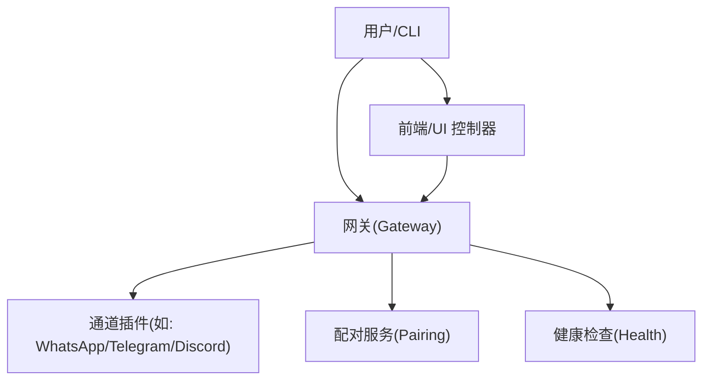
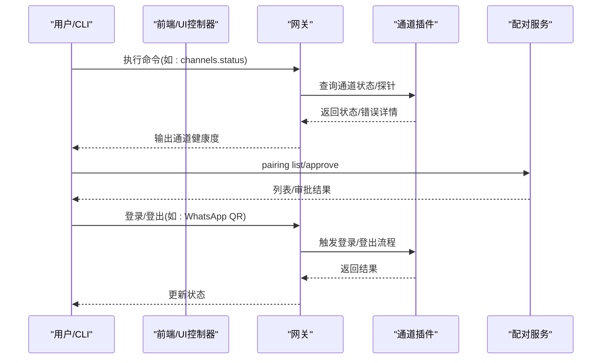
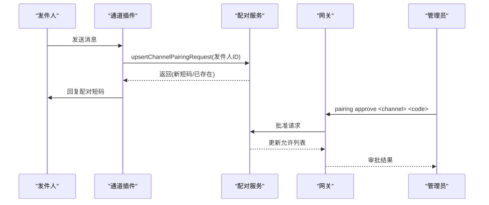
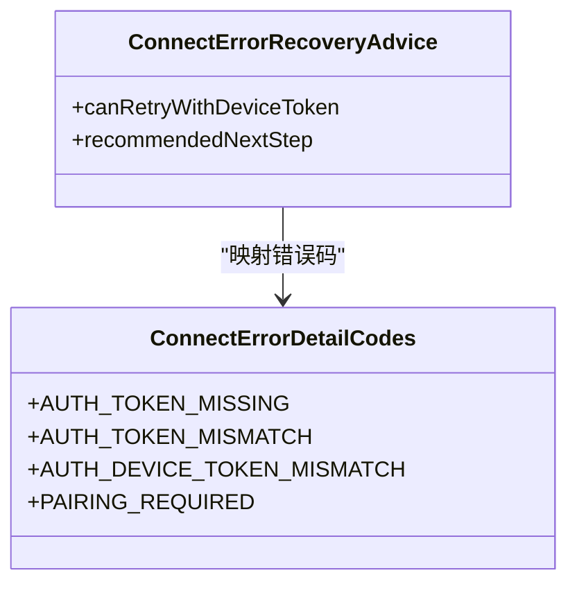
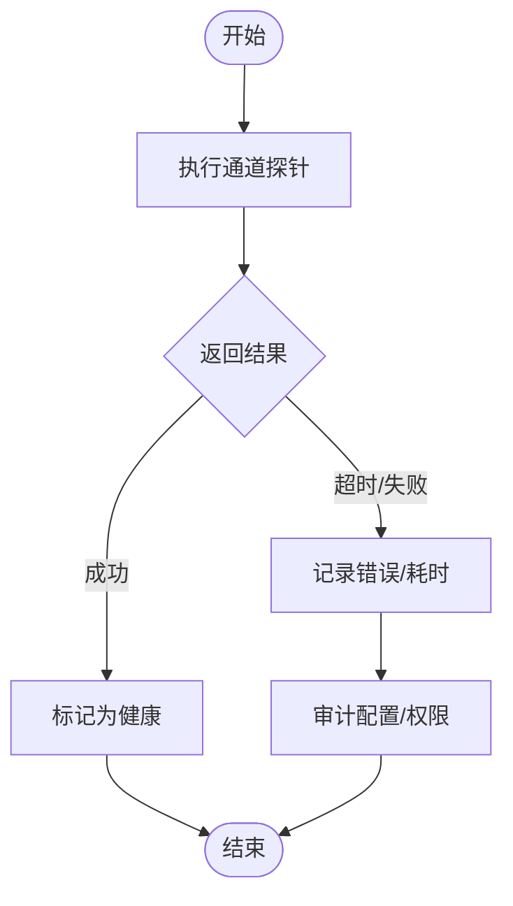
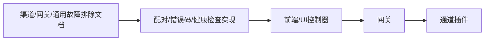

# 渠道适配器故障排除

<cite>
**本文档引用的文件**
- [docs/channels/troubleshooting.md](file://docs/channels/troubleshooting.md)
- [docs/gateway/troubleshooting.md](file://docs/gateway/troubleshooting.md)
- [docs/help/troubleshooting.md](file://docs/help/troubleshooting.md)
- [docs/channels/whatsapp.md](file://docs/channels/whatsapp.md)
- [docs/channels/telegram.md](file://docs/channels/telegram.md)
- [docs/channels/discord.md](file://docs/channels/discord.md)
- [docs/channels/pairing.md](file://docs/channels/pairing.md)
- [docs/channels/groups.md](file://docs/channels/groups.md)
- [src/pairing/pairing-challenge.ts](file://src/pairing/pairing-challenge.ts)
- [src/pairing/pairing-messages.ts](file://src/pairing/pairing-messages.ts)
- [src/gateway/protocol/connect-error-details.ts](file://src/gateway/protocol/connect-error-details.ts)
- [ui/src/ui/controllers/channels.ts](file://ui/src/ui/controllers/channels.ts)
- [apps/macos/Sources/OpenClaw/ChannelsStore+Lifecycle.swift](file://apps/macos/Sources/OpenClaw/ChannelsStore+Lifecycle.swift)
- [src/commands/health.ts](file://src/commands/health.ts)
- [apps/macos/Sources/OpenClaw/HealthStore.swift](file://apps/macos/Sources/OpenClaw/HealthStore.swift)
- [ui/src/ui/views/channels.ts](file://ui/src/ui/views/channels.ts)
</cite>

## 目录
1. [简介](#简介)
2. [项目结构](#项目结构)
3. [核心组件](#核心组件)
4. [架构总览](#架构总览)
5. [详细组件分析](#详细组件分析)
6. [依赖关系分析](#依赖关系分析)
7. [性能考虑](#性能考虑)
8. [故障排除指南](#故障排除指南)
9. [结论](#结论)
10. [附录](#附录)

## 简介
本指南聚焦于渠道适配器系统的故障排除，覆盖 WhatsApp、Telegram、Discord 等主流渠道的连接问题、消息发送失败、权限不足等常见故障。内容基于仓库中的官方文档与实现细节，提供可操作的诊断流程、错误代码解读与修复步骤，并补充渠道特定的配置与行为差异。

## 项目结构
OpenClaw 的渠道适配器由「网关」统一管理，各渠道通过各自的插件实现与上游平台交互。故障排除涉及以下关键层面：
- 官方文档：渠道故障排除、网关故障排除、通用故障排除
- 核心实现：配对流程、连接错误码、通道状态检查
- 前端与移动端：通道状态展示、登录/登出控制

[无图表来源——该图为概念性结构示意，不直接映射具体源码文件]

## 核心组件
- 配对机制：用于未知发件人的 DM 访问控制，支持一次性短码与审批流程
- 连接错误码：设备身份、令牌不匹配、配对必需等错误的标准化描述
- 通道状态检查：统一的通道健康度与探针结果展示
- 文档化故障排除：按渠道与症状快速定位与修复

**章节来源**
- [docs/channels/pairing.md:1-111](file://docs/channels/pairing.md#L1-L111)
- [src/pairing/pairing-challenge.ts:1-48](file://src/pairing/pairing-challenge.ts#L1-L48)
- [src/gateway/protocol/connect-error-details.ts:28-49](file://src/gateway/protocol/connect-error-details.ts#L28-L49)
- [src/commands/health.ts:264-294](file://src/commands/health.ts#L264-L294)

## 架构总览
下图展示了从用户发起到通道状态查询的关键调用链路，以及配对与错误码在其中的作用位置。

**图表来源**
- [ui/src/ui/controllers/channels.ts:6-27](file://ui/src/ui/controllers/channels.ts#L6-L27)
- [apps/macos/Sources/OpenClaw/ChannelsStore+Lifecycle.swift:121-163](file://apps/macos/Sources/OpenClaw/ChannelsStore+Lifecycle.swift#L121-L163)
- [src/pairing/pairing-challenge.ts:24-48](file://src/pairing/pairing-challenge.ts#L24-L48)

**章节来源**
- [ui/src/ui/controllers/channels.ts:6-27](file://ui/src/ui/controllers/channels.ts#L6-L27)
- [apps/macos/Sources/OpenClaw/ChannelsStore+Lifecycle.swift:121-163](file://apps/macos/Sources/OpenClaw/ChannelsStore+Lifecycle.swift#L121-L163)

## 详细组件分析

### 配对流程与挑战发放
配对是 DM 访问控制的核心机制：当 DM 策略为配对且发件人未被允许时，系统会生成一次性短码并通过渠道回复给发件人，等待管理员批准后方可继续。

**图表来源**
- [src/pairing/pairing-challenge.ts:24-48](file://src/pairing/pairing-challenge.ts#L24-L48)
- [src/pairing/pairing-messages.ts:4-20](file://src/pairing/pairing-messages.ts#L4-L20)

**章节来源**
- [docs/channels/pairing.md:20-50](file://docs/channels/pairing.md#L20-L50)
- [src/pairing/pairing-challenge.ts:24-48](file://src/pairing/pairing-challenge.ts#L24-L48)

### 连接错误码与恢复建议
网关侧定义了连接错误的标准化代码，便于 UI 与 CLI 提供一致的提示与下一步建议。

**图表来源**
- [src/gateway/protocol/connect-error-details.ts:28-49](file://src/gateway/protocol/connect-error-details.ts#L28-L49)

**章节来源**
- [src/gateway/protocol/connect-error-details.ts:28-49](file://src/gateway/protocol/connect-error-details.ts#L28-L49)
- [docs/help/troubleshooting.md:121-148](file://docs/help/troubleshooting.md#L121-L148)

### 通道状态检查与健康度
通道状态检查通过统一的探针接口返回每个账户的健康状况，包括是否配置、是否连通、探针耗时与错误原因等。

**图表来源**
- [src/commands/health.ts:264-294](file://src/commands/health.ts#L264-L294)
- [apps/macos/Sources/OpenClaw/HealthStore.swift:147-163](file://apps/macos/Sources/OpenClaw/HealthStore.swift#L147-L163)

**章节来源**
- [src/commands/health.ts:264-294](file://src/commands/health.ts#L264-L294)
- [apps/macos/Sources/OpenClaw/HealthStore.swift:147-163](file://apps/macos/Sources/OpenClaw/HealthStore.swift#L147-L163)

## 依赖关系分析
- 文档层：渠道故障排除、网关故障排除、通用故障排除形成三级排查路径
- 实现层：配对服务与通道插件紧密耦合；连接错误码为 UI/CLI 提供统一语义
- 展示层：前端控制器负责调用网关接口并渲染通道状态与登录流程

[无图表来源——该图为概念性依赖示意，不直接映射具体源码文件]

**章节来源**
- [docs/channels/troubleshooting.md:1-118](file://docs/channels/troubleshooting.md#L1-L118)
- [docs/gateway/troubleshooting.md:1-380](file://docs/gateway/troubleshooting.md#L1-L380)
- [ui/src/ui/views/channels.ts:102-150](file://ui/src/ui/views/channels.ts#L102-L150)

## 性能考虑
- 通道探针超时与重试：合理设置探针超时时间，避免阻塞 UI 与 CLI
- 健康度缓存：在 UI 中缓存最近一次成功状态，减少频繁请求
- 配对请求上限：默认每通道最多保留有限数量的待审批请求，避免资源浪费

[本节为通用指导，不直接分析具体文件]

## 故障排除指南

### 通用命令阶梯
遇到问题时，先按顺序执行以下命令以建立健康基线：
- openclaw status
- openclaw gateway status
- openclaw logs --follow
- openclaw doctor
- openclaw channels status --probe

预期健康信号：
- 运行态正常、RPC 探针成功
- 通道探针显示已连接/就绪

**章节来源**
- [docs/help/troubleshooting.md:15-25](file://docs/help/troubleshooting.md#L15-L25)
- [docs/gateway/troubleshooting.md:14-24](file://docs/gateway/troubleshooting.md#L14-L24)

### 渠道连接问题
- 症状：通道显示已连接但消息不流动
- 快速检查：channels status --probe、日志中是否存在 mention required、pairing/pending、missing_scope、not_in_channel、Forbidden、401/403
- 修复方向：
  - 群组提及要求：调整 requireMention 或在配置中放宽提及策略
  - 配对请求：在 pairing list 中查看并批准 pending 请求
  - 权限缺失：补齐所需作用域或重新授权

**章节来源**
- [docs/gateway/troubleshooting.md:182-212](file://docs/gateway/troubleshooting.md#L182-L212)
- [docs/channels/troubleshooting.md:31-41](file://docs/channels/troubleshooting.md#L31-L41)

### WhatsApp 特定故障
- 症状：已连接但私聊无回复
  - 检查：openclaw pairing list whatsapp
  - 修复：批准发件人或切换 DM 策略/白名单
- 症状：群组消息被忽略
  - 检查：requireMention 与配置中的提及模式
  - 修复：在群组中@机器人或放宽提及策略
- 症状：随机断开/重登循环
  - 检查：channels status --probe + 日志
  - 修复：重新登录并确认凭据目录健康

**章节来源**
- [docs/channels/troubleshooting.md:31-41](file://docs/channels/troubleshooting.md#L31-L41)
- [docs/channels/whatsapp.md:374-424](file://docs/channels/whatsapp.md#L374-L424)

### Telegram 特定故障
- 症状：/start 后无可用回复流
  - 检查：openclaw pairing list telegram
  - 修复：批准配对或调整 DM 策略
- 症状：机器人在线但群组保持沉默
  - 检查：提及要求与机器人隐私模式
  - 修复：关闭隐私模式或@机器人
- 症状：发送失败且出现网络错误
  - 检查：日志中 Telegram API 调用失败
  - 修复：修正到 api.telegram.org 的 DNS/IPv6/代理路由
- 症状：升级后白名单阻止
  - 检查：openclaw security audit 与配置白名单
  - 修复：运行 openclaw doctor --fix 或将 @username 替换为数值型发送者 ID

**章节来源**
- [docs/channels/troubleshooting.md:43-54](file://docs/channels/troubleshooting.md#L43-L54)
- [docs/channels/telegram.md:338-341](file://docs/channels/telegram.md#L338-L341)

### Discord 特定故障
- 症状：机器人在线但公会回复缺失
  - 检查：openclaw channels status --probe
  - 修复：允许公会/频道并验证消息内容意图
- 症状：群组消息被忽略
  - 检查：日志中的提及门控丢弃
  - 修复：在公会/频道中设置 requireMention: false 或@机器人
- 症状：私聊回复缺失
  - 检查：openclaw pairing list discord
  - 修复：批准 DM 配对或调整 DM 策略

**章节来源**
- [docs/channels/troubleshooting.md:56-66](file://docs/channels/troubleshooting.md#L56-L66)
- [docs/channels/discord.md:397-461](file://docs/channels/discord.md#L397-L461)

### Slack 特定故障
- 症状：Socket 模式已连接但无响应
  - 检查：openclaw channels status --probe
  - 修复：验证应用令牌与机器人令牌及所需作用域
- 症状：私聊被阻止
  - 检查：openclaw pairing list slack
  - 修复：批准配对或放宽 DM 策略
- 症状：频道消息被忽略
  - 检查：groupPolicy 与频道白名单
  - 修复：允许该频道或将策略切换为 open

**章节来源**
- [docs/channels/troubleshooting.md:68-78](file://docs/channels/troubleshooting.md#L68-L78)

### 群组策略与提及门控
- 群组策略：groupPolicy 支持 open/disabled/allowlist，需结合 groups 与 groupAllowFrom 使用
- 提及门控：requireMention 默认开启，可通过 mentionPatterns 或回复@机器人触发
- 评估顺序：groupPolicy → 群组白名单 → 提及门控

**章节来源**
- [docs/channels/groups.md:128-201](file://docs/channels/groups.md#L128-L201)

### 渠道状态检查与配对请求处理
- 通道状态：通过 channels.status --probe 获取每个账户的配置、连通性、探针耗时与错误
- 配对请求：当 DM 策略为配对且发件人未被允许时，系统自动发放一次性短码并等待审批
- 登出操作：支持按通道清理凭据（如 Telegram/WhatsApp），并刷新状态

**章节来源**
- [src/commands/health.ts:264-294](file://src/commands/health.ts#L264-L294)
- [src/pairing/pairing-challenge.ts:24-48](file://src/pairing/pairing-challenge.ts#L24-L48)
- [apps/macos/Sources/OpenClaw/ChannelsStore+Lifecycle.swift:121-163](file://apps/macos/Sources/OpenClaw/ChannelsStore+Lifecycle.swift#L121-L163)

### 错误代码解读与修复步骤
- mention required：群组消息因未提及而被忽略，需@机器人或调整 requireMention
- pairing/pending：发件人未被批准，需在 pairing list 中审批
- missing_scope/not_in_channel/Forbidden/401/403：通道认证/权限问题，需补齐作用域或重新授权
- device identity required/AUTH_TOKEN_MISMATCH：设备身份或令牌不匹配，按 UI/CLI 提示进行重试或更新配置

**章节来源**
- [docs/gateway/troubleshooting.md:200-205](file://docs/gateway/troubleshooting.md#L200-L205)
- [docs/help/troubleshooting.md:107-112](file://docs/help/troubleshooting.md#L107-L112)
- [src/gateway/protocol/connect-error-details.ts:28-49](file://src/gateway/protocol/connect-error-details.ts#L28-L49)

## 结论
通过「通用命令阶梯」+「渠道特定检查」+「错误码解读」的三段式流程，可高效定位并修复渠道适配器的连接与消息问题。建议在生产环境中定期执行通道状态检查与安全审计，确保配对与权限配置符合预期。

[本节为总结性内容，不直接分析具体文件]

## 附录

### 常用命令速查
- openclaw channels status --probe
- openclaw pairing list <channel> [--account <id>]
- openclaw pairing approve <channel> <code>
- openclaw logs --follow
- openclaw doctor

**章节来源**
- [docs/help/troubleshooting.md:92-98](file://docs/help/troubleshooting.md#L92-L98)
- [docs/channels/troubleshooting.md:31-66](file://docs/channels/troubleshooting.md#L31-L66)