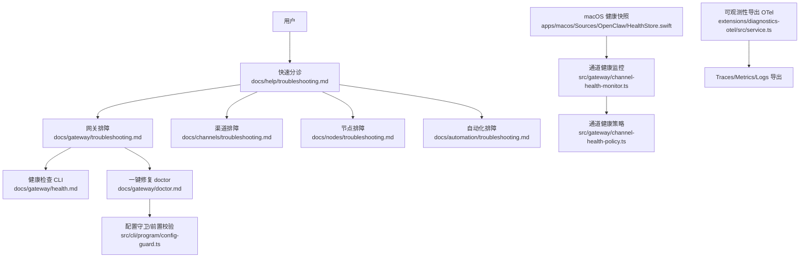
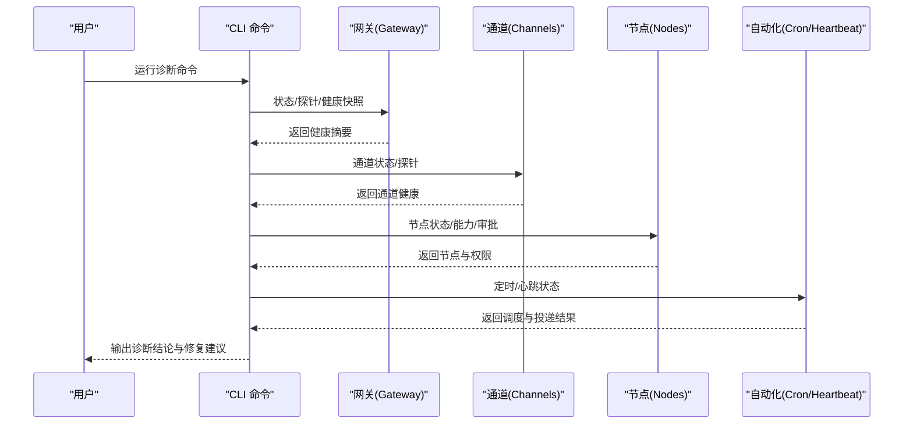
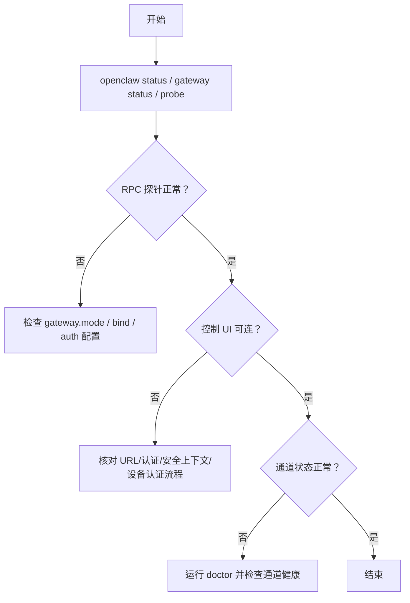
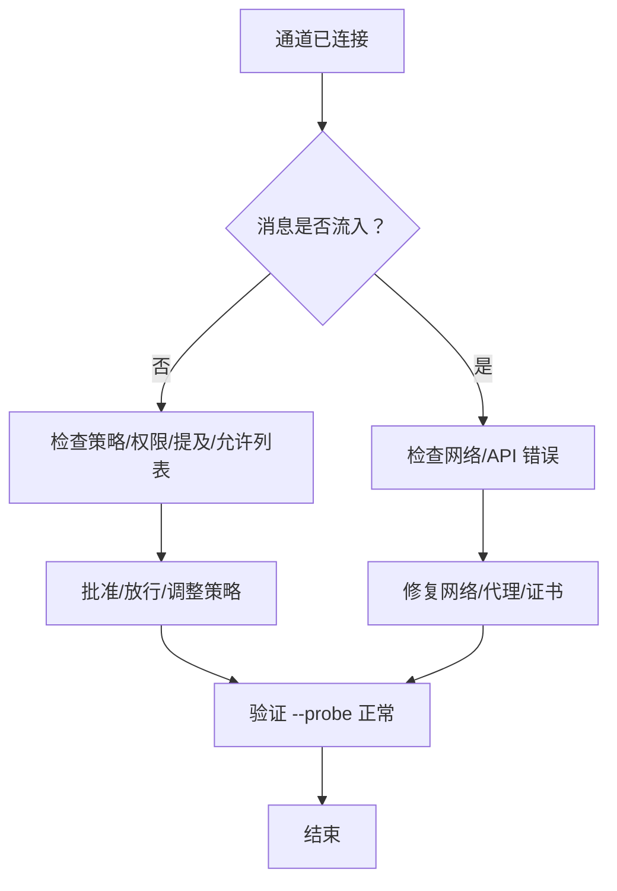
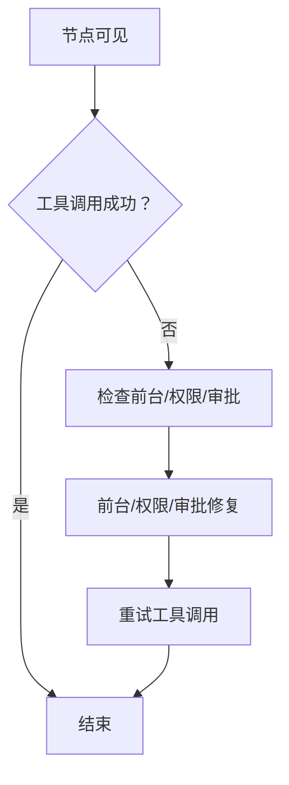
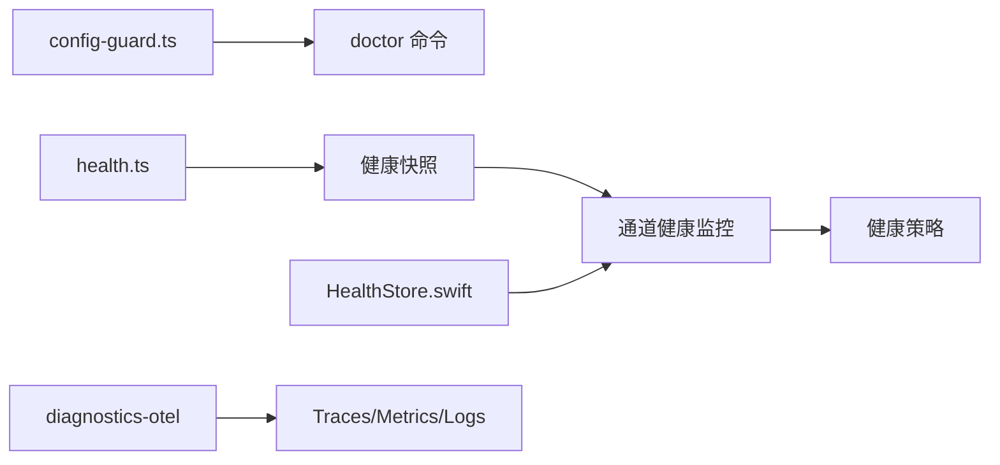

# 组件特定故障排除

<cite>
**本文引用的文件**
- [docs/help/troubleshooting.md](file://docs/help/troubleshooting.md)
- [docs/gateway/troubleshooting.md](file://docs/gateway/troubleshooting.md)
- [docs/gateway/health.md](file://docs/gateway/health.md)
- [docs/gateway/doctor.md](file://docs/gateway/doctor.md)
- [docs/channels/troubleshooting.md](file://docs/channels/troubleshooting.md)
- [docs/nodes/troubleshooting.md](file://docs/nodes/troubleshooting.md)
- [docs/automation/troubleshooting.md](file://docs/automation/troubleshooting.md)
- [docs/cli/doctor.md](file://docs/cli/doctor.md)
- [src/cli/program/config-guard.ts](file://src/cli/program/config-guard.ts)
- [src/commands/health.ts](file://src/commands/health.ts)
- [src/gateway/channel-health-monitor.ts](file://src/gateway/channel-health-monitor.ts)
- [src/gateway/channel-health-policy.ts](file://src/gateway/channel-health-policy.ts)
- [extensions/diagnostics-otel/src/service.ts](file://extensions/diagnostics-otel/src/service.ts)
- [apps/macos/Sources/OpenClaw/HealthStore.swift](file://apps/macos/Sources/OpenClaw/HealthStore.swift)
</cite>

## 目录
1. [简介](#简介)
2. [项目结构](#项目结构)
3. [核心组件](#核心组件)
4. [架构总览](#架构总览)
5. [详细组件分析](#详细组件分析)
6. [依赖关系分析](#依赖关系分析)
7. [性能考量](#性能考量)
8. [故障排除指南](#故障排除指南)
9. [结论](#结论)
10. [附录](#附录)

## 简介
本指南聚焦于 OpenClaw 各组件的“组件特定”故障排除：网关组件、渠道适配器、节点系统、工具系统以及自动化（定时任务/心跳）等。内容覆盖常见故障类型、诊断命令、日志分析方法、修复步骤、组件间交互问题排查，以及配置检查清单与性能监控方法。目标是帮助用户在最短时间内定位并解决问题。

## 项目结构
OpenClaw 的故障排除知识主要分布在以下位置：
- 快速分诊与决策树：docs/help/troubleshooting.md
- 深入排障手册：docs/gateway/troubleshooting.md、docs/channels/troubleshooting.md、docs/nodes/troubleshooting.md、docs/automation/troubleshooting.md
- 健康检查与诊断：docs/gateway/health.md、src/commands/health.ts、src/gateway/channel-health-monitor.ts、apps/macos/Sources/OpenClaw/HealthStore.swift
- 一键修复与迁移：docs/gateway/doctor.md、docs/cli/doctor.md、src/cli/program/config-guard.ts
- 可观测性导出：extensions/diagnostics-otel/src/service.ts

图表来源
- [docs/help/troubleshooting.md:1-299](file://docs/help/troubleshooting.md#L1-L299)
- [docs/gateway/troubleshooting.md:1-380](file://docs/gateway/troubleshooting.md#L1-L380)
- [docs/gateway/health.md:1-36](file://docs/gateway/health.md#L1-L36)
- [docs/gateway/doctor.md:1-331](file://docs/gateway/doctor.md#L1-L331)
- [src/cli/program/config-guard.ts:1-39](file://src/cli/program/config-guard.ts#L1-L39)
- [src/commands/health.ts:252-673](file://src/commands/health.ts#L252-L673)
- [src/gateway/channel-health-monitor.ts:76-111](file://src/gateway/channel-health-monitor.ts#L76-L111)
- [src/gateway/channel-health-policy.ts:57-81](file://src/gateway/channel-health-policy.ts#L57-L81)
- [apps/macos/Sources/OpenClaw/HealthStore.swift:147-163](file://apps/macos/Sources/OpenClaw/HealthStore.swift#L147-L163)
- [extensions/diagnostics-otel/src/service.ts:78-587](file://extensions/diagnostics-otel/src/service.ts#L78-L587)

章节来源
- [docs/help/troubleshooting.md:1-299](file://docs/help/troubleshooting.md#L1-L299)
- [docs/gateway/troubleshooting.md:1-380](file://docs/gateway/troubleshooting.md#L1-L380)
- [docs/gateway/health.md:1-36](file://docs/gateway/health.md#L1-L36)
- [docs/gateway/doctor.md:1-331](file://docs/gateway/doctor.md#L1-L331)
- [src/cli/program/config-guard.ts:1-39](file://src/cli/program/config-guard.ts#L1-L39)
- [src/commands/health.ts:252-673](file://src/commands/health.ts#L252-L673)
- [src/gateway/channel-health-monitor.ts:76-111](file://src/gateway/channel-health-monitor.ts#L76-L111)
- [src/gateway/channel-health-policy.ts:57-81](file://src/gateway/channel-health-policy.ts#L57-L81)
- [apps/macos/Sources/OpenClaw/HealthStore.swift:147-163](file://apps/macos/Sources/OpenClaw/HealthStore.swift#L147-L163)
- [extensions/diagnostics-otel/src/service.ts:78-587](file://extensions/diagnostics-otel/src/service.ts#L78-L587)

## 核心组件
- 网关组件：负责 RPC 探针、远程/本地模式、认证、服务生命周期、通道状态聚合与健康快照。
- 渠道适配器：各平台（WhatsApp、Telegram、Discord、Slack、iMessage/BlueBubbles、Signal、Matrix 等）的连接、权限、消息路由与策略。
- 节点系统：设备配对、前台要求、权限矩阵、执行审批与允许列表。
- 工具系统：浏览器工具、沙箱策略、执行审批与允许列表。
- 自动化：定时任务（cron）、心跳（heartbeat），包括调度器状态、投递目标与时间区处理。
- 健康检查与诊断：CLI 健康快照、通道健康监控、macOS 健康存储、可观测性导出。

章节来源
- [docs/gateway/troubleshooting.md:14-380](file://docs/gateway/troubleshooting.md#L14-L380)
- [docs/channels/troubleshooting.md:1-118](file://docs/channels/troubleshooting.md#L1-L118)
- [docs/nodes/troubleshooting.md:1-115](file://docs/nodes/troubleshooting.md#L1-L115)
- [docs/automation/troubleshooting.md:1-123](file://docs/automation/troubleshooting.md#L1-L123)
- [docs/gateway/health.md:1-36](file://docs/gateway/health.md#L1-L36)
- [src/commands/health.ts:252-673](file://src/commands/health.ts#L252-L673)
- [src/gateway/channel-health-monitor.ts:76-111](file://src/gateway/channel-health-monitor.ts#L76-L111)
- [apps/macos/Sources/OpenClaw/HealthStore.swift:147-163](file://apps/macos/Sources/OpenClaw/HealthStore.swift#L147-L163)
- [extensions/diagnostics-otel/src/service.ts:78-587](file://extensions/diagnostics-otel/src/service.ts#L78-L587)

## 架构总览
下图展示从用户到组件的典型排障路径与关键交互点。

图表来源
- [docs/help/troubleshooting.md:13-299](file://docs/help/troubleshooting.md#L13-L299)
- [docs/gateway/health.md:12-36](file://docs/gateway/health.md#L12-L36)
- [docs/gateway/troubleshooting.md:14-380](file://docs/gateway/troubleshooting.md#L14-L380)
- [docs/channels/troubleshooting.md:13-118](file://docs/channels/troubleshooting.md#L13-L118)
- [docs/nodes/troubleshooting.md:13-115](file://docs/nodes/troubleshooting.md#L13-L115)
- [docs/automation/troubleshooting.md:14-123](file://docs/automation/troubleshooting.md#L14-L123)

## 详细组件分析

### 网关组件
- 关键职责：运行时状态、RPC 探针、认证与设备令牌、远程/本地模式、服务安装与端口冲突、通道健康聚合。
- 常见问题：服务未启动、URL/认证不匹配、端口冲突、升级后配置漂移、远程模式误判。
- 诊断命令与要点：
  - 基础：openclaw status、openclaw gateway status、openclaw gateway probe、openclaw logs --follow
  - 深度：openclaw doctor、openclaw gateway status --deep、openclaw gateway status --json
  - 控制 UI 连接：核对 URL、认证模式、安全上下文、设备身份与 nonce 流程
  - 服务不可达：检查 gateway.mode、bind 与 auth 配置、端口占用
- 日志关键词：device identity required、device nonce required、AUTH_TOKEN_MISMATCH、gateway connect failed、EADDRINUSE
- 修复步骤：启用本地模式、配置共享令牌或设备令牌、更新客户端以完成设备认证、重启服务、必要时强制重装服务元数据

图表来源
- [docs/gateway/troubleshooting.md:14-380](file://docs/gateway/troubleshooting.md#L14-L380)
- [docs/gateway/health.md:12-36](file://docs/gateway/health.md#L12-L36)
- [docs/gateway/doctor.md:14-331](file://docs/gateway/doctor.md#L14-L331)

章节来源
- [docs/gateway/troubleshooting.md:14-380](file://docs/gateway/troubleshooting.md#L14-L380)
- [docs/gateway/health.md:12-36](file://docs/gateway/health.md#L12-L36)
- [docs/gateway/doctor.md:14-331](file://docs/gateway/doctor.md#L14-L331)

### 渠道适配器
- 关键职责：各平台连接、权限/作用域、消息路由、提及/允许列表策略、隐私模式。
- 常见问题：已连接但无回复、群组忽略、DM 被阻止、权限缺失、网络错误。
- 诊断命令与要点：
  - 基础：openclaw status、openclaw gateway status、openclaw channels status --probe、openclaw logs --follow
  - 具体平台：WhatsApp/Telegram/Discord/Slack/iMessage/BlueBubbles/Signal/Matrix 的策略与权限检查
  - 快速签名：mention required、pairing/pending、missing_scope/not_in_channel/401/403
- 修复步骤：批准发送者/调整 DM 策略、放宽提及要求、修正 allowlist、检查 DNS/代理、重新登录/重载凭据

图表来源
- [docs/channels/troubleshooting.md:13-118](file://docs/channels/troubleshooting.md#L13-L118)
- [docs/help/troubleshooting.md:180-205](file://docs/help/troubleshooting.md#L180-L205)

章节来源
- [docs/channels/troubleshooting.md:13-118](file://docs/channels/troubleshooting.md#L13-L118)
- [docs/help/troubleshooting.md:180-205](file://docs/help/troubleshooting.md#L180-L205)

### 节点系统
- 关键职责：设备配对、前台要求、权限矩阵（相机/屏幕/位置/执行）、执行审批与允许列表。
- 常见问题：前台不可用、权限缺失、执行被拒、系统运行失败。
- 诊断命令与要点：
  - 基础：openclaw status、openclaw gateway status、openclaw channels status --probe、openclaw logs --follow
  - 节点：openclaw nodes status、openclaw nodes describe、openclaw approvals get
  - 快速签名：NODE_BACKGROUND_UNAVAILABLE、*_PERMISSION_REQUIRED、LOCATION_PERMISSION_REQUIRED、SYSTEM_RUN_DENIED
- 修复步骤：将节点应用置于前台、重新授予权限、重建/调整执行审批策略

图表来源
- [docs/nodes/troubleshooting.md:13-115](file://docs/nodes/troubleshooting.md#L13-L115)
- [docs/help/troubleshooting.md:239-266](file://docs/help/troubleshooting.md#L239-L266)

章节来源
- [docs/nodes/troubleshooting.md:13-115](file://docs/nodes/troubleshooting.md#L13-L115)
- [docs/help/troubleshooting.md:239-266](file://docs/help/troubleshooting.md#L239-L266)

### 工具系统（浏览器/沙箱/执行）
- 关键职责：浏览器工具（CDP/扩展中继）、沙箱策略、执行审批与允许列表。
- 常见问题：浏览器无法启动、可执行路径无效、扩展未连接、attach-only 不可达。
- 诊断命令与要点：
  - 基础：openclaw status、openclaw gateway status、openclaw browser status、openclaw logs --follow、openclaw doctor
  - 快速签名：Failed to start Chrome CDP、browser.executablePath not found、extension relay not attached、attachOnly not reachable
- 修复步骤：修正可执行路径、确保扩展中继连接、切换/修复浏览器配置

章节来源
- [docs/gateway/troubleshooting.md:276-306](file://docs/gateway/troubleshooting.md#L276-L306)
- [docs/help/troubleshooting.md:269-296](file://docs/help/troubleshooting.md#L269-L296)

### 自动化（定时任务/心跳）
- 关键职责：调度器状态、投递目标、时间区与时钟偏差、静默时段与并发限制。
- 常见问题：任务未触发、已触发但未投递、心跳被跳过。
- 诊断命令与要点：
  - 基础：openclaw status、openclaw gateway status、openclaw cron status/list/runs、openclaw system heartbeat last、openclaw logs --follow
  - 快速签名：scheduler disabled、timer tick failed、heartbeat skipped(reason=quiet-hours/requests-in-flight/unknown accountId)
- 修复步骤：启用调度器、修正计划/时区、检查投递目标与通道权限、调整静默时段

章节来源
- [docs/automation/troubleshooting.md:14-123](file://docs/automation/troubleshooting.md#L14-L123)
- [docs/help/troubleshooting.md:208-236](file://docs/help/troubleshooting.md#L208-L236)

## 依赖关系分析
- CLI 前置校验：config-guard 在非允许命令上拦截并引导 doctor 修复，避免无效配置导致的错误。
- 健康快照：CLI health 命令聚合通道、会话、心跳等信息；通道健康监控周期性评估并进行重启/冷却策略控制。
- macOS 健康存储：将通道探针失败原因格式化为可读文本，辅助定位超时/状态码/错误信息。
- 可观测性：diagnostics-otel 插件导出队列深度、等待时间、会话状态等指标，便于性能分析。

图表来源
- [src/cli/program/config-guard.ts:10-39](file://src/cli/program/config-guard.ts#L10-L39)
- [src/commands/health.ts:348-673](file://src/commands/health.ts#L348-L673)
- [src/gateway/channel-health-monitor.ts:76-111](file://src/gateway/channel-health-monitor.ts#L76-L111)
- [src/gateway/channel-health-policy.ts:57-81](file://src/gateway/channel-health-policy.ts#L57-L81)
- [apps/macos/Sources/OpenClaw/HealthStore.swift:147-163](file://apps/macos/Sources/OpenClaw/HealthStore.swift#L147-L163)
- [extensions/diagnostics-otel/src/service.ts:78-587](file://extensions/diagnostics-otel/src/service.ts#L78-L587)

章节来源
- [src/cli/program/config-guard.ts:10-39](file://src/cli/program/config-guard.ts#L10-L39)
- [src/commands/health.ts:348-673](file://src/commands/health.ts#L348-L673)
- [src/gateway/channel-health-monitor.ts:76-111](file://src/gateway/channel-health-monitor.ts#L76-L111)
- [src/gateway/channel-health-policy.ts:57-81](file://src/gateway/channel-health-policy.ts#L57-L81)
- [apps/macos/Sources/OpenClaw/HealthStore.swift:147-163](file://apps/macos/Sources/OpenClaw/HealthStore.swift#L147-L163)
- [extensions/diagnostics-otel/src/service.ts:78-587](file://extensions/diagnostics-otel/src/service.ts#L78-L587)

## 性能考量
- 队列与延迟：通过可观测性导出队列排队/出队计数与等待直方图，识别瓶颈。
- 通道健康：通道健康监控在启动宽限期后开始评估，结合冷却周期与重启上限，避免风暴式重启。
- 会话状态：记录会话状态变化与原因，便于定位异常回退或阻塞。
- 时间区与时钟：cron 使用主机时区，heartbeat 使用用户/本地/IANA 时区解析，变更主机时区可能导致错峰运行。

章节来源
- [extensions/diagnostics-otel/src/service.ts:560-587](file://extensions/diagnostics-otel/src/service.ts#L560-L587)
- [src/gateway/channel-health-monitor.ts:76-111](file://src/gateway/channel-health-monitor.ts#L76-L111)
- [docs/automation/troubleshooting.md:95-123](file://docs/automation/troubleshooting.md#L95-L123)

## 故障排除指南

### 通用诊断命令与流程
- 快速三分钟：openclaw status、openclaw gateway probe/status、openclaw doctor、openclaw channels status --probe、openclaw logs --follow
- 深度诊断：openclaw status --all、openclaw health --json、openclaw gateway status --deep
- 配置前置校验：非允许命令自动触发 doctor，避免无效配置导致的错误

章节来源
- [docs/help/troubleshooting.md:13-36](file://docs/help/troubleshooting.md#L13-L36)
- [src/cli/program/config-guard.ts:10-39](file://src/cli/program/config-guard.ts#L10-L39)

### 网关组件
- 常见症状与命令
  - 无回复：openclaw status、openclaw channels status --probe、openclaw pairing list、openclaw config get channels、openclaw logs --follow
  - 控制 UI 连接失败：openclaw gateway status、openclaw doctor、openclaw gateway status --json
  - 服务未运行：openclaw gateway status、openclaw doctor、openclaw gateway status --deep
  - 通道消息不流动：openclaw channels status --probe、openclaw pairing list、openclaw config get channels
  - 定时/心跳异常：openclaw cron status/list/runs、openclaw system heartbeat last
- 日志关键词
  - 设备认证：device identity required、device nonce required、device signature invalid/expired、AUTH_TOKEN_MISMATCH
  - 服务/绑定：Gateway start blocked、refusing to bind、EADDRINUSE
  - 通道：mention required、pairing/pending、missing_scope、not_in_channel、401/403
- 修复步骤
  - 启用本地模式、配置共享令牌/设备令牌、完成设备认证挑战、重启服务、重装服务元数据、修正 bind/auth

章节来源
- [docs/gateway/troubleshooting.md:61-380](file://docs/gateway/troubleshooting.md#L61-L380)
- [docs/gateway/health.md:12-36](file://docs/gateway/health.md#L12-L36)
- [docs/gateway/doctor.md:14-331](file://docs/gateway/doctor.md#L14-L331)

### 渠道适配器
- 平台特定
  - WhatsApp：检查配对、提及策略、允许列表；随机断开需重新登录
  - Telegram：/start 后无回复、隐私模式、网络错误（DNS/IPv6/代理）
  - Discord：公会/频道未允许、提及策略、DM 被阻止
  - Slack：Socket 模式连接但无响应、DM 被阻止、通道允许列表
  - iMessage/BlueBubbles：Webhook/服务器可达性、macOS 权限
  - Signal：daemon 可达性、接收模式
  - Matrix：房间未允许、DM 处理、加密支持
- 诊断命令与修复
  - openclaw pairing list <channel>、openclaw channels status --probe、openclaw doctor --fix
  - 修正 @username 为数字 ID、放宽提及/允许列表、修复 DNS/代理

章节来源
- [docs/channels/troubleshooting.md:13-118](file://docs/channels/troubleshooting.md#L13-L118)
- [docs/help/troubleshooting.md:180-205](file://docs/help/troubleshooting.md#L180-L205)

### 节点系统
- 前台要求：iOS/Android 上 canvas/camera/screen 需前台
- 权限矩阵：相机/屏幕/位置/执行均需相应权限
- 执行审批：system.run 需显式批准与允许列表
- 诊断命令与修复
  - openclaw nodes status/describe/approvals get、bring to foreground、重新授予权限、重建执行审批

章节来源
- [docs/nodes/troubleshooting.md:13-115](file://docs/nodes/troubleshooting.md#L13-L115)
- [docs/help/troubleshooting.md:239-266](file://docs/help/troubleshooting.md#L239-L266)

### 工具系统
- 浏览器工具
  - 诊断：openclaw browser status/start/profiles、openclaw logs --follow、openclaw doctor
  - 修复：修正 executablePath、确保扩展中继连接、切换 attach-only 配置
- 沙箱与执行
  - 诊断：openclaw approvals get、openclaw nodes describe
  - 修复：调整执行审批/允许列表、在允许列表模式下使用询问流程

章节来源
- [docs/gateway/troubleshooting.md:276-306](file://docs/gateway/troubleshooting.md#L276-L306)
- [docs/help/troubleshooting.md:269-296](file://docs/help/troubleshooting.md#L269-L296)

### 自动化（定时任务/心跳）
- 诊断：openclaw cron status/list/runs、openclaw system heartbeat last、openclaw config get agents.defaults.heartbeat
- 常见签名：scheduler disabled、timer tick failed、heartbeat skipped(reason=quiet-hours/requests-in-flight/unknown accountId)
- 修复：启用调度器、修正计划与时区、检查投递目标与通道权限、调整静默时段

章节来源
- [docs/automation/troubleshooting.md:14-123](file://docs/automation/troubleshooting.md#L14-L123)
- [docs/help/troubleshooting.md:208-236](file://docs/help/troubleshooting.md#L208-L236)

### 组件间交互问题排查
- 网关与渠道：RPC 探针失败、认证不匹配、通道权限不足
- 节点通信：前台不可用、权限缺失、执行被拒
- 工具调用：浏览器不可达、扩展未连接、attach-only 不可达
- 自动化：调度器禁用、投递目标无效、通道认证错误

章节来源
- [docs/help/troubleshooting.md:68-88](file://docs/help/troubleshooting.md#L68-L88)
- [docs/gateway/troubleshooting.md:14-380](file://docs/gateway/troubleshooting.md#L14-L380)
- [docs/channels/troubleshooting.md:13-118](file://docs/channels/troubleshooting.md#L13-L118)
- [docs/nodes/troubleshooting.md:13-115](file://docs/nodes/troubleshooting.md#L13-L115)
- [docs/automation/troubleshooting.md:14-123](file://docs/automation/troubleshooting.md#L14-L123)

### 配置检查清单
- 网关
  - gateway.mode、gateway.auth.mode/token/password、gateway.bind、端口占用
- 渠道
  - 各平台凭据、作用域、允许列表、提及策略、隐私模式
- 节点
  - 设备配对、前台状态、权限授予、执行审批/允许列表
- 自动化
  - cron 启用、计划与时区、心跳间隔与静默时段、投递目标
- 一键修复
  - openclaw doctor、openclaw doctor --repair/--yes/--non-interactive

章节来源
- [docs/gateway/doctor.md:14-331](file://docs/gateway/doctor.md#L14-L331)
- [docs/cli/doctor.md:18-46](file://docs/cli/doctor.md#L18-L46)
- [src/cli/program/config-guard.ts:10-39](file://src/cli/program/config-guard.ts#L10-L39)

### 性能监控方法
- 可观测性导出
  - 启用 diagnostics-otel 插件，导出队列深度、等待时间、会话状态等指标
- 健康快照
  - openclaw health --json 获取通道探针、会话与心跳摘要
- 通道健康监控
  - 启动宽限期后周期评估，结合冷却与重启上限

章节来源
- [extensions/diagnostics-otel/src/service.ts:78-587](file://extensions/diagnostics-otel/src/service.ts#L78-L587)
- [src/commands/health.ts:348-673](file://src/commands/health.ts#L348-L673)
- [src/gateway/channel-health-monitor.ts:76-111](file://src/gateway/channel-health-monitor.ts#L76-L111)

## 结论
通过“快速分诊—深入排障—组件修复—性能监控”的闭环流程，可高效定位并解决 OpenClaw 各组件的常见问题。建议优先使用 docs/help/troubleshooting.md 的决策树，再根据具体组件查阅对应排障文档，并配合 doctor 与健康快照进行修复与验证。

## 附录
- 决策树（节选）
  - 无回复 → 检查路由/策略/配对/允许列表
  - 控制 UI 连接失败 → 校验 URL/认证/安全上下文/设备认证
  - 网关未运行 → 检查模式/绑定/认证/端口冲突
  - 通道消息不流 → 检查权限/提及/允许列表
  - 定时/心跳异常 → 检查调度器/计划/时区/投递目标
  - 节点工具失败 → 检查前台/权限/执行审批
  - 浏览器工具失败 → 检查可执行路径/扩展中继/attach-only

章节来源
- [docs/help/troubleshooting.md:68-88](file://docs/help/troubleshooting.md#L68-L88)