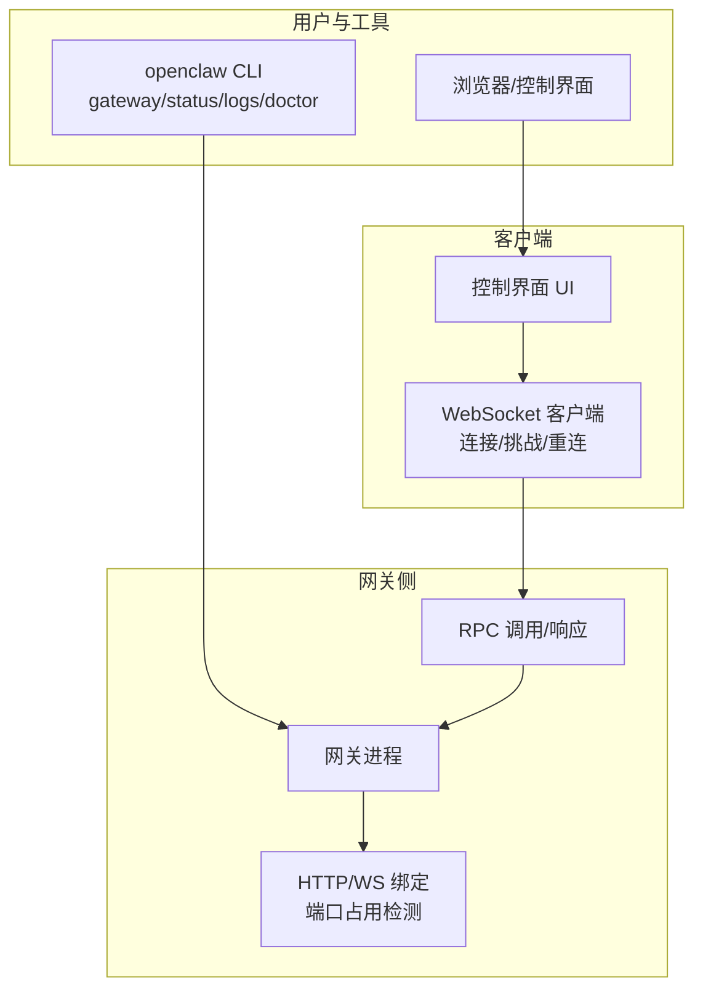
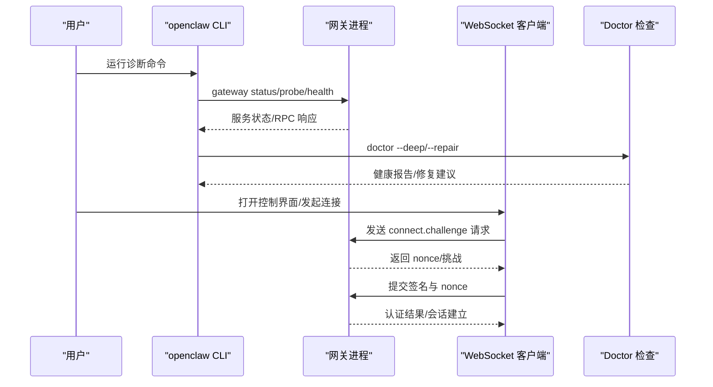
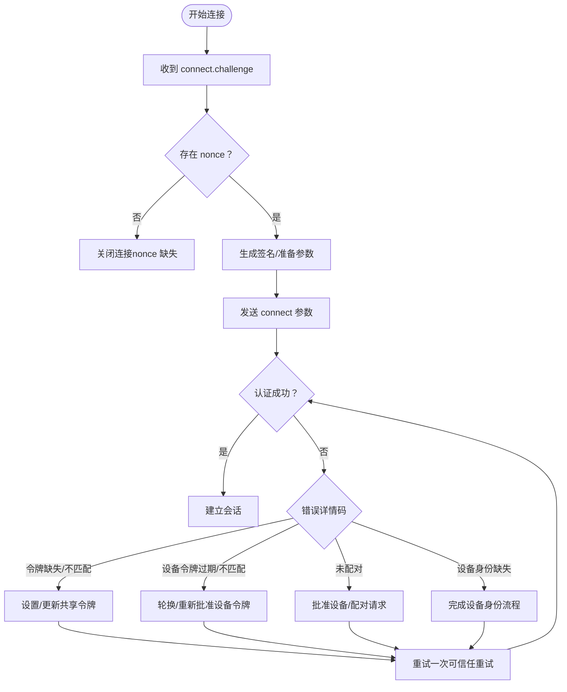
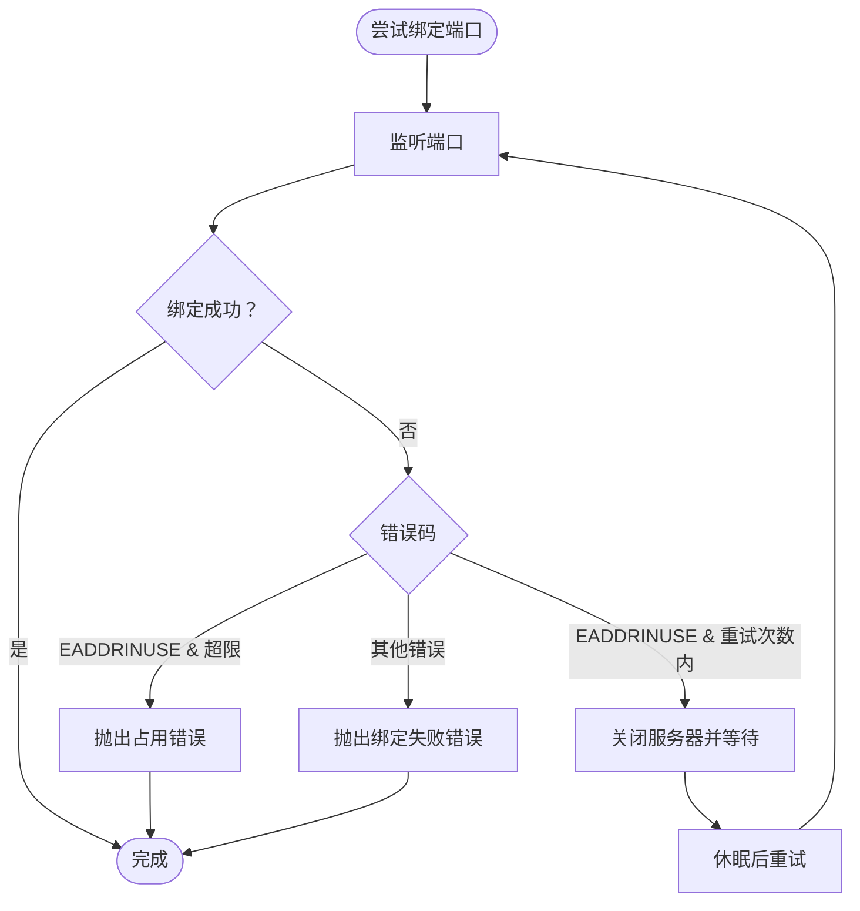
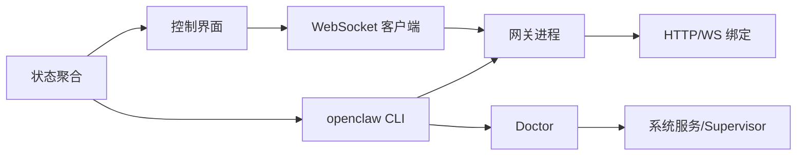

# 网关组件故障排除

<cite>
**本文引用的文件**
- [docs/gateway/troubleshooting.md](file://docs/gateway/troubleshooting.md)
- [docs/cli/gateway.md](file://docs/cli/gateway.md)
- [docs/cli/doctor.md](file://docs/cli/doctor.md)
- [docs/cli/logs.md](file://docs/cli/logs.md)
- [src/gateway/server/http-listen.ts](file://src/gateway/server/http-listen.ts)
- [src/gateway/client.ts](file://src/gateway/client.ts)
- [apps/shared/OpenClawKit/Sources/OpenClawKit/GatewayErrors.swift](file://apps/shared/OpenClawKit/Sources/OpenClawKit/GatewayErrors.swift)
- [ui/src/ui/gateway.ts](file://ui/src/ui/gateway.ts)
- [src/commands/status-all.ts](file://src/commands/status-all.ts)
- [src/daemon/service-runtime.ts](file://src/daemon/service-runtime.ts)
- [docs/gateway/doctor.md](file://docs/gateway/doctor.md)
</cite>

## 目录
1. [简介](#简介)
2. [项目结构](#项目结构)
3. [核心组件](#核心组件)
4. [架构总览](#架构总览)
5. [详细组件分析](#详细组件分析)
6. [依赖分析](#依赖分析)
7. [性能考虑](#性能考虑)
8. [故障排除指南](#故障排除指南)
9. [结论](#结论)
10. [附录](#附录)

## 简介
本指南面向运维与开发者，聚焦 OpenClaw 网关组件的常见故障：服务启动失败、WebSocket 连接问题、认证错误、配置冲突、Anthropic 429 长上下文限制、无回复（No replies）排查、Dashboard 控制界面连接问题等。文档提供可操作的诊断命令与输出解读，并给出端口冲突检测、权限配置验证等实用排障步骤。

## 项目结构
围绕网关的故障排除，相关知识与实现分布在以下位置：
- 故障排除与诊断流程：docs/gateway/troubleshooting.md
- CLI 文档（gateway/status/doctor/logs 等）：docs/cli/*.md
- 网关服务绑定与端口占用：src/gateway/server/http-listen.ts
- 客户端连接与重连逻辑：src/gateway/client.ts、ui/src/ui/gateway.ts
- 错误模型与恢复建议：apps/shared/OpenClawKit/Sources/OpenClawKit/GatewayErrors.swift
- 状态与控制界面链接解析：src/commands/status-all.ts
- 服务运行时元数据：src/daemon/service-runtime.ts
- Doctor 健康检查与修复：docs/gateway/doctor.md

图表来源
- [docs/cli/gateway.md:95-127](file://docs/cli/gateway.md#L95-L127)
- [src/gateway/server/http-listen.ts:18-61](file://src/gateway/server/http-listen.ts#L18-L61)
- [src/gateway/client.ts:497-594](file://src/gateway/client.ts#L497-L594)
- [ui/src/ui/gateway.ts:446-469](file://ui/src/ui/gateway.ts#L446-L469)

章节来源
- [docs/gateway/troubleshooting.md:14-31](file://docs/gateway/troubleshooting.md#L14-L31)
- [docs/cli/gateway.md:95-127](file://docs/cli/gateway.md#L95-L127)

## 核心组件
- 网关状态查询与探测：通过 openclaw gateway status 与 gateway probe 获取服务状态、RPC 探针结果、URL 解析等。
- Doctor 健康检查与修复：openclaw doctor 执行配置迁移、端口冲突诊断、服务安装校验、通道状态探测等。
- 日志远程查看：openclaw logs 支持 --follow、--json、--limit 等参数，便于远端定位问题。
- WebSocket 连接与认证：客户端在收到 connect.challenge 后完成签名与 nonce 校验；失败时依据错误码进行恢复建议。
- 端口占用与绑定：服务在启动时尝试绑定端口，若被占用抛出明确错误，避免多实例互相干扰。

章节来源
- [docs/cli/gateway.md:95-127](file://docs/cli/gateway.md#L95-L127)
- [docs/cli/doctor.md:18-33](file://docs/cli/doctor.md#L18-L33)
- [docs/cli/logs.md:17-29](file://docs/cli/logs.md#L17-L29)
- [src/gateway/server/http-listen.ts:18-61](file://src/gateway/server/http-listen.ts#L18-L61)

## 架构总览
下图展示从 CLI 到网关、再到客户端连接的关键路径与交互点，以及 Doctor 的健康扫描范围。

图表来源
- [docs/cli/gateway.md:95-127](file://docs/cli/gateway.md#L95-L127)
- [docs/gateway/doctor.md:59-84](file://docs/gateway/doctor.md#L59-L84)
- [src/gateway/client.ts:497-594](file://src/gateway/client.ts#L497-L594)

## 详细组件分析

### 网关状态与探测
- gateway status：显示服务状态、运行时信息、可选 RPC 探针（包含 URL、鉴权方式、连接延迟等）。
- gateway probe：同时探测本地与远程网关，支持 SSH 透传场景。
- gateway health：轻量级健康检查，常用于快速确认服务可达性。

章节来源
- [docs/cli/gateway.md:95-127](file://docs/cli/gateway.md#L95-L127)
- [src/commands/status-all.ts:241-275](file://src/commands/status-all.ts#L241-L275)

### Doctor 健康检查与修复
- 配置迁移与规范化：自动处理旧键到新键映射，避免命令因旧配置阻塞。
- 端口冲突诊断：检查默认端口是否被占用或隧道占用。
- 服务安装与环境变量审计：对 systemd/launchd/schtasks 等进行一致性检查与修复提示。
- 通道状态警告：在网关健康时探测通道状态并给出修复建议。
- 模型认证健康：检查 OAuth 凭据有效期与可用性。

章节来源
- [docs/gateway/doctor.md:59-84](file://docs/gateway/doctor.md#L59-L84)
- [docs/gateway/doctor.md:304-318](file://docs/gateway/doctor.md#L304-L318)

### WebSocket 连接与认证
- 客户端挑战流程：收到 connect.challenge 后必须提供 nonce；超时或 nonce 缺失将触发断开。
- 设备身份与令牌：当出现设备身份/令牌不匹配时，按错误码指引执行一次性重试或轮换令牌。
- 非恢复性错误：部分错误（如令牌缺失、配对未完成、设备身份缺失）属于非恢复性，需手动修正配置或审批。

图表来源
- [src/gateway/client.ts:497-594](file://src/gateway/client.ts#L497-L594)
- [apps/shared/OpenClawKit/Sources/OpenClawKit/GatewayErrors.swift:31-115](file://apps/shared/OpenClawKit/Sources/OpenClawKit/GatewayErrors.swift#L31-L115)
- [ui/src/ui/gateway.ts:446-469](file://ui/src/ui/gateway.ts#L446-L469)

章节来源
- [src/gateway/client.ts:497-594](file://src/gateway/client.ts#L497-L594)
- [apps/shared/OpenClawKit/Sources/OpenClawKit/GatewayErrors.swift:31-115](file://apps/shared/OpenClawKit/Sources/OpenClawKit/GatewayErrors.swift#L31-L115)
- [ui/src/ui/gateway.ts:446-469](file://ui/src/ui/gateway.ts#L446-L469)

### 端口占用与绑定
- 端口绑定重试：在端口被占用且处于 TIME_WAIT 期间，服务会短暂等待后重试。
- 占用冲突：超过最大重试次数或非 TIME_WAIT 类错误，将抛出明确的“另一个网关实例已在监听”或绑定失败错误。

图表来源
- [src/gateway/server/http-listen.ts:18-61](file://src/gateway/server/http-listen.ts#L18-L61)

章节来源
- [src/gateway/server/http-listen.ts:18-61](file://src/gateway/server/http-listen.ts#L18-L61)

## 依赖分析
- CLI 与网关：gateway status/probe/health 依赖 WebSocket RPC；logs 依赖 RPC 远程拉取日志。
- Doctor 与系统服务：doctor 对 systemd/launchd/schtasks 进行审计与修复建议。
- 客户端与网关：WebSocket 客户端依赖 connect.challenge 流程；UI 层封装请求/响应与错误处理。
- 状态解析：status-all 将网关自报告与探针结果整合，生成可读的连接状态与鉴权信息。

图表来源
- [docs/cli/gateway.md:95-127](file://docs/cli/gateway.md#L95-L127)
- [docs/gateway/doctor.md:285-303](file://docs/gateway/doctor.md#L285-L303)
- [src/commands/status-all.ts:241-275](file://src/commands/status-all.ts#L241-L275)

章节来源
- [docs/cli/gateway.md:95-127](file://docs/cli/gateway.md#L95-L127)
- [docs/gateway/doctor.md:285-303](file://docs/gateway/doctor.md#L285-L303)
- [src/commands/status-all.ts:241-275](file://src/commands/status-all.ts#L241-L275)

## 性能考虑
- 端口占用重试：TIME_WAIT 内的自动重试减少人工干预，但可能带来短暂延迟。
- RPC 探测与日志：使用 --json 与 --limit 可降低带宽与解析成本，适合自动化脚本。
- 服务安装一致性：统一 supervisor 配置可减少启动失败与反复重启带来的资源浪费。

## 故障排除指南

### 通用诊断命令与输出解读
- openclaw status：查看整体状态、最近更新、网关可达性与鉴权方式。
- openclaw gateway status：查看服务状态、RPC 探针、URL 与鉴权信息。
- openclaw logs --follow：实时查看网关日志，定位异常堆栈与错误上下文。
- openclaw doctor：执行健康检查与修复，包括配置迁移、端口冲突、服务安装审计等。

章节来源
- [docs/gateway/troubleshooting.md:14-31](file://docs/gateway/troubleshooting.md#L14-L31)
- [docs/cli/gateway.md:95-127](file://docs/cli/gateway.md#L95-L127)
- [docs/cli/logs.md:17-29](file://docs/cli/logs.md#L17-L29)
- [docs/cli/doctor.md:18-33](file://docs/cli/doctor.md#L18-L33)

### 网关服务启动失败
- 症状：Runtime: stopped，exit hints 显示拒绝绑定或端口冲突。
- 排查步骤：
  - 使用 openclaw gateway status 查看服务状态与退出原因。
  - 使用 openclaw doctor --deep 检测额外网关实例与服务配置漂移。
  - 使用 openclaw gateway status --deep 深度扫描系统服务。
- 常见原因与修复：
  - 未启用本地模式：设置 gateway.mode="local" 或运行 openclaw configure。
  - 非回环绑定缺少鉴权：配置共享令牌或密码。
  - 端口冲突：another gateway instance is already listening / EADDRINUSE → 更改端口或停止冲突进程。

章节来源
- [docs/gateway/troubleshooting.md:152-180](file://docs/gateway/troubleshooting.md#L152-L180)
- [src/gateway/server/http-listen.ts:18-61](file://src/gateway/server/http-listen.ts#L18-L61)

### WebSocket 连接问题
- 症状：无法建立连接、反复断开、认证失败。
- 排查步骤：
  - 使用 openclaw gateway status --json 获取探针 URL 与鉴权方式。
  - 在客户端侧确认是否收到 connect.challenge，是否正确提交 nonce。
  - 若出现 AUTH_TOKEN_MISMATCH 并提示可信任重试，允许一次性重试；仍失败则执行令牌漂移恢复流程。
- 常见原因与修复：
  - 设备身份/令牌缺失：完成设备身份流程或轮换设备令牌。
  - 非法 URL 或主机名：核对 --url 与实际网关地址一致。
  - 客户端未完成挑战流程：确保在收到 challenge 后签名并发送正确的 nonce。

章节来源
- [docs/gateway/troubleshooting.md:91-151](file://docs/gateway/troubleshooting.md#L91-L151)
- [src/gateway/client.ts:497-594](file://src/gateway/client.ts#L497-L594)
- [apps/shared/OpenClawKit/Sources/OpenClawKit/GatewayErrors.swift:31-115](file://apps/shared/OpenClawKit/Sources/OpenClawKit/GatewayErrors.swift#L31-L115)

### 认证错误
- 症状：unauthorized、AUTH_TOKEN_MISSING、AUTH_TOKEN_MISMATCH、PAIRING_REQUIRED、DEVICE_IDENTITY_REQUIRED 等。
- 排查步骤：
  - 使用 openclaw doctor 检查鉴权配置与 SecretRef 状态。
  - 使用 openclaw gateway status --json 核对鉴权方式与令牌来源。
  - 控制界面：根据 lastErrorCode 判断是否需要令牌或完成配对。
- 常见原因与修复：
  - 令牌缺失或不匹配：设置共享令牌或使用 doctor 生成令牌。
  - 设备令牌过期：轮换/重新批准设备令牌。
  - 未完成配对：在 openclaw devices 中批准请求。

章节来源
- [docs/gateway/troubleshooting.md:120-151](file://docs/gateway/troubleshooting.md#L120-L151)
- [docs/cli/doctor.md:26-33](file://docs/cli/doctor.md#L26-L33)
- [ui/src/ui/views/overview.ts:101-144](file://ui/src/ui/views/overview.ts#L101-L144)

### 配置冲突
- 症状：RPC 探测失败但运行时存活；gateway.mode 与 CLI 目标不一致；显式 --url 不回落到存储凭据。
- 排查步骤：
  - 使用 openclaw gateway status 与 openclaw config get 核对 gateway.mode、gateway.remote.url、gateway.auth.mode。
  - 使用 openclaw doctor --repair 修复服务安装与环境变量不一致问题。
- 常见原因与修复：
  - 远程模式下 CLI 默认指向远程而本地服务正常：切换到本地或修正 --url。
  - 绑定与鉴权不匹配：为非回环绑定配置鉴权。

章节来源
- [docs/gateway/troubleshooting.md:307-380](file://docs/gateway/troubleshooting.md#L307-L380)
- [docs/gateway/doctor.md:285-303](file://docs/gateway/doctor.md#L285-L303)

### Anthropic 429 长上下文限制
- 症状：HTTP 429 rate_limit_error: Extra usage is required for long context requests。
- 排查步骤：
  - 使用 openclaw logs --follow 观察错误上下文。
  - 使用 openclaw models status 与 openclaw config get agents.defaults.models 检查模型长上下文参数。
- 修复选项：
  - 关闭 context1m 以回落到常规上下文窗口。
  - 使用具备账单或启用 Extra Usage 的 Anthropic 密钥。
  - 配置回退模型以在长上下文请求被拒绝时继续运行。

章节来源
- [docs/gateway/troubleshooting.md:32-60](file://docs/gateway/troubleshooting.md#L32-L60)

### 无回复（No replies）
- 症状：通道已连接但无响应。
- 排查步骤：
  - 使用 openclaw channels status --probe、openclaw pairing list、openclaw config get channels 检查配对与策略。
  - 使用 openclaw logs --follow 观察 drop guild message、pairing request、blocked/allowlist 等日志线索。
- 常见原因与修复：
  - 群组提及要求未满足：开启 requireMention 或配置 mentionPatterns。
  - 发送方/频道被策略过滤：调整 allowlist 或群组白名单。

章节来源
- [docs/gateway/troubleshooting.md:61-90](file://docs/gateway/troubleshooting.md#L61-L90)

### Dashboard 控制界面连接问题
- 症状：控制界面无法连接、报错 device identity required/device nonce mismatch/device signature invalid 等。
- 排查步骤：
  - 使用 openclaw gateway status、openclaw status、openclaw logs --follow、openclaw doctor、gateway status --json 核对 URL、鉴权与安全上下文。
  - 在控制界面中根据 lastErrorCode 判断所需修复动作。
- 常见原因与修复：
  - 非安全上下文或缺少设备鉴权：完成设备身份流程。
  - nonce 不匹配或签名过期：确保客户端按 challenge 正确签名并使用当前握手时间戳。
  - 可信任重试一次后仍失败：执行令牌漂移恢复流程并重新批准设备令牌。

章节来源
- [docs/gateway/troubleshooting.md:91-151](file://docs/gateway/troubleshooting.md#L91-L151)
- [ui/src/ui/views/overview.ts:101-144](file://ui/src/ui/views/overview.ts#L101-L144)

### 端口冲突检测
- 症状：another gateway instance is already listening / EADDRINUSE。
- 排查步骤：
  - 使用 openclaw doctor --deep 或直接查看服务运行时状态（lastExitStatus、detail）。
  - 使用 netstat/ss/lsof 检查端口占用进程。
- 修复建议：
  - 更改网关端口或停止占用进程。
  - 若为 TIME_WAIT，等待片刻后重试。

章节来源
- [src/gateway/server/http-listen.ts:18-61](file://src/gateway/server/http-listen.ts#L18-L61)
- [src/daemon/service-runtime.ts:1-13](file://src/daemon/service-runtime.ts#L1-L13)

### 权限配置验证
- 症状：服务安装后鉴权失败、doctor 报告环境变量覆盖或权限问题。
- 排查步骤：
  - 使用 openclaw doctor 检查配置文件权限与 SecretRef 状态。
  - 在 macOS 上使用 launchctl getenv/unsetenv 清理覆盖的环境变量。
- 修复建议：
  - 严格配置 gateway.auth.token/password，必要时使用 SecretRef。
  - 修复配置文件权限（chmod 600），避免组/世界可读。

章节来源
- [docs/cli/doctor.md:26-33](file://docs/cli/doctor.md#L26-L33)
- [docs/cli/doctor.md:35-45](file://docs/cli/doctor.md#L35-L45)

## 结论
通过“命令阶梯”（status → gateway status → logs --follow → doctor → channels status --probe）与针对具体场景的诊断清单，可高效定位并解决网关组件的启动、连接、认证与配置类问题。结合 Doctor 的自动修复与端口占用检测，可显著缩短排障时间并提升系统稳定性。

## 附录

### 常用命令速查
- openclaw status：查看整体状态与最近更新。
- openclaw gateway status：查看服务状态与 RPC 探针。
- openclaw logs --follow：实时查看网关日志。
- openclaw doctor：执行健康检查与修复。
- openclaw channels status --probe：检查通道连接与策略。

章节来源
- [docs/gateway/troubleshooting.md:14-31](file://docs/gateway/troubleshooting.md#L14-L31)