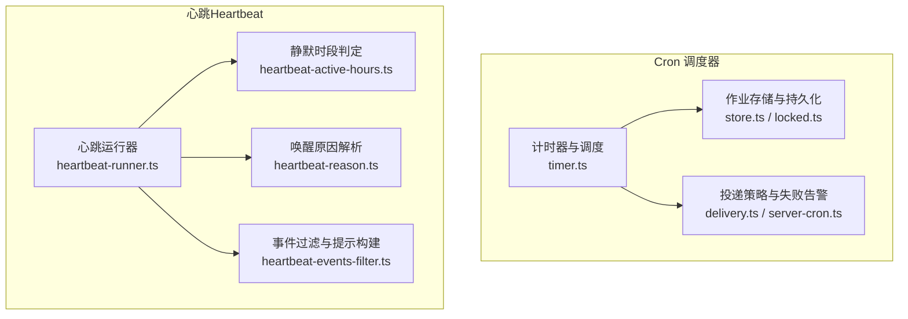
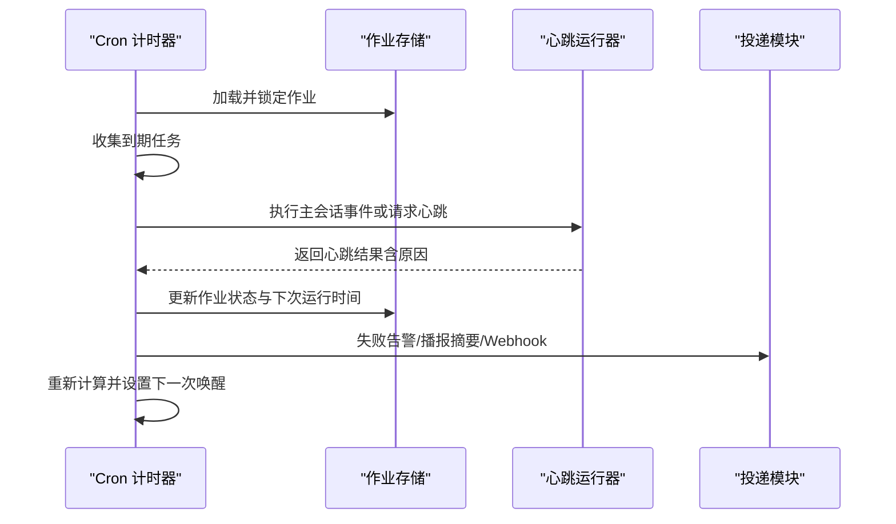
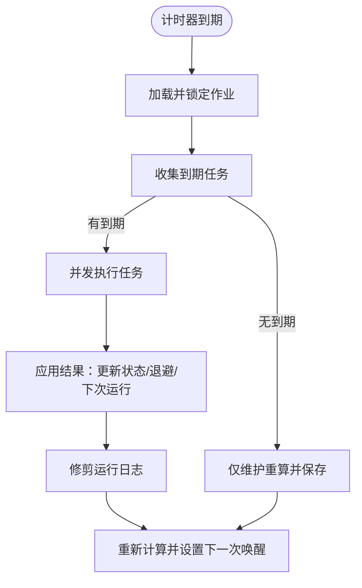
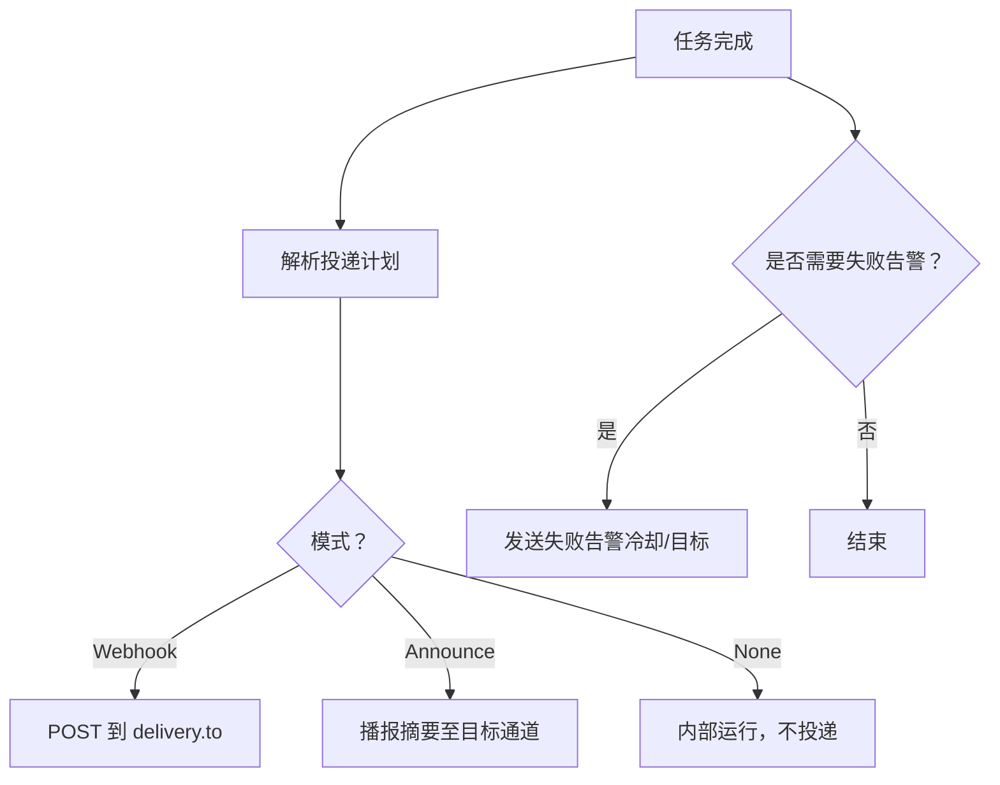
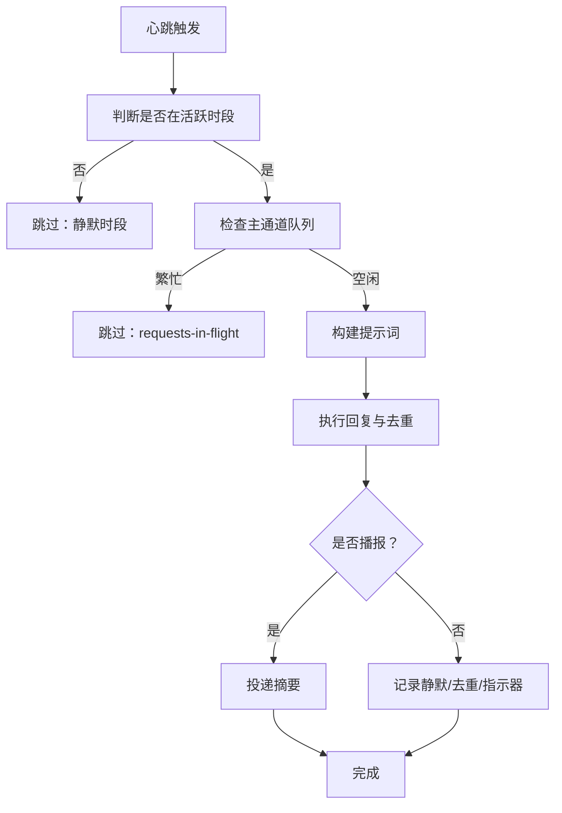
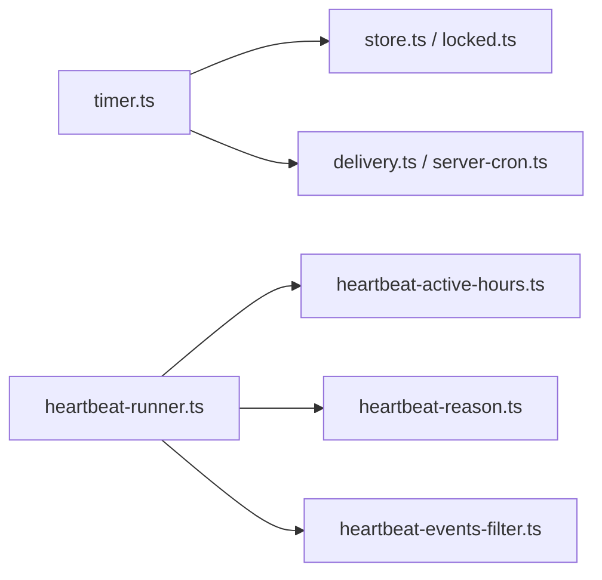

# 自动化任务故障排除

<cite>
**本文引用的文件**
- [docs/automation/troubleshooting.md](file://docs/automation/troubleshooting.md)
- [docs/automation/cron-jobs.md](file://docs/automation/cron-jobs.md)
- [docs/automation/cron-vs-heartbeat.md](file://docs/automation/cron-vs-heartbeat.md)
- [docs/gateway/heartbeat.md](file://docs/gateway/heartbeat.md)
- [src/cron/service/timer.ts](file://src/cron/service/timer.ts)
- [src/cron/service/store.ts](file://src/cron/service/store.ts)
- [src/cron/service/locked.ts](file://src/cron/service/locked.ts)
- [src/cron/delivery.ts](file://src/cron/delivery.ts)
- [src/infra/heartbeat-runner.ts](file://src/infra/heartbeat-runner.ts)
- [src/infra/heartbeat-active-hours.ts](file://src/infra/heartbeat-active-hours.ts)
- [src/infra/heartbeat-reason.ts](file://src/infra/heartbeat-reason.ts)
- [src/infra/heartbeat-events-filter.ts](file://src/infra/heartbeat-events-filter.ts)
- [src/gateway/server-cron.ts](file://src/gateway/server-cron.ts)
- [src/cron/service.failure-alert.test.ts](file://src/cron/service.failure-alert.test.ts)
- [src/cron/service/timer.ts](file://src/cron/service/timer.ts)
</cite>

## 目录
1. [简介](#简介)
2. [项目结构](#项目结构)
3. [核心组件](#核心组件)
4. [架构总览](#架构总览)
5. [详细组件分析](#详细组件分析)
6. [依赖关系分析](#依赖关系分析)
7. [性能考量](#性能考量)
8. [故障排除指南](#故障排除指南)
9. [结论](#结论)
10. [附录](#附录)

## 简介
本指南聚焦于自动化任务系统的故障排除，覆盖 Cron 作业调度失败、心跳任务执行异常、定时任务未触发等常见问题。文档提供任务状态检查、调度器状态验证、作业历史记录分析等诊断方法，并给出 Cron 服务重启、任务配置修正、时间窗口验证等实用排障步骤。同时包含静默时段设置、并发限制配置、错误重试机制等关键参数的调优建议。

## 项目结构
自动化任务系统由两大部分组成：
- Cron 调度器：负责在指定时间点或周期性地执行任务，支持主会话事件与隔离会话执行两种模式，并可选择直接播报摘要或通过 Webhook 回传结果。
- 心跳（Heartbeat）：周期性在主会话中运行，汇总多项监控任务，具备智能抑制与自然漂移特性，适合低开销的持续监控。

图表来源
- [src/cron/service/timer.ts:507-731](file://src/cron/service/timer.ts#L507-L731)
- [src/cron/service/store.ts:34-72](file://src/cron/service/store.ts#L34-L72)
- [src/cron/service/locked.ts:11-22](file://src/cron/service/locked.ts#L11-L22)
- [src/cron/delivery.ts:111-239](file://src/cron/delivery.ts#L111-L239)
- [src/infra/heartbeat-runner.ts:608-1008](file://src/infra/heartbeat-runner.ts#L608-L1008)
- [src/infra/heartbeat-active-hours.ts:70-99](file://src/infra/heartbeat-active-hours.ts#L70-L99)
- [src/infra/heartbeat-reason.ts:20-57](file://src/infra/heartbeat-reason.ts#L20-L57)
- [src/infra/heartbeat-events-filter.ts:86-96](file://src/infra/heartbeat-events-filter.ts#L86-L96)

章节来源
- [docs/automation/cron-jobs.md:10-33](file://docs/automation/cron-jobs.md#L10-L33)
- [docs/automation/cron-vs-heartbeat.md:10-287](file://docs/automation/cron-vs-heartbeat.md#L10-L287)

## 核心组件
- Cron 计时器与调度：负责计算下次唤醒时间、收集到期任务、并发执行、应用退避策略、更新作业状态与下一次运行时间。
- Cron 存储与锁：确保对作业存储的读写串行化，避免竞态；加载/保存作业文件并维护文件时间戳以防止热重载冲突。
- Cron 投递与失败告警：根据作业配置决定播报摘要或 Webhook 回传；支持失败告警通道与冷却策略；支持最佳努力投递与失败目的地回退。
- 心跳运行器：解析心跳配置、判定静默时段、检查队列繁忙度、构建提示词、执行回复、去重与抑制、最终投递或静默。
- 静默时段与原因解析：基于用户时区与显式时区解析当前是否处于活跃时间段；将唤醒原因归类为间隔、手动、事件驱动等类型。
- 事件过滤：区分心跳噪音、执行完成事件与 Cron 系统事件，决定是否作为提醒内容投递。

章节来源
- [src/cron/service/timer.ts:507-731](file://src/cron/service/timer.ts#L507-L731)
- [src/cron/service/store.ts:34-72](file://src/cron/service/store.ts#L34-L72)
- [src/cron/service/locked.ts:11-22](file://src/cron/service/locked.ts#L11-L22)
- [src/cron/delivery.ts:111-239](file://src/cron/delivery.ts#L111-L239)
- [src/infra/heartbeat-runner.ts:608-1008](file://src/infra/heartbeat-runner.ts#L608-L1008)
- [src/infra/heartbeat-active-hours.ts:70-99](file://src/infra/heartbeat-active-hours.ts#L70-L99)
- [src/infra/heartbeat-reason.ts:20-57](file://src/infra/heartbeat-reason.ts#L20-L57)
- [src/infra/heartbeat-events-filter.ts:86-96](file://src/infra/heartbeat-events-filter.ts#L86-L96)

## 架构总览
Cron 与心跳共同构成自动化任务体系。Cron 在网关内部运行，持久化作业并在到期时唤醒代理；心跳在主会话中定期运行，汇总监控项并按需播报。

图表来源
- [src/cron/service/timer.ts:572-731](file://src/cron/service/timer.ts#L572-L731)
- [src/infra/heartbeat-runner.ts:608-1008](file://src/infra/heartbeat-runner.ts#L608-L1008)
- [src/cron/delivery.ts:111-239](file://src/cron/delivery.ts#L111-L239)

## 详细组件分析

### Cron 调度器（计时器与状态管理）
- 唤醒与重试：当计时器到期后，收集到期任务并发执行；若执行挂起则以固定间隔重检，避免事件循环被占满。
- 退避与禁用：对一次性任务按瞬时错误进行最多三次指数退避；对周期性任务在连续错误后采用指数退避并保留启用状态。
- 最小重触间隔：防止同一秒内重复触发导致的自旋循环。
- 运行日志修剪：按大小与行数修剪运行日志文件，避免 IO 压力。
- 失败告警：在达到阈值后发送失败告警，支持 Webhook 或播报摘要；可配置冷却时间与目标通道。

图表来源
- [src/cron/service/timer.ts:572-731](file://src/cron/service/timer.ts#L572-L731)
- [src/cron/service/store.ts:34-72](file://src/cron/service/store.ts#L34-L72)

章节来源
- [src/cron/service/timer.ts:114-162](file://src/cron/service/timer.ts#L114-L162)
- [src/cron/service/timer.ts:206-288](file://src/cron/service/timer.ts#L206-L288)
- [src/cron/service/timer.ts:295-474](file://src/cron/service/timer.ts#L295-L474)
- [src/cron/service/store.ts:34-72](file://src/cron/service/store.ts#L34-L72)

### Cron 投递与失败告警
- 投递策略：根据作业配置决定播报摘要（默认）、Webhook 回传或内部不投递；支持最佳努力投递与失败目的地回退。
- 失败告警：可配置全局与作业级失败告警；支持冷却时间与目标通道；Webhook 模式要求有效 URL 并进行 SSRF 保护。
- 失败目的地：当主投递失败且配置了失败目的地（announce/webhook），自动切换到失败目的地进行回退通知。

图表来源
- [src/cron/delivery.ts:111-239](file://src/cron/delivery.ts#L111-L239)
- [src/gateway/server-cron.ts:302-469](file://src/gateway/server-cron.ts#L302-L469)

章节来源
- [src/cron/delivery.ts:111-239](file://src/cron/delivery.ts#L111-L239)
- [src/gateway/server-cron.ts:302-469](file://src/gateway/server-cron.ts#L302-L469)

### 心跳运行器（静默时段、队列与播报）
- 静默时段：根据配置的开始/结束时间与时区判定是否允许心跳；支持用户时区、本地时区与 IANA 时区。
- 队列繁忙度：若主通道队列非空，则跳过本次心跳并等待后续重试。
- 提示词与播报：构建提示词，执行回复，去重与抑制；根据可见性控制是否播报；支持理由指示器。
- 事件驱动：当唤醒原因为执行事件、Cron 事件或钩子事件时，心跳会携带相应上下文。

图表来源
- [src/infra/heartbeat-runner.ts:608-1008](file://src/infra/heartbeat-runner.ts#L608-L1008)
- [src/infra/heartbeat-active-hours.ts:70-99](file://src/infra/heartbeat-active-hours.ts#L70-L99)
- [src/infra/heartbeat-reason.ts:20-57](file://src/infra/heartbeat-reason.ts#L20-L57)
- [src/infra/heartbeat-events-filter.ts:86-96](file://src/infra/heartbeat-events-filter.ts#L86-L96)

章节来源
- [src/infra/heartbeat-runner.ts:608-1008](file://src/infra/heartbeat-runner.ts#L608-L1008)
- [src/infra/heartbeat-active-hours.ts:70-99](file://src/infra/heartbeat-active-hours.ts#L70-L99)
- [src/infra/heartbeat-reason.ts:20-57](file://src/infra/heartbeat-reason.ts#L20-L57)
- [src/infra/heartbeat-events-filter.ts:86-96](file://src/infra/heartbeat-events-filter.ts#L86-L96)

## 依赖关系分析
- Cron 调度器依赖存储模块进行作业持久化与串行化操作，依赖投递模块进行失败告警与播报。
- 心跳运行器依赖静默时段模块、原因解析模块与事件过滤模块，结合通道插件进行播报与去重。
- 两者均通过网关配置与运行时环境进行初始化与更新。

图表来源
- [src/cron/service/timer.ts:507-731](file://src/cron/service/timer.ts#L507-L731)
- [src/cron/service/store.ts:34-72](file://src/cron/service/store.ts#L34-L72)
- [src/cron/delivery.ts:111-239](file://src/cron/delivery.ts#L111-L239)
- [src/infra/heartbeat-runner.ts:608-1008](file://src/infra/heartbeat-runner.ts#L608-L1008)
- [src/infra/heartbeat-active-hours.ts:70-99](file://src/infra/heartbeat-active-hours.ts#L70-L99)
- [src/infra/heartbeat-reason.ts:20-57](file://src/infra/heartbeat-reason.ts#L20-L57)
- [src/infra/heartbeat-events-filter.ts:86-96](file://src/infra/heartbeat-events-filter.ts#L86-L96)

## 性能考量
- 高频 Cron：注意会话保留与运行日志修剪策略，避免大量孤立运行与日志文件造成 IO 压力。
- 心跳频率：默认 30 分钟一次，可根据实际需求调整；在高负载场景下，心跳会在队列繁忙时自动推迟。
- 退避策略：周期性任务在连续错误后采用指数退避，减少重试风暴；一次性任务在瞬时错误下最多三次重试。

章节来源
- [docs/automation/cron-jobs.md:446-480](file://docs/automation/cron-jobs.md#L446-L480)
- [src/cron/service/timer.ts:114-162](file://src/cron/service/timer.ts#L114-L162)

## 故障排除指南

### 通用命令阶梯
使用以下命令快速定位问题：
- 系统与网关状态：openclaw status、openclaw gateway status、openclaw logs --follow、openclaw doctor、openclaw channels status --probe
- Cron 检查：openclaw cron status、openclaw cron list、openclaw cron runs --id <jobId> --limit 20
- 心跳检查：openclaw system heartbeat last、openclaw config get agents.defaults.heartbeat

章节来源
- [docs/automation/troubleshooting.md:14-31](file://docs/automation/troubleshooting.md#L14-L31)

### Cron 未触发/未执行
- 检查调度器是否启用：确认配置与环境变量未禁用 Cron。
- 检查作业状态：确认作业已启用、计划正确、时区一致。
- 查看最近运行记录：核对运行状态与跳过原因（如 not-due）。
- 关键日志：关注“scheduler disabled”“timer tick failed”等错误信息。

章节来源
- [docs/automation/troubleshooting.md:32-52](file://docs/automation/troubleshooting.md#L32-L52)
- [src/cron/service/store.ts:51-63](file://src/cron/service/store.ts#L51-L63)
- [src/cron/service/timer.ts:550-558](file://src/cron/service/timer.ts#L550-L558)

### Cron 已触发但未播报/未回传
- 检查投递模式与目标：确认 delivery.mode、channel、to 是否正确。
- 检查通道认证与权限：关注 unauthorized、missing_scope、Forbidden 等错误。
- 检查最佳努力与失败目的地：若主投递失败，确认失败目的地配置是否有效。

章节来源
- [docs/automation/troubleshooting.md:53-73](file://docs/automation/troubleshooting.md#L53-L73)
- [src/cron/delivery.ts:111-239](file://src/cron/delivery.ts#L111-L239)
- [src/gateway/server-cron.ts:302-469](file://src/gateway/server-cron.ts#L302-L469)

### 心跳被静默或跳过
- 检查静默时段：确认 activeHours 的 start/end 与时区配置是否合理。
- 检查队列繁忙度：若主通道队列非空，心跳会被推迟。
- 检查可见性设置：若 alerts-disabled，心跳可能只在内部处理而不对外播报。

章节来源
- [docs/automation/troubleshooting.md:74-94](file://docs/automation/troubleshooting.md#L74-L94)
- [docs/gateway/heartbeat.md:146-275](file://docs/gateway/heartbeat.md#L146-L275)
- [src/infra/heartbeat-runner.ts:634-642](file://src/infra/heartbeat-runner.ts#L634-L642)
- [src/infra/heartbeat-active-hours.ts:70-99](file://src/infra/heartbeat-active-hours.ts#L70-L99)

### 时间与静默时段陷阱
- 用户时区缺失：当 agents.defaults.userTimezone 未设置时，心跳可能回退到主机时区。
- Cron at 表达式：省略时区的 at 时间被视为 UTC。
- top-of-hour 负载分散：对于每小时整点表达式，系统会施加最多 5 分钟的随机错峰。

章节来源
- [docs/automation/troubleshooting.md:95-123](file://docs/automation/troubleshooting.md#L95-L123)
- [docs/automation/cron-jobs.md:113-134](file://docs/automation/cron-jobs.md#L113-L134)

### 排障步骤清单
- Cron 服务重启：停止并重启网关进程，确保计时器与存储状态恢复。
- 任务配置修正：校验作业的 schedule、delivery、agentId、模型与思考层级等字段。
- 时间窗口验证：核对 activeHours 与时区，必要时改为 full-day 或明确 IANA 时区。
- 并发限制与退避：调整 cron.maxConcurrentRuns、重试次数与退避策略，观察日志收敛情况。
- 失败告警与回退：开启失败告警并配置冷却时间与目标；为关键作业配置失败目的地回退。

章节来源
- [docs/automation/cron-jobs.md:401-445](file://docs/automation/cron-jobs.md#L401-L445)
- [src/cron/service/timer.ts:206-288](file://src/cron/service/timer.ts#L206-L288)
- [src/cron/delivery.ts:111-239](file://src/cron/delivery.ts#L111-L239)

### 关键参数调优建议
- 静默时段（Heartbeat）：根据业务需求设置 activeHours.start/end 与 timezone；避免 start=end 导致零宽窗口。
- 并发限制（Cron）：maxConcurrentRuns 控制并发执行上限；高频任务建议降低并发或拆分作业。
- 错误重试（Cron）：针对瞬时错误（限流、过载、网络、服务器错误）设置合理重试次数与退避；永久错误立即禁用。
- 失败告警（Cron）：为关键作业启用失败告警，配置冷却时间与目标通道；必要时启用失败目的地回退。

章节来源
- [docs/automation/cron-jobs.md:401-445](file://docs/automation/cron-jobs.md#L401-L445)
- [src/cron/service/timer.ts:114-162](file://src/cron/service/timer.ts#L114-L162)
- [src/cron/service/timer.ts:206-288](file://src/cron/service/timer.ts#L206-L288)
- [src/cron/delivery.ts:111-239](file://src/cron/delivery.ts#L111-L239)

## 结论
通过系统化的命令阶梯与参数排查，可以快速定位 Cron 与心跳的异常根因。重点在于：确认调度器状态与作业配置、验证投递链路与失败告警、检查静默时段与队列繁忙度、并结合退避与并发策略进行调优。遵循本文提供的步骤与建议，可显著提升自动化任务的稳定性与可观测性。

## 附录

### 常见错误与信号
- Cron：scheduler disabled、timer tick failed、not-due
- 心跳：quiet-hours、requests-in-flight、alerts-disabled、no-target、duplicate

章节来源
- [docs/automation/troubleshooting.md:47-94](file://docs/automation/troubleshooting.md#L47-L94)
- [src/infra/heartbeat-runner.ts:712-721](file://src/infra/heartbeat-runner.ts#L712-L721)
- [src/infra/heartbeat-runner.ts:892-902](file://src/infra/heartbeat-runner.ts#L892-L902)