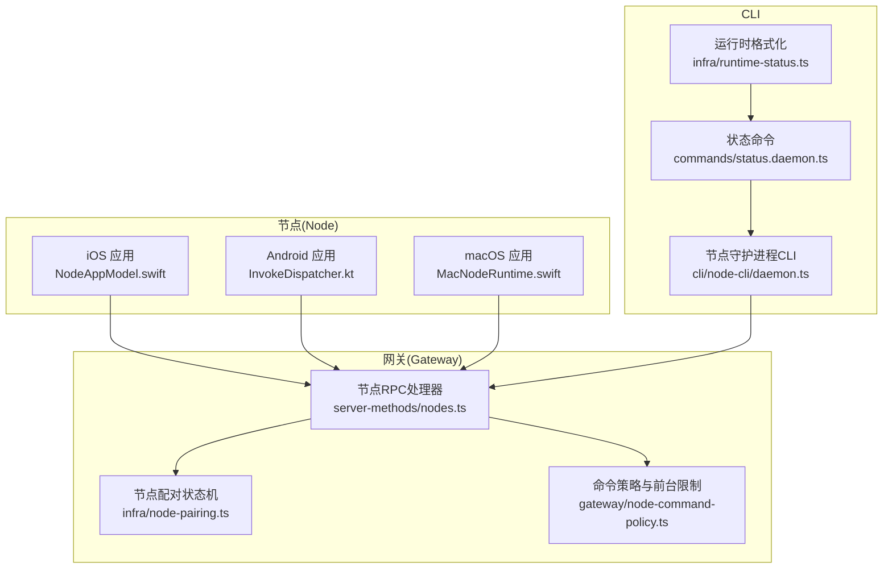
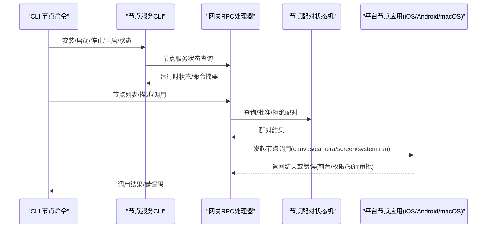
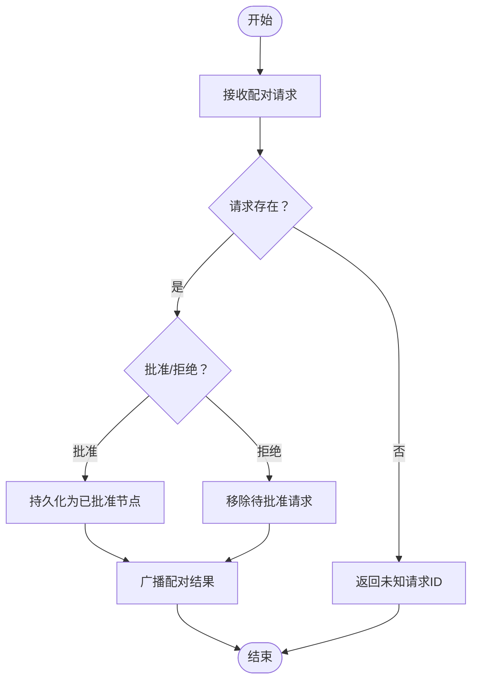
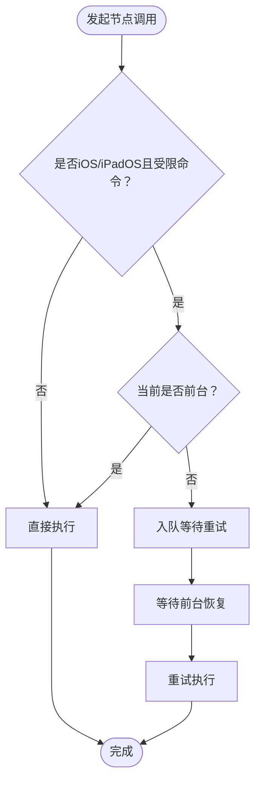
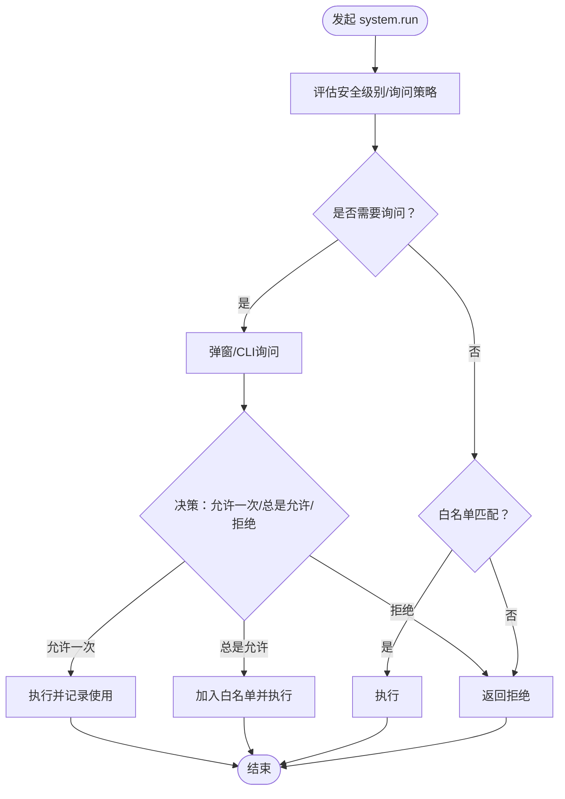
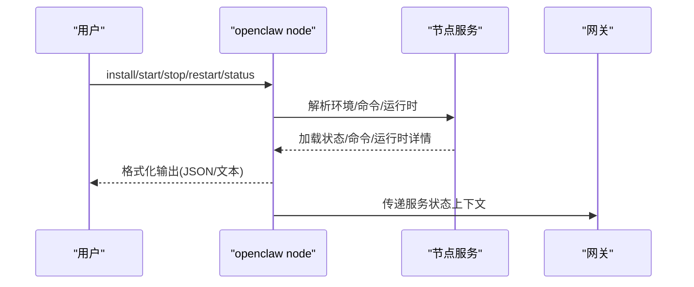
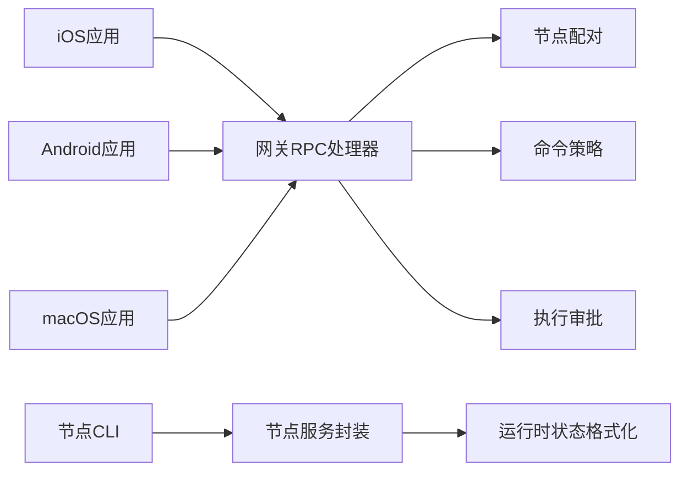

# 节点系统故障排除

<cite>
**本文引用的文件**
- [docs/nodes/troubleshooting.md](file://docs/nodes/troubleshooting.md)
- [src/cli/node-cli/daemon.ts](file://src/cli/node-cli/daemon.ts)
- [src/daemon/node-service.ts](file://src/daemon/node-service.ts)
- [src/gateway/server-methods/nodes.ts](file://src/gateway/server-methods/nodes.ts)
- [src/infra/node-pairing.ts](file://src/infra/node-pairing.ts)
- [src/infra/exec-approvals.ts](file://src/infra/exec-approvals.ts)
- [src/gateway/node-command-policy.ts](file://src/gateway/node-command-policy.ts)
- [apps/macos/Sources/OpenClaw/NodeServiceManager.swift](file://apps/macos/Sources/OpenClaw/NodeServiceManager.swift)
- [apps/macos/Sources/OpenClaw/NodeMode/MacNodeRuntime.swift](file://apps/macos/Sources/OpenClaw/NodeMode/MacNodeRuntime.swift)
- [apps/ios/Sources/Model/NodeAppModel.swift](file://apps/ios/Sources/Model/NodeAppModel.swift)
- [apps/android/app/src/main/java/ai/openclaw/app/node/InvokeDispatcher.kt](file://apps/android/app/src/main/java/ai/openclaw/app/node/InvokeDispatcher.kt)
- [docs/platforms/ios.md](file://docs/platforms/ios.md)
- [docs/platforms/android.md](file://docs/platforms/android.md)
- [docs/platforms/macos.md](file://docs/platforms/macos.md)
- [src/commands/status.daemon.ts](file://src/commands/status.daemon.ts)
- [src/infra/runtime-status.ts](file://src/infra/runtime-status.ts)
- [src/commands/daemon-install-runtime-warning.ts](file://src/commands/daemon-install-runtime-warning.ts)
- [src/agents/bash-tools.exec-host-gateway.ts](file://src/agents/bash-tools.exec-host-gateway.ts)
</cite>

## 目录
1. [简介](#简介)
2. [项目结构](#项目结构)
3. [核心组件](#核心组件)
4. [架构总览](#架构总览)
5. [详细组件分析](#详细组件分析)
6. [依赖关系分析](#依赖关系分析)
7. [性能考量](#性能考量)
8. [故障排除指南](#故障排除指南)
9. [结论](#结论)
10. [附录](#附录)

## 简介
本指南面向多平台节点（macOS、iOS、Android）使用者与运维人员，聚焦“节点可见但功能失效”的典型场景，提供系统化的诊断路径与可操作的修复步骤。内容覆盖：
- 连接与发现：Bonjour/Tailscale/手动主机端口
- 前台运行要求：iOS/Android 的 canvas/camera/screen 前台限制
- 权限矩阵：相机、屏幕录制、位置、系统运行（system.run）等
- 配对与执行审批：设备配对、exec 审批与白名单策略
- 服务生命周期：节点服务安装、启动、停止、状态查询与重启
- 日志与健康检查：doctor、日志跟踪、状态快照

## 项目结构
节点系统由“网关侧服务编排 + 多端节点应用 + CLI 工具链”构成，关键模块如下：
- 网关侧：节点配对、节点列表、节点调用路由、前台受限命令处理、APNs 唤醒与重连
- 节点侧：iOS/Android/macOS 应用分别实现能力调用与前台限制
- CLI：节点服务安装/启动/停止/重启/状态查询，以及 doctor/logs/status 等诊断命令
- 执行审批：exec-approvals 文件与策略（安全级别、询问模式、白名单）

**图表来源**
- [src/gateway/server-methods/nodes.ts:384-800](file://src/gateway/server-methods/nodes.ts#L384-L800)
- [src/infra/node-pairing.ts:146-228](file://src/infra/node-pairing.ts#L146-L228)
- [src/gateway/node-command-policy.ts:1-44](file://src/gateway/node-command-policy.ts#L1-L44)
- [apps/ios/Sources/Model/NodeAppModel.swift:732-751](file://apps/ios/Sources/Model/NodeAppModel.swift#L732-L751)
- [apps/android/app/src/main/java/ai/openclaw/app/node/InvokeDispatcher.kt:45-54](file://apps/android/app/src/main/java/ai/openclaw/app/node/InvokeDispatcher.kt#L45-L54)
- [apps/macos/Sources/OpenClaw/NodeMode/MacNodeRuntime.swift:188-215](file://apps/macos/Sources/OpenClaw/NodeMode/MacNodeRuntime.swift#L188-L215)
- [src/cli/node-cli/daemon.ts:91-237](file://src/cli/node-cli/daemon.ts#L91-L237)
- [src/commands/status.daemon.ts:15-37](file://src/commands/status.daemon.ts#L15-L37)
- [src/infra/runtime-status.ts:1-28](file://src/infra/runtime-status.ts#L1-L28)

**章节来源**
- [src/gateway/server-methods/nodes.ts:109-139](file://src/gateway/server-methods/nodes.ts#L109-L139)
- [src/infra/node-pairing.ts:146-228](file://src/infra/node-pairing.ts#L146-L228)
- [src/gateway/node-command-policy.ts:1-44](file://src/gateway/node-command-policy.ts#L1-L44)
- [apps/ios/Sources/Model/NodeAppModel.swift:732-751](file://apps/ios/Sources/Model/NodeAppModel.swift#L732-L751)
- [apps/android/app/src/main/java/ai/openclaw/app/node/InvokeDispatcher.kt:45-54](file://apps/android/app/src/main/java/ai/openclaw/app/node/InvokeDispatcher.kt#L45-L54)
- [apps/macos/Sources/OpenClaw/NodeMode/MacNodeRuntime.swift:188-215](file://apps/macos/Sources/OpenClaw/NodeMode/MacNodeRuntime.swift#L188-L215)
- [src/cli/node-cli/daemon.ts:91-237](file://src/cli/node-cli/daemon.ts#L91-L237)
- [src/commands/status.daemon.ts:15-37](file://src/commands/status.daemon.ts#L15-L37)
- [src/infra/runtime-status.ts:1-28](file://src/infra/runtime-status.ts#L1-L28)

## 核心组件
- 节点配对与令牌校验：负责节点首次接入的配对请求、批准/拒绝、令牌验证与元数据更新
- 节点 RPC 与前台限制：根据平台与命令类型判断是否需要前台运行，必要时排队等待或提示用户
- 执行审批（system.run）：基于安全级别、询问策略与白名单决定是否放行命令
- 节点服务生命周期：CLI 提供节点服务的安装、启动、停止、重启与状态查询
- 平台差异实现：iOS/Android/macOS 分别在应用层实现前台限制、权限开关与能力调用

**章节来源**
- [src/infra/node-pairing.ts:146-228](file://src/infra/node-pairing.ts#L146-L228)
- [src/gateway/server-methods/nodes.ts:109-139](file://src/gateway/server-methods/nodes.ts#L109-L139)
- [src/infra/exec-approvals.ts:1-200](file://src/infra/exec-approvals.ts#L1-L200)
- [src/cli/node-cli/daemon.ts:91-237](file://src/cli/node-cli/daemon.ts#L91-L237)
- [apps/ios/Sources/Model/NodeAppModel.swift:732-751](file://apps/ios/Sources/Model/NodeAppModel.swift#L732-L751)
- [apps/android/app/src/main/java/ai/openclaw/app/node/InvokeDispatcher.kt:45-54](file://apps/android/app/src/main/java/ai/openclaw/app/node/InvokeDispatcher.kt#L45-L54)
- [apps/macos/Sources/OpenClaw/NodeMode/MacNodeRuntime.swift:188-215](file://apps/macos/Sources/OpenClaw/NodeMode/MacNodeRuntime.swift#L188-L215)

## 架构总览
下图展示从 CLI 到节点服务、再到各平台节点应用的交互路径，以及网关侧对前台限制与执行审批的控制。

**图表来源**
- [src/cli/node-cli/daemon.ts:91-237](file://src/cli/node-cli/daemon.ts#L91-L237)
- [src/gateway/server-methods/nodes.ts:384-800](file://src/gateway/server-methods/nodes.ts#L384-L800)
- [src/infra/node-pairing.ts:146-228](file://src/infra/node-pairing.ts#L146-L228)
- [apps/ios/Sources/Model/NodeAppModel.swift:732-751](file://apps/ios/Sources/Model/NodeAppModel.swift#L732-L751)
- [apps/android/app/src/main/java/ai/openclaw/app/node/InvokeDispatcher.kt:45-54](file://apps/android/app/src/main/java/ai/openclaw/app/node/InvokeDispatcher.kt#L45-L54)
- [apps/macos/Sources/OpenClaw/NodeMode/MacNodeRuntime.swift:188-215](file://apps/macos/Sources/OpenClaw/NodeMode/MacNodeRuntime.swift#L188-L215)

## 详细组件分析

### 组件A：节点配对与令牌校验
- 功能要点
  - 接收节点配对请求，维护待批准与已批准列表
  - 支持批准/拒绝请求，并广播结果
  - 校验节点令牌，确保后续通信安全
- 故障定位
  - 若节点无法连接，先确认配对请求是否存在且被批准
  - 若批准后仍失败，检查令牌有效性与时间戳

**图表来源**
- [src/infra/node-pairing.ts:146-228](file://src/infra/node-pairing.ts#L146-L228)
- [src/gateway/server-methods/nodes.ts:422-468](file://src/gateway/server-methods/nodes.ts#L422-L468)

**章节来源**
- [src/infra/node-pairing.ts:146-228](file://src/infra/node-pairing.ts#L146-L228)
- [src/gateway/server-methods/nodes.ts:422-468](file://src/gateway/server-methods/nodes.ts#L422-L468)

### 组件B：前台运行限制与重试队列
- 功能要点
  - 对 iOS/iPadOS 的 canvas/camera/screen/talk 等命令进行前台限制
  - 当检测到前台不可用错误时，将调用入队并在条件满足后重试
- 故障定位
  - 若出现“后台不可用”，需将应用切回前台再重试
  - 可通过节点描述查看命令可用性与权限状态

**图表来源**
- [src/gateway/server-methods/nodes.ts:109-139](file://src/gateway/server-methods/nodes.ts#L109-L139)
- [apps/ios/Sources/Model/NodeAppModel.swift:732-751](file://apps/ios/Sources/Model/NodeAppModel.swift#L732-L751)
- [apps/android/app/src/main/java/ai/openclaw/app/node/InvokeDispatcher.kt:45-54](file://apps/android/app/src/main/java/ai/openclaw/app/node/InvokeDispatcher.kt#L45-L54)

**章节来源**
- [src/gateway/server-methods/nodes.ts:109-139](file://src/gateway/server-methods/nodes.ts#L109-L139)
- [apps/ios/Sources/Model/NodeAppModel.swift:732-751](file://apps/ios/Sources/Model/NodeAppModel.swift#L732-L751)
- [apps/android/app/src/main/java/ai/openclaw/app/node/InvokeDispatcher.kt:45-54](file://apps/android/app/src/main/java/ai/openclaw/app/node/InvokeDispatcher.kt#L45-L54)

### 组件C：执行审批（system.run）与白名单
- 功能要点
  - 基于安全级别（deny/allowlist/full）、询问策略（off/on-miss/always）与白名单决定放行
  - 支持“允许一次/总是允许”，并在允许时自动写入白名单
- 故障定位
  - 若 system.run 被拒绝，检查审批策略与白名单条目
  - Windows 节点主机上，shell 包装形式可能被视为白名单缺失，需走询问流程

**图表来源**
- [src/infra/exec-approvals.ts:484-523](file://src/infra/exec-approvals.ts#L484-L523)
- [src/agents/bash-tools.exec-host-gateway.ts:226-268](file://src/agents/bash-tools.exec-host-gateway.ts#L226-L268)

**章节来源**
- [src/infra/exec-approvals.ts:1-200](file://src/infra/exec-approvals.ts#L1-L200)
- [src/agents/bash-tools.exec-host-gateway.ts:226-268](file://src/agents/bash-tools.exec-host-gateway.ts#L226-L268)

### 组件D：节点服务生命周期与状态
- 功能要点
  - CLI 提供节点服务安装、启动、停止、重启与状态查询
  - 状态输出包含服务加载状态、运行时详情与命令摘要
- 故障定位
  - 若服务未加载或运行异常，优先检查服务安装与环境变量
  - 使用 JSON 模式导出状态便于自动化比对

**图表来源**
- [src/cli/node-cli/daemon.ts:91-237](file://src/cli/node-cli/daemon.ts#L91-L237)
- [src/commands/status.daemon.ts:15-37](file://src/commands/status.daemon.ts#L15-L37)
- [src/infra/runtime-status.ts:1-28](file://src/infra/runtime-status.ts#L1-L28)
- [src/daemon/node-service.ts:44-67](file://src/daemon/node-service.ts#L44-L67)

**章节来源**
- [src/cli/node-cli/daemon.ts:91-237](file://src/cli/node-cli/daemon.ts#L91-L237)
- [src/commands/status.daemon.ts:15-37](file://src/commands/status.daemon.ts#L15-L37)
- [src/infra/runtime-status.ts:1-28](file://src/infra/runtime-status.ts#L1-L28)
- [src/daemon/node-service.ts:44-67](file://src/daemon/node-service.ts#L44-L67)

## 依赖关系分析
- 网关侧依赖
  - 节点配对状态机：提供配对生命周期管理
  - 命令策略：判定前台限制与命令可用性
  - 执行审批：system.run 的安全控制
- 节点侧依赖
  - 平台应用：实现前台限制、权限开关与能力调用
- CLI 依赖
  - 节点服务封装：统一环境变量与命令解析
  - 状态格式化：将运行时信息转为人类可读文本

**图表来源**
- [src/gateway/server-methods/nodes.ts:384-800](file://src/gateway/server-methods/nodes.ts#L384-L800)
- [src/infra/node-pairing.ts:146-228](file://src/infra/node-pairing.ts#L146-L228)
- [src/gateway/node-command-policy.ts:1-44](file://src/gateway/node-command-policy.ts#L1-L44)
- [src/infra/exec-approvals.ts:1-200](file://src/infra/exec-approvals.ts#L1-L200)
- [apps/ios/Sources/Model/NodeAppModel.swift:732-751](file://apps/ios/Sources/Model/NodeAppModel.swift#L732-L751)
- [apps/android/app/src/main/java/ai/openclaw/app/node/InvokeDispatcher.kt:45-54](file://apps/android/app/src/main/java/ai/openclaw/app/node/InvokeDispatcher.kt#L45-L54)
- [apps/macos/Sources/OpenClaw/NodeMode/MacNodeRuntime.swift:188-215](file://apps/macos/Sources/OpenClaw/NodeMode/MacNodeRuntime.swift#L188-L215)
- [src/cli/node-cli/daemon.ts:91-237](file://src/cli/node-cli/daemon.ts#L91-L237)
- [src/daemon/node-service.ts:44-67](file://src/daemon/node-service.ts#L44-L67)
- [src/infra/runtime-status.ts:1-28](file://src/infra/runtime-status.ts#L1-L28)

**章节来源**
- [src/gateway/server-methods/nodes.ts:384-800](file://src/gateway/server-methods/nodes.ts#L384-L800)
- [src/infra/node-pairing.ts:146-228](file://src/infra/node-pairing.ts#L146-L228)
- [src/gateway/node-command-policy.ts:1-44](file://src/gateway/node-command-policy.ts#L1-L44)
- [src/infra/exec-approvals.ts:1-200](file://src/infra/exec-approvals.ts#L1-L200)
- [apps/ios/Sources/Model/NodeAppModel.swift:732-751](file://apps/ios/Sources/Model/NodeAppModel.swift#L732-L751)
- [apps/android/app/src/main/java/ai/openclaw/app/node/InvokeDispatcher.kt:45-54](file://apps/android/app/src/main/java/ai/openclaw/app/node/InvokeDispatcher.kt#L45-L54)
- [apps/macos/Sources/OpenClaw/NodeMode/MacNodeRuntime.swift:188-215](file://apps/macos/Sources/OpenClaw/NodeMode/MacNodeRuntime.swift#L188-L215)
- [src/cli/node-cli/daemon.ts:91-237](file://src/cli/node-cli/daemon.ts#L91-L237)
- [src/daemon/node-service.ts:44-67](file://src/daemon/node-service.ts#L44-L67)
- [src/infra/runtime-status.ts:1-28](file://src/infra/runtime-status.ts#L1-L28)

## 性能考量
- 前台限制与重试队列：避免频繁唤醒导致的抖动，合理设置节流与轮询间隔
- 执行审批：白名单命中可减少交互成本；允许一次/总是允许策略应结合安全级别权衡
- 服务状态查询：批量并发读取（加载状态/命令/运行时）可降低 CLI 响应延迟

## 故障排除指南

### 一、通用诊断命令与健康信号
- 健康信号
  - 节点已连接且配对角色为 node
  - 节点描述包含所需能力
  - 执行审批显示期望的安全级别与白名单
- 快速命令
  - 系统级：openclaw status、openclaw gateway status、openclaw logs --follow、openclaw doctor、openclaw channels status --probe
  - 节点侧：openclaw nodes status、openclaw nodes describe --node <idOrNameOrIp>、openclaw approvals get --node <idOrNameOrIp>

**章节来源**
- [docs/nodes/troubleshooting.md:13-36](file://docs/nodes/troubleshooting.md#L13-L36)
- [docs/nodes/troubleshooting.md:92-99](file://docs/nodes/troubleshooting.md#L92-L99)

### 二、前台运行要求（iOS/Android）
- 现象
  - canvas/camera/screen 命令在后台返回“后台不可用”
- 诊断
  - 使用节点描述检查命令可用性
  - 观察日志中的错误码或消息
- 修复
  - 将节点应用切回前台后重试
  - iOS/Android 应用在后台会主动拒绝相关命令

**章节来源**
- [docs/nodes/troubleshooting.md:37-49](file://docs/nodes/troubleshooting.md#L37-L49)
- [src/gateway/server-methods/nodes.ts:109-139](file://src/gateway/server-methods/nodes.ts#L109-L139)
- [apps/ios/Sources/Model/NodeAppModel.swift:732-751](file://apps/ios/Sources/Model/NodeAppModel.swift#L732-L751)
- [apps/android/app/src/main/java/ai/openclaw/app/node/InvokeDispatcher.kt:45-54](file://apps/android/app/src/main/java/ai/openclaw/app/node/InvokeDispatcher.kt#L45-L54)

### 三、权限矩阵与常见错误码
- 权限矩阵（摘自文档）
  - 相机/视频：iOS/Android/macOS 均需相机权限；缺失时返回“权限缺失”类错误码
  - 屏幕录制：iOS/Android/macOS 均需相应权限；缺失时返回“权限缺失”类错误码
  - 位置：iOS/Android 根据模式可能需要“始终”或“使用期间”；后台仅“使用期间”时返回“后台不可用”
  - system.run：macOS 节点需执行审批；Windows 节点主机上的 shell 包装可能被视为白名单缺失
- 常见错误码
  - NODE_BACKGROUND_UNAVAILABLE：后台不可用
  - CAMERA_DISABLED：相机被用户关闭
  - *_PERMISSION_REQUIRED：系统权限缺失
  - LOCATION_PERMISSION_REQUIRED：位置权限未授予
  - SYSTEM_RUN_DENIED：执行被拒绝（审批/白名单）

**章节来源**
- [docs/nodes/troubleshooting.md:51-91](file://docs/nodes/troubleshooting.md#L51-L91)

### 四、配对与执行审批（Pairing vs Approvals）
- 两道门
  - 设备配对：节点能否连接到网关
  - 执行审批：节点能否运行特定 shell 命令
- 快速检查
  - openclaw devices list、openclaw nodes status、openclaw approvals get --node <idOrNameOrIp>
  - 若配对缺失，先批准节点设备；若配对正常但 system.run 失败，调整 exec 审批/白名单

**章节来源**
- [docs/nodes/troubleshooting.md:60-77](file://docs/nodes/troubleshooting.md#L60-L77)

### 五、平台特定排查

#### iOS
- 连接与发现
  - Bonjour（局域网）、Tailnet（跨网络）、手动主机端口
- 常见错误
  - 后台不可用：将应用切回前台
  - A2UI 主机未配置：检查网关 canvasHost 配置
  - 重新安装后配对失败：钥匙串令牌被清除，需重新配对
- 相关文档
  - [iOS 平台文档:1-109](file://docs/platforms/ios.md#L1-L109)

**章节来源**
- [docs/platforms/ios.md:52-103](file://docs/platforms/ios.md#L52-L103)

#### Android
- 连接与发现
  - mDNS/NSD（局域网）、Tailnet（跨网络）、手动主机端口
- 前台要求
  - canvas/camera 等命令需前台运行；后台调用返回“后台不可用”
- 权限
  - 相机/录音等运行时权限缺失时返回“权限缺失”类错误码
- 相关文档
  - [Android 平台文档:1-165](file://docs/platforms/android.md#L1-L165)

**章节来源**
- [docs/platforms/android.md:24-165](file://docs/platforms/android.md#L24-L165)

#### macOS
- 能力与服务
  - Canvas、Camera、Screen、system.run 等
  - system.run 通过本地 Unix Socket 在应用 UI/TCC 上下文中执行
- 执行审批
  - 存储于 ~/.openclaw/exec-approvals.json，支持安全级别、询问策略与白名单
- 相关文档
  - [macOS 平台文档:50-111](file://docs/platforms/macos.md#L50-L111)

**章节来源**
- [docs/platforms/macos.md:50-111](file://docs/platforms/macos.md#L50-L111)

### 六、节点服务重启与状态检查
- 服务生命周期
  - openclaw node install/start/stop/restart/status
  - 状态输出包含服务加载状态、运行时详情与命令摘要
- 重启建议
  - 若节点服务未加载或运行异常，先检查安装与环境变量
  - 使用 JSON 模式导出状态便于自动化比对

**章节来源**
- [src/cli/node-cli/daemon.ts:91-237](file://src/cli/node-cli/daemon.ts#L91-L237)
- [src/commands/status.daemon.ts:15-37](file://src/commands/status.daemon.ts#L15-L37)
- [src/infra/runtime-status.ts:1-28](file://src/infra/runtime-status.ts#L1-L28)
- [src/daemon/node-service.ts:44-67](file://src/daemon/node-service.ts#L44-L67)

### 七、权限重新授予与网络连接测试
- 权限重新授予
  - iOS：在系统设置中开启相机/麦克风/屏幕录制等
  - Android：在应用权限页面授予相机/录音等运行时权限
  - macOS：在系统设置中授权相机/屏幕录制/辅助功能等
- 网络连接测试
  - Bonjour/Tailscale/手动主机端口均可作为连接路径
  - 使用网关侧 discovery 与节点侧 connect/health 探针对比差异

**章节来源**
- [docs/platforms/ios.md:52-103](file://docs/platforms/ios.md#L52-L103)
- [docs/platforms/android.md:24-165](file://docs/platforms/android.md#L24-L165)
- [docs/platforms/macos.md:171-198](file://docs/platforms/macos.md#L171-L198)

## 结论
- 节点“可见但功能不可用”的问题通常由“前台限制、权限缺失、配对/审批策略不当”三类原因导致
- 建议采用“命令阶梯 + 平台差异 + 生命周期与状态检查”的系统化方法快速定位
- 对于 macOS 的 system.run，重点在于执行审批策略与白名单的正确配置

## 附录

### A. 快速恢复循环
- openclaw nodes status
- openclaw nodes describe --node <idOrNameOrIp>
- openclaw approvals get --node <idOrNameOrIp>
- openclaw logs --follow
- 若仍卡住：重新配对设备、重新打开节点应用（前台）、重新授予权限、重建/调整执行审批策略

**章节来源**
- [docs/nodes/troubleshooting.md:92-107](file://docs/nodes/troubleshooting.md#L92-L107)

### B. 节点服务状态输出字段说明
- 加载状态：服务是否已安装/加载
- 命令：服务启动命令与来源
- 运行时：状态、PID、状态细节

**章节来源**
- [src/commands/status.daemon.ts:15-37](file://src/commands/status.daemon.ts#L15-L37)
- [src/infra/runtime-status.ts:1-28](file://src/infra/runtime-status.ts#L1-L28)