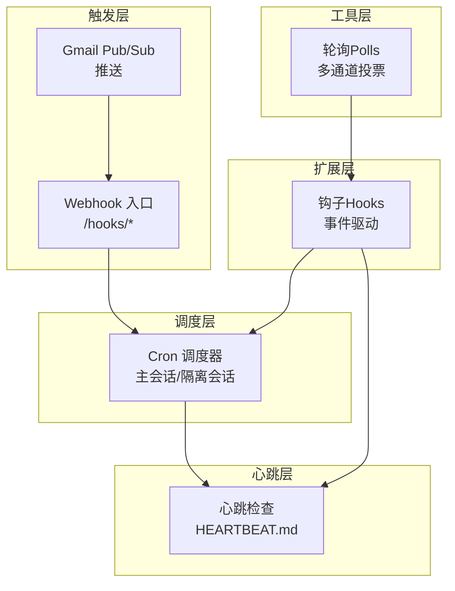
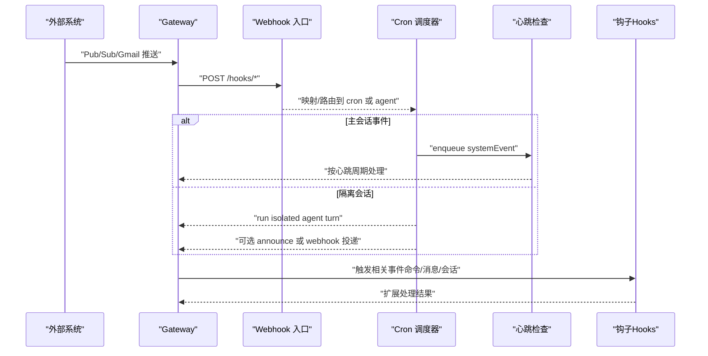
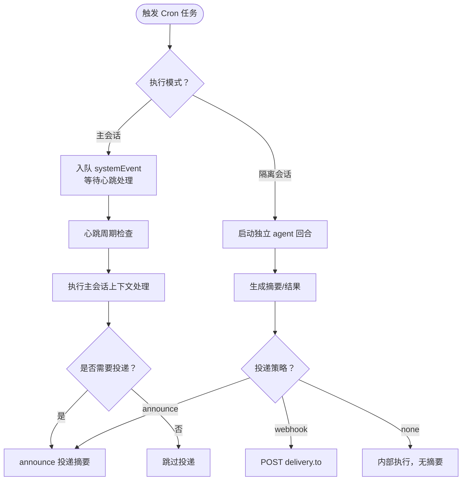
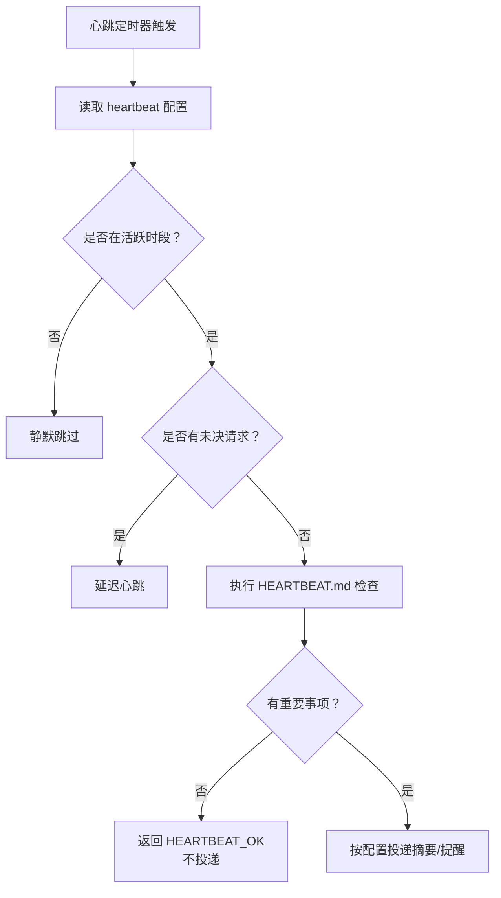
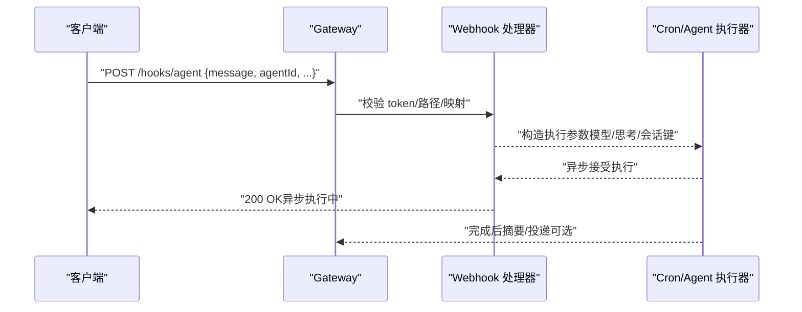
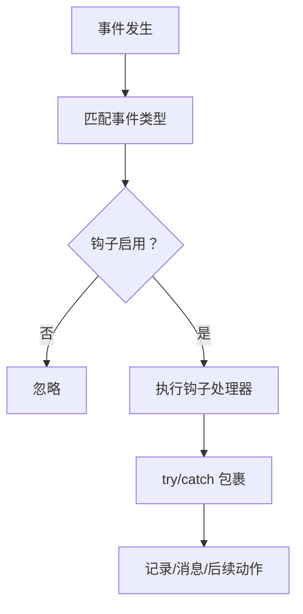
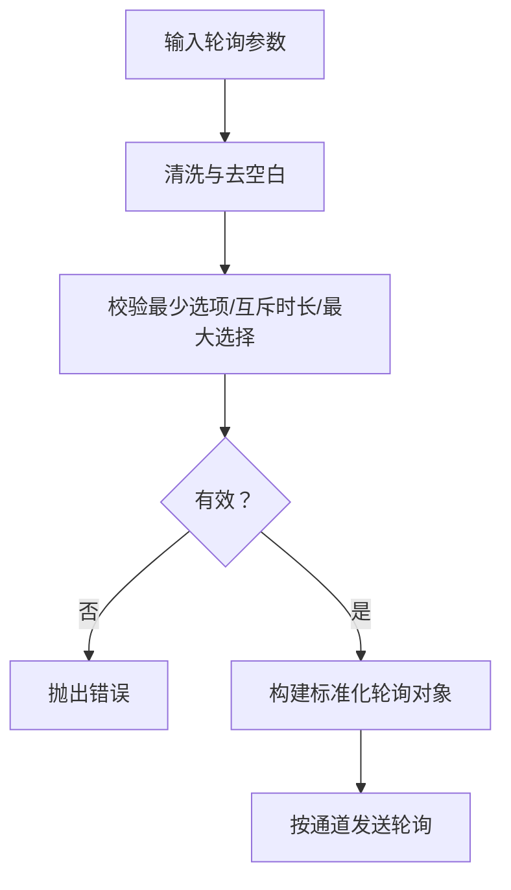
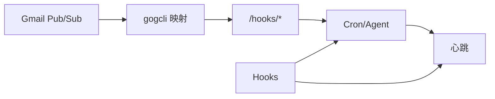

# 自动化系统故障排除

<cite>
**本文引用的文件**   
- [自动化故障排除](file://docs/automation/troubleshooting.md)
- [Cron 作业](file://docs/automation/cron-jobs.md)
- [心跳与定时器](file://docs/automation/cron-vs-heartbeat.md)
- [钩子（Hooks）](file://docs/automation/hooks.md)
- [轮询（Polls）](file://docs/automation/poll.md)
- [Webhook 入口](file://docs/automation/webhook.md)
- [Gmail Pub/Sub 集成](file://docs/automation/gmail-pubsub.md)
- [Auth 监控脚本](file://scripts/auth-monitor.sh)
- [Auth 监控计时器](file://scripts/systemd/openclaw-auth-monitor.timer)
- [Launchd 守护进程管理](file://src/daemon/launchd.ts)
- [轮询输入规范化](file://src/polls.ts)
- [钩子注册与触发](file://src/hooks/hooks.ts)
</cite>

## 目录
1. [简介](#简介)
2. [项目结构](#项目结构)
3. [核心组件](#核心组件)
4. [架构总览](#架构总览)
5. [详细组件分析](#详细组件分析)
6. [依赖关系分析](#依赖关系分析)
7. [性能考量](#性能考量)
8. [故障排除指南](#故障排除指南)
9. [结论](#结论)
10. [附录](#附录)

## 简介
本指南面向 OpenClaw 自动化系统的运维与开发人员，聚焦于定时任务（Cron）、心跳机制、轮询系统与 Webhook 的故障诊断与优化。内容覆盖 cron 作业执行失败、心跳信号异常、Webhook 接收问题等常见场景，并提供状态监控、执行历史分析与性能调优建议，以及配置验证、依赖检查与重试机制调试方法。

## 项目结构
OpenClaw 将自动化能力分为多个层面：
- 调度层：Gateway 内置的 Cron 调度器，支持主会话与隔离会话两种执行模式。
- 心跳层：周期性的心跳检查，用于批量监控与上下文感知决策。
- 触发层：Webhook 入口与外部事件（如 Gmail Pub/Sub）驱动的唤醒或独立运行。
- 扩展层：钩子（Hooks）对命令、消息、会话等事件进行扩展处理。
- 工具层：轮询（Polls）在多通道上发送投票消息。

[无图表来源：该图为概念性结构示意，不直接映射到具体源码文件]

## 核心组件
- Cron 调度器：负责持久化任务、计算下次唤醒时间、执行主会话事件或隔离会话的代理回合，并可选择对外投递摘要或 Webhook。
- 心跳机制：在固定周期内汇总检查项，结合 HEARTBEAT.md 指令进行上下文感知的处理；支持静默时段、并发抑制与空闲检查。
- Webhook 入口：提供 /hooks/wake 与 /hooks/agent 端点，支持令牌鉴权、会话键策略与映射路由。
- 钩子（Hooks）：事件驱动扩展，监听命令、消息、会话等事件并执行自定义逻辑。
- 轮询（Polls）：在 Telegram、WhatsApp、Discord、MS Teams 等通道发送投票消息，支持匿名/公开、多选与持续时间控制。

章节来源
- [Cron 作业:10-32](file://docs/automation/cron-jobs.md#L10-L32)
- [心跳与定时器:25-101](file://docs/automation/cron-vs-heartbeat.md#L25-L101)
- [Webhook 入口:9-33](file://docs/automation/webhook.md#L9-L33)
- [钩子（Hooks）:9-30](file://docs/automation/hooks.md#L9-L30)
- [轮询（Polls）:9-17](file://docs/automation/poll.md#L9-L17)

## 架构总览
下图展示从外部事件到内部执行的关键路径与交互：

图表来源
- [Webhook 入口:42-97](file://docs/automation/webhook.md#L42-L97)
- [Cron 作业:135-167](file://docs/automation/cron-jobs.md#L135-L167)
- [钩子（Hooks）:240-340](file://docs/automation/hooks.md#L240-L340)

章节来源
- [Webhook 入口:42-97](file://docs/automation/webhook.md#L42-L97)
- [Cron 作业:135-167](file://docs/automation/cron-jobs.md#L135-L167)
- [钩子（Hooks）:240-340](file://docs/automation/hooks.md#L240-L340)

## 详细组件分析

### Cron 调度器
- 执行模型
  - 主会话：入队 systemEvent，由心跳统一处理，适合需要上下文的任务。
  - 隔离会话：独立 agent 回合，适合高频、噪声大或不需要主会话上下文的任务，默认摘要投递至目标渠道。
- 投递方式
  - announce：直接通过通道适配器投递摘要，避免重复投递与主会话污染。
  - webhook：向 delivery.to 发送完成事件负载，适合外部系统集成。
  - none：仅内部执行，不投递。
- 重试策略
  - 一次性任务：瞬态错误最多重试 3 次（指数退避），永久错误立即禁用。
  - 周期性任务：每次失败后指数退避（30s→1m→5m→15m→60m），成功后重置。
- 存储与维护
  - 任务存储：~/.openclaw/cron/jobs.json
  - 运行日志：~/.openclaw/cron/runs/<jobId>.jsonl，支持大小与行数裁剪
  - 隔离会话保留：cron.sessionRetention 控制过期清理

图表来源
- [Cron 作业:135-222](file://docs/automation/cron-jobs.md#L135-L222)
- [Cron 作业:368-400](file://docs/automation/cron-jobs.md#L368-L400)

章节来源
- [Cron 作业:135-222](file://docs/automation/cron-jobs.md#L135-L222)
- [Cron 作业:368-400](file://docs/automation/cron-jobs.md#L368-L400)

### 心跳机制
- 周期与上下文
  - 默认每 30 分钟一次，可在 HEARTBEAT.md 中编写检查清单，Agent 在主会话上下文中统一处理。
  - 若无重要事项，返回 HEARTBEAT_OK，不投递消息。
- 静默时段与抑制
  - activeHours 可限制活跃时间段，避免非工作时间打扰。
  - requests-in-flight 时延迟心跳，避免主通道拥塞。
- 配置要点
  - agents.defaults.heartbeat.every、target、activeHours.start/end
  - 用户时区与主机时区差异可能导致“看似跳过”的现象

图表来源
- [心跳与定时器:57-73](file://docs/automation/cron-vs-heartbeat.md#L57-L73)
- [自动化故障排除:74-94](file://docs/automation/troubleshooting.md#L74-L94)

章节来源
- [心跳与定时器:57-73](file://docs/automation/cron-vs-heartbeat.md#L57-L73)
- [自动化故障排除:74-94](file://docs/automation/troubleshooting.md#L74-L94)

### Webhook 入口
- 端点与鉴权
  - /hooks/wake：入队系统事件，支持立即或下个心跳触发。
  - /hooks/agent：独立 agent 回合，支持模型/思考级别覆盖、投递与会话键策略。
  - 鉴权：Authorization: Bearer 或 x-openclaw-token，拒绝查询串参数。
- 映射与安全
  - hooks.mappings 支持匹配、动作与模板；transform 模块可自定义逻辑。
  - sessionKey 前缀白名单与默认值策略，防止任意会话键覆盖。
- 响应与错误
  - 200 成功；401 认证失败；429 速率限制；400 负载无效；413 负载过大

图表来源
- [Webhook 入口:42-97](file://docs/automation/webhook.md#L42-L97)
- [Webhook 入口:132-157](file://docs/automation/webhook.md#L132-L157)

章节来源
- [Webhook 入口:42-97](file://docs/automation/webhook.md#L42-L97)
- [Webhook 入口:132-157](file://docs/automation/webhook.md#L132-L157)

### 钩子（Hooks）
- 事件类型
  - 命令：/new、/reset、/stop
  - 会话：compact:before/after
  - Agent：bootstrap
  - 网关：startup
  - 消息：received/transcribed/preprocessed/sent
- 最佳实践
  - 保持处理器轻量，避免阻塞命令处理。
  - 错误捕获与早返回，减少对其他钩子的影响。
  - 使用精确事件键，降低开销。
- 调试
  - 启动日志显示已注册钩子；使用 hooks list --verbose 查看发现与依赖情况。

图表来源
- [钩子（Hooks）:240-340](file://docs/automation/hooks.md#L240-L340)
- [钩子（Hooks）:778-800](file://docs/automation/hooks.md#L778-L800)

章节来源
- [钩子（Hooks）:240-340](file://docs/automation/hooks.md#L240-L340)
- [钩子（Hooks）:778-800](file://docs/automation/hooks.md#L778-L800)

### 轮询（Polls）
- 支持通道与参数
  - Telegram：2-10 选项，支持匿名/公开，时长 5-600 秒。
  - WhatsApp：2-12 选项，多选需不超过选项总数。
  - Discord：2-10 选项，时长 1-768 小时，默认 24 小时。
  - MS Teams：自适应卡片，需网关在线记录投票。
- 输入规范化
  - 校验问题、选项数量、最大选择数、互斥时长字段等。

图表来源
- [轮询（Polls）:18-87](file://docs/automation/poll.md#L18-L87)
- [轮询输入规范化:36-91](file://src/polls.ts#L36-L91)

章节来源
- [轮询（Polls）:18-87](file://docs/automation/poll.md#L18-L87)
- [轮询输入规范化:36-91](file://src/polls.ts#L36-L91)

## 依赖关系分析
- Cron 与心跳
  - Cron 的主会话任务通过 enqueue systemEvent 与心跳协同；隔离会话独立执行并可直接投递。
- Webhook 与 Cron/Agent
  - Webhook 可映射为 wake 或 agent 动作；agent 模式等价于隔离 Cron 任务。
- Hooks 与 Cron/心跳/Webhook
  - Hooks 在命令、消息、会话等事件上扩展行为，可能影响 Cron/心跳的上下文或投递。
- Gmail Pub/Sub
  - 通过 gogcli 将 Gmail 推送映射为 Webhook，再进入 /hooks/* 流程。

图表来源
- [Gmail Pub/Sub 集成:9-33](file://docs/automation/gmail-pubsub.md#L9-L33)
- [Webhook 入口:132-157](file://docs/automation/webhook.md#L132-L157)
- [Cron 作业:135-167](file://docs/automation/cron-jobs.md#L135-L167)

章节来源
- [Gmail Pub/Sub 集成:9-33](file://docs/automation/gmail-pubsub.md#L9-L33)
- [Webhook 入口:132-157](file://docs/automation/webhook.md#L132-L157)
- [Cron 作业:135-167](file://docs/automation/cron-jobs.md#L135-L167)

## 性能考量
- 高频 Cron 的 IO 与清理
  - 隔离会话过多或运行日志过大将产生额外 IO；建议缩短 cron.sessionRetention 并合理设置 runLog.maxBytes/keepLines。
- 心跳成本控制
  - HEARTBEAT.md 体量越大，单次心跳成本越高；建议合并相似检查，必要时将部分任务迁移到 Cron。
- 通道投递抖动
  - announce 会避免重复投递与主会话污染；webhook 投递需关注外部服务可用性与超时。

[本节为通用指导，无需章节来源]

## 故障排除指南

### 命令阶梯（通用诊断）
- 基础状态
  - openclaw status、openclaw gateway status、openclaw logs --follow、openclaw doctor
- 自动化检查
  - openclaw cron status、openclaw cron list、openclaw system heartbeat last
- 通道健康
  - openclaw channels status --probe

章节来源
- [自动化故障排除:14-31](file://docs/automation/troubleshooting.md#L14-L31)

### Cron 未触发
- 排查步骤
  - openclaw cron status、openclaw cron list、openclaw cron runs --id <jobId> --limit 20、openclaw logs --follow
- 常见签名
  - scheduler disabled（配置/环境禁用）
  - timer tick failed（调度器崩溃）
  - reason: not-due（未到期且未强制）

章节来源
- [自动化故障排除:32-52](file://docs/automation/troubleshooting.md#L32-L52)
- [Cron 作业:660-674](file://docs/automation/cron-jobs.md#L660-L674)

### Cron 触发但未投递
- 排查步骤
  - openclaw cron runs --id <jobId> --limit 20、openclaw cron list、openclaw channels status --probe、openclaw logs --follow
- 常见原因
  - delivery.mode 为 none
  - delivery.channel/to 缺失或无效
  - 通道认证错误（unauthorized/missing_scope/Forbidden）

章节来源
- [自动化故障排除:53-73](file://docs/automation/troubleshooting.md#L53-L73)

### 心跳被抑制或跳过
- 排查步骤
  - openclaw system heartbeat last、openclaw logs --follow、openclaw config get agents.defaults.heartbeat、openclaw channels status --probe
- 常见原因
  - quiet-hours（activeHours 外）
  - requests-in-flight（主通道繁忙）
  - empty-heartbeat-file（HEARTBEAT.md 无内容且无排队 Cron）
  - alerts-disabled（可见性设置抑制外发）

章节来源
- [自动化故障排除:74-94](file://docs/automation/troubleshooting.md#L74-L94)

### 时区与 activeHours 细节
- 排查步骤
  - openclaw config get agents.defaults.heartbeat.activeHours、openclaw config get agents.defaults.heartbeat.activeHours.timezone、openclaw config get agents.defaults.userTimezone、openclaw cron list、openclaw logs --follow
- 关键规则
  - 未设置 userTimezone 时回退到主机时区或 activeHours.timezone
  - at 时间不含时区时按 UTC 解析
  - 主机时区变更后 at 任务出现“墙钟时间错位”

章节来源
- [自动化故障排除:95-116](file://docs/automation/troubleshooting.md#L95-L116)

### Webhook 接收问题
- 鉴权与路径
  - 确认 hooks.enabled、hooks.token、hooks.path 设置正确；Authorization: Bearer 或 x-openclaw-token
- 映射与路由
  - hooks.mappings 是否正确匹配；sessionKey 前缀白名单与默认值策略
- 响应码定位
  - 401：鉴权失败；429：重复鉴权失败；400：负载无效；413：负载过大

章节来源
- [Webhook 入口:13-33](file://docs/automation/webhook.md#L13-L33)
- [Webhook 入口:159-167](file://docs/automation/webhook.md#L159-L167)

### Gmail Pub/Sub 接入问题
- 前置条件
  - gcloud/gogcli/tailscale 正确安装与登录；OAuth 客户端所在项目与 Pub/Sub 主题一致
- 映射与投递
  - hooks.presets: ["gmail"] 或自定义 hooks.mappings；deliver/channel/to 配置确保摘要投递
- 常见错误
  - topicName 无效（项目不匹配）
  - 无 publisher 权限（缺少 roles/pubsub.publisher）
  - 空消息（仅 historyId，需通过 gog 历史接口获取）

章节来源
- [Gmail Pub/Sub 集成:13-33](file://docs/automation/gmail-pubsub.md#L13-L33)
- [Gmail Pub/Sub 集成:244-257](file://docs/automation/gmail-pubsub.md#L244-L257)

### 认证与守护进程健康
- Auth 监控
  - Auth 监控脚本定期检查 Claude 凭据有效期，临近过期或过期时通过 OpenClaw 或 ntfy.sh 提醒
  - systemd 计时器每 30 分钟触发一次监控
- 守护进程（macOS LaunchAgent）
  - 通过 launchd 管理 Gateway 进程，支持安装、重启、卸载与遗留版本清理
  - 若 GUI 会话缺失会导致安装/重启失败，需登录桌面用户后重试

章节来源
- [Auth 监控脚本:1-90](file://scripts/auth-monitor.sh#L1-L90)
- [Auth 监控计时器:1-11](file://scripts/systemd/openclaw-auth-monitor.timer#L1-L11)
- [Launchd 守护进程管理:420-433](file://src/daemon/launchd.ts#L420-L433)
- [Launchd 守护进程管理:500-511](file://src/daemon/launchd.ts#L500-L511)

### 钩子（Hooks）调试
- 发现与注册
  - openclaw hooks list --verbose 查看钩子目录优先级与依赖满足情况
  - 启动日志显示 Registered hook 列表
- 最佳实践
  - 保持处理器轻量、错误包裹、早返回；使用具体事件键减少开销

章节来源
- [钩子（Hooks）:791-798](file://docs/automation/hooks.md#L791-L798)
- [钩子（Hooks）:715-777](file://docs/automation/hooks.md#L715-L777)

### 轮询（Polls）问题
- 参数校验
  - 选项数量不足、互斥时长冲突、最大选择数越界等均会抛错
- 通道差异
  - Telegram/WhatsApp/Discord/MS Teams 的参数范围与默认值不同，需按文档配置

章节来源
- [轮询（Polls）:69-87](file://docs/automation/poll.md#L69-L87)
- [轮询输入规范化:36-91](file://src/polls.ts#L36-L91)

## 结论
OpenClaw 的自动化体系以 Cron、心跳、Webhook、Hooks 与 Polls 协同工作：前者保证“何时做”，后者决定“如何做”。通过本文提供的命令阶梯、常见签名与流程图，可快速定位并修复 cron 不触发、心跳被抑制、Webhook 无法接收、Gmail Pub/Sub 未生效、认证过期与守护进程异常等问题。同时，结合配置验证、依赖检查与重试机制调试，可进一步提升系统稳定性与可观测性。

[本节为总结，无需章节来源]

## 附录

### 常用命令速查
- 状态与日志
  - openclaw status、openclaw gateway status、openclaw logs --follow、openclaw doctor
- Cron
  - openclaw cron status、openclaw cron list、openclaw cron runs --id <jobId> --limit 20
- 心跳
  - openclaw system heartbeat last、openclaw config get agents.defaults.heartbeat
- 通道
  - openclaw channels status --probe
- Hooks
  - openclaw hooks list、openclaw hooks check、openclaw hooks info <name>
- Webhook
  - openclaw webhooks gmail setup/run（示例）

章节来源
- [自动化故障排除:14-31](file://docs/automation/troubleshooting.md#L14-L31)
- [Webhook 入口:168-203](file://docs/automation/webhook.md#L168-L203)
- [Gmail Pub/Sub 集成:93-134](file://docs/automation/gmail-pubsub.md#L93-L134)