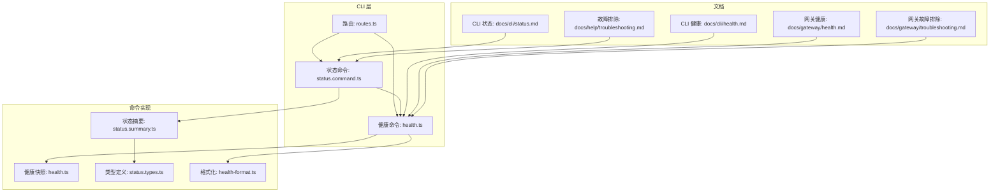
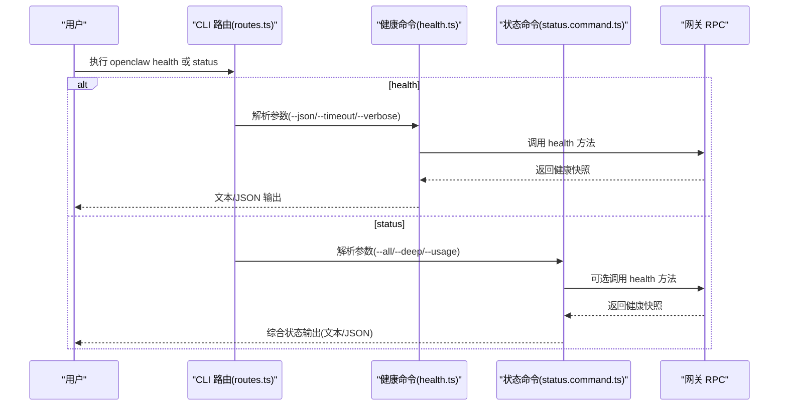
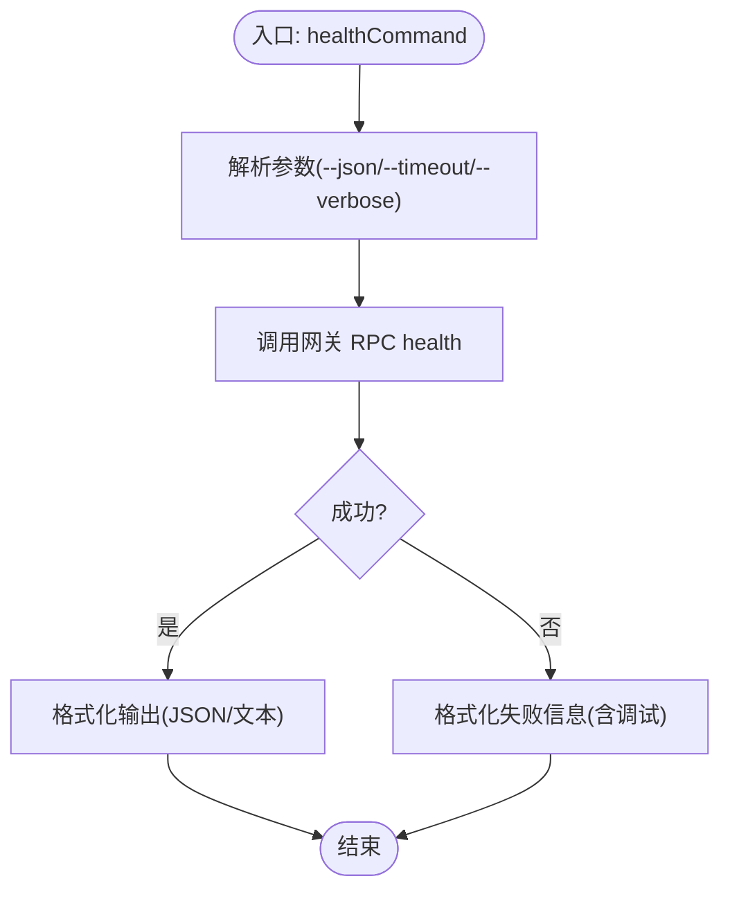
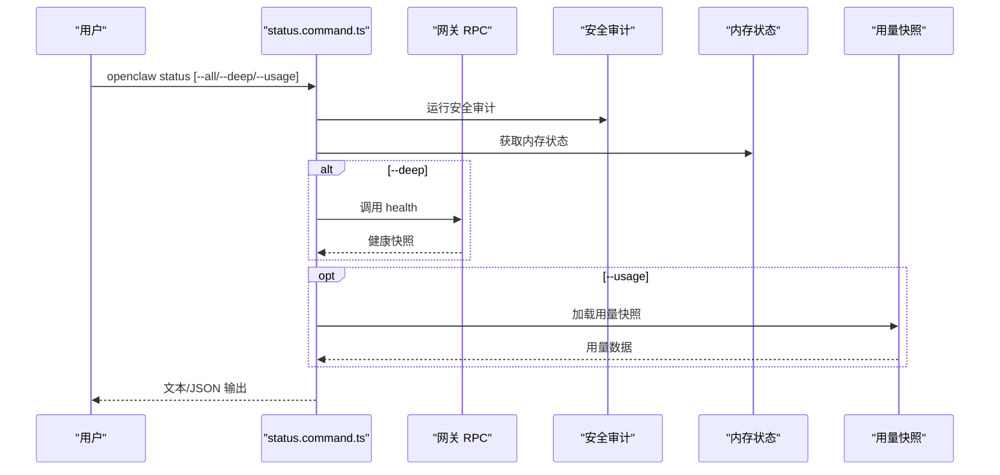
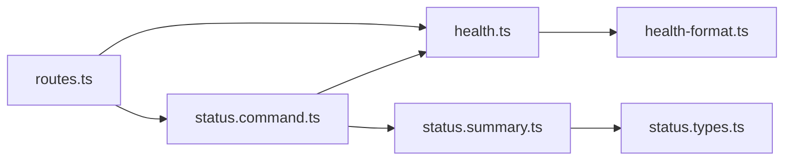

# 健康检查

<cite>
**本文引用的文件**
- [src/commands/health.ts](file://src/commands/health.ts)
- [src/commands/status.command.ts](file://src/commands/status.command.ts)
- [src/commands/status.summary.ts](file://src/commands/status.summary.ts)
- [src/commands/status.types.ts](file://src/commands/status.types.ts)
- [src/commands/health-format.ts](file://src/commands/health-format.ts)
- [src/cli/program/routes.ts](file://src/cli/program/routes.ts)
- [src/cli/program/register.status-health-sessions.test.ts](file://src/cli/program/register.status-health-sessions.test.ts)
- [docs/cli/health.md](file://docs/cli/health.md)
- [docs/cli/status.md](file://docs/cli/status.md)
- [docs/gateway/health.md](file://docs/gateway/health.md)
- [docs/help/troubleshooting.md](file://docs/help/troubleshooting.md)
- [docs/gateway/troubleshooting.md](file://docs/gateway/troubleshooting.md)
</cite>

## 目录
1. [简介](#简介)
2. [项目结构](#项目结构)
3. [核心组件](#核心组件)
4. [架构总览](#架构总览)
5. [详细组件分析](#详细组件分析)
6. [依赖关系分析](#依赖关系分析)
7. [性能考量](#性能考量)
8. [故障排除指南](#故障排除指南)
9. [结论](#结论)
10. [附录](#附录)

## 简介
本技术文档聚焦于 OpenClaw 的健康检查系统，围绕 CLI 命令 openclaw status 与 openclaw health --json 的使用方法、参数选项、输出格式与诊断能力进行系统化说明。文档同时解释“快速检查”与“深度诊断”的区别，并给出日志分析要点与常见错误代码的定位与修复路径，帮助用户在最小干扰下完成系统健康巡检与问题定位。

## 项目结构
- 健康检查相关的核心实现位于命令模块与 CLI 路由层：
  - 健康检查命令实现：src/commands/health.ts
  - 状态命令实现（含快速/深度诊断）：src/commands/status.command.ts
  - 状态摘要构建与会话统计：src/commands/status.summary.ts、src/commands/status.types.ts
  - 健康输出格式化工具：src/commands/health-format.ts
  - CLI 路由与参数解析：src/cli/program/routes.ts
  - CLI 行为测试用例：src/cli/program/register.status-health-sessions.test.ts
- 文档参考：
  - CLI 健康命令文档：docs/cli/health.md
  - CLI 状态命令文档：docs/cli/status.md
  - 网关健康检查指引：docs/gateway/health.md
  - 故障排除总览与决策树：docs/help/troubleshooting.md
  - 网关深度故障排除：docs/gateway/troubleshooting.md

图表来源
- [src/cli/program/routes.ts:17-33](file://src/cli/program/routes.ts#L17-L33)
- [src/commands/status.command.ts:67-686](file://src/commands/status.command.ts#L67-L686)
- [src/commands/health.ts:525-751](file://src/commands/health.ts#L525-L751)
- [src/commands/status.summary.ts:79-240](file://src/commands/status.summary.ts#L79-L240)
- [src/commands/status.types.ts:1-62](file://src/commands/status.types.ts#L1-L62)
- [src/commands/health-format.ts:1-49](file://src/commands/health-format.ts#L1-L49)
- [docs/cli/health.md:1-22](file://docs/cli/health.md#L1-L22)
- [docs/cli/status.md:1-29](file://docs/cli/status.md#L1-L29)
- [docs/gateway/health.md:1-36](file://docs/gateway/health.md#L1-L36)
- [docs/help/troubleshooting.md:1-299](file://docs/help/troubleshooting.md#L1-L299)
- [docs/gateway/troubleshooting.md:1-380](file://docs/gateway/troubleshooting.md#L1-L380)

章节来源
- [src/cli/program/routes.ts:17-33](file://src/cli/program/routes.ts#L17-L33)
- [src/commands/status.command.ts:67-686](file://src/commands/status.command.ts#L67-L686)
- [src/commands/health.ts:525-751](file://src/commands/health.ts#L525-L751)
- [src/commands/status.summary.ts:79-240](file://src/commands/status.summary.ts#L79-L240)
- [src/commands/status.types.ts:1-62](file://src/commands/status.types.ts#L1-L62)
- [src/commands/health-format.ts:1-49](file://src/commands/health-format.ts#L1-L49)
- [docs/cli/health.md:1-22](file://docs/cli/health.md#L1-L22)
- [docs/cli/status.md:1-29](file://docs/cli/status.md#L1-L29)
- [docs/gateway/health.md:1-36](file://docs/gateway/health.md#L1-L36)
- [docs/help/troubleshooting.md:1-299](file://docs/help/troubleshooting.md#L1-L299)
- [docs/gateway/troubleshooting.md:1-380](file://docs/gateway/troubleshooting.md#L1-L380)

## 核心组件
- openclaw health
  - 功能：从运行中的网关拉取健康快照，支持 JSON 输出；可选 --verbose 触发实时探测。
  - 关键参数：--json、--timeout <ms>、--verbose/--debug。
  - 行为：调用网关 RPC 方法 health，返回包含通道连接状态、会话统计、心跳间隔等信息的摘要。
- openclaw status
  - 功能：本地诊断与概览，支持 --all（完整只读）、--deep（含网关探测）、--usage（用量快照）。
  - 关键参数：--all、--deep、--usage、--timeout <ms>、--verbose。
  - 行为：扫描系统状态，汇总网关可达性、通道状态、会话最近活动、安全审计、更新信息等；--deep 时调用网关 health 并渲染通道探测结果。

章节来源
- [docs/cli/health.md:8-22](file://docs/cli/health.md#L8-L22)
- [docs/cli/status.md:9-29](file://docs/cli/status.md#L9-L29)
- [src/commands/health.ts:525-751](file://src/commands/health.ts#L525-L751)
- [src/commands/status.command.ts:67-686](file://src/commands/status.command.ts#L67-L686)

## 架构总览
健康检查与状态命令通过 CLI 路由进入，分别调用命令实现模块。状态命令在需要时触发网关健康探测，最终统一输出文本或 JSON。

图表来源
- [src/cli/program/routes.ts:17-33](file://src/cli/program/routes.ts#L17-L33)
- [src/commands/health.ts:525-751](file://src/commands/health.ts#L525-L751)
- [src/commands/status.command.ts:67-686](file://src/commands/status.command.ts#L67-L686)

## 详细组件分析

### openclaw health 命令
- 参数与行为
  - --json：以 JSON 形式输出健康快照，便于自动化消费。
  - --timeout <ms>：超时时间，默认约 10 秒，必须为正整数毫秒。
  - --verbose/--debug：启用详细模式，打印网关连接详情与调试信息。
- 输出内容
  - 基础字段：ok（恒为真）、ts（采集时间戳）、durationMs（采集耗时）。
  - 通道维度：channels、channelOrder、channelLabels；每个通道包含 accounts 映射及账户级探测结果。
  - 智能体维度：agents 列表（含心跳间隔、会话统计）。
  - 会话维度：sessions（路径、总数、最近条目）。
- 失败处理
  - 健康命令内部对错误进行格式化，支持富文本颜色与细节分行展示，便于快速定位“网关目标”、“配置来源”等上下文。

图表来源
- [src/commands/health.ts:525-751](file://src/commands/health.ts#L525-L751)
- [src/commands/health-format.ts:21-49](file://src/commands/health-format.ts#L21-L49)

章节来源
- [src/commands/health.ts:525-751](file://src/commands/health.ts#L525-L751)
- [src/commands/health-format.ts:1-49](file://src/commands/health-format.ts#L1-L49)
- [docs/cli/health.md:8-22](file://docs/cli/health.md#L8-L22)

### openclaw status 命令
- 参数与行为
  - --all：输出完整、可直接粘贴的诊断报告（只读、彩色）。
  - --deep：在本地诊断基础上，调用网关 health 进行通道探测，输出更详细的通道状态。
  - --usage：抓取各提供商用量快照。
  - --timeout <ms>：控制探测超时。
  - --verbose：显示网关连接详情。
- 输出内容（JSON）
  - 包含基础概要、操作系统、更新通道、内存、网关可达性、服务状态、代理/节点状态、智能体、安全审计、密钥诊断、健康快照（可选）、用量（可选）、最近心跳（可选）等。
- 输出内容（文本）
  - 概览区：仪表盘链接、系统/Node 版本、Tailscale、更新通道、网关可达性、服务状态、智能体、内存、探针开关、事件队列、心跳间隔、最近心跳、会话统计等。
  - 安全审计：严重程度分级与摘要。
  - 通道：通道名称、启用状态、当前状态（OK/WARN/OFF/SETUP）、详细说明与网关侧问题提示。
  - 会话：最近会话列表（键、类型、年龄、模型、令牌用量）。
  - 健康：网关可达与各通道探测结果（OK/UNLINKED/WARN/OFF/LINKED）。
  - 用量：格式化用量报告。
  - 提示与下一步操作建议。

图表来源
- [src/commands/status.command.ts:67-686](file://src/commands/status.command.ts#L67-L686)

章节来源
- [src/commands/status.command.ts:67-686](file://src/commands/status.command.ts#L67-L686)
- [src/commands/status.summary.ts:79-240](file://src/commands/status.summary.ts#L79-L240)
- [src/commands/status.types.ts:1-62](file://src/commands/status.types.ts#L1-L62)
- [docs/cli/status.md:9-29](file://docs/cli/status.md#L9-L29)

### 快速检查 vs 深度诊断
- 快速检查（openclaw status）
  - 侧重本地可观测性：网关可达性、通道概览、最近会话、安全审计、更新信息、内存状态、事件队列、心跳间隔等。
  - 适合日常巡检与共享诊断信息。
- 深度诊断（openclaw status --deep）
  - 在快速检查基础上，调用网关 health 对通道进行实时探测，输出更细粒度的状态与失败原因。
  - 适合定位通道连接异常、认证失效、权限缺失等问题。

章节来源
- [docs/cli/status.md:20-29](file://docs/cli/status.md#L20-L29)
- [docs/gateway/health.md:12-36](file://docs/gateway/health.md#L12-L36)
- [src/commands/status.command.ts:144-159](file://src/commands/status.command.ts#L144-L159)

### 健康报告输出格式说明
- JSON 字段概览
  - 基础：ok、ts、durationMs
  - 通道：channels、channelOrder、channelLabels
  - 智能体：agents（含心跳间隔、会话统计）
  - 会话：sessions（path、count、recent）
  - 网关：mode、url、urlSource、misconfigured、reachable、connectLatencyMs、self、error、authWarning
  - 服务：gatewayService、nodeService
  - 其他：securityAudit、secretDiagnostics、health（可选）、usage（可选）、lastHeartbeat（可选）
- 文本输出要点
  - 通道状态：OK（正常）、UNLINKED（未关联）、WARN（警告）、OFF（关闭/未配置）、LINKED（已关联）。
  - 会话统计：会话数量、最近活动、模型与令牌用量。
  - 健康探测：通道探测耗时、失败原因、机器人用户名等。

章节来源
- [src/commands/health.ts:47-72](file://src/commands/health.ts#L47-L72)
- [src/commands/status.command.ts:178-216](file://src/commands/status.command.ts#L178-L216)
- [src/commands/status.command.ts:605-658](file://src/commands/status.command.ts#L605-L658)

## 依赖关系分析
- CLI 路由到命令
  - 路由器根据命令路径匹配执行 health/status；health 命令在 --json 模式下不加载插件元数据，以减少开销。
- 命令到网关
  - status 在 --deep 时调用网关 health；health 直接调用网关 health。
- 命令到本地状态
  - status 汇总本地内存、会话、通道、事件、更新、安全审计等信息。
- 测试覆盖
  - CLI 行为测试验证参数解析、超时校验、verbose 与 json 输出转发逻辑。

图表来源
- [src/cli/program/routes.ts:17-33](file://src/cli/program/routes.ts#L17-L33)
- [src/commands/health.ts:525-751](file://src/commands/health.ts#L525-L751)
- [src/commands/status.command.ts:67-686](file://src/commands/status.command.ts#L67-L686)
- [src/commands/status.summary.ts:79-240](file://src/commands/status.summary.ts#L79-L240)
- [src/commands/status.types.ts:1-62](file://src/commands/status.types.ts#L1-L62)
- [src/commands/health-format.ts:1-49](file://src/commands/health-format.ts#L1-L49)

章节来源
- [src/cli/program/register.status-health-sessions.test.ts:67-113](file://src/cli/program/register.status-health-sessions.test.ts#L67-L113)
- [src/cli/program/routes.ts:17-33](file://src/cli/program/routes.ts#L17-L33)

## 性能考量
- 默认超时：health 命令默认超时约为 10 秒，可通过 --timeout 自定义；status 的 --deep 也会受相同超时影响。
- 探测范围：--verbose/--deep 会触发通道探测，可能增加网络往返与 IO 开销；在大规模通道或弱网络环境下应谨慎使用。
- 输出开销：--json 仅输出网关 RPC 结果，避免本地插件元数据加载；文本输出包含丰富表格与颜色，适合人类阅读但会带来额外渲染成本。

章节来源
- [src/commands/health.ts:74-75](file://src/commands/health.ts#L74-L75)
- [src/commands/health.ts:525-751](file://src/commands/health.ts#L525-L751)
- [src/cli/program/routes.ts:17-33](file://src/cli/program/routes.ts#L17-L33)

## 故障排除指南
- 常见症状与定位
  - 网关不可达：检查 openclaw gateway status 与 openclaw gateway probe；确认端口、URL、鉴权配置是否正确。
  - 通道未关联/登录失效：查看通道状态与日志中的“已登出/409–515”等信号；执行 relink 流程。
  - 消息不入：核对配对/允许名单、提及规则、群组权限；关注日志中“mention required”“pairing/pending”“blocked/allowlist”等关键字。
  - 心跳/定时任务未触发：检查 cron 状态、活跃时段、并发限制与账户有效性。
- 日志分析关键词
  - web-heartbeat、web-reconnect、web-auto-reply、web-inbound 等，用于判断网关心跳与重连行为。
- 建议流程
  - 使用 docs/help/troubleshooting.md 中的“首分钟”清单进行快速收敛，再结合 docs/gateway/troubleshooting.md 的分场景深度排查。

章节来源
- [docs/gateway/health.md:12-36](file://docs/gateway/health.md#L12-L36)
- [docs/help/troubleshooting.md:17-36](file://docs/help/troubleshooting.md#L17-L36)
- [docs/gateway/troubleshooting.md:61-90](file://docs/gateway/troubleshooting.md#L61-L90)
- [docs/gateway/troubleshooting.md:152-181](file://docs/gateway/troubleshooting.md#L152-L181)
- [docs/gateway/troubleshooting.md:182-212](file://docs/gateway/troubleshooting.md#L182-L212)
- [docs/gateway/troubleshooting.md:213-244](file://docs/gateway/troubleshooting.md#L213-L244)

## 结论
openclaw health 与 openclaw status 提供了从“网关可达性”到“通道探测”的完整健康视图。前者专注网关侧快照与 JSON 输出，后者则在本地可观测性基础上叠加网关探测与安全审计，适合不同场景下的快速诊断与深度排障。配合日志关键词与官方故障排除文档，可在最短时间内定位问题并恢复服务。

## 附录
- 常用命令速查
  - openclaw health：快速获取网关健康快照（可 JSON 输出）。
  - openclaw health --json：机器可读健康报告。
  - openclaw status：本地概览与通道状态。
  - openclaw status --all：完整可分享诊断。
  - openclaw status --deep：包含通道探测的深度诊断。
  - openclaw status --usage：用量快照。
- 参数校验与错误处理
  - --timeout 非正整数将被拒绝并退出非零码。
  - 健康命令失败时，格式化输出包含摘要与详细上下文，便于快速定位“网关目标”“配置来源”。

章节来源
- [src/cli/program/register.status-health-sessions.test.ts:87-119](file://src/cli/program/register.status-health-sessions.test.ts#L87-L119)
- [src/commands/health-format.ts:21-49](file://src/commands/health-format.ts#L21-L49)
- [docs/cli/health.md:8-22](file://docs/cli/health.md#L8-L22)
- [docs/cli/status.md:9-29](file://docs/cli/status.md#L9-L29)