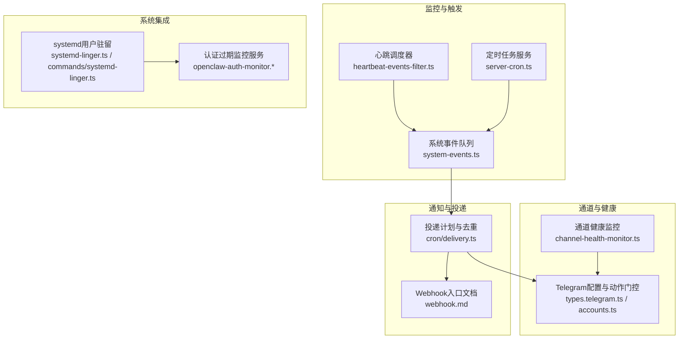
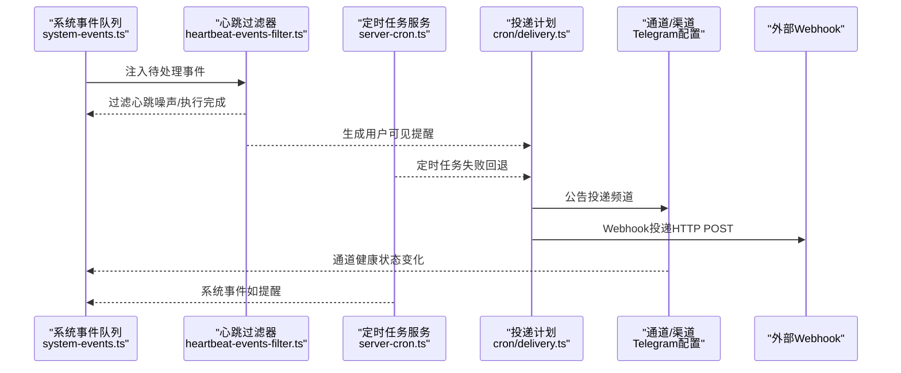
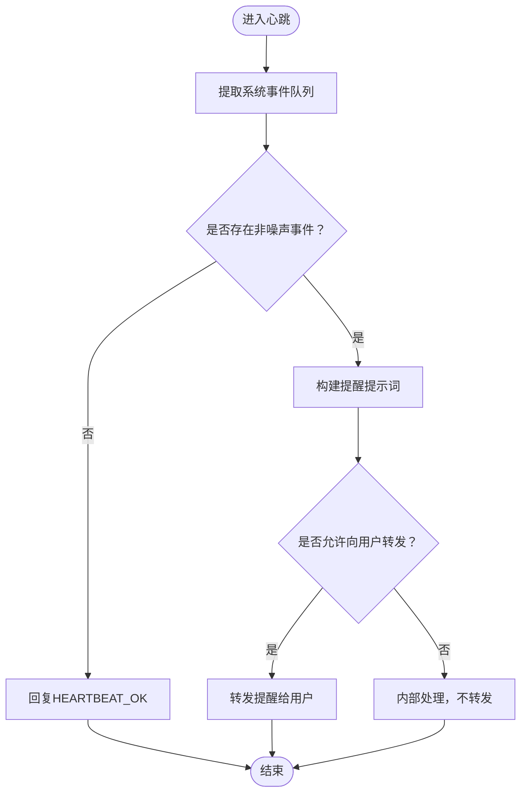
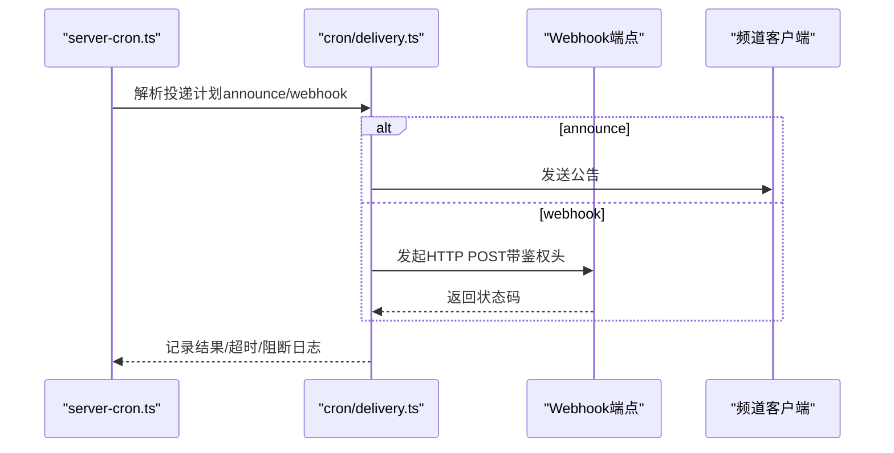
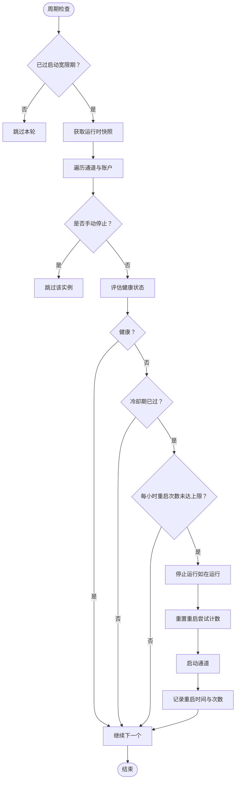
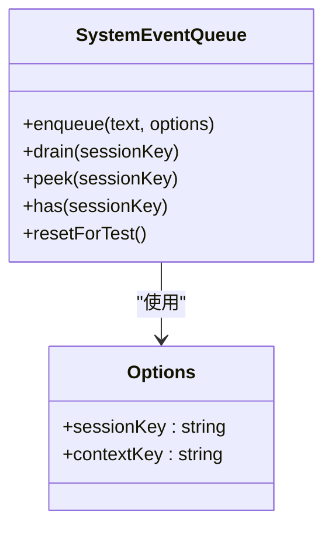
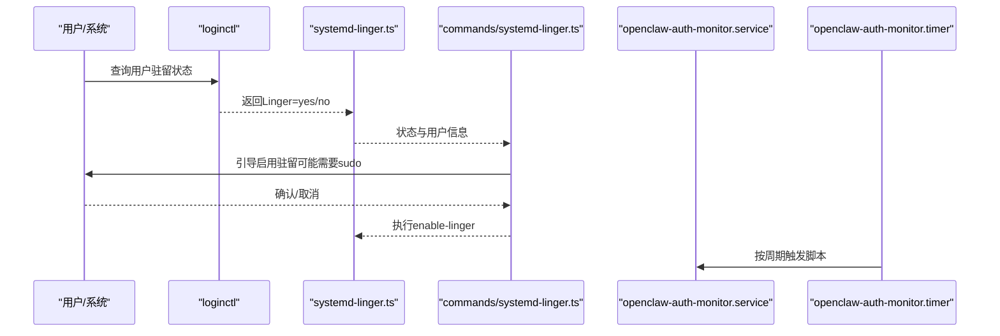
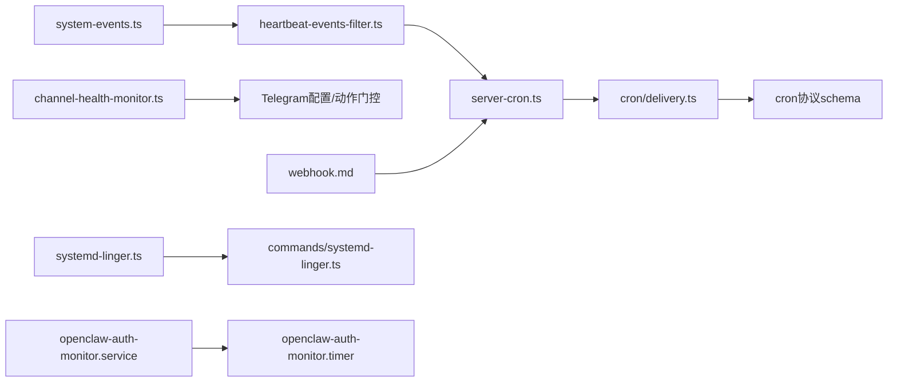

# 告警配置

<cite>
**本文引用的文件**
- [scripts/systemd/openclaw-auth-monitor.service](file://scripts/systemd/openclaw-auth-monitor.service)
- [scripts/systemd/openclaw-auth-monitor.timer](file://scripts/systemd/openclaw-auth-monitor.timer)
- [src/commands/systemd-linger.ts](file://src/commands/systemd-linger.ts)
- [src/daemon/systemd-linger.ts](file://src/daemon/systemd-linger.ts)
- [src/gateway/server-cron.ts](file://src/gateway/server-cron.ts)
- [src/gateway/channel-health-monitor.ts](file://src/gateway/channel-health-monitor.ts)
- [src/infra/system-events.ts](file://src/infra/system-events.ts)
- [src/infra/heartbeat-events-filter.ts](file://src/infra/heartbeat-events-filter.ts)
- [src/cron/delivery.ts](file://src/cron/delivery.ts)
- [src/gateway/protocol/schema/cron.ts](file://src/gateway/protocol/schema/cron.ts)
- [docs/automation/webhook.md](file://docs/automation/webhook.md)
- [docs/automation/hooks.md](file://docs/automation/hooks.md)
- [docs/automation/cron-vs-heartbeat.md](file://docs/automation/cron-vs-heartbeat.md)
- [apps/macos/Sources/OpenClaw/HealthStore.swift](file://apps/macos/Sources/OpenClaw/HealthStore.swift)
- [src/telegram/monitor.test.ts](file://src/telegram/monitor.test.ts)
- [src/config/types.telegram.ts](file://src/config/types.telegram.ts)
- [src/telegram/accounts.ts](file://src/telegram/accounts.ts)
- [src/telegram/bot.test.ts](file://src/telegram/bot.test.ts)
- [src/commands/health.ts](file://src/commands/health.ts)
- [src/gateway/server.cron.test.ts](file://src/gateway/server.cron.test.ts)
- [src/cron/service.jobs.test.ts](file://src/cron/service.jobs.test.ts)
- [src/cron/delivery.test.ts](file://src/cron/delivery.test.ts)
</cite>

## 目录
1. [简介](#简介)
2. [项目结构](#项目结构)
3. [核心组件](#核心组件)
4. [架构总览](#架构总览)
5. [详细组件分析](#详细组件分析)
6. [依赖关系分析](#依赖关系分析)
7. [性能考量](#性能考量)
8. [故障排查指南](#故障排查指南)
9. [结论](#结论)
10. [附录](#附录)

## 简介
本运维指南面向OpenClaw的告警配置与运行维护，覆盖系统级与应用级告警机制：包括心跳与定时任务（cron）的告警设计、通道健康监控、系统事件队列与过滤、Webhook与外部集成、以及通知投递策略与去重抑制。文档同时提供最佳实践、常见问题与排障建议，帮助在不同平台（Linux systemd、macOS等）稳定地部署与运维。

## 项目结构
OpenClaw通过“心跳+定时任务”双轨机制实现周期性监控与告警，结合通道健康监控与系统事件队列，形成从触发到通知的闭环。关键位置如下：
- 心跳与定时任务：心跳用于批量检查与智能抑制；定时任务用于精确时间点或一次性提醒，并支持失败回退通知。
- 通道健康监控：对各消息通道进行健康度评估与自动重启，避免长时间不可用。
- 系统事件队列与过滤：将系统事件（如cron提醒）注入会话提示词，按需决定是否向用户转发。
- 通知投递：支持频道公告与Webhook两种主要模式，具备失败目的地回退与去重抑制能力。
- 外部集成：Webhook入口用于外部系统触发工作流；Hooks用于内部事件驱动自动化。

图表来源
- [src/infra/heartbeat-events-filter.ts:1-97](file://src/infra/heartbeat-events-filter.ts#L1-L97)
- [src/gateway/server-cron.ts:33-407](file://src/gateway/server-cron.ts#L33-L407)
- [src/infra/system-events.ts:1-120](file://src/infra/system-events.ts#L1-L120)
- [src/gateway/channel-health-monitor.ts:32-200](file://src/gateway/channel-health-monitor.ts#L32-L200)
- [src/cron/delivery.ts:186-239](file://src/cron/delivery.ts#L186-L239)
- [docs/automation/webhook.md:1-216](file://docs/automation/webhook.md#L1-L216)
- [src/daemon/systemd-linger.ts:1-44](file://src/daemon/systemd-linger.ts#L1-L44)
- [src/commands/systemd-linger.ts:1-90](file://src/commands/systemd-linger.ts#L1-L90)
- [scripts/systemd/openclaw-auth-monitor.service:1-15](file://scripts/systemd/openclaw-auth-monitor.service#L1-L15)
- [scripts/systemd/openclaw-auth-monitor.timer:1-11](file://scripts/systemd/openclaw-auth-monitor.timer#L1-L11)

章节来源
- [docs/automation/cron-vs-heartbeat.md:29-162](file://docs/automation/cron-vs-heartbeat.md#L29-L162)

## 核心组件
- 心跳与系统事件过滤
  - 将系统事件（如cron提醒）注入提示词，按需决定是否向用户转发；过滤心跳确认与执行完成噪声，避免误触发。
- 定时任务与通知投递
  - 支持“公告”和“Webhook”两种投递模式；可配置失败目的地回退；具备去重与超时控制。
- 通道健康监控
  - 对通道运行状态进行周期性评估，超过冷却与重启频率限制则跳过；必要时自动重启通道以恢复服务。
- 外部集成与系统服务
  - 提供systemd用户驻留与认证过期监控服务，确保服务在登录后持续运行并及时预警。

章节来源
- [src/infra/heartbeat-events-filter.ts:1-97](file://src/infra/heartbeat-events-filter.ts#L1-L97)
- [src/infra/system-events.ts:1-120](file://src/infra/system-events.ts#L1-L120)
- [src/gateway/server-cron.ts:33-407](file://src/gateway/server-cron.ts#L33-L407)
- [src/cron/delivery.ts:186-239](file://src/cron/delivery.ts#L186-L239)
- [src/gateway/channel-health-monitor.ts:32-200](file://src/gateway/channel-health-monitor.ts#L32-L200)
- [src/daemon/systemd-linger.ts:1-44](file://src/daemon/systemd-linger.ts#L1-L44)
- [src/commands/systemd-linger.ts:1-90](file://src/commands/systemd-linger.ts#L1-L90)
- [scripts/systemd/openclaw-auth-monitor.service:1-15](file://scripts/systemd/openclaw-auth-monitor.service#L1-L15)
- [scripts/systemd/openclaw-auth-monitor.timer:1-11](file://scripts/systemd/openclaw-auth-monitor.timer#L1-L11)

## 架构总览
下图展示从系统事件到通知投递的关键流程，包括心跳与定时任务两条路径、通道健康监控与Webhook集成。

图表来源
- [src/infra/system-events.ts:51-101](file://src/infra/system-events.ts#L51-L101)
- [src/infra/heartbeat-events-filter.ts:6-38](file://src/infra/heartbeat-events-filter.ts#L6-L38)
- [src/gateway/server-cron.ts:374-407](file://src/gateway/server-cron.ts#L374-L407)
- [src/cron/delivery.ts:186-239](file://src/cron/delivery.ts#L186-L239)

## 详细组件分析

### 组件A：心跳与系统事件过滤
- 设计要点
  - 将系统事件文本拼接为动态提示，直接嵌入模型上下文，避免“显示在系统消息中”的模糊提示。
  - 区分心跳确认、心跳轮询/唤醒噪声与执行完成事件，仅当存在真实提醒内容时才转发给用户。
- 关键行为
  - 当无事件或仅心跳OK时，回复“HEARTBEAT_OK”，不产生用户可见通知。
  - 可通过配置开关控制是否向用户转发提醒。
- 配置参考
  - 心跳间隔与目标通道在配置中定义，详见“决策流程”。

图表来源
- [src/infra/heartbeat-events-filter.ts:6-38](file://src/infra/heartbeat-events-filter.ts#L6-L38)
- [src/infra/system-events.ts:85-110](file://src/infra/system-events.ts#L85-L110)

章节来源
- [src/infra/heartbeat-events-filter.ts:1-97](file://src/infra/heartbeat-events-filter.ts#L1-L97)
- [src/infra/system-events.ts:1-120](file://src/infra/system-events.ts#L1-L120)
- [docs/automation/cron-vs-heartbeat.md:29-162](file://docs/automation/cron-vs-heartbeat.md#L29-L162)

### 组件B：定时任务与通知投递
- 投递模式
  - 公告（announce）：通过指定频道与接收者发送。
  - Webhook（webhook）：向HTTP端点发起POST请求，支持令牌鉴权头。
- 失败回退与去重
  - 支持为隔离会话任务配置失败目的地回退（仅Webhook或与主投递目标不同）。
  - 同一投递目标与参数视为相同，避免重复投递。
- 超时与安全
  - Webhook调用设置超时；对URL进行规范化与SSRF防护日志提示。
- 配置项
  - 投递模式、频道、接收者、账户ID、失败目的地等。

图表来源
- [src/gateway/server-cron.ts:374-407](file://src/gateway/server-cron.ts#L374-L407)
- [src/cron/delivery.ts:186-239](file://src/cron/delivery.ts#L186-L239)

章节来源
- [src/gateway/server-cron.ts:33-407](file://src/gateway/server-cron.ts#L33-L407)
- [src/cron/delivery.ts:186-239](file://src/cron/delivery.ts#L186-L239)
- [src/gateway/protocol/schema/cron.ts:179-221](file://src/gateway/protocol/schema/cron.ts#L179-L221)
- [src/gateway/server.cron.test.ts:851-875](file://src/gateway/server.cron.test.ts#L851-L875)
- [src/cron/service.jobs.test.ts:220-260](file://src/cron/service.jobs.test.ts#L220-L260)
- [src/cron/delivery.test.ts:89-168](file://src/cron/delivery.test.ts#L89-L168)

### 组件C：通道健康监控
- 目标
  - 在通道异常时自动重启，减少人工干预；通过冷却周期与每小时重启上限防止风暴式重启。
- 关键参数
  - 启动宽限期、通道连接宽限期、陈旧事件阈值、检查间隔、冷却周期、每小时最大重启次数。
- 行为
  - 避免在启动宽限期内检查；对健康通道跳过；若未达到冷却且超过每小时上限则跳过；否则停止、重置尝试计数并重启。

图表来源
- [src/gateway/channel-health-monitor.ts:76-200](file://src/gateway/channel-health-monitor.ts#L76-L200)

章节来源
- [src/gateway/channel-health-monitor.ts:32-200](file://src/gateway/channel-health-monitor.ts#L32-L200)

### 组件D：系统事件队列与去重
- 特性
  - 会话级内存队列，最多保留固定数量事件；去重相邻重复事件；支持上下文键变更检测。
- 使用场景
  - 将cron提醒、系统事件等临时信息注入提示词，避免持久化带来的复杂性。

图表来源
- [src/infra/system-events.ts:5-120](file://src/infra/system-events.ts#L5-L120)

章节来源
- [src/infra/system-events.ts:1-120](file://src/infra/system-events.ts#L1-L120)

### 组件E：外部集成与系统服务
- Webhook入口
  - 提供唤醒与隔离会话运行的HTTP端点，支持鉴权与映射配置。
- systemd用户驻留
  - 检测并启用用户驻留，确保注销后服务仍可运行；提供交互式引导。
- 认证过期监控
  - systemd服务与定时器定期检查认证有效期，通过环境变量配置通知渠道。

图表来源
- [src/daemon/systemd-linger.ts:21-44](file://src/daemon/systemd-linger.ts#L21-L44)
- [src/commands/systemd-linger.ts:14-90](file://src/commands/systemd-linger.ts#L14-L90)
- [scripts/systemd/openclaw-auth-monitor.service:1-15](file://scripts/systemd/openclaw-auth-monitor.service#L1-L15)
- [scripts/systemd/openclaw-auth-monitor.timer:1-11](file://scripts/systemd/openclaw-auth-monitor.timer#L1-L11)

章节来源
- [docs/automation/webhook.md:1-216](file://docs/automation/webhook.md#L1-L216)
- [src/daemon/systemd-linger.ts:1-44](file://src/daemon/systemd-linger.ts#L1-L44)
- [src/commands/systemd-linger.ts:1-90](file://src/commands/systemd-linger.ts#L1-L90)
- [scripts/systemd/openclaw-auth-monitor.service:1-15](file://scripts/systemd/openclaw-auth-monitor.service#L1-L15)
- [scripts/systemd/openclaw-auth-monitor.timer:1-11](file://scripts/systemd/openclaw-auth-monitor.timer#L1-L11)

## 依赖关系分析
- 心跳与系统事件
  - 心跳过滤器依赖系统事件队列；系统事件队列为轻量内存结构，避免持久化开销。
- 定时任务与投递
  - server-cron依赖投递模块解析与去重；投递模块依赖配置schema与频道配置。
- 通道健康监控
  - 依赖通道管理器快照与重启接口；受冷却与频率限制约束。
- 外部集成
  - Webhook入口文档定义了鉴权与端点语义；systemd相关模块负责驻留与认证监控。

图表来源
- [src/infra/system-events.ts:1-120](file://src/infra/system-events.ts#L1-L120)
- [src/infra/heartbeat-events-filter.ts:1-97](file://src/infra/heartbeat-events-filter.ts#L1-L97)
- [src/gateway/server-cron.ts:33-407](file://src/gateway/server-cron.ts#L33-L407)
- [src/cron/delivery.ts:186-239](file://src/cron/delivery.ts#L186-L239)
- [src/gateway/protocol/schema/cron.ts:179-221](file://src/gateway/protocol/schema/cron.ts#L179-L221)
- [src/gateway/channel-health-monitor.ts:32-200](file://src/gateway/channel-health-monitor.ts#L32-L200)
- [docs/automation/webhook.md:1-216](file://docs/automation/webhook.md#L1-L216)
- [src/daemon/systemd-linger.ts:1-44](file://src/daemon/systemd-linger.ts#L1-L44)
- [src/commands/systemd-linger.ts:1-90](file://src/commands/systemd-linger.ts#L1-L90)
- [scripts/systemd/openclaw-auth-monitor.service:1-15](file://scripts/systemd/openclaw-auth-monitor.service#L1-L15)
- [scripts/systemd/openclaw-auth-monitor.timer:1-11](file://scripts/systemd/openclaw-auth-monitor.timer#L1-L11)

章节来源
- [src/gateway/server-cron.ts:33-407](file://src/gateway/server-cron.ts#L33-L407)
- [src/cron/delivery.ts:186-239](file://src/cron/delivery.ts#L186-L239)
- [src/gateway/channel-health-monitor.ts:32-200](file://src/gateway/channel-health-monitor.ts#L32-L200)
- [docs/automation/webhook.md:1-216](file://docs/automation/webhook.md#L1-L216)

## 性能考量
- 心跳批处理
  - 将多项检查合并至一次心跳，降低API调用与会话切换成本。
- 投递去重与超时
  - 通过同目标去重与超时控制，避免重复通知与阻塞。
- 通道健康监控节流
  - 冷却周期与每小时重启上限有效抑制风暴式重启。
- 系统事件队列容量
  - 固定容量与去重策略避免内存膨胀与重复事件影响。

[本节为通用指导，无需特定文件引用]

## 故障排查指南
- 心跳未触发或未转发
  - 检查系统事件队列是否为空或仅含心跳噪声；确认心跳过滤器配置是否允许转发。
- 定时任务Webhook未送达
  - 核对投递目标URL有效性与鉴权头；查看SSRF防护日志与超时记录；确认失败目的地配置正确。
- 通道频繁重启
  - 检查冷却周期与每小时重启上限设置；确认通道连接宽限期与陈旧事件阈值；查看通道健康评估原因。
- systemd驻留未生效
  - 确认用户驻留状态；按交互式提示启用；检查sudo权限与loginctl可用性。
- 认证过期未预警
  - 检查服务与定时器是否启用；核对环境变量（如预警时长、通知渠道）；验证脚本执行权限。

章节来源
- [src/infra/heartbeat-events-filter.ts:55-97](file://src/infra/heartbeat-events-filter.ts#L55-L97)
- [src/gateway/server-cron.ts:374-407](file://src/gateway/server-cron.ts#L374-L407)
- [src/gateway/channel-health-monitor.ts:141-171](file://src/gateway/channel-health-monitor.ts#L141-L171)
- [src/commands/systemd-linger.ts:14-90](file://src/commands/systemd-linger.ts#L14-L90)
- [scripts/systemd/openclaw-auth-monitor.service:8-12](file://scripts/systemd/openclaw-auth-monitor.service#L8-L12)

## 结论
OpenClaw的告警体系以“心跳+定时任务”为核心，结合系统事件队列与通道健康监控，形成从触发、过滤、去重到投递的完整闭环。通过Webhook与频道公告实现多通道通知，并辅以systemd驻留与认证监控保障系统稳定性。遵循本文最佳实践与排障建议，可在不同平台上可靠地部署与运维告警配置。

[本节为总结，无需特定文件引用]

## 附录

### 告警机制设计与实现要点
- 触发条件
  - 心跳：周期性检查，遇真实提醒内容才转发；心跳噪声与执行完成事件被过滤。
  - 定时任务：系统事件触发或失败回退；支持精确时间与一次性提醒。
- 告警级别
  - 通过“是否允许转发”与“失败目的地”表达不同严重程度与处理策略。
- 告警传播
  - 公告投递给指定频道；Webhook投递至外部系统；失败时可回退至Webhook或另一频道。

章节来源
- [src/infra/heartbeat-events-filter.ts:6-38](file://src/infra/heartbeat-events-filter.ts#L6-L38)
- [src/gateway/server-cron.ts:374-407](file://src/gateway/server-cron.ts#L374-L407)
- [src/cron/delivery.ts:186-239](file://src/cron/delivery.ts#L186-L239)

### 系统级告警配置
- systemd用户驻留
  - 通过命令行交互启用；写入系统驻留文件；提供sudo提示。
- 认证过期监控
  - systemd服务与定时器按周期执行脚本；通过环境变量配置预警参数与通知渠道。

章节来源
- [src/commands/systemd-linger.ts:14-90](file://src/commands/systemd-linger.ts#L14-L90)
- [scripts/systemd/openclaw-auth-monitor.service:8-12](file://scripts/systemd/openclaw-auth-monitor.service#L8-L12)
- [scripts/systemd/openclaw-auth-monitor.timer:5-7](file://scripts/systemd/openclaw-auth-monitor.timer#L5-L7)

### 应用级告警配置
- 网关健康告警
  - 通过通道健康监控自动重启；macOS侧提供健康描述与超时判断逻辑。
- 通道连接告警
  - Telegram配置包含Webhook监听绑定主机与端口、证书路径、动作门控等；测试覆盖Webhook主机参数与中断信号等待。
- 代理执行告警
  - 心跳过滤器区分执行完成事件，避免将其误判为提醒内容。

章节来源
- [apps/macos/Sources/OpenClaw/HealthStore.swift:147-163](file://apps/macos/Sources/OpenClaw/HealthStore.swift#L147-L163)
- [src/config/types.telegram.ts:150-181](file://src/config/types.telegram.ts#L150-L181)
- [src/telegram/monitor.test.ts:492-514](file://src/telegram/monitor.test.ts#L492-L514)
- [src/telegram/bot.test.ts:1580-1632](file://src/telegram/bot.test.ts#L1580-L1632)
- [src/infra/heartbeat-events-filter.ts:86-96](file://src/infra/heartbeat-events-filter.ts#L86-L96)

### 通知方式配置
- 邮件通知
  - 通过Webhook将提醒投递至邮件服务端点；在配置中设置鉴权头与目标URL。
- Webhook推送
  - 使用HTTP POST；支持令牌鉴权头；对URL进行规范化与SSRF防护日志提示。
- 系统通知
  - 通过频道公告投递至指定通道；可配置账户ID与接收者。

章节来源
- [docs/automation/webhook.md:15-27](file://docs/automation/webhook.md#L15-L27)
- [src/gateway/server-cron.ts:84-92](file://src/gateway/server-cron.ts#L84-L92)
- [src/cron/delivery.ts:186-239](file://src/cron/delivery.ts#L186-L239)

### 告警规则自定义
- 心跳与定时任务
  - 通过配置定义心跳间隔、活跃时段与目标通道；定时任务支持公告与Webhook两种模式及失败目的地。
- 通道健康
  - 调整冷却周期、每小时重启上限、宽限期与陈旧事件阈值，平衡恢复速度与稳定性。

章节来源
- [docs/automation/cron-vs-heartbeat.md:57-71](file://docs/automation/cron-vs-heartbeat.md#L57-L71)
- [src/gateway/channel-health-monitor.ts:56-74](file://src/gateway/channel-health-monitor.ts#L56-L74)
- [src/gateway/protocol/schema/cron.ts:179-221](file://src/gateway/protocol/schema/cron.ts#L179-L221)

### 告警去重与抑制
- 去重
  - 同一投递目标与参数视为相同；系统事件队列对相邻重复事件去重。
- 抑制
  - 心跳过滤器对心跳确认与轮询噪声抑制；通道健康监控通过冷却与频率限制抑制风暴重启。

章节来源
- [src/cron/delivery.ts:211-236](file://src/cron/delivery.ts#L211-L236)
- [src/infra/system-events.ts:64-82](file://src/infra/system-events.ts#L64-L82)
- [src/infra/heartbeat-events-filter.ts:55-84](file://src/infra/heartbeat-events-filter.ts#L55-L84)
- [src/gateway/channel-health-monitor.ts:141-171](file://src/gateway/channel-health-monitor.ts#L141-L171)

### 最佳实践与常见问题
- 最佳实践
  - 将常规检查合并至心跳；对精确时间与一次性提醒使用定时任务；为隔离会话任务配置失败目的地回退；合理设置通道健康监控参数。
- 常见问题
  - Webhook未送达：检查URL、鉴权与超时；查看SSRF日志；确认失败目的地配置。
  - 通道频繁重启：增大冷却周期或降低重启上限；检查连接宽限期与陈旧事件阈值。
  - systemd驻留：确认状态与sudo权限；按提示启用。

章节来源
- [docs/automation/webhook.md:204-216](file://docs/automation/webhook.md#L204-L216)
- [src/gateway/channel-health-monitor.ts:141-171](file://src/gateway/channel-health-monitor.ts#L141-L171)
- [src/commands/systemd-linger.ts:48-90](file://src/commands/systemd-linger.ts#L48-L90)