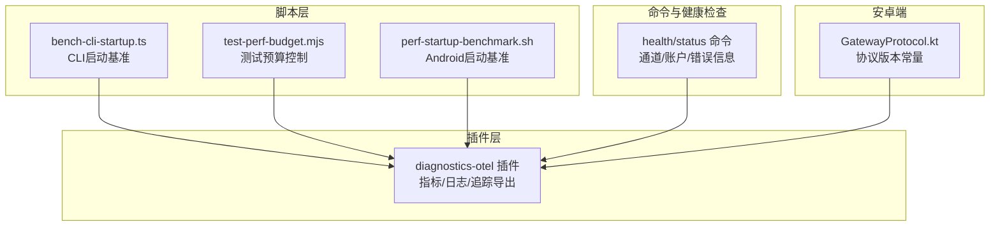
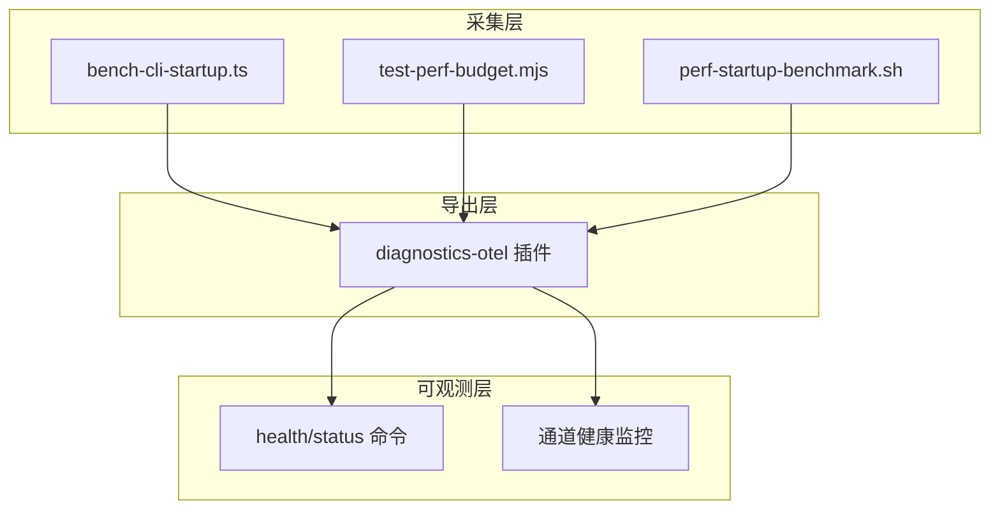
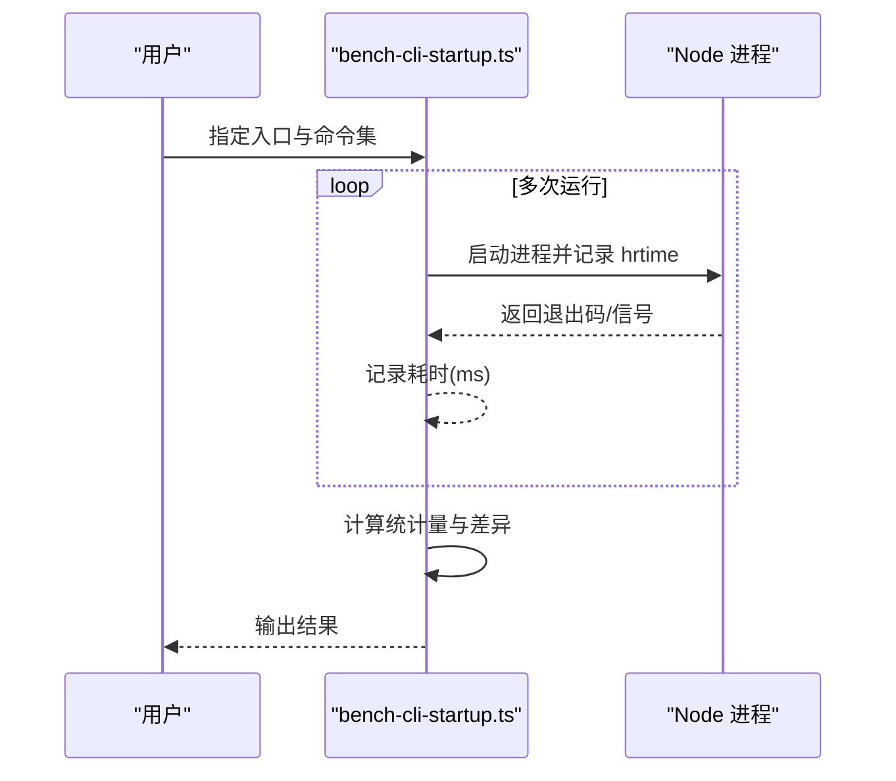
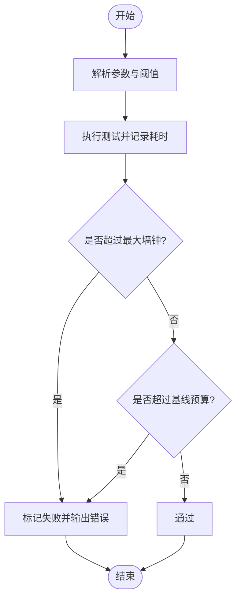
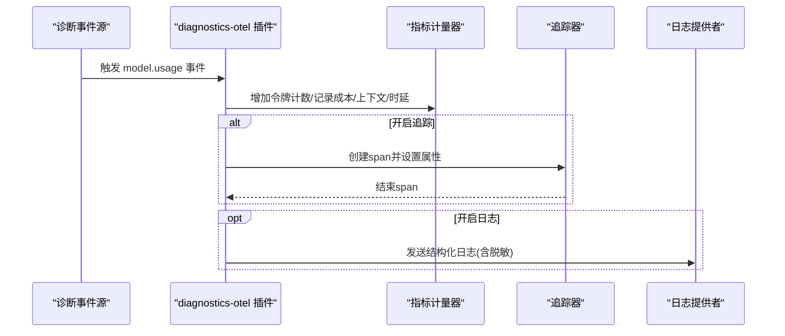
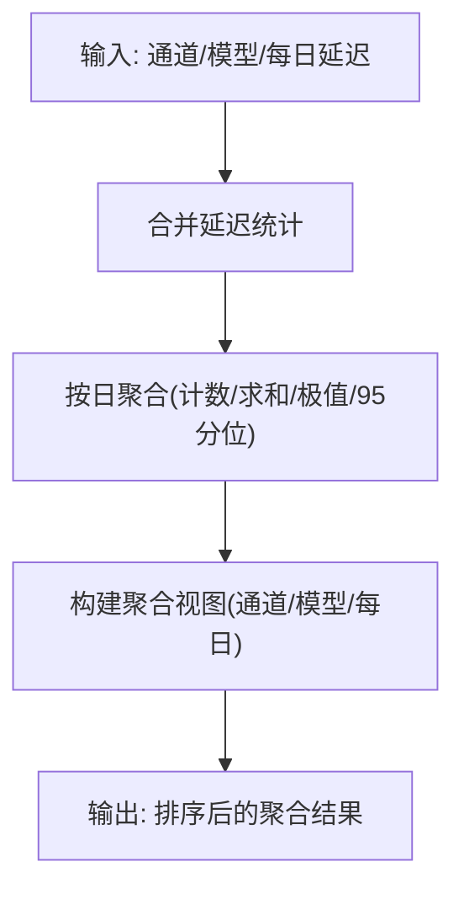
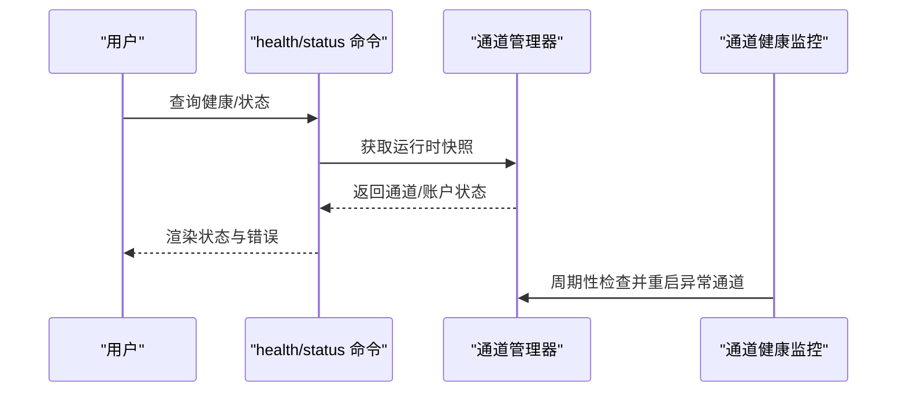
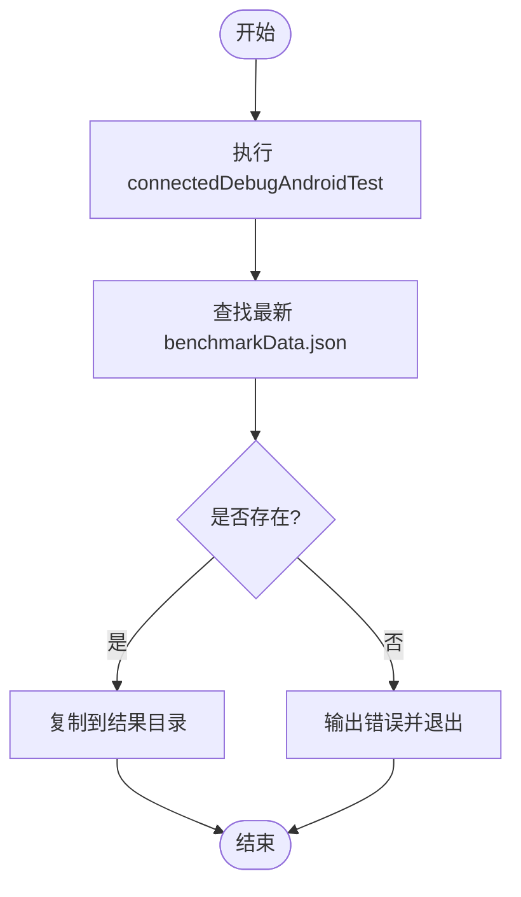
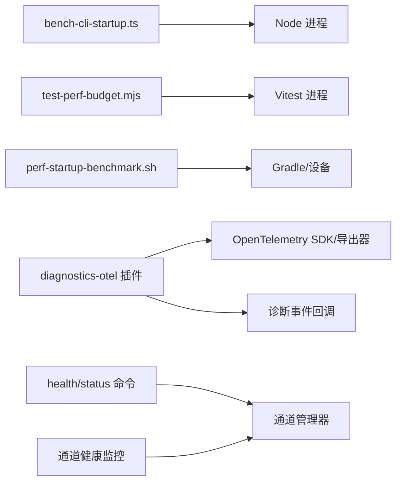

# 性能监控

<cite>
**本文引用的文件**
- [bench-cli-startup.ts](file://scripts/bench-cli-startup.ts)
- [test-perf-budget.mjs](file://scripts/test-perf-budget.mjs)
- [service.ts](file://extensions/diagnostics-otel/src/service.ts)
- [usage-aggregates.ts](file://src/shared/usage-aggregates.ts)
- [status.ts](file://src/auto-reply/status.ts)
- [usage.sessions-usage.test.ts](file://src/gateway/server-methods/usage.sessions-usage.test.ts)
- [channel-health-monitor.ts](file://src/gateway/channel-health-monitor.ts)
- [health.ts](file://src/commands/health.ts)
- [status.command.ts](file://src/commands/status.command.ts)
- [status-all.ts](file://src/commands/status-all.ts)
- [perf-startup-benchmark.sh](file://apps/android/scripts/perf-startup-benchmark.sh)
- [GatewayProtocol.kt](file://apps/android/app/src/main/java/ai/openclaw/app/gateway/GatewayProtocol.kt)
</cite>

## 目录
1. [简介](#简介)
2. [项目结构](#项目结构)
3. [核心组件](#核心组件)
4. [架构总览](#架构总览)
5. [详细组件分析](#详细组件分析)
6. [依赖关系分析](#依赖关系分析)
7. [性能考量](#性能考量)
8. [故障排查指南](#故障排查指南)
9. [结论](#结论)
10. [附录](#附录)

## 简介
本技术指南面向OpenClaw性能监控体系，系统性阐述如何采集与监控系统资源（CPU、内存、网络I/O、磁盘I/O）与应用性能（响应时间、吞吐量、并发连接、代理执行延迟等），覆盖网关服务、通道适配器、代理执行等多层级性能指标，并提供基准测试、优化建议、数据分析与告警机制的落地实践。

## 项目结构
OpenClaw在多语言与多平台下实现性能监控能力：
- 脚本层：提供CLI启动性能基准与测试预算控制脚本，用于端到端启动时延统计与回归阈值控制。
- 插件层：诊断与遥测插件通过OpenTelemetry协议导出指标、日志与追踪，统一采集消息处理、会话状态、队列等待等关键指标。
- 命令与健康检查：命令行“健康/状态”输出通道运行态、账户连通性、错误信息等，辅助定位性能瓶颈。
- 安卓端：提供启动基准脚本与协议常量，支撑移动端启动性能观测。

**图表来源**
- [bench-cli-startup.ts:1-201](file://scripts/bench-cli-startup.ts#L1-L201)
- [test-perf-budget.mjs:1-128](file://scripts/test-perf-budget.mjs#L1-L128)
- [service.ts:72-686](file://extensions/diagnostics-otel/src/service.ts#L72-L686)
- [health.ts:252-490](file://src/commands/health.ts#L252-L490)
- [status.command.ts:360-392](file://src/commands/status.command.ts#L360-L392)
- [perf-startup-benchmark.sh:55-86](file://apps/android/scripts/perf-startup-benchmark.sh#L55-L86)
- [GatewayProtocol.kt:1-3](file://apps/android/app/src/main/java/ai/openclaw/app/gateway/GatewayProtocol.kt#L1-L3)

**章节来源**
- [bench-cli-startup.ts:1-201](file://scripts/bench-cli-startup.ts#L1-L201)
- [test-perf-budget.mjs:1-128](file://scripts/test-perf-budget.mjs#L1-L128)
- [service.ts:72-686](file://extensions/diagnostics-otel/src/service.ts#L72-L686)
- [health.ts:252-490](file://src/commands/health.ts#L252-L490)
- [status.command.ts:360-392](file://src/commands/status.command.ts#L360-L392)
- [perf-startup-benchmark.sh:55-86](file://apps/android/scripts/perf-startup-benchmark.sh#L55-L86)
- [GatewayProtocol.kt:1-3](file://apps/android/app/src/main/java/ai/openclaw/app/gateway/GatewayProtocol.kt#L1-L3)

## 核心组件
- CLI启动性能基准：统计命令执行耗时（均值、中位数、95分位、最小/最大），支持对比主次入口差异，便于发现启动路径回归。
- 测试预算控制：对测试执行墙钟时间进行上限与基线回归阈值控制，避免CI引入性能退化。
- 诊断遥测插件：基于OpenTelemetry导出指标（令牌用量、成本、时延直方图）、日志与追踪，覆盖Webhook接收/处理、消息入队/出队、队列深度/等待、会话卡住、运行尝试等事件。
- 使用聚合工具：合并延迟统计、按日聚合，构建通道/模型维度的使用聚合视图，支撑趋势分析与成本归因。
- 健康与状态命令：输出通道/账户状态、错误、连通性等信息，辅助定位异常与瓶颈。
- 安卓启动基准：收集Android端启动数据并持久化，形成移动端启动性能基线。

**章节来源**
- [bench-cli-startup.ts:68-154](file://scripts/bench-cli-startup.ts#L68-L154)
- [test-perf-budget.mjs:61-127](file://scripts/test-perf-budget.mjs#L61-L127)
- [service.ts:167-242](file://extensions/diagnostics-otel/src/service.ts#L167-L242)
- [usage-aggregates.ts:32-109](file://src/shared/usage-aggregates.ts#L32-L109)
- [health.ts:252-490](file://src/commands/health.ts#L252-L490)
- [status.command.ts:360-392](file://src/commands/status.command.ts#L360-L392)
- [perf-startup-benchmark.sh:55-86](file://apps/android/scripts/perf-startup-benchmark.sh#L55-L86)

## 架构总览
OpenClaw性能监控采用“脚本采集 + 插件导出 + 命令可观测 + 平台基准”的分层架构。脚本负责端到端性能测量；插件负责细粒度指标与追踪；命令与健康检查提供运行态可见性；平台脚本补充移动端观测。

**图表来源**
- [bench-cli-startup.ts:1-201](file://scripts/bench-cli-startup.ts#L1-L201)
- [test-perf-budget.mjs:1-128](file://scripts/test-perf-budget.mjs#L1-L128)
- [service.ts:72-686](file://extensions/diagnostics-otel/src/service.ts#L72-L686)
- [health.ts:252-490](file://src/commands/health.ts#L252-L490)
- [channel-health-monitor.ts:76-111](file://src/gateway/channel-health-monitor.ts#L76-L111)

**章节来源**
- [service.ts:72-686](file://extensions/diagnostics-otel/src/service.ts#L72-L686)
- [channel-health-monitor.ts:76-111](file://src/gateway/channel-health-monitor.ts#L76-L111)

## 详细组件分析

### CLI启动性能基准（bench-cli-startup.ts）
- 功能要点
  - 支持多次运行同一命令，计算平均/中位/95分位/最小/最大耗时。
  - 统计退出码/信号分布，辅助识别异常退出。
  - 对比两个入口（主/次）的平均耗时差与百分比变化，快速定位回归。
- 关键流程

**图表来源**
- [bench-cli-startup.ts:68-154](file://scripts/bench-cli-startup.ts#L68-L154)

**章节来源**
- [bench-cli-startup.ts:1-201](file://scripts/bench-cli-startup.ts#L1-L201)

### 测试预算控制（test-perf-budget.mjs）
- 功能要点
  - 以环境变量或参数形式配置最大墙钟时间与基线预算及回归阈值。
  - 执行测试后比较实际耗时与阈值，失败时输出详细报告并退出非零。
- 关键流程

**图表来源**
- [test-perf-budget.mjs:61-127](file://scripts/test-perf-budget.mjs#L61-L127)

**章节来源**
- [test-perf-budget.mjs:1-128](file://scripts/test-perf-budget.mjs#L1-L128)

### 诊断遥测插件（diagnostics-otel）
- 指标与事件
  - 模型使用：令牌输入/输出/缓存读写/提示/总计、成本、上下文大小、单次运行时长。
  - Webhook：接收次数、处理时延、错误计数、处理结果。
  - 消息队列：入队/出队、队列深度、等待时延。
  - 会话：状态转换、卡住会话数量与年龄。
  - 运行尝试：重试次数统计。
  - 日志：级别映射、属性红名单、敏感信息脱敏。
- 关键流程（以“模型使用”为例）

**图表来源**
- [service.ts:167-242](file://extensions/diagnostics-otel/src/service.ts#L167-L242)
- [service.ts:382-444](file://extensions/diagnostics-otel/src/service.ts#L382-L444)
- [service.ts:243-366](file://extensions/diagnostics-otel/src/service.ts#L243-L366)

**章节来源**
- [service.ts:72-686](file://extensions/diagnostics-otel/src/service.ts#L72-L686)

### 使用聚合工具（usage-aggregates.ts）
- 功能要点
  - 合并延迟统计（总数、求和、最小、最大、95分位）。
  - 按日聚合延迟，生成日维度统计。
  - 构建通道/模型/每日视图，支持排序与成本归因。
- 关键流程

**图表来源**
- [usage-aggregates.ts:32-109](file://src/shared/usage-aggregates.ts#L32-L109)

**章节来源**
- [usage-aggregates.ts:1-110](file://src/shared/usage-aggregates.ts#L1-L110)

### 健康与状态命令（health/status）
- 健康命令：汇总通道/账户状态、探测结果、最后探测时间，辅助识别连通性与错误。
- 状态命令：展示内存插件状态、向量/FST索引状态、通道卡片渲染等，帮助定位资源与索引问题。
- 通道健康监控：周期性快照通道运行态，触发重启策略，防止异常放大。

**图表来源**
- [health.ts:252-490](file://src/commands/health.ts#L252-L490)
- [status.command.ts:360-392](file://src/commands/status.command.ts#L360-L392)
- [channel-health-monitor.ts:76-111](file://src/gateway/channel-health-monitor.ts#L76-L111)

**章节来源**
- [health.ts:252-490](file://src/commands/health.ts#L252-L490)
- [status.command.ts:360-392](file://src/commands/status.command.ts#L360-L392)
- [channel-health-monitor.ts:76-111](file://src/gateway/channel-health-monitor.ts#L76-L111)

### 安卓启动基准（perf-startup-benchmark.sh）
- 功能要点
  - 调用Gradle任务执行连接设备上的基准测试，提取最新benchmarkData.json并复制到结果目录。
  - 便于移动端启动性能的持续观测与回归检测。
- 关键流程

**图表来源**
- [perf-startup-benchmark.sh:55-86](file://apps/android/scripts/perf-startup-benchmark.sh#L55-L86)

**章节来源**
- [perf-startup-benchmark.sh:55-86](file://apps/android/scripts/perf-startup-benchmark.sh#L55-L86)
- [GatewayProtocol.kt:1-3](file://apps/android/app/src/main/java/ai/openclaw/app/gateway/GatewayProtocol.kt#L1-L3)

## 依赖关系分析
- 脚本依赖
  - bench-cli-startup.ts 依赖 Node 子进程接口进行启动测量。
  - test-perf-budget.mjs 依赖子进程执行测试并解析JSON报告。
  - perf-startup-benchmark.sh 依赖 Gradle 与 Android 设备输出。
- 插件依赖
  - diagnostics-otel 插件依赖 OpenTelemetry SDK、导出器与日志/追踪提供者。
  - 通过注册诊断事件回调，将事件转化为指标/日志/追踪。
- 命令与监控依赖
  - health/status 命令依赖通道管理器获取运行态。
  - 通道健康监控依赖通道管理器的快照与重启策略。

**图表来源**
- [bench-cli-startup.ts:77-94](file://scripts/bench-cli-startup.ts#L77-L94)
- [test-perf-budget.mjs:73-82](file://scripts/test-perf-budget.mjs#L73-L82)
- [service.ts:137-156](file://extensions/diagnostics-otel/src/service.ts#L137-L156)
- [health.ts:252-490](file://src/commands/health.ts#L252-L490)
- [channel-health-monitor.ts:76-111](file://src/gateway/channel-health-monitor.ts#L76-L111)

**章节来源**
- [bench-cli-startup.ts:1-201](file://scripts/bench-cli-startup.ts#L1-L201)
- [test-perf-budget.mjs:1-128](file://scripts/test-perf-budget.mjs#L1-L128)
- [service.ts:72-686](file://extensions/diagnostics-otel/src/service.ts#L72-L686)
- [health.ts:252-490](file://src/commands/health.ts#L252-L490)
- [channel-health-monitor.ts:76-111](file://src/gateway/channel-health-monitor.ts#L76-L111)

## 性能考量
- 系统资源监控
  - CPU/内存：结合操作系统采样与容器/进程指标，关注峰值与持续高水位。
  - 网络I/O：监控通道适配器的请求/响应速率与错误率，识别网络抖动与超时。
  - 磁盘I/O：关注索引构建、日志轮转与缓存写入的吞吐与延迟。
- 应用性能指标
  - 响应时间：Webhook/消息处理时延直方图（p50/p95）。
  - 吞吐量：单位时间内处理的消息数与Webhook请求数。
  - 并发连接：通道账户连接数与队列深度。
  - 代理执行延迟：单次代理运行时长与重试次数。
- 层级监控
  - 网关服务：健康检查、心跳、错误计数、队列等待。
  - 通道适配器：账户连通性、错误类型分布、慢调用占比。
  - 代理执行：令牌用量、上下文窗口、成本估算、卡住会话。
- 基准与回归
  - 使用 bench-cli-startup.ts 与 test-perf-budget.mjs 建立基线与回归阈值。
  - 移动端使用 perf-startup-benchmark.sh 持续观测启动性能。
- 数据分析
  - 使用 usage-aggregates.ts 的聚合函数构建通道/模型/每日视图，识别趋势与异常。
  - 结合健康命令输出的错误与状态，定位异常根因。
- 告警机制
  - 将关键指标阈值化（如队列等待超限、会话卡住、处理时延突增、成本异常）接入监控系统，触发通知与自动恢复（如通道重启）。

[本节为通用指导，不直接分析具体文件，故无“章节来源”]

## 故障排查指南
- 启动性能异常
  - 使用 bench-cli-startup.ts 对比主/次入口，定位启动路径差异。
  - 使用 test-perf-budget.mjs 在CI中拦截回归。
- 通道/账户异常
  - 使用 health/status 命令查看通道/账户状态、错误与最后探测时间。
  - 通道健康监控自动重启异常通道，观察重启频率与恢复效果。
- 指标缺失或异常
  - 检查 diagnostics-otel 插件配置（端点、协议、采样率、导出间隔）。
  - 确认诊断事件回调是否正常触发，日志是否被脱敏或过滤。
- 移动端启动问题
  - 使用 perf-startup-benchmark.sh 提取最新基准数据，核对设备环境与依赖版本。

**章节来源**
- [bench-cli-startup.ts:156-201](file://scripts/bench-cli-startup.ts#L156-L201)
- [test-perf-budget.mjs:103-127](file://scripts/test-perf-budget.mjs#L103-L127)
- [health.ts:252-490](file://src/commands/health.ts#L252-L490)
- [status.command.ts:360-392](file://src/commands/status.command.ts#L360-L392)
- [channel-health-monitor.ts:76-111](file://src/gateway/channel-health-monitor.ts#L76-L111)
- [service.ts:80-104](file://extensions/diagnostics-otel/src/service.ts#L80-L104)
- [perf-startup-benchmark.sh:55-86](file://apps/android/scripts/perf-startup-benchmark.sh#L55-L86)

## 结论
OpenClaw通过脚本层的端到端性能测量、插件层的统一遥测导出、命令层的可观测性与平台层的移动基准，形成了覆盖系统与应用、跨层级的完整性能监控闭环。结合使用聚合工具与健康命令，可有效识别瓶颈、异常与回归，配合阈值化告警与自动恢复策略，保障系统稳定与高性能运行。

[本节为总结，不直接分析具体文件，故无“章节来源”]

## 附录
- 性能指标清单
  - 系统资源：CPU使用率、内存占用、网络I/O、磁盘I/O。
  - 应用性能：响应时间（p50/p95）、吞吐量、并发连接数、代理执行延迟。
  - 网关/通道/代理：健康状态、错误计数、队列深度/等待、会话卡住、令牌用量、成本估算。
- 基准测试方法
  - CLI启动：bench-cli-startup.ts，多轮统计与差异对比。
  - 测试预算：test-perf-budget.mjs，墙钟时间与基线回归阈值。
  - 移动端：perf-startup-benchmark.sh，提取设备端基准数据。
- 优化建议
  - 缓存命中优化（令牌缓存读写）、批量导出降低开销、合理采样率与导出间隔。
  - 队列与重试策略优化，避免积压与级联失败。
  - 通道账户连接池与超时配置调优，减少抖动。
- 告警建议
  - 队列等待>阈值、会话卡住>阈值、处理时延p95>阈值、成本异常波动、通道错误率上升。

[本节为通用附录，不直接分析具体文件，故无“章节来源”]