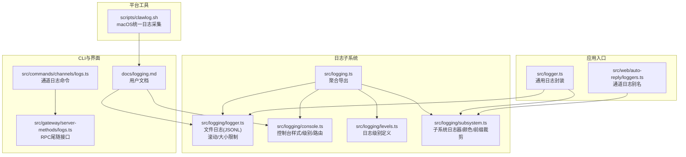
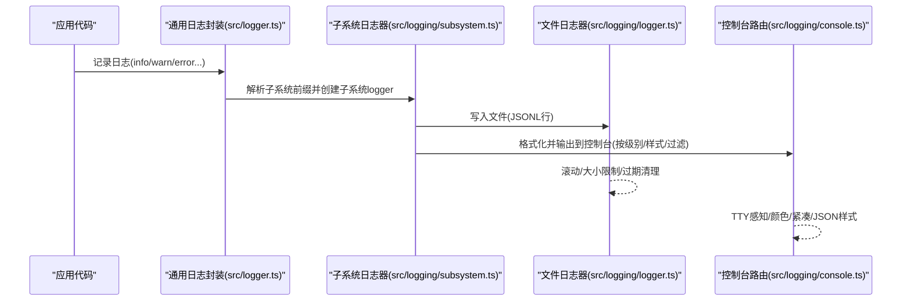
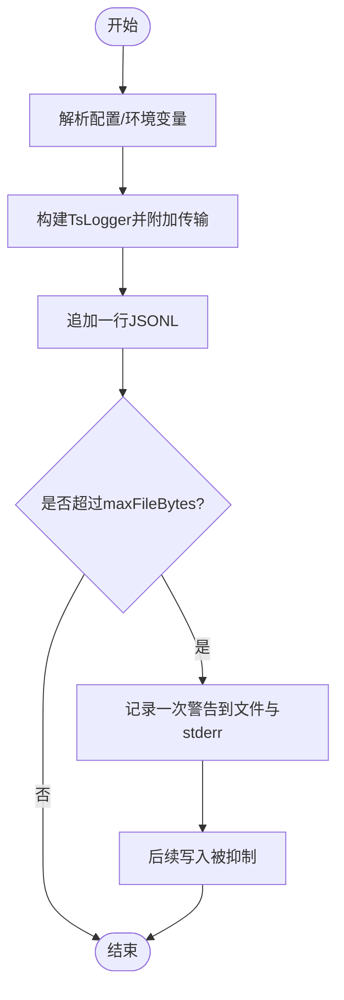
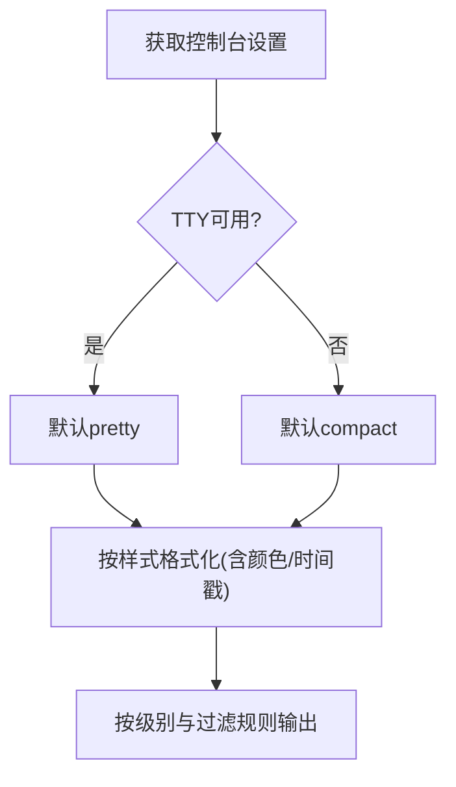
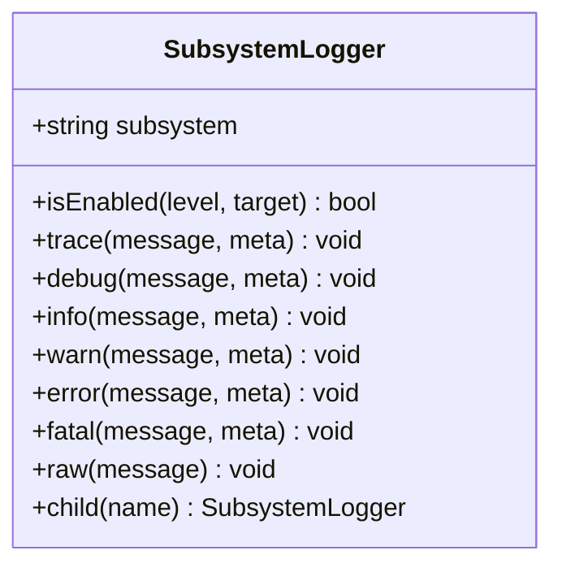
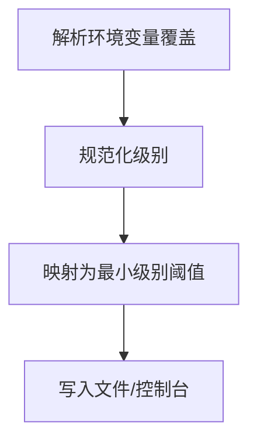
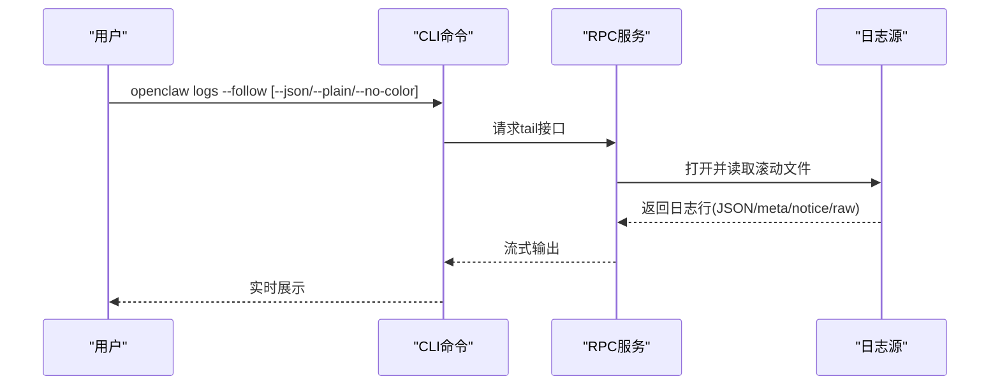
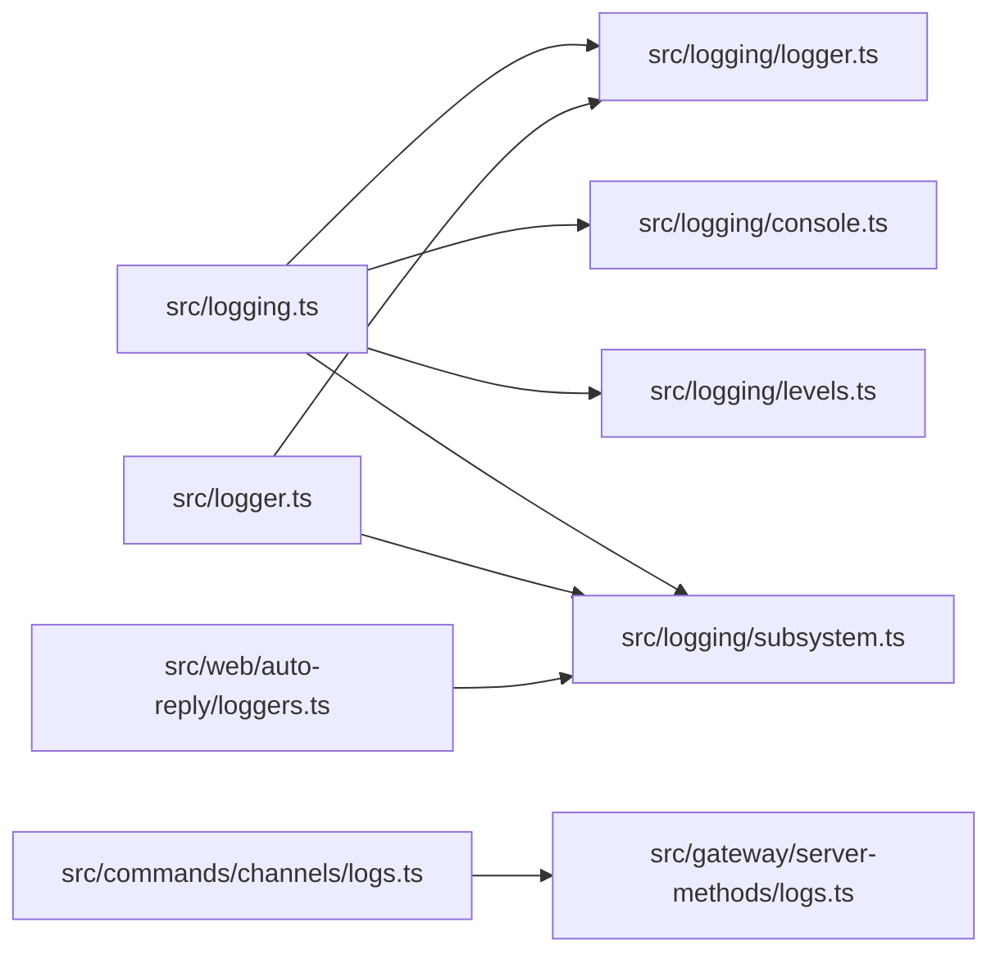

# 日志分析

<cite>
**本文引用的文件**
- [src/logging.ts](file://src/logging.ts)
- [src/logger.ts](file://src/logger.ts)
- [src/logging/logger.ts](file://src/logging/logger.ts)
- [src/logging/console.ts](file://src/logging/console.ts)
- [src/logging/levels.ts](file://src/logging/levels.ts)
- [src/logging/subsystem.ts](file://src/logging/subsystem.ts)
- [docs/logging.md](file://docs/logging.md)
- [scripts/clawlog.sh](file://scripts/clawlog.sh)
- [src/web/auto-reply/loggers.ts](file://src/web/auto-reply/loggers.ts)
- [src/commands/channels/logs.ts](file://src/commands/channels/logs.ts)
- [src/gateway/server-methods/logs.ts](file://src/gateway/server-methods/logs.ts)
- [src/web/auto-reply/heartbeat-runner.test.ts](file://src/web/auto-reply/heartbeat-runner.test.ts)
- [src/commands/health.snapshot.test.ts](file://src/commands/health.snapshot.test.ts)
- [src/config/logging-max-file-bytes.test.ts](file://src/config/logging-max-file-bytes.test.ts)
</cite>

## 目录
1. [简介](#简介)
2. [项目结构](#项目结构)
3. [核心组件](#核心组件)
4. [架构总览](#架构总览)
5. [详细组件分析](#详细组件分析)
6. [依赖关系分析](#依赖关系分析)
7. [性能考量](#性能考量)
8. [故障排查指南](#故障排查指南)
9. [结论](#结论)
10. [附录](#附录)

## 简介
本运维文档面向OpenClaw日志分析与运维场景，系统化阐述日志架构、配置项、日志级别与格式、滚动与清理策略、通道日志过滤、CLI与控制界面的读取方式、以及基于Unix工具链的查询与分析方法。同时给出心跳检测、重连机制、错误追踪等关键日志模式的解读，帮助快速定位问题并建立自动化日志分析流程。

## 项目结构
OpenClaw的日志子系统由“文件日志(JSONL)”和“控制台输出”两部分组成，通过统一的子系统日志器与级别控制实现分层输出与过滤。核心入口导出位于日志聚合模块，具体实现分布在logger、console、levels、subsystem等模块中；CLI与控制界面提供实时查看与过滤能力；macOS平台提供专用日志采集脚本。

**图表来源**
- [src/logging.ts:1-70](file://src/logging.ts#L1-L70)
- [src/logging/logger.ts:1-348](file://src/logging/logger.ts#L1-L348)
- [src/logging/console.ts:1-327](file://src/logging/console.ts#L1-L327)
- [src/logging/levels.ts:1-38](file://src/logging/levels.ts#L1-L38)
- [src/logging/subsystem.ts:1-426](file://src/logging/subsystem.ts#L1-L426)
- [src/logger.ts:1-86](file://src/logger.ts#L1-L86)
- [src/web/auto-reply/loggers.ts:1-6](file://src/web/auto-reply/loggers.ts#L1-L6)
- [src/commands/channels/logs.ts](file://src/commands/channels/logs.ts)
- [src/gateway/server-methods/logs.ts](file://src/gateway/server-methods/logs.ts)
- [docs/logging.md:1-353](file://docs/logging.md#L1-L353)
- [scripts/clawlog.sh:1-322](file://scripts/clawlog.sh#L1-L322)

**章节来源**
- [src/logging.ts:1-70](file://src/logging.ts#L1-L70)
- [docs/logging.md:10-114](file://docs/logging.md#L10-L114)

## 核心组件
- 文件日志(JSONL)：默认滚动到按日命名的文件，支持最大文件字节限制与过期清理。
- 控制台输出：支持pretty/compact/json三种样式，可按子系统过滤与时间戳前缀控制。
- 子系统日志器：为不同功能域（如gateway/channels/whatsapp）提供独立的logger实例，便于分级与过滤。
- 日志级别：支持silent/fatal/error/warn/info/debug/trace，内部映射到底层库的最小级别阈值。
- CLI与控制界面：提供实时tail、JSON/纯文本输出、TTY感知格式化、通道日志过滤等能力。
- 平台工具：macOS下通过统一日志系统采集并展示OpenClaw相关日志。

**章节来源**
- [src/logging/logger.ts:15-106](file://src/logging/logger.ts#L15-L106)
- [src/logging/console.ts:13-91](file://src/logging/console.ts#L13-L91)
- [src/logging/levels.ts:1-38](file://src/logging/levels.ts#L1-L38)
- [src/logging/subsystem.ts:17-426](file://src/logging/subsystem.ts#L17-L426)
- [docs/logging.md:82-141](file://docs/logging.md#L82-L141)

## 架构总览
OpenClaw日志系统采用“双通道”设计：文件通道用于持久化与离线分析，控制台通道用于交互式观察。文件通道默认写入滚动日志，具备大小上限与过期清理；控制台通道根据TTY与样式设置输出，支持子系统过滤与时间戳前缀。子系统日志器在文件与控制台之间保持一致的消息语义，确保同一事件在两种通道的一致性呈现。

**图表来源**
- [src/logger.ts:20-86](file://src/logger.ts#L20-L86)
- [src/logging/subsystem.ts:308-402](file://src/logging/subsystem.ts#L308-L402)
- [src/logging/logger.ts:126-184](file://src/logging/logger.ts#L126-L184)
- [src/logging/console.ts:203-327](file://src/logging/console.ts#L203-L327)

## 详细组件分析

### 文件日志与滚动策略
- 默认目录与文件名：使用临时目录作为默认日志根，按日期生成滚动文件名。
- 大小限制：超过最大字节数后停止写入并在stderr输出警告，同时在文件中记录一次告警条目。
- 过期清理：删除24小时之前的滚动文件，避免磁盘占用增长。
- 配置项：可通过配置覆盖文件路径与最大文件字节，支持环境变量覆盖。

**图表来源**
- [src/logging/logger.ts:73-106](file://src/logging/logger.ts#L73-L106)
- [src/logging/logger.ts:149-184](file://src/logging/logger.ts#L149-L184)
- [src/logging/logger.ts:323-347](file://src/logging/logger.ts#L323-L347)

**章节来源**
- [src/logging/logger.ts:15-106](file://src/logging/logger.ts#L15-L106)
- [src/logging/logger.ts:186-191](file://src/logging/logger.ts#L186-L191)
- [src/logging/logger.ts:309-321](file://src/logging/logger.ts#L309-L321)
- [src/config/logging-max-file-bytes.test.ts:1-25](file://src/config/logging-max-file-bytes.test.ts#L1-L25)

### 控制台输出与样式
- 样式选择：TTY环境下默认pretty，非TTY默认compact；可通过配置或环境变量调整。
- 时间戳前缀：可开启在非JSON模式下为每行添加本地ISO时间戳。
- 子系统过滤：支持白名单过滤仅显示特定子系统或其子树。
- 输出路由：在RPC/JSON模式下将日志路由至stderr以保持stdout纯净。

**图表来源**
- [src/logging/console.ts:50-91](file://src/logging/console.ts#L50-L91)
- [src/logging/console.ts:169-178](file://src/logging/console.ts#L169-L178)
- [src/logging/console.ts:119-138](file://src/logging/console.ts#L119-L138)
- [src/logging/console.ts:203-327](file://src/logging/console.ts#L203-L327)

**章节来源**
- [src/logging/console.ts:13-91](file://src/logging/console.ts#L13-L91)
- [src/logging/console.ts:119-138](file://src/logging/console.ts#L119-L138)
- [src/logging/console.ts:203-327](file://src/logging/console.ts#L203-L327)

### 子系统日志器与颜色/前缀
- 子系统命名：支持多段层级，如gateway/channels/whatsapp；自动裁剪冗余前缀并为通道类子系统做特殊处理。
- 颜色分配：基于子系统字符串哈希选择颜色，支持对特定子系统覆写。
- 前缀去重：去除重复的子系统前缀，避免冗余显示。
- 元数据透传：支持在文件与控制台分别输出元数据，控制台可覆盖显示消息。

**图表来源**
- [src/logging/subsystem.ts:17-42](file://src/logging/subsystem.ts#L17-L42)
- [src/logging/subsystem.ts:308-402](file://src/logging/subsystem.ts#L308-L402)

**章节来源**
- [src/logging/subsystem.ts:126-191](file://src/logging/subsystem.ts#L126-L191)
- [src/logging/subsystem.ts:308-402](file://src/logging/subsystem.ts#L308-L402)

### 日志级别与配置
- 支持级别：silent/fatal/error/warn/info/debug/trace。
- 级别映射：内部转换为底层库的最小级别阈值，实现按级别过滤。
- 配置来源：配置文件、环境变量、CLI参数；环境变量优先级高于配置文件。
- 文件级别与控制台级别可独立设置；--verbose仅影响控制台输出。

**图表来源**
- [src/logging/levels.ts:13-37](file://src/logging/levels.ts#L13-L37)
- [src/logging/logger.ts:73-106](file://src/logging/logger.ts#L73-L106)
- [docs/logging.md:116-124](file://docs/logging.md#L116-L124)

**章节来源**
- [src/logging/levels.ts:1-38](file://src/logging/levels.ts#L1-L38)
- [docs/logging.md:116-124](file://docs/logging.md#L116-L124)

### CLI与控制界面读取
- CLI tail：支持TTY美化、纯文本、JSON、禁色等模式；在网关不可达时提示doctor。
- 控制界面：通过tail接口实时查看日志。
- 通道日志：提供按通道过滤的专用命令，便于定位渠道问题。

**图表来源**
- [docs/logging.md:40-81](file://docs/logging.md#L40-L81)
- [src/commands/channels/logs.ts](file://src/commands/channels/logs.ts)
- [src/gateway/server-methods/logs.ts](file://src/gateway/server-methods/logs.ts)

**章节来源**
- [docs/logging.md:38-81](file://docs/logging.md#L38-L81)

### macOS统一日志采集
- 使用统一日志子系统ai.openclaw采集OpenClaw日志。
- 支持类别过滤、错误过滤、关键词搜索、时间范围、流式/一次性查看、JSON输出、导出到文件等。
- 需要sudo权限以绕过隐私遮蔽，提供NOPASSWD配置建议。

**章节来源**
- [scripts/clawlog.sh:1-322](file://scripts/clawlog.sh#L1-L322)

## 依赖关系分析
- 日志聚合导出：logging.ts统一导出控制台、级别、logger、子系统等能力。
- 通用封装：logger.ts提供便捷的日志方法，并与子系统日志器协同工作。
- 子系统别名：web/auto-reply/loggers.ts为常用通道提供子系统别名，便于集中管理。
- CLI与RPC：channels/logs.ts与gateway/server-methods/logs.ts共同支撑日志读取与过滤。

**图表来源**
- [src/logging.ts:1-70](file://src/logging.ts#L1-L70)
- [src/logger.ts:1-86](file://src/logger.ts#L1-L86)
- [src/web/auto-reply/loggers.ts:1-6](file://src/web/auto-reply/loggers.ts#L1-L6)
- [src/commands/channels/logs.ts](file://src/commands/channels/logs.ts)
- [src/gateway/server-methods/logs.ts](file://src/gateway/server-methods/logs.ts)

**章节来源**
- [src/logging.ts:1-70](file://src/logging.ts#L1-L70)

## 性能考量
- 文件写入：每次追加写入均进行大小检查，超限后抑制写入并记录一次警告，避免频繁I/O与阻塞。
- 控制台输出：对TTY与非TTY分别优化，减少不必要的颜色与格式化开销。
- 子系统过滤：通过白名单减少控制台噪声，降低渲染与输出成本。
- 滚动清理：定期清理过期文件，防止磁盘空间持续增长。

[本节为通用指导，无需列出具体文件来源]

## 故障排查指南
- 网关不可达：优先执行诊断命令，确认网关状态与日志文件路径。
- 日志为空：检查网关是否运行、文件路径是否正确、级别是否过高导致无输出。
- 需要更详细：提升文件级别至debug或trace，必要时开启诊断标志位。
- macOS日志缺失：确认sudo权限配置，避免隐私遮蔽导致日志不全。

**章节来源**
- [docs/logging.md:347-353](file://docs/logging.md#L347-L353)

## 结论
OpenClaw的日志系统通过清晰的双通道设计、灵活的级别与样式控制、完善的子系统隔离与过滤机制，既满足日常运维观察，也便于离线分析与自动化集成。结合CLI/RPC与macOS统一日志工具，可高效完成从问题发现到根因定位的全流程。

[本节为总结性内容，无需列出具体文件来源]

## 附录

### 日志级别与用途
- silent：完全静默，适合CI或测试环境。
- fatal/error：致命/错误，用于异常与失败事件。
- warn：警告，用于潜在问题或非阻断异常。
- info：常规信息，用于一般性状态与流程。
- debug：调试信息，用于开发与深度排障。
- trace：最细粒度日志，用于极少数需要完整轨迹的场景。

**章节来源**
- [src/logging/levels.ts:1-38](file://src/logging/levels.ts#L1-L38)

### 日志格式与字段
- 文件(JSONL)：每行一个JSON对象，包含时间、级别、子系统、消息及可能的元数据。
- 控制台(JSON)：与文件一致的结构，便于机器解析。
- 控制台(美化/紧凑)：增加颜色、时间戳与子系统前缀，便于人工阅读。

**章节来源**
- [docs/logging.md:84-96](file://docs/logging.md#L84-L96)

### 日志收集与存储最佳实践
- 文件位置：默认滚动到按日命名的文件；可通过配置覆盖路径。
- 命名规范：按日期命名，避免跨天覆盖。
- 保留策略：默认保留24小时内的滚动文件；可根据磁盘压力调整maxFileBytes与清理策略。
- 导出与归档：使用CLI/RPC导出JSONL，配合外部日志平台进行长期归档。

**章节来源**
- [docs/logging.md:20-36](file://docs/logging.md#L20-L36)
- [src/logging/logger.ts:309-321](file://src/logging/logger.ts#L309-L321)
- [src/logging/logger.ts:323-347](file://src/logging/logger.ts#L323-L347)

### 日志分析方法与工具
- grep：按关键字过滤，如错误、异常、特定子系统。
- awk：按字段提取、统计、聚合，如按级别计数、按子系统分组。
- sed：正则替换、清洗、格式化。
- jq：JSONL解析与字段抽取，适合复杂过滤与结构化分析。
- macOS统一日志：使用脚本按类别/错误/关键词/时间范围筛选，支持导出到文件。

**章节来源**
- [scripts/clawlog.sh:78-123](file://scripts/clawlog.sh#L78-L123)
- [scripts/clawlog.sh:286-322](file://scripts/clawlog.sh#L286-L322)

### 常见日志模式解读
- 心跳检测：通道心跳日志通常包含状态、耗时、队列深度等指标，可用于判断服务健康与延迟。
- 重连机制：重连尝试与退避策略会体现在日志中，关注连续错误与恢复时间。
- 错误追踪：错误日志包含上下文与堆栈片段，结合子系统前缀定位到具体模块。

**章节来源**
- [src/web/auto-reply/loggers.ts:1-6](file://src/web/auto-reply/loggers.ts#L1-L6)
- [src/web/auto-reply/heartbeat-runner.test.ts:175-203](file://src/web/auto-reply/heartbeat-runner.test.ts#L175-L203)
- [src/commands/health.snapshot.test.ts:243-253](file://src/commands/health.snapshot.test.ts#L243-L253)

### 日志监控与告警配置
- 采集：使用CLI/RPC或macOS统一日志脚本持续采集。
- 过滤：通过子系统过滤与关键词匹配，聚焦关键事件。
- 告警：基于错误级别阈值、异常模式、超时/超频等规则触发告警。
- 自动化：将采集与分析脚本纳入定时任务或流水线，形成闭环。

[本节为通用指导，无需列出具体文件来源]