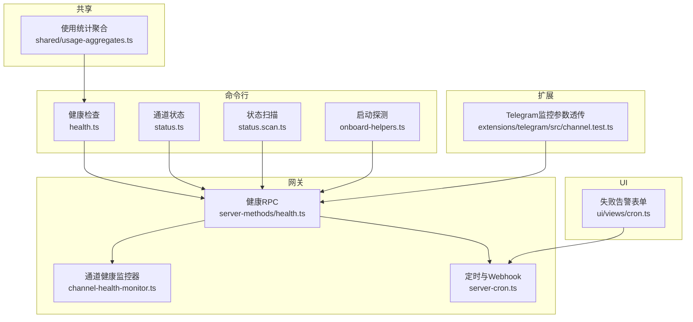
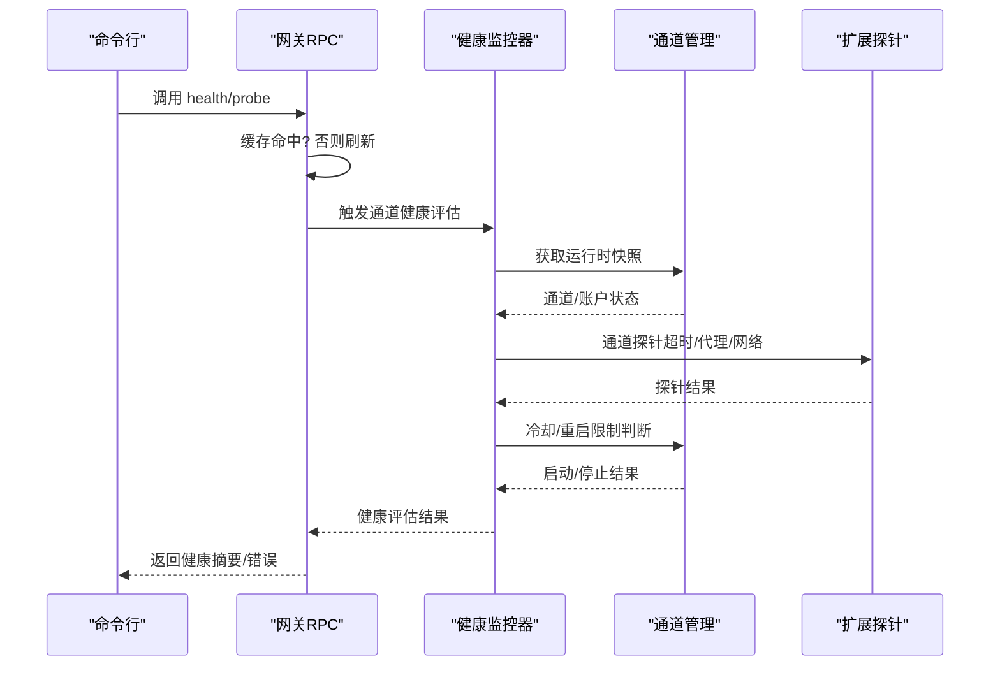
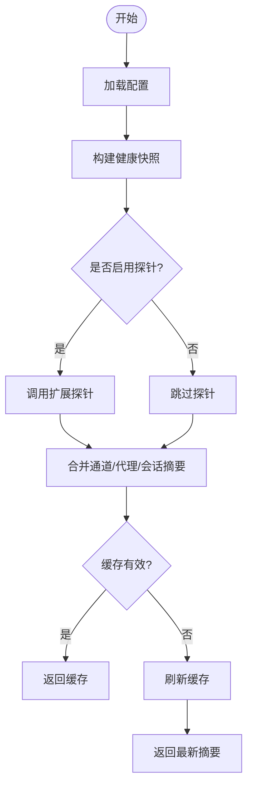
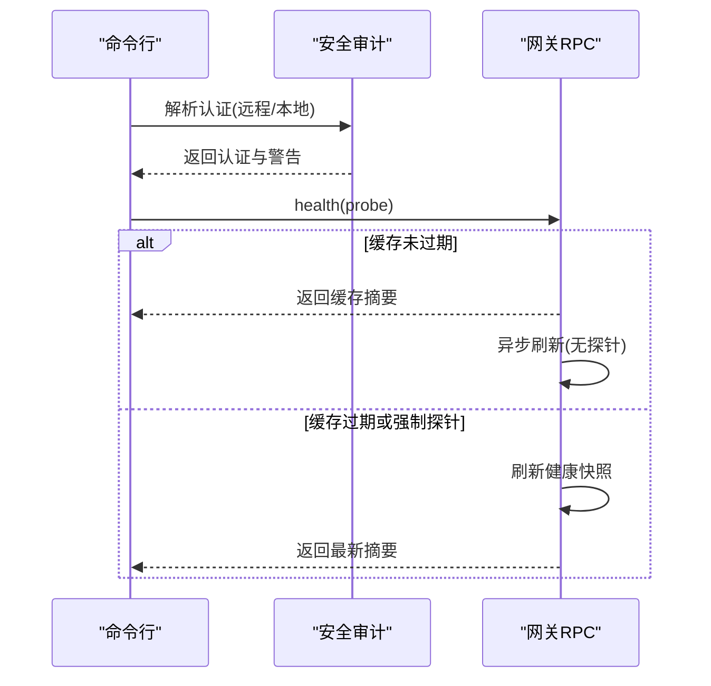
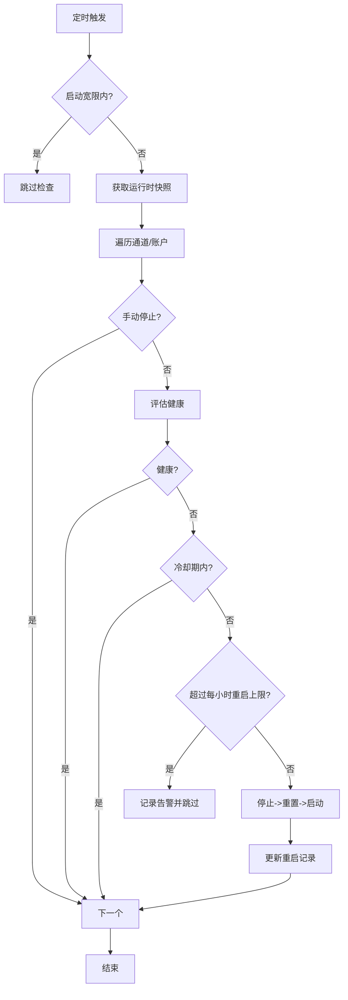
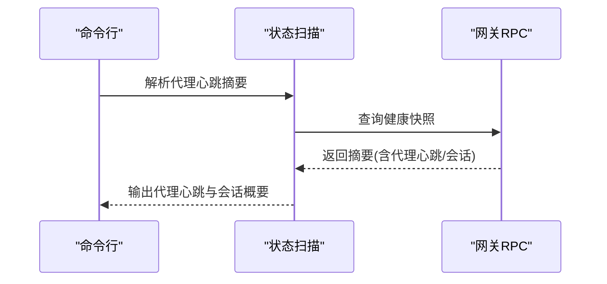
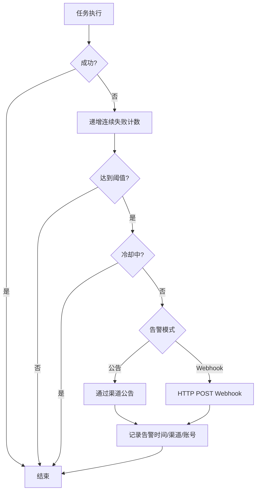
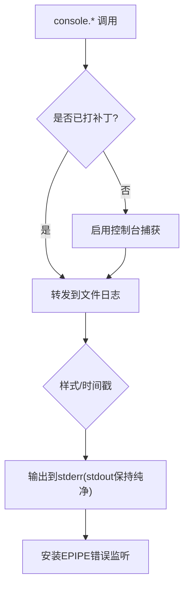
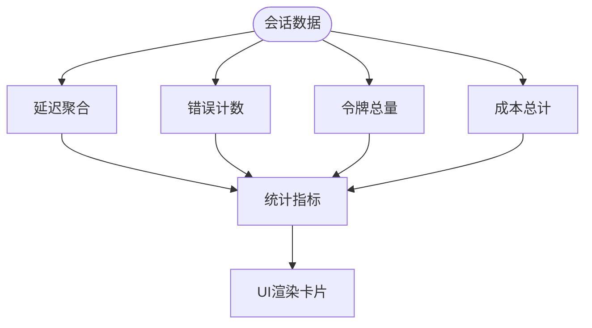
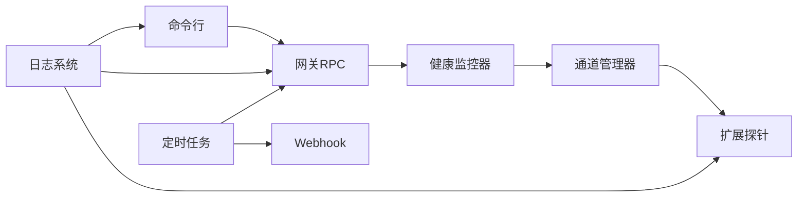

# 监控告警

<cite>
**本文引用的文件**
- [health.ts](file://src/commands/health.ts)
- [channel-health-monitor.ts](file://src/gateway/channel-health-monitor.ts)
- [health.ts](file://src/gateway/server-methods/health.ts)
- [status.ts](file://src/commands/status.ts)
- [status.scan.ts](file://src/commands/status.scan.ts)
- [onboard-helpers.ts](file://src/commands/onboard-helpers.ts)
- [logging.ts](file://src/logging.ts)
- [console.ts](file://src/logging/console.ts)
- [server-cron.ts](file://src/gateway/server-cron.ts)
- [timer.ts](file://src/cron/service/timer.ts)
- [cron.ts](file://ui/src/ui/views/cron.ts)
- [usage-render-overview.ts](file://ui/src/ui/views/usage-render-overview.ts)
- [usage-metrics.ts](file://ui/src/ui/views/usage-metrics.ts)
- [usage-aggregates.ts](file://src/shared/usage-aggregates.ts)
- [system-presence.ts](file://src/infra/system-presence.ts)
- [server-channels.ts](file://src/gateway/server-channels.ts)
- [channel-health-policy.ts](file://src/gateway/channel-health-policy.ts)
- [channel.ts](file://extensions/telegram/src/channel.test.ts)
- [audit.ts](file://src/security/audit.ts)
</cite>

## 目录
1. [简介](#简介)
2. [项目结构](#项目结构)
3. [核心组件](#核心组件)
4. [架构总览](#架构总览)
5. [详细组件分析](#详细组件分析)
6. [依赖关系分析](#依赖关系分析)
7. [性能考量](#性能考量)
8. [故障排查指南](#故障排查指南)
9. [结论](#结论)
10. [附录](#附录)

## 简介
本运维指南面向OpenClaw监控告警体系，聚焦以下目标：
- 健康检查机制：系统健康状态、网关服务可达性、通道连接状态、代理心跳与会话状态
- 性能监控指标：响应时间、吞吐量、错误率、缓存命中率、延迟分位
- 日志收集与分析：控制台与文件日志、子系统过滤、时间戳前缀、EPIPE防护
- 告警规则与通知：自动告警、Webhook推送、失败告警阈值与冷却、渠道与账号选择
- 资源与业务监控：CPU/内存/磁盘/网络外延建议、业务指标（消息数、成本、时延）可视化

## 项目结构
OpenClaw在命令行、网关RPC、扩展插件、UI与共享模块之间形成清晰的监控与告警闭环：
- 命令行层：健康检查、状态扫描、通道状态查询、启动辅助探测
- 网关层：健康RPC接口、通道健康监控器、定时任务与Webhook
- 扩展层：各通道（如Telegram）的探针与监控参数透传
- UI层：失败告警表单、业务指标可视化
- 共享层：使用聚合工具计算延迟与指标

**图表来源**
- [health.ts:1-752](file://src/commands/health.ts#L1-L752)
- [status.scan.ts:75-180](file://src/commands/status.scan.ts#L75-L180)
- [status.ts:318-358](file://src/commands/status.ts#L318-L358)
- [onboard-helpers.ts:423-457](file://src/commands/onboard-helpers.ts#L423-L457)
- [health.ts:1-38](file://src/gateway/server-methods/health.ts#L1-L38)
- [channel-health-monitor.ts:1-201](file://src/gateway/channel-health-monitor.ts#L1-L201)
- [server-cron.ts:33-92](file://src/gateway/server-cron.ts#L33-L92)
- [channel.ts:142-170](file://extensions/telegram/src/channel.test.ts#L142-L170)
- [usage-aggregates.ts:1-66](file://src/shared/usage-aggregates.ts#L1-L66)
- [cron.ts:1217-1303](file://ui/src/ui/views/cron.ts#L1217-L1303)

**章节来源**
- [health.ts:1-752](file://src/commands/health.ts#L1-L752)
- [status.scan.ts:75-180](file://src/commands/status.scan.ts#L75-L180)
- [status.ts:318-358](file://src/commands/status.ts#L318-L358)
- [onboard-helpers.ts:423-457](file://src/commands/onboard-helpers.ts#L423-L457)
- [health.ts:1-38](file://src/gateway/server-methods/health.ts#L1-L38)
- [channel-health-monitor.ts:1-201](file://src/gateway/channel-health-monitor.ts#L1-L201)
- [server-cron.ts:33-92](file://src/gateway/server-cron.ts#L33-L92)
- [channel.ts:142-170](file://extensions/telegram/src/channel.test.ts#L142-L170)
- [usage-aggregates.ts:1-66](file://src/shared/usage-aggregates.ts#L1-L66)
- [cron.ts:1217-1303](file://ui/src/ui/views/cron.ts#L1217-L1303)

## 核心组件
- 健康快照与格式化输出：构建通道、代理、会话的健康摘要，并支持详细探针输出
- 网关健康RPC：缓存与刷新策略、探针开关、错误处理
- 通道健康监控器：周期性评估通道健康、冷却与重启限制、事件停滞检测
- 日志系统：控制台样式与级别、文件落盘、子系统过滤、时间戳前缀、EPIPE防护
- 定时任务与Webhook：失败告警阈值、冷却、渠道与账号选择、HTTP头部
- UI失败告警表单：阈值、冷却、渠道、收件人、模式（公告/Webhook）
- 使用统计聚合：延迟聚合、日累计、平均/分位、错误率、吞吐量

**章节来源**
- [health.ts:348-523](file://src/commands/health.ts#L348-L523)
- [health.ts:10-37](file://src/gateway/server-methods/health.ts#L10-L37)
- [channel-health-monitor.ts:76-200](file://src/gateway/channel-health-monitor.ts#L76-L200)
- [logging.ts:1-70](file://src/logging.ts#L1-L70)
- [console.ts:1-327](file://src/logging/console.ts#L1-L327)
- [server-cron.ts:33-92](file://src/gateway/server-cron.ts#L33-L92)
- [timer.ts:206-244](file://src/cron/service/timer.ts#L206-L244)
- [cron.ts:1217-1303](file://ui/src/ui/views/cron.ts#L1217-L1303)
- [usage-aggregates.ts:32-66](file://src/shared/usage-aggregates.ts#L32-L66)

## 架构总览
下图展示从命令行到网关、再到通道与扩展的健康检查与告警路径。

**图表来源**
- [health.ts:525-751](file://src/commands/health.ts#L525-L751)
- [health.ts:10-37](file://src/gateway/server-methods/health.ts#L10-L37)
- [channel-health-monitor.ts:99-176](file://src/gateway/channel-health-monitor.ts#L99-L176)
- [server-channels.ts:1-200](file://src/gateway/server-channels.ts#L1-L200)
- [channel.ts:142-170](file://extensions/telegram/src/channel.test.ts#L142-L170)

**章节来源**
- [health.ts:525-751](file://src/commands/health.ts#L525-L751)
- [health.ts:10-37](file://src/gateway/server-methods/health.ts#L10-L37)
- [channel-health-monitor.ts:99-176](file://src/gateway/channel-health-monitor.ts#L99-L176)
- [server-channels.ts:1-200](file://src/gateway/server-channels.ts#L1-L200)
- [channel.ts:142-170](file://extensions/telegram/src/channel.test.ts#L142-L170)

## 详细组件分析

### 健康检查机制
- 命令行健康快照：聚合通道探针、代理心跳、会话存储信息；支持详细探针与超时控制
- 网关健康RPC：缓存刷新间隔、探针开关、错误码映射
- 启动辅助探测：在引导流程中轮询网关可达性，记录最后一次细节

**图表来源**
- [health.ts:348-523](file://src/commands/health.ts#L348-L523)
- [health.ts:10-37](file://src/gateway/server-methods/health.ts#L10-L37)
- [onboard-helpers.ts:423-457](file://src/commands/onboard-helpers.ts#L423-L457)

**章节来源**
- [health.ts:348-523](file://src/commands/health.ts#L348-L523)
- [health.ts:10-37](file://src/gateway/server-methods/health.ts#L10-L37)
- [onboard-helpers.ts:423-457](file://src/commands/onboard-helpers.ts#L423-L457)

### 网关服务监控
- 健康RPC：区分缓存命中与刷新；后台触发无探针刷新以保持缓存新鲜
- 认证与授权：远程/本地模式下的认证解析与警告拼接
- 可达性探测：在命令行与引导流程中进行超时控制与错误汇总

**图表来源**
- [audit.ts:1057-1091](file://src/security/audit.ts#L1057-L1091)
- [health.ts:10-37](file://src/gateway/server-methods/health.ts#L10-L37)

**章节来源**
- [audit.ts:1057-1091](file://src/security/audit.ts#L1057-L1091)
- [health.ts:10-37](file://src/gateway/server-methods/health.ts#L10-L37)

### 通道连接状态监控
- 周期性检查：默认5分钟一次，启动宽限、事件停滞阈值、冷却窗口与每小时重启上限
- 健康评估：基于连接、事件时间、重启尝试与冷却策略
- 自动重启：满足条件后先停止再启动，记录重启时间并清理旧记录

**图表来源**
- [channel-health-monitor.ts:76-200](file://src/gateway/channel-health-monitor.ts#L76-L200)
- [channel-health-policy.ts:1-200](file://src/gateway/channel-health-policy.ts#L1-L200)

**章节来源**
- [channel-health-monitor.ts:76-200](file://src/gateway/channel-health-monitor.ts#L76-L200)
- [channel-health-policy.ts:1-200](file://src/gateway/channel-health-policy.ts#L1-L200)

### 代理执行监控
- 代理心跳摘要：按代理解析心跳间隔与最近一次心跳，支持“禁用”与“未知”场景
- 会话存储：最近活动会话列表与计数，用于定位活跃度与异常

**图表来源**
- [status.ts:318-358](file://src/commands/status.ts#L318-L358)
- [status.scan.ts:75-108](file://src/commands/status.scan.ts#L75-L108)

**章节来源**
- [status.ts:318-358](file://src/commands/status.ts#L318-L358)
- [status.scan.ts:75-108](file://src/commands/status.scan.ts#L75-L108)

### 告警规则与通知
- 失败告警阈值与冷却：连续错误次数、最小告警间隔、渠道与账号覆盖
- Webhook推送：URL规范化、Authorization头、超时控制
- UI表单校验：URL合法性、数值范围、必填项提示

**图表来源**
- [timer.ts:206-244](file://src/cron/service/timer.ts#L206-L244)
- [server-cron.ts:63-92](file://src/gateway/server-cron.ts#L63-L92)
- [cron.ts:1217-1303](file://ui/src/ui/views/cron.ts#L1217-L1303)

**章节来源**
- [timer.ts:206-244](file://src/cron/service/timer.ts#L206-L244)
- [server-cron.ts:63-92](file://src/gateway/server-cron.ts#L63-L92)
- [cron.ts:1217-1303](file://ui/src/ui/views/cron.ts#L1217-L1303)

### 日志收集与分析
- 控制台与文件日志：统一路由至文件日志，同时保留控制台输出；支持静默、紧凑、JSON、美化等样式
- 子系统过滤：按前缀过滤输出，便于聚焦特定模块
- 时间戳前缀：可选添加，避免重复；JSON负载自动忽略
- EPIPE防护：监听stdout/stderr异步错误，避免管道关闭导致崩溃

**图表来源**
- [logging.ts:34-70](file://src/logging.ts#L34-L70)
- [console.ts:203-327](file://src/logging/console.ts#L203-L327)

**章节来源**
- [logging.ts:34-70](file://src/logging.ts#L34-L70)
- [console.ts:203-327](file://src/logging/console.ts#L203-L327)

### 应用性能监控与业务指标
- 延迟聚合：总计/最小/最大/分位、日累计聚合
- 错误率：错误数/消息总数
- 吞吐量：令牌/分钟、成本/分钟
- 缓存命中率：缓存读/(输入+缓存读)

**图表来源**
- [usage-aggregates.ts:32-66](file://src/shared/usage-aggregates.ts#L32-L66)
- [usage-render-overview.ts:380-533](file://ui/src/ui/views/usage-render-overview.ts#L380-L533)
- [usage-metrics.ts:1-48](file://ui/src/ui/views/usage-metrics.ts#L1-L48)

**章节来源**
- [usage-aggregates.ts:32-66](file://src/shared/usage-aggregates.ts#L32-L66)
- [usage-render-overview.ts:380-533](file://ui/src/ui/views/usage-render-overview.ts#L380-L533)
- [usage-metrics.ts:1-48](file://ui/src/ui/views/usage-metrics.ts#L1-L48)

### 系统资源监控（建议）
- CPU/内存/磁盘/网络：结合系统级监控工具（如进程采样、容器指标）与应用侧日志聚合
- 网关与通道：关注通道停滞事件阈值、重启频率、探针耗时分布
- 业务侧：消息数、错误率、吞吐量、缓存命中率作为关键SLO

[本节为通用实践说明，不直接分析具体文件]

## 依赖关系分析
- 命令行依赖网关RPC；网关内部依赖通道管理器与健康策略；扩展通过探针参与健康评估
- 日志系统被广泛使用，贯穿命令行、网关与扩展
- 定时任务依赖网关的Webhook解析与安全头设置

**图表来源**
- [health.ts:525-751](file://src/commands/health.ts#L525-L751)
- [channel-health-monitor.ts:76-200](file://src/gateway/channel-health-monitor.ts#L76-L200)
- [server-channels.ts:1-200](file://src/gateway/server-channels.ts#L1-L200)
- [logging.ts:1-70](file://src/logging.ts#L1-L70)
- [server-cron.ts:63-92](file://src/gateway/server-cron.ts#L63-L92)

**章节来源**
- [health.ts:525-751](file://src/commands/health.ts#L525-L751)
- [channel-health-monitor.ts:76-200](file://src/gateway/channel-health-monitor.ts#L76-L200)
- [server-channels.ts:1-200](file://src/gateway/server-channels.ts#L1-L200)
- [logging.ts:1-70](file://src/logging.ts#L1-L70)
- [server-cron.ts:63-92](file://src/gateway/server-cron.ts#L63-L92)

## 性能考量
- 健康快照超时与探针：合理设置超时与探针开关，避免阻塞RPC
- 缓存刷新：利用缓存减少重复探针开销，后台无探针刷新保持新鲜度
- 通道重启限制：冷却窗口与每小时上限防止风暴重启
- 日志写入：控制台捕获与文件落盘分离，避免阻塞主流程

[本节为通用指导，不直接分析具体文件]

## 故障排查指南
- 网关不可达：检查远程URL、认证解析与警告；命令行与引导流程均提供探测
- 通道探针失败：查看探针错误、状态码、耗时；确认代理与网络设置透传
- 健康监控重启频繁：检查冷却与上限配置；关注事件停滞阈值
- 日志缺失或EPIPE：启用控制台捕获、设置时间戳前缀、安装EPIPE监听

**章节来源**
- [audit.ts:1057-1091](file://src/security/audit.ts#L1057-L1091)
- [onboard-helpers.ts:423-457](file://src/commands/onboard-helpers.ts#L423-L457)
- [channel.ts:172-187](file://extensions/telegram/src/channel.test.ts#L172-L187)
- [console.ts:203-327](file://src/logging/console.ts#L203-L327)

## 结论
OpenClaw提供了从命令行到网关、从通道到扩展的完整健康检查与告警闭环。通过缓存与探针策略、通道健康监控器、日志系统与定时任务Webhook，可以构建稳定可靠的监控告警体系。建议结合系统资源与业务指标，持续优化阈值与通知策略，确保快速发现与恢复。

## 附录
- 健康快照字段与格式化：通道探针、代理心跳、会话存储
- 通道健康策略：连接宽限、事件停滞、重启冷却与上限
- 日志样式与过滤：控制台级别、样式、子系统过滤、时间戳前缀
- 失败告警配置：阈值、冷却、渠道、账号、Webhook头

**章节来源**
- [health.ts:23-72](file://src/commands/health.ts#L23-L72)
- [channel-health-monitor.ts:20-74](file://src/gateway/channel-health-monitor.ts#L20-L74)
- [console.ts:13-138](file://src/logging/console.ts#L13-L138)
- [server-cron.ts:39-92](file://src/gateway/server-cron.ts#L39-L92)