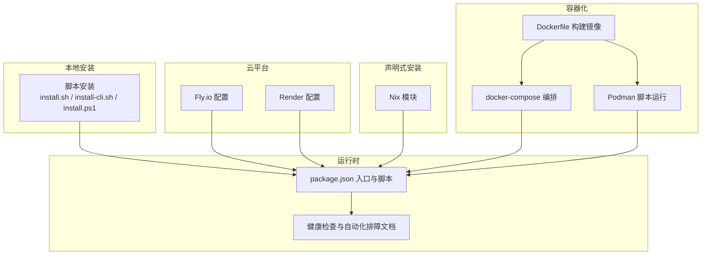
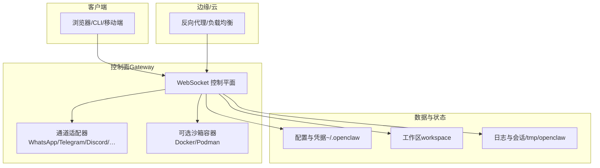
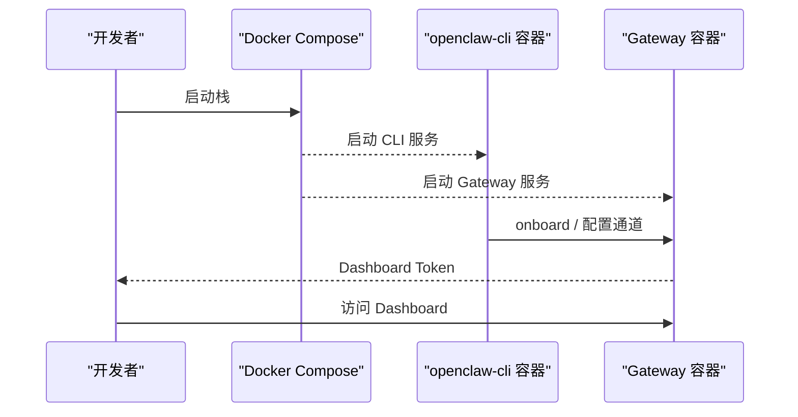
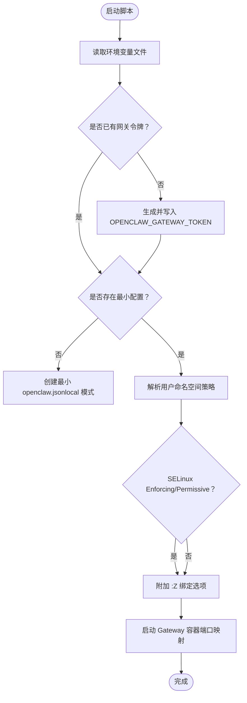
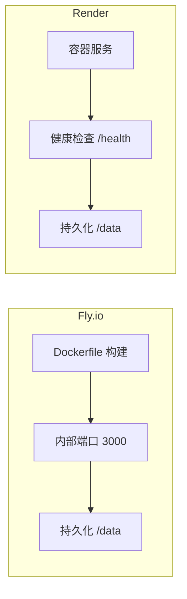
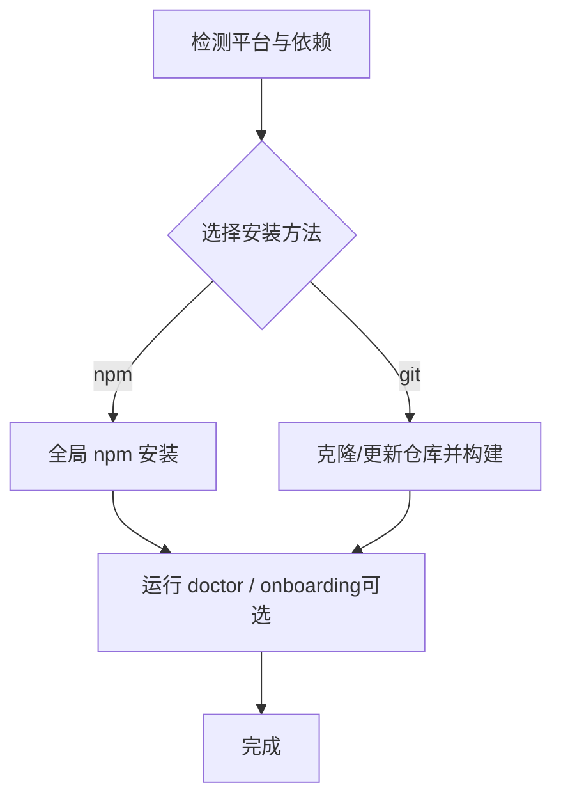
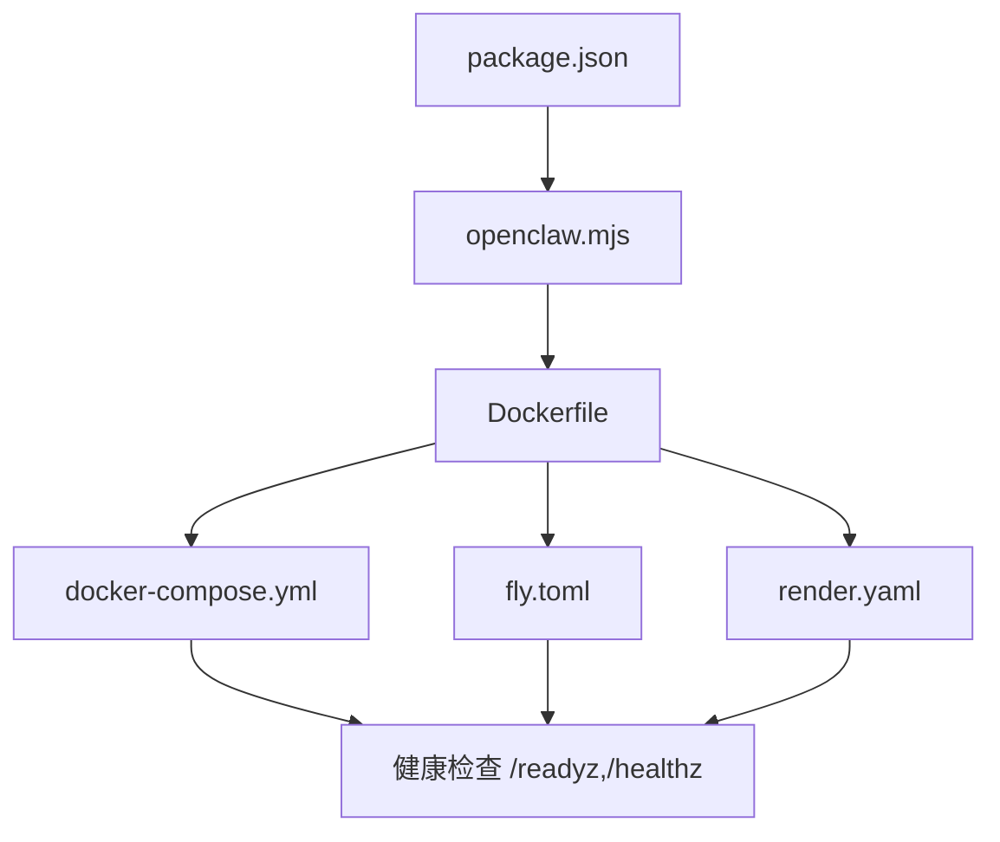
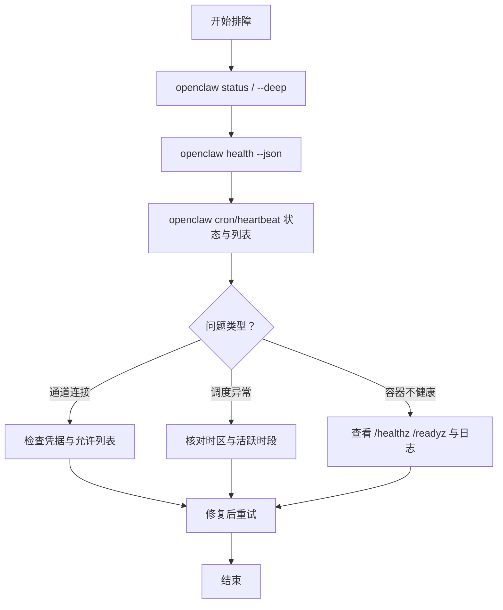

# 部署与运维

<cite>
**本文引用的文件**
- [README.md](file://README.md)
- [Dockerfile](file://Dockerfile)
- [docker-compose.yml](file://docker-compose.yml)
- [package.json](file://package.json)
- [fly.toml](file://fly.toml)
- [render.yaml](file://render.yaml)
- [openclaw.podman.env](file://openclaw.podman.env)
- [scripts/run-openclaw-podman.sh](file://scripts/run-openclaw-podman.sh)
- [docs/install/docker.md](file://docs/install/docker.md)
- [docs/install/nix.md](file://docs/install/nix.md)
- [docs/install/installer.md](file://docs/install/installer.md)
- [docs/install/updating.md](file://docs/install/updating.md)
- [docs/install/migrating.md](file://docs/install/migrating.md)
- [docs/gateway/health.md](file://docs/gateway/health.md)
- [docs/automation/troubleshooting.md](file://docs/automation/troubleshooting.md)
</cite>

## 目录
1. [简介](#简介)
2. [项目结构](#项目结构)
3. [核心组件](#核心组件)
4. [架构总览](#架构总览)
5. [详细组件分析](#详细组件分析)
6. [依赖关系分析](#依赖关系分析)
7. [性能考量](#性能考量)
8. [故障排查指南](#故障排查指南)
9. [结论](#结论)
10. [附录](#附录)

## 简介
本指南面向运维工程师与平台工程团队，围绕 OpenClaw 的多种部署与运维实践提供系统化说明。内容覆盖容器化（Docker/Podman）、声明式安装（Nix）、传统安装（脚本）等部署路径；并给出健康检查、自动化运维、备份恢复、升级迁移、容量规划、安全加固与高可用建议，帮助在开发、测试与生产环境中稳定运行 OpenClaw。

## 项目结构
OpenClaw 提供多条安装与运行路径：本地脚本安装、容器镜像、云平台编排与声明式包管理。仓库中包含：
- 容器构建与编排：Dockerfile、docker-compose.yml、Fly.io 与 Render 平台配置
- 运行时与打包：package.json 中的二进制入口与脚本
- 部署与运维文档：安装、更新、迁移、健康检查与自动化排障
- Podman 运行脚本与示例环境变量文件

图示来源
- [Dockerfile:1-231](file://Dockerfile#L1-L231)
- [docker-compose.yml:1-77](file://docker-compose.yml#L1-L77)
- [package.json:1-465](file://package.json#L1-L465)
- [fly.toml:1-35](file://fly.toml#L1-L35)
- [render.yaml:1-22](file://render.yaml#L1-L22)
- [openclaw.podman.env:1-25](file://openclaw.podman.env#L1-L25)
- [scripts/run-openclaw-podman.sh:1-232](file://scripts/run-openclaw-podman.sh#L1-L232)
- [docs/install/docker.md:1-800](file://docs/install/docker.md#L1-L800)
- [docs/install/nix.md:1-99](file://docs/install/nix.md#L1-L99)
- [docs/install/installer.md:1-406](file://docs/install/installer.md#L1-L406)
- [docs/gateway/health.md:1-36](file://docs/gateway/health.md#L1-L36)
- [docs/automation/troubleshooting.md:1-123](file://docs/automation/troubleshooting.md#L1-L123)

章节来源
- [README.md:1-560](file://README.md#L1-L560)
- [package.json:1-465](file://package.json#L1-L465)

## 核心组件
- 容器镜像与健康探针
  - Dockerfile 定义多阶段构建、非 root 用户运行、内置健康检查端点与可选浏览器/沙箱依赖安装参数
  - docker-compose.yml 提供网关与 CLI 服务编排、卷挂载与健康检查
- 云平台编排
  - fly.toml：Fly.io 平台的镜像、进程、HTTP 服务与磁盘挂载
  - render.yaml：Render 平台的容器服务、环境变量与持久化磁盘
- Podman 运行与环境
  - scripts/run-openclaw-podman.sh：Podman 一键启动、生成令牌、最小化配置与 SELinux 绑定处理
  - openclaw.podman.env：Podman 环境变量模板
- 传统安装与脚本
  - docs/install/installer.md：install.sh/install-cli.sh/install.ps1 的行为、标志与自动化用法
- 运维与排障
  - docs/gateway/health.md：健康检查命令与常见问题定位
  - docs/automation/troubleshooting.md：定时任务与心跳自动化排障流程

章节来源
- [Dockerfile:1-231](file://Dockerfile#L1-L231)
- [docker-compose.yml:1-77](file://docker-compose.yml#L1-L77)
- [fly.toml:1-35](file://fly.toml#L1-L35)
- [render.yaml:1-22](file://render.yaml#L1-L22)
- [openclaw.podman.env:1-25](file://openclaw.podman.env#L1-L25)
- [scripts/run-openclaw-podman.sh:1-232](file://scripts/run-openclaw-podman.sh#L1-L232)
- [docs/install/installer.md:1-406](file://docs/install/installer.md#L1-L406)
- [docs/gateway/health.md:1-36](file://docs/gateway/health.md#L1-L36)
- [docs/automation/troubleshooting.md:1-123](file://docs/automation/troubleshooting.md#L1-L123)

## 架构总览
下图展示 OpenClaw 在不同部署形态下的运行架构与交互关系。

图示来源
- [README.md:180-238](file://README.md#L180-L238)
- [Dockerfile:224-231](file://Dockerfile#L224-L231)
- [docker-compose.yml:1-77](file://docker-compose.yml#L1-L77)
- [fly.toml:1-35](file://fly.toml#L1-L35)
- [render.yaml:1-22](file://render.yaml#L1-L22)

## 详细组件分析

### Docker 部署
- 适用场景
  - 需要隔离的网关运行环境、快速验证或 CI 场景
  - 需要通过 docker-compose 同时运行 CLI 与网关服务
- 关键特性
  - 多阶段构建与非 root 用户运行，降低攻击面
  - 内置健康检查端点 /healthz 与 /readyz
  - 可选安装 Playwright 浏览器与 Docker CLI，支持沙箱容器
  - 支持扩展 apt 包、预装扩展依赖、安装 Chromium 以减少冷启动开销
- 常见参数
  - OPENCLAW_IMAGE：使用远程镜像替代本地构建
  - OPENCLAW_DOCKER_APT_PACKAGES：构建期安装系统依赖
  - OPENCLAW_EXTENSIONS：预装扩展依赖
  - OPENCLAW_SANDBOX：启用沙箱引导（需镜像含 Docker CLI）
  - OPENCLAW_INSTALL_DOCKER_CLI：在镜像内安装 Docker CLI
  - OPENCLAW_EXTRA_MOUNTS / OPENCLAW_HOME_VOLUME：持久化与额外挂载
- 注意事项
  - 默认绑定 loopback，桥接网络映射端口时需设置认证与 bind 模式
  - 沙箱需要主机 Docker Socket 或镜像内 Docker CLI

图示来源
- [docs/install/docker.md:35-230](file://docs/install/docker.md#L35-L230)
- [docker-compose.yml:1-77](file://docker-compose.yml#L1-L77)
- [Dockerfile:224-231](file://Dockerfile#L224-L231)

章节来源
- [docs/install/docker.md:1-800](file://docs/install/docker.md#L1-L800)
- [docker-compose.yml:1-77](file://docker-compose.yml#L1-L77)
- [Dockerfile:1-231](file://Dockerfile#L1-L231)

### Podman 部署
- 适用场景
  - 需要 rootless 容器运行、简化权限与 SELinux 策略
  - 作为 systemd/Quadlet 用户服务长期运行
- 关键特性
  - 自动生成网关令牌并写入 .env
  - 创建最小化 openclaw.json（gateway.mode=local）
  - 支持 keep-id/host 用户命名空间策略
  - 自动处理 SELinux 上下文标签（:Z）
  - 支持按需运行 onboard 与 gateway
- 常见参数
  - OPENCLAW_PODMAN_ENV：环境变量文件路径
  - OPENCLAW_GATEWAY_BIND：默认 loopback
  - OPENCLAW_PODMAN_USERNS：用户命名空间策略
  - OPENCLAW_PODMAN_IMAGE：镜像名
  - OPENCLAW_PODMAN_PULL：拉取策略
  - OPENCLAW_CONFIG_DIR / OPENCLAW_WORKSPACE_DIR：挂载目录

图示来源
- [scripts/run-openclaw-podman.sh:105-232](file://scripts/run-openclaw-podman.sh#L105-L232)
- [openclaw.podman.env:1-25](file://openclaw.podman.env#L1-L25)

章节来源
- [scripts/run-openclaw-podman.sh:1-232](file://scripts/run-openclaw-podman.sh#L1-L232)
- [openclaw.podman.env:1-25](file://openclaw.podman.env#L1-L25)

### 云平台部署（Fly.io / Render）
- Fly.io
  - 使用 Dockerfile 构建镜像，内部端口 3000，强制 HTTPS，持久化磁盘挂载到 /data
  - 通过环境变量控制内存与 Node 选项
- Render
  - 容器服务，健康检查路径 /health，持久化磁盘挂载到 /data
  - 环境变量包括端口、随机令牌、状态目录与工作区目录

图示来源
- [fly.toml:1-35](file://fly.toml#L1-L35)
- [render.yaml:1-22](file://render.yaml#L1-L22)

章节来源
- [fly.toml:1-35](file://fly.toml#L1-L35)
- [render.yaml:1-22](file://render.yaml#L1-L22)

### 传统安装（脚本）
- install.sh：推荐的交互式安装脚本，支持 npm/git 安装方法、版本选择、跳过引导等
- install-cli.sh：将 Node 与 OpenClaw 安装到本地前缀，适合无系统 Node 的环境
- install.ps1：Windows 平台安装脚本，支持 npm/git 安装与调试追踪

图示来源
- [docs/install/installer.md:61-324](file://docs/install/installer.md#L61-L324)

章节来源
- [docs/install/installer.md:1-406](file://docs/install/installer.md#L1-L406)

### Nix 声明式安装
- 通过 nix-openclaw 模块实现可复现、可回滚的安装与服务管理
- Nix 模式下禁用自动安装与自更新，强调确定性与可审计性
- 推荐在 macOS 上通过 defaults 设置开启 Nix 模式

章节来源
- [docs/install/nix.md:1-99](file://docs/install/nix.md#L1-L99)

## 依赖关系分析
- 运行时与入口
  - package.json 定义二进制入口 openclaw 指向 openclaw.mjs，并提供大量脚本用于构建、测试与 UI 打包
- 容器镜像与运行参数
  - Dockerfile 将 Node 22-bookworm 作为基础镜像，内置健康检查与非 root 用户运行
  - docker-compose.yml 映射端口、挂载配置与工作区、提供健康检查
- 云平台配置
  - fly.toml 与 render.yaml 分别定义平台特定的镜像、端口、健康检查与持久化

图示来源
- [package.json:1-465](file://package.json#L1-L465)
- [Dockerfile:224-231](file://Dockerfile#L224-L231)
- [docker-compose.yml:38-49](file://docker-compose.yml#L38-L49)
- [fly.toml:20-26](file://fly.toml#L20-L26)
- [render.yaml:6-10](file://render.yaml#L6-L10)

章节来源
- [package.json:1-465](file://package.json#L1-L465)
- [Dockerfile:1-231](file://Dockerfile#L1-L231)
- [docker-compose.yml:1-77](file://docker-compose.yml#L1-L77)
- [fly.toml:1-35](file://fly.toml#L1-L35)
- [render.yaml:1-22](file://render.yaml#L1-L22)

## 性能考量
- 容器镜像层缓存与构建优化
  - 将依赖安装置于独立层，避免频繁重建
  - 使用 pnpm 与 Corepack，减少安装时间与磁盘占用
- 运行时内存与并发
  - fly.toml 中设置 NODE_OPTIONS 与内存大小，避免 OOM
  - 渲染服务计划 starter，结合实际负载评估
- 浏览器与媒体
  - 预装 Playwright 浏览器可减少首次启动延迟
  - 媒体与会话日志可能成为磁盘增长热点，建议定期清理与归档

章节来源
- [Dockerfile:56-90](file://Dockerfile#L56-L90)
- [fly.toml:10-16](file://fly.toml#L10-L16)
- [docs/install/docker.md:350-436](file://docs/install/docker.md#L350-L436)

## 故障排查指南
- 健康检查
  - 使用 openclaw status / health --json 获取网关与通道状态快照
  - 容器内 /healthz /readyz 作为轻量存活与就绪探针
- 自动化排障
  - cron 与 heartbeat 的状态、列表与最近运行记录
  - 时间区域与活跃时段配置对调度的影响
- 更新与回滚
  - 使用 openclaw update 与 doctor 进行安全更新
  - 全局安装可通过固定版本回滚，源码安装可按日期回退
- 迁移
  - 复制状态目录与工作区，确保文件权限正确
  - 注意 profile 与 state 目录一致性

图示来源
- [docs/gateway/health.md:1-36](file://docs/gateway/health.md#L1-L36)
- [docs/automation/troubleshooting.md:1-123](file://docs/automation/troubleshooting.md#L1-L123)

章节来源
- [docs/gateway/health.md:1-36](file://docs/gateway/health.md#L1-L36)
- [docs/automation/troubleshooting.md:1-123](file://docs/automation/troubleshooting.md#L1-L123)
- [docs/install/updating.md:1-258](file://docs/install/updating.md#L1-L258)
- [docs/install/migrating.md:1-193](file://docs/install/migrating.md#L1-L193)

## 结论
OpenClaw 提供从本地脚本到容器、云平台与声明式安装的多样化部署路径。结合内置健康检查、自动化排障与更新迁移机制，可在开发与生产环境中实现稳定、可观测与可演进的运维体系。建议在生产中优先采用容器化或云平台编排，并配合 Nix 实现可复现与可审计的发布流程。

## 附录
- 最佳实践清单
  - 生产环境使用非 root 镜像与最小权限原则
  - 为容器与云平台配置健康检查与自动重启策略
  - 对状态目录与工作区进行定期备份与容量监控
  - 使用 Nix 或容器镜像锁定依赖版本，避免漂移
  - 通过 fly.toml/render.yaml 等平台配置启用 HTTPS 与持久化存储
- 安全加固建议
  - 限制容器网络与 Capabilities，启用只读根文件系统
  - 使用平台提供的密钥管理与环境变量注入
  - 严格控制 Dashboard 与通道访问白名单
- 高可用与扩展
  - 通过云平台多实例与负载均衡提升可用性
  - 使用沙箱隔离非主会话工具执行，降低风险面