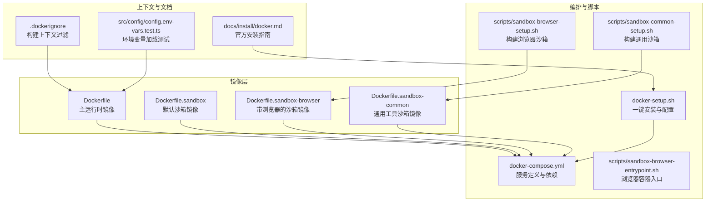
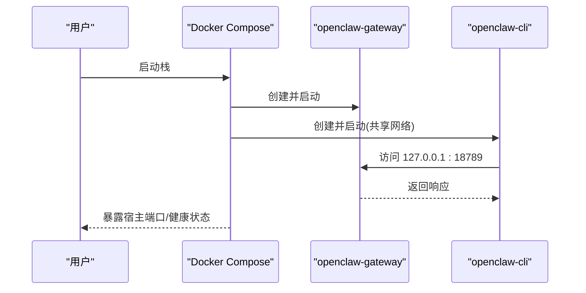
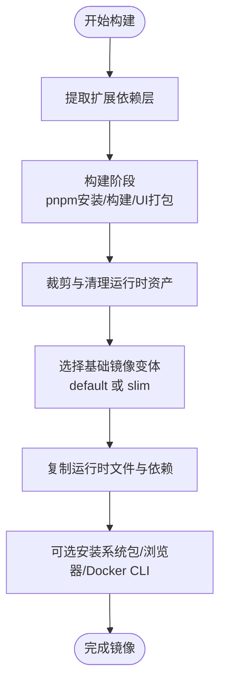
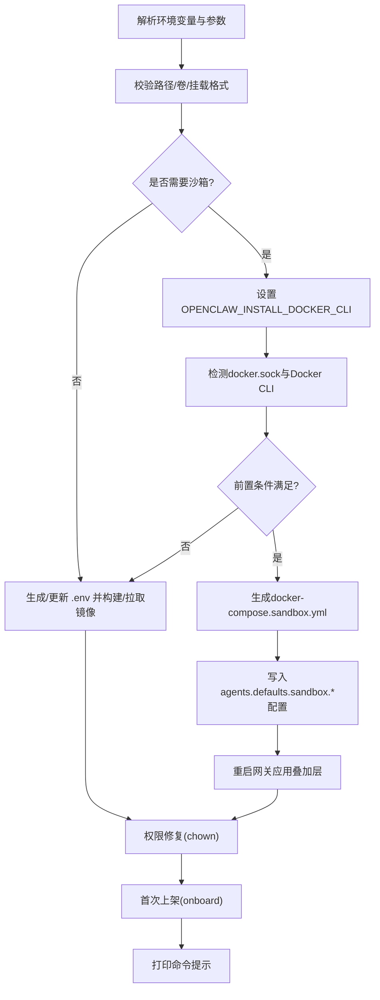
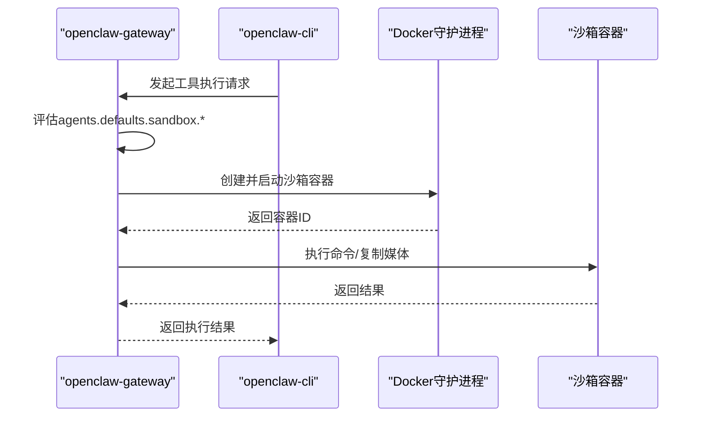
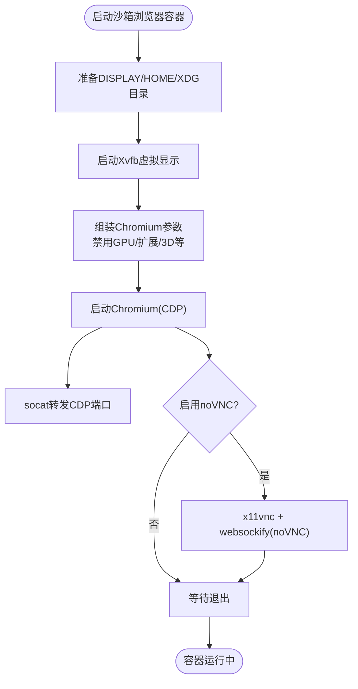
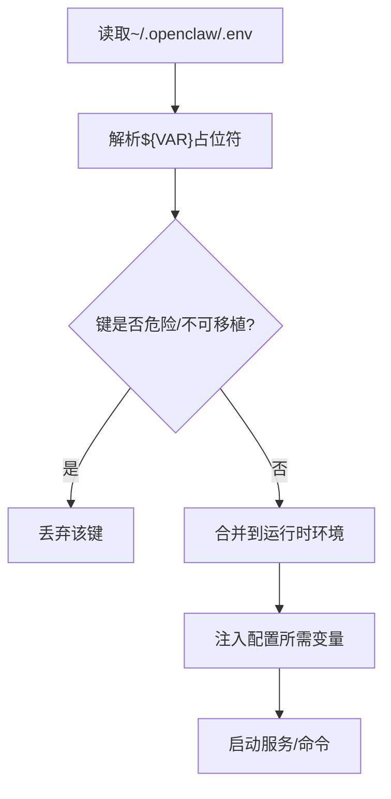
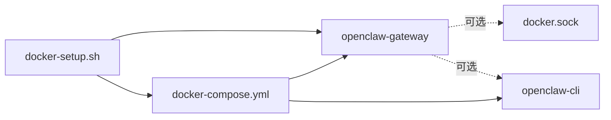

# Docker容器化部署

<cite>
**本文引用的文件**
- [Dockerfile](file://Dockerfile)
- [docker-compose.yml](file://docker-compose.yml)
- [.dockerignore](file://.dockerignore)
- [docker-setup.sh](file://docker-setup.sh)
- [Dockerfile.sandbox](file://Dockerfile.sandbox)
- [Dockerfile.sandbox-browser](file://Dockerfile.sandbox-browser)
- [Dockerfile.sandbox-common](file://Dockerfile.sandbox-common)
- [scripts/sandbox-browser-entrypoint.sh](file://scripts/sandbox-browser-entrypoint.sh)
- [scripts/sandbox-browser-setup.sh](file://scripts/sandbox-browser-setup.sh)
- [scripts/sandbox-common-setup.sh](file://scripts/sandbox-common-setup.sh)
- [docs/install/docker.md](file://docs/install/docker.md)
- [src/config/config.env-vars.test.ts](file://src/config/config.env-vars.test.ts)
</cite>

## 目录
1. [简介](#简介)
2. [项目结构](#项目结构)
3. [核心组件](#核心组件)
4. [架构总览](#架构总览)
5. [详细组件分析](#详细组件分析)
6. [依赖分析](#依赖分析)
7. [性能考虑](#性能考虑)
8. [故障排除指南](#故障排除指南)
9. [结论](#结论)
10. [附录](#附录)

## 简介
本技术文档面向在Docker环境中部署OpenClaw的用户与运维工程师，系统性阐述容器编排、镜像构建、环境变量、网络与安全、存储持久化、健康检查以及代理与浏览器沙箱的Docker实现。文档同时覆盖Docker Compose服务间依赖关系、端口映射与数据卷挂载策略，并提供安装步骤、参数说明、故障排除、性能优化与安全加固建议。

## 项目结构
围绕Docker部署的关键文件与目录如下：
- 镜像构建：Dockerfile（主运行时镜像）、Dockerfile.sandbox（默认沙箱镜像）、Dockerfile.sandbox-browser（带浏览器的沙箱镜像）、Dockerfile.sandbox-common（通用工具沙箱镜像）
- 编排与运行：docker-compose.yml、docker-setup.sh（一键安装脚本）
- 构建上下文与忽略规则：.dockerignore
- 沙箱浏览器入口与构建脚本：scripts/sandbox-browser-entrypoint.sh、scripts/sandbox-browser-setup.sh、scripts/sandbox-common-setup.sh
- 官方安装文档：docs/install/docker.md
- 环境变量加载测试：src/config/config.env-vars.test.ts



**图表来源**
- [Dockerfile:1-231](file://Dockerfile#L1-L231)
- [docker-compose.yml:1-77](file://docker-compose.yml#L1-L77)
- [docker-setup.sh:1-598](file://docker-setup.sh#L1-L598)
- [Dockerfile.sandbox:1-24](file://Dockerfile.sandbox#L1-L24)
- [Dockerfile.sandbox-browser:1-35](file://Dockerfile.sandbox-browser#L1-L35)
- [Dockerfile.sandbox-common:1-48](file://Dockerfile.sandbox-common#L1-L48)
- [scripts/sandbox-browser-entrypoint.sh:1-128](file://scripts/sandbox-browser-entrypoint.sh#L1-L128)
- [scripts/sandbox-browser-setup.sh:1-8](file://scripts/sandbox-browser-setup.sh#L1-L8)
- [scripts/sandbox-common-setup.sh:1-55](file://scripts/sandbox-common-setup.sh#L1-L55)
- [.dockerignore:1-65](file://.dockerignore#L1-L65)
- [docs/install/docker.md:1-844](file://docs/install/docker.md#L1-L844)
- [src/config/config.env-vars.test.ts:1-134](file://src/config/config.env-vars.test.ts#L1-L134)

**章节来源**
- [Dockerfile:1-231](file://Dockerfile#L1-L231)
- [docker-compose.yml:1-77](file://docker-compose.yml#L1-L77)
- [docker-setup.sh:1-598](file://docker-setup.sh#L1-L598)
- [.dockerignore:1-65](file://.dockerignore#L1-L65)
- [docs/install/docker.md:1-844](file://docs/install/docker.md#L1-L844)

## 核心组件
- 主运行时镜像（Gateway）：基于Node 22 Debian Bookworm，非root用户运行，内置健康检查，支持可选安装Playwright浏览器与Docker CLI以启用代理沙箱。
- Docker Compose编排：定义openclaw-gateway与openclaw-cli两个服务，前者暴露网关端口并提供健康检查；后者通过共享网络模式访问前者。
- 一键安装脚本：自动构建/拉取镜像、生成或复用网关令牌、引导首次上架、可选启用代理沙箱（挂载docker.sock并写入沙箱配置）。
- 沙箱镜像体系：默认沙箱镜像、带浏览器的沙箱镜像、通用工具沙箱镜像，分别满足不同执行场景的安全隔离与工具需求。
- 浏览器沙箱：通过Xvfb虚拟显示、Chromium远程调试协议（CDP）与可选noVNC观察，提供可控的无头/有头浏览体验。

**章节来源**
- [Dockerfile:103-231](file://Dockerfile#L103-L231)
- [docker-compose.yml:1-77](file://docker-compose.yml#L1-L77)
- [docker-setup.sh:413-598](file://docker-setup.sh#L413-L598)
- [Dockerfile.sandbox:1-24](file://Dockerfile.sandbox#L1-L24)
- [Dockerfile.sandbox-browser:1-35](file://Dockerfile.sandbox-browser#L1-L35)
- [Dockerfile.sandbox-common:1-48](file://Dockerfile.sandbox-common#L1-L48)
- [scripts/sandbox-browser-entrypoint.sh:1-128](file://scripts/sandbox-browser-entrypoint.sh#L1-L128)

## 架构总览
下图展示Docker部署的整体架构：主容器运行网关与CLI，可选地挂载docker.sock以启用代理沙箱；浏览器沙箱通过独立容器提供可控的浏览能力。

```mermaid
graph TB
subgraph "宿主机"
U["用户浏览器/CLI"]
S["Docker守护进程"]
end
subgraph "Docker网络"
GW["openclaw-gateway<br/>18789/tcp, 18790/tcp"]
CLI["openclaw-cli<br/>共享网络: openclaw-gateway"]
SB["沙箱容器组<br/>默认/浏览器/通用镜像"]
end
U --> |"HTTP/WS"| GW
CLI --> |"127.0.0.1:18789"| GW
GW -. 可选: docker.sock .-> S
GW --> SB
SB -. 可选: 浏览器容器 .->|"CDP/noVNC"| U
```

**图表来源**
- [docker-compose.yml:1-77](file://docker-compose.yml#L1-L77)
- [Dockerfile.sandbox-browser:1-35](file://Dockerfile.sandbox-browser#L1-L35)
- [scripts/sandbox-browser-entrypoint.sh:1-128](file://scripts/sandbox-browser-entrypoint.sh#L1-L128)

## 详细组件分析

### 组件A：Docker Compose编排与服务依赖
- openclaw-gateway
  - 端口映射：默认将宿主端口映射到容器的18789（网关）与18790（桥接通道），可通过环境变量覆盖。
  - 健康检查：内置探针GET /healthz（别名/health），用于容器编排健康状态判断。
  - 数据卷：挂载配置目录与工作区目录，支持命名卷或绑定挂载。
  - 可选沙箱：当启用代理沙箱时，挂载docker.sock并加入docker组GID。
- openclaw-cli
  - 共享网络：network_mode: service:openclaw-gateway，确保对网关的本地回环访问。
  - 权限限制：丢弃NET_RAW/NET_ADMIN并启用no-new-privileges，降低被利用面。
  - 交互性：stdin_open与tty开启，便于交互式命令行。



**图表来源**
- [docker-compose.yml:1-77](file://docker-compose.yml#L1-L77)

**章节来源**
- [docker-compose.yml:1-77](file://docker-compose.yml#L1-L77)

### 组件B：主运行时镜像构建（Dockerfile）
- 多阶段构建：分离扩展依赖提取、构建与运行时资产，最终产出精简运行时镜像。
- 运行时变体：支持默认与Slim两种基础镜像（bookworm与bookworm-slim），通过OPENCLAW_VARIANT切换。
- 系统包安装：可按需安装额外apt包（OPENCLAW_DOCKER_APT_PACKAGES），或预装Chromium与Playwright浏览器（OPENCLAW_INSTALL_BROWSER）。
- Docker CLI支持：可选安装docker-ce-cli与compose插件（OPENCLAW_INSTALL_DOCKER_CLI），用于代理沙箱。
- 安全加固：非root用户运行（node:1000），内置健康检查探针。
- 命令入口：默认启动网关，允许未配置模式（--allow-unconfigured）。



**图表来源**
- [Dockerfile:27-231](file://Dockerfile#L27-L231)

**章节来源**
- [Dockerfile:1-231](file://Dockerfile#L1-L231)

### 组件C：一键安装与配置（docker-setup.sh）
- 参数校验与默认值：对配置目录、工作区目录、命名卷名称、额外挂载格式进行严格校验。
- 环境变量管理：自动生成/复用网关令牌，写入根目录.env；支持从配置文件或.env读取令牌。
- 首次上架：调用CLI onboard，固定gateway.mode=local与gateway.bind=lan。
- 沙箱启用流程：检测docker.sock存在与Docker CLI可用性，必要时自动设置OPENCLAW_INSTALL_DOCKER_CLI；生成docker-compose.sandbox.yml叠加层，挂载docker.sock并添加组GID；写入agents.defaults.sandbox.*配置后重启网关。
- 权限修复：使用root容器短暂修正挂载目录属主，避免EACCES。
- 命令提示：输出日志、健康检查与仪表盘访问命令。



**图表来源**
- [docker-setup.sh:1-598](file://docker-setup.sh#L1-L598)

**章节来源**
- [docker-setup.sh:1-598](file://docker-setup.sh#L1-L598)

### 组件D：代理沙箱隔离（基于Docker）
- 启用方式：通过docker-setup.sh在openclaw-gateway中挂载/var/run/docker.sock并写入agents.defaults.sandbox.*配置。
- 配置要点：默认非主会话执行进入沙箱，作用域可按agent或session划分，工作区访问可设为none/ro/rw，网络默认none，capDrop ALL，内存/CPU/ulimit等硬限制可配。
- 重建策略：当沙箱配置或setupCommand变化且容器近期使用过时，自动重建；否则提示精确重建命令。
- 注意事项：scope=shared会关闭跨会话隔离；不支持host网络与container:<id>网络连接（除非显式允许）。



**图表来源**
- [docker-setup.sh:509-575](file://docker-setup.sh#L509-L575)
- [docs/install/docker.md:545-670](file://docs/install/docker.md#L545-L670)

**章节来源**
- [docker-setup.sh:479-575](file://docker-setup.sh#L479-L575)
- [docs/install/docker.md:545-670](file://docs/install/docker.md#L545-L670)

### 组件E：浏览器沙箱（带Xvfb/CDP/noVNC）
- 默认镜像：Dockerfile.sandbox-browser安装Chromium、Xvfb、novnc、x11vnc、socat等。
- 入口脚本：scripts/sandbox-browser-entrypoint.sh负责：
  - 设置DISPLAY与用户目录
  - 启动Xvfb
  - 配置Chromium参数（可禁用GPU/扩展/3D等以提升安全性）
  - 启动Chromium并通过socat将CDP端口映射到宿主
  - 可选启用noVNC（密码保护），提供远程观察
- 端口暴露：默认暴露9222（CDP）、5900（VNC）、6080（noVNC），可通过环境变量调整。
- 使用方式：在agents.defaults.sandbox.browser中启用并指定镜像，工具调用将获得控制URL与可选noVNC地址。



**图表来源**
- [Dockerfile.sandbox-browser:1-35](file://Dockerfile.sandbox-browser#L1-L35)
- [scripts/sandbox-browser-entrypoint.sh:1-128](file://scripts/sandbox-browser-entrypoint.sh#L1-L128)

**章节来源**
- [Dockerfile.sandbox-browser:1-35](file://Dockerfile.sandbox-browser#L1-L35)
- [scripts/sandbox-browser-entrypoint.sh:1-128](file://scripts/sandbox-browser-entrypoint.sh#L1-L128)
- [scripts/sandbox-browser-setup.sh:1-8](file://scripts/sandbox-browser-setup.sh#L1-L8)
- [docs/install/docker.md:702-789](file://docs/install/docker.md#L702-L789)

### 组件F：环境变量与配置注入
- 环境变量加载：支持从~/.openclaw/.env加载变量并进行${VAR}替换，避免危险键（如HOME、SHELL等）污染进程环境。
- 配置注入：在容器内按需将配置中的环境变量注入，但不会覆盖已存在的同名变量。
- Docker集成：docker-setup.sh在生成.env时处理换行符与空值，确保令牌正确写入。



**图表来源**
- [src/config/config.env-vars.test.ts:1-134](file://src/config/config.env-vars.test.ts#L1-L134)
- [docker-setup.sh:358-411](file://docker-setup.sh#L358-L411)

**章节来源**
- [src/config/config.env-vars.test.ts:1-134](file://src/config/config.env-vars.test.ts#L1-L134)
- [docker-setup.sh:358-411](file://docker-setup.sh#L358-L411)

## 依赖分析
- 组件耦合
  - docker-compose.yml将openclaw-cli与openclaw-gateway耦合在同一网络，CLI通过127.0.0.1访问网关，形成强内聚弱耦合的服务边界。
  - 代理沙箱依赖docker.sock与Docker CLI，二者由docker-setup.sh在满足前提后才挂载/启用。
- 外部依赖
  - Docker守护进程（宿主）与Docker Compose v2
  - 可选：Playwright浏览器缓存目录（持久化建议）
- 循环依赖
  - 无直接循环依赖；沙箱启用通过叠加compose文件实现，避免直接耦合。



**图表来源**
- [docker-compose.yml:1-77](file://docker-compose.yml#L1-L77)
- [docker-setup.sh:509-575](file://docker-setup.sh#L509-L575)

**章节来源**
- [docker-compose.yml:1-77](file://docker-compose.yml#L1-L77)
- [docker-setup.sh:509-575](file://docker-setup.sh#L509-L575)

## 性能考虑
- 镜像构建
  - 将依赖层置于变更频率低的指令前，减少不必要的pnpm install重跑。
  - 使用多阶段构建与裁剪，减小镜像体积与攻击面。
- 运行时
  - 通过OPENCLAW_DOCKER_APT_PACKAGES在构建期固化系统依赖，避免容器内重复安装。
  - 若频繁使用浏览器，建议在构建期安装Chromium与Playwright，配合持久化缓存目录以避免每次启动下载。
- 资源限制
  - 在agents.defaults.sandbox.docker中设置memory、cpus、ulimits等，防止资源争用。
- I/O与磁盘
  - 关注media/会话日志/转录文件等热点目录，合理规划卷与归档策略。

[本节为通用指导，无需特定文件引用]

## 故障排除指南
- 健康检查失败
  - 使用内置/healthz与/readyz探针验证容器状态；若持续失败，检查网关日志与端口映射。
- 权限错误（EACCES）
  - 确保挂载的配置与工作区目录属主为uid 1000（容器内node用户）；docker-setup.sh会自动修复。
- 网络访问异常
  - Docker Compose默认lan绑定，确保宿主端口映射正确；如需外部访问，需调整bind与认证。
- 沙箱无法启动
  - 确认Docker CLI可用（docker --version）与docker.sock存在；检查compose叠加层是否生效。
- 浏览器沙箱问题
  - 检查Xvfb/VNC/noVNC端口映射；必要时调整Chromium参数（禁用GPU/扩展等）以适配目标站点。
- 环境变量冲突
  - 避免在配置中注入危险键；确认~/.openclaw/.env加载顺序与占位符替换行为。

**章节来源**
- [docs/install/docker.md:469-538](file://docs/install/docker.md#L469-L538)
- [docker-setup.sh:430-445](file://docker-setup.sh#L430-L445)
- [scripts/sandbox-browser-entrypoint.sh:1-128](file://scripts/sandbox-browser-entrypoint.sh#L1-L128)

## 结论
通过Docker与Docker Compose，OpenClaw实现了可复现、可隔离、可扩展的容器化部署。主运行时镜像强调安全与最小化，编排层提供清晰的服务边界与健康检查，一键安装脚本自动化了配置、权限与沙箱启用流程。结合代理沙箱与浏览器沙箱，系统在保证安全性的同时提供了灵活的工具执行与浏览能力。建议在生产环境中启用持久化卷、严格的资源限制与最小权限原则，并定期更新基础镜像与系统包。

[本节为总结，无需特定文件引用]

## 附录

### A. 安装步骤（推荐）
- 一键安装
  - 在仓库根目录执行：./docker-setup.sh
  - 支持通过环境变量定制：OPENCLAW_IMAGE、OPENCLAW_DOCKER_APT_PACKAGES、OPENCLAW_EXTENSIONS、OPENCLAW_EXTRA_MOUNTS、OPENCLAW_HOME_VOLUME、OPENCLAW_SANDBOX、OPENCLAW_INSTALL_DOCKER_CLI等。
- 手动流程
  - 构建镜像：docker build -t openclaw:local -f Dockerfile .
  - 首次上架：docker compose run --rm openclaw-cli onboard
  - 启动网关：docker compose up -d openclaw-gateway

**章节来源**
- [docs/install/docker.md:35-231](file://docs/install/docker.md#L35-L231)
- [docker-setup.sh:413-428](file://docker-setup.sh#L413-L428)

### B. 环境变量与端口映射
- 环境变量（示例）
  - OPENCLAW_GATEWAY_TOKEN：网关令牌（未设置时自动生成）
  - OPENCLAW_GATEWAY_BIND：网关绑定模式（默认lan）
  - OPENCLAW_GATEWAY_PORT/OPENCLAW_BRIDGE_PORT：宿主端口映射
  - OPENCLAW_CONFIG_DIR/OPENCLAW_WORKSPACE_DIR：配置与工作区挂载路径
  - OPENCLAW_ALLOW_INSECURE_PRIVATE_WS：允许私有ws目标（谨慎使用）
  - OPENCLAW_INSTALL_DOCKER_CLI：在镜像中安装Docker CLI（启用沙箱）
  - OPENCLAW_DOCKER_APT_PACKAGES：构建期安装apt包
  - OPENCLAW_EXTENSIONS：预安装扩展依赖
  - OPENCLAW_EXTRA_MOUNTS：逗号分隔的额外挂载
  - OPENCLAW_HOME_VOLUME：命名卷持久化/home/node
  - OPENCLAW_SANDBOX：启用代理沙箱
  - OPENCLAW_DOCKER_SOCKET：docker.sock路径
- 端口映射
  - 18789：网关HTTP/WS
  - 18790：桥接通道（如启用）

**章节来源**
- [docker-compose.yml:1-77](file://docker-compose.yml#L1-L77)
- [docker-setup.sh:216-227](file://docker-setup.sh#L216-L227)
- [docs/install/docker.md:59-116](file://docs/install/docker.md#L59-L116)

### C. 存储卷与持久化
- 配置与工作区
  - 绑定挂载：OPENCLAW_CONFIG_DIR -> /home/node/.openclaw
  - 绑定挂载：OPENCLAW_WORKSPACE_DIR -> /home/node/.openclaw/workspace
- 可选命名卷
  - OPENCLAW_HOME_VOLUME：持久化/home/node，可与额外挂载组合
- 浏览器缓存
  - 建议将PLAYWRIGHT_BROWSERS_PATH持久化至/home/node以避免重复下载

**章节来源**
- [docker-compose.yml:12-14](file://docker-compose.yml#L12-L14)
- [docker-setup.sh:258-345](file://docker-setup.sh#L258-L345)
- [docs/install/docker.md:385-391](file://docs/install/docker.md#L385-L391)

### D. 安全加固措施
- 非root运行：镜像默认以node用户运行
- 权限限制：openclaw-cli丢弃NET_RAW/NET_ADMIN并启用no-new-privileges
- 网络隔离：沙箱默认network:none，禁止host与container:<id>网络
- 能力与限制：capDrop ALL、pids/memory/cpu/ulimit限制
- Docker CLI最小暴露：仅在启用沙箱时挂载docker.sock并添加组GID

**章节来源**
- [Dockerfile:211-214](file://Dockerfile#L211-L214)
- [docker-compose.yml:54-58](file://docker-compose.yml#L54-L58)
- [docs/install/docker.md:591-670](file://docs/install/docker.md#L591-L670)