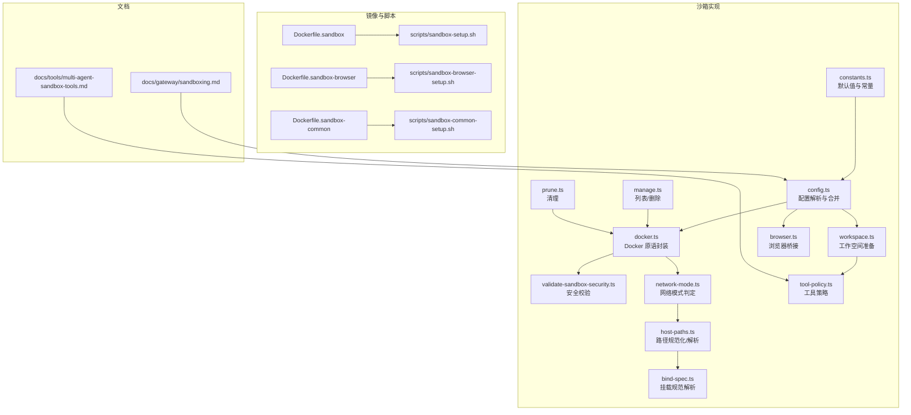
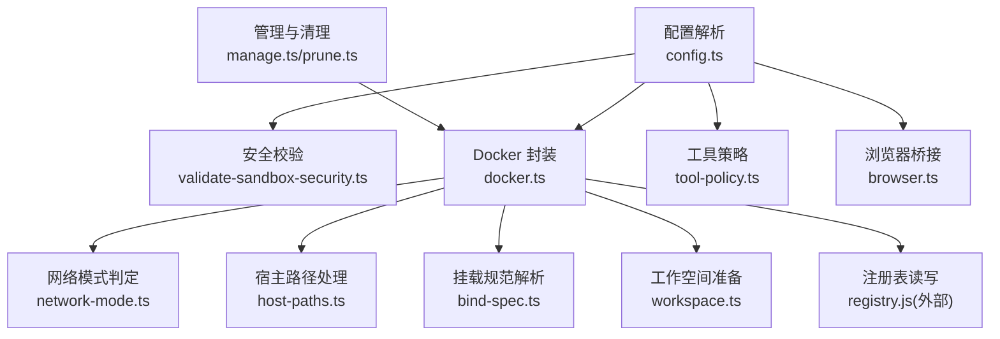
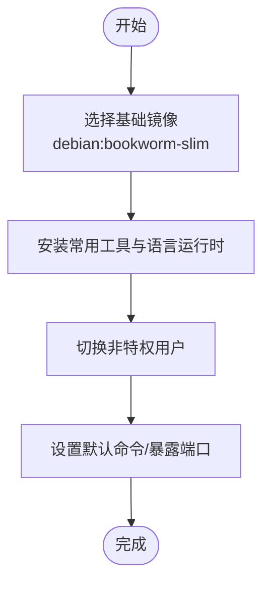
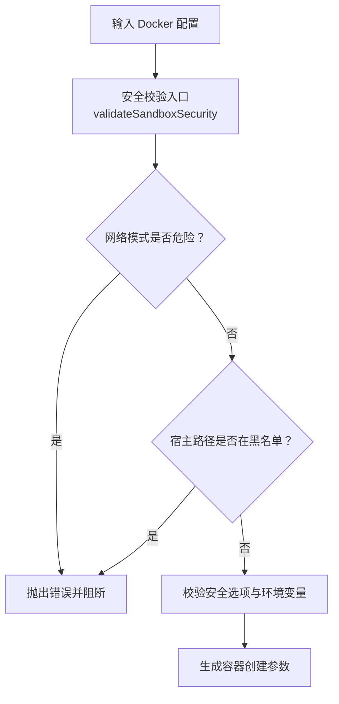
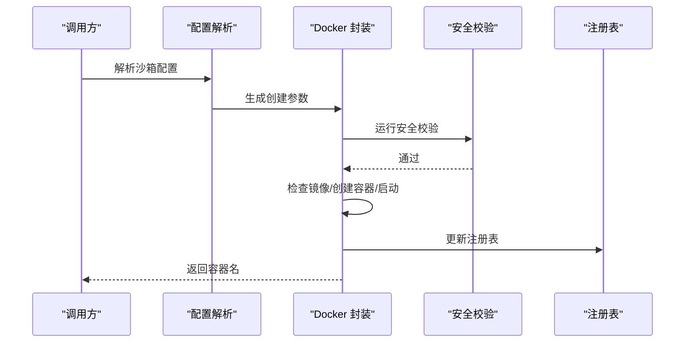
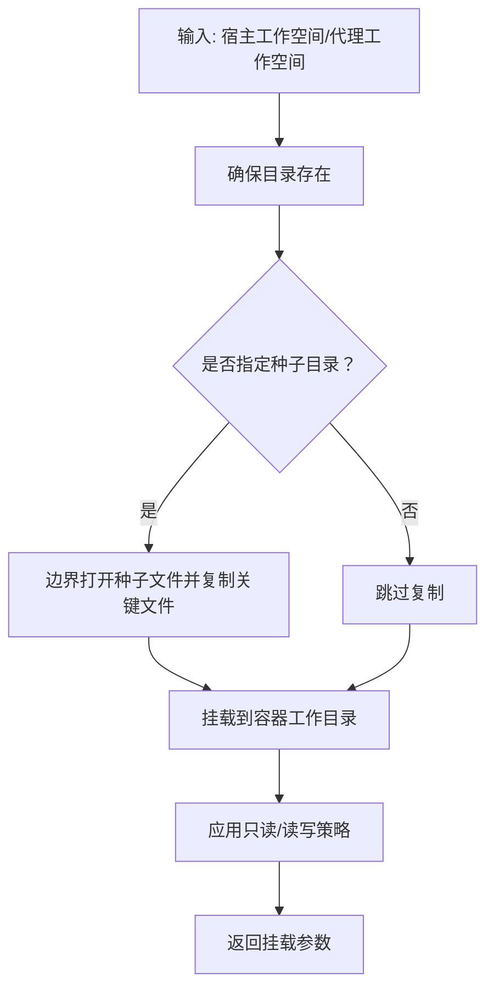
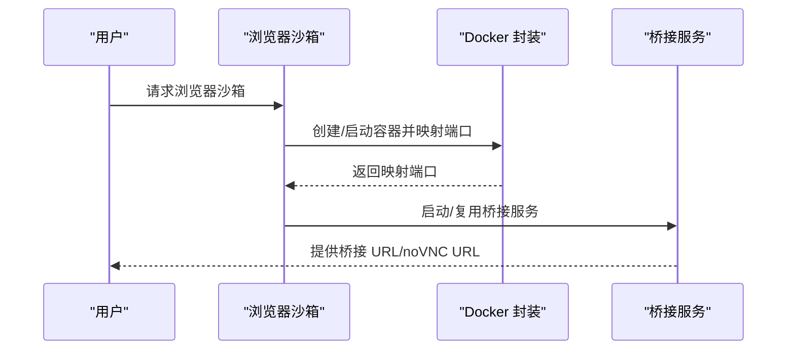
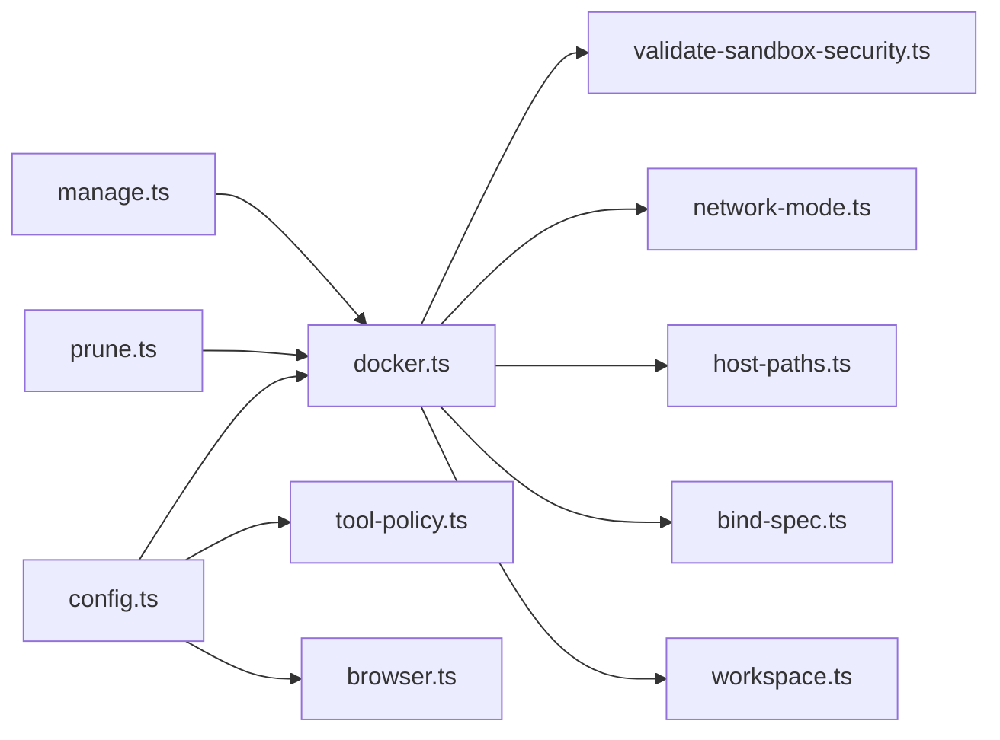

# 代理沙箱隔离

<cite>
**本文引用的文件**
- [Dockerfile.sandbox](file://Dockerfile.sandbox)
- [Dockerfile.sandbox-browser](file://Dockerfile.sandbox-browser)
- [Dockerfile.sandbox-common](file://Dockerfile.sandbox-common)
- [src/agents/sandbox/constants.ts](file://src/agents/sandbox/constants.ts)
- [src/agents/sandbox/network-mode.ts](file://src/agents/sandbox/network-mode.ts)
- [src/agents/sandbox/host-paths.ts](file://src/agents/sandbox/host-paths.ts)
- [src/agents/sandbox/bind-spec.ts](file://src/agents/sandbox/bind-spec.ts)
- [src/agents/sandbox/validate-sandbox-security.ts](file://src/agents/sandbox/validate-sandbox-security.ts)
- [src/agents/sandbox/docker.ts](file://src/agents/sandbox/docker.ts)
- [src/agents/sandbox/config.ts](file://src/agents/sandbox/config.ts)
- [src/agents/sandbox/workspace.ts](file://src/agents/sandbox/workspace.ts)
- [src/agents/sandbox/tool-policy.ts](file://src/agents/sandbox/tool-policy.ts)
- [src/agents/sandbox/manage.ts](file://src/agents/sandbox/manage.ts)
- [src/agents/sandbox/prune.ts](file://src/agents/sandbox/prune.ts)
- [src/agents/sandbox/browser.ts](file://src/agents/sandbox/browser.ts)
- [src/agents/sandbox/types.docker.ts](file://src/agents/sandbox/types.docker.ts)
- [docs/gateway/sandboxing.md](file://docs/gateway/sandboxing.md)
- [docs/tools/multi-agent-sandbox-tools.md](file://docs/tools/multi-agent-sandbox-tools.md)
- [scripts/sandbox-setup.sh](file://scripts/sandbox-setup.sh)
- [scripts/sandbox-browser-setup.sh](file://scripts/sandbox-browser-setup.sh)
- [scripts/sandbox-common-setup.sh](file://scripts/sandbox-common-setup.sh)
</cite>

## 目录
1. [简介](#简介)
2. [项目结构](#项目结构)
3. [核心组件](#核心组件)
4. [架构总览](#架构总览)
5. [详细组件分析](#详细组件分析)
6. [依赖关系分析](#依赖关系分析)
7. [性能考虑](#性能考虑)
8. [故障排查指南](#故障排查指南)
9. [结论](#结论)
10. [附录](#附录)

## 简介
本技术文档围绕代理沙箱隔离能力，系统阐述基于 Docker 的容器化执行环境、工具隔离机制与安全策略。内容覆盖沙箱容器生命周期管理、资源限制配置、网络隔离设置、文件系统权限控制、沙箱镜像构建、多代理配置、工具访问控制以及工作空间管理等关键主题，并提供调试方法、性能调优建议与安全加固措施。

## 项目结构
与沙箱相关的核心实现位于 src/agents/sandbox 目录，配套的 Docker 镜像构建脚本与 Dockerfile 位于仓库根目录及 scripts/ 目录。文档中还包含官方沙箱使用说明与多代理沙箱工具说明。

**图表来源**
- [src/agents/sandbox/constants.ts:1-55](file://src/agents/sandbox/constants.ts#L1-L55)
- [src/agents/sandbox/config.ts:1-217](file://src/agents/sandbox/config.ts#L1-L217)
- [src/agents/sandbox/docker.ts:1-568](file://src/agents/sandbox/docker.ts#L1-L568)
- [src/agents/sandbox/validate-sandbox-security.ts:1-306](file://src/agents/sandbox/validate-sandbox-security.ts#L1-L306)
- [src/agents/sandbox/network-mode.ts:1-29](file://src/agents/sandbox/network-mode.ts#L1-L29)
- [src/agents/sandbox/host-paths.ts:1-44](file://src/agents/sandbox/host-paths.ts#L1-L44)
- [src/agents/sandbox/bind-spec.ts:1-35](file://src/agents/sandbox/bind-spec.ts#L1-L35)
- [src/agents/sandbox/workspace.ts:1-66](file://src/agents/sandbox/workspace.ts#L1-L66)
- [src/agents/sandbox/tool-policy.ts:1-110](file://src/agents/sandbox/tool-policy.ts#L1-L110)
- [src/agents/sandbox/browser.ts:1-402](file://src/agents/sandbox/browser.ts#L1-L402)
- [src/agents/sandbox/manage.ts:1-107](file://src/agents/sandbox/manage.ts#L1-L107)
- [src/agents/sandbox/prune.ts:1-113](file://src/agents/sandbox/prune.ts#L1-L113)
- [Dockerfile.sandbox:1-24](file://Dockerfile.sandbox#L1-L24)
- [Dockerfile.sandbox-browser:1-35](file://Dockerfile.sandbox-browser#L1-L35)
- [Dockerfile.sandbox-common:1-48](file://Dockerfile.sandbox-common#L1-L48)
- [scripts/sandbox-setup.sh](file://scripts/sandbox-setup.sh)
- [scripts/sandbox-browser-setup.sh](file://scripts/sandbox-browser-setup.sh)
- [scripts/sandbox-common-setup.sh](file://scripts/sandbox-common-setup.sh)
- [docs/gateway/sandboxing.md](file://docs/gateway/sandboxing.md)
- [docs/tools/multi-agent-sandbox-tools.md](file://docs/tools/multi-agent-sandbox-tools.md)

**章节来源**
- [src/agents/sandbox/constants.ts:1-55](file://src/agents/sandbox/constants.ts#L1-L55)
- [src/agents/sandbox/config.ts:1-217](file://src/agents/sandbox/config.ts#L1-L217)
- [Dockerfile.sandbox:1-24](file://Dockerfile.sandbox#L1-L24)
- [Dockerfile.sandbox-browser:1-35](file://Dockerfile.sandbox-browser#L1-L35)
- [Dockerfile.sandbox-common:1-48](file://Dockerfile.sandbox-common#L1-L48)

## 核心组件
- 安全校验与网络模式：对危险网络模式（如 host、container:*）进行阻断；对宿主路径进行白名单/黑名单约束，防止敏感路径泄露。
- Docker 封装：统一构建容器参数、执行 docker 命令、查询端口与标签、镜像存在性检查与拉取、容器状态管理。
- 配置解析：按作用域（共享/代理/会话）合并全局与代理级 Docker、浏览器、工具策略与清理策略。
- 工作空间与挂载：确保工作空间存在并可选地从种子目录复制关键文件；将工作空间与代理工作空间以只读或读写方式挂载到容器。
- 工具策略：支持通配与组展开，内置默认允许/拒绝清单，保证图像工具可用性。
- 浏览器桥接：在沙箱内运行浏览器容器，提供 CDP/VNC/novnc 访问，自动创建/启动并维护桥接服务。
- 生命周期与清理：容器/浏览器注册表维护、按闲置时长与最大年龄清理、热容器变更提示重建。

**章节来源**
- [src/agents/sandbox/validate-sandbox-security.ts:1-306](file://src/agents/sandbox/validate-sandbox-security.ts#L1-L306)
- [src/agents/sandbox/network-mode.ts:1-29](file://src/agents/sandbox/network-mode.ts#L1-L29)
- [src/agents/sandbox/docker.ts:1-568](file://src/agents/sandbox/docker.ts#L1-L568)
- [src/agents/sandbox/config.ts:1-217](file://src/agents/sandbox/config.ts#L1-L217)
- [src/agents/sandbox/workspace.ts:1-66](file://src/agents/sandbox/workspace.ts#L1-L66)
- [src/agents/sandbox/tool-policy.ts:1-110](file://src/agents/sandbox/tool-policy.ts#L1-L110)
- [src/agents/sandbox/browser.ts:1-402](file://src/agents/sandbox/browser.ts#L1-L402)
- [src/agents/sandbox/manage.ts:1-107](file://src/agents/sandbox/manage.ts#L1-L107)
- [src/agents/sandbox/prune.ts:1-113](file://src/agents/sandbox/prune.ts#L1-L113)

## 架构总览
下图展示沙箱核心模块之间的交互关系与数据流。

**图表来源**
- [src/agents/sandbox/config.ts:1-217](file://src/agents/sandbox/config.ts#L1-L217)
- [src/agents/sandbox/validate-sandbox-security.ts:1-306](file://src/agents/sandbox/validate-sandbox-security.ts#L1-L306)
- [src/agents/sandbox/docker.ts:1-568](file://src/agents/sandbox/docker.ts#L1-L568)
- [src/agents/sandbox/network-mode.ts:1-29](file://src/agents/sandbox/network-mode.ts#L1-L29)
- [src/agents/sandbox/host-paths.ts:1-44](file://src/agents/sandbox/host-paths.ts#L1-L44)
- [src/agents/sandbox/bind-spec.ts:1-35](file://src/agents/sandbox/bind-spec.ts#L1-L35)
- [src/agents/sandbox/workspace.ts:1-66](file://src/agents/sandbox/workspace.ts#L1-L66)
- [src/agents/sandbox/tool-policy.ts:1-110](file://src/agents/sandbox/tool-policy.ts#L1-L110)
- [src/agents/sandbox/browser.ts:1-402](file://src/agents/sandbox/browser.ts#L1-L402)
- [src/agents/sandbox/manage.ts:1-107](file://src/agents/sandbox/manage.ts#L1-L107)
- [src/agents/sandbox/prune.ts:1-113](file://src/agents/sandbox/prune.ts#L1-L113)

## 详细组件分析

### 沙箱镜像与构建
- 基础镜像：debian:bookworm-slim，安装常用工具链与语言运行时。
- 浏览器镜像：在基础镜像上增加 Chromium、VNC、noVNC、Xvfb 等依赖，并提供浏览器入口脚本。
- 通用工具镜像：在基础镜像基础上安装 Node/npm/pnpm/bun、Go/Rust、Homebrew/Linuxbrew 等，便于多语言工具链使用。
- 构建脚本：提供 sandbox-setup.sh、sandbox-browser-setup.sh、sandbox-common-setup.sh，用于一键构建对应镜像。

**图表来源**
- [Dockerfile.sandbox:1-24](file://Dockerfile.sandbox#L1-L24)
- [Dockerfile.sandbox-browser:1-35](file://Dockerfile.sandbox-browser#L1-L35)
- [Dockerfile.sandbox-common:1-48](file://Dockerfile.sandbox-common#L1-L48)
- [scripts/sandbox-setup.sh](file://scripts/sandbox-setup.sh)
- [scripts/sandbox-browser-setup.sh](file://scripts/sandbox-browser-setup.sh)
- [scripts/sandbox-common-setup.sh](file://scripts/sandbox-common-setup.sh)

**章节来源**
- [Dockerfile.sandbox:1-24](file://Dockerfile.sandbox#L1-L24)
- [Dockerfile.sandbox-browser:1-35](file://Dockerfile.sandbox-browser#L1-L35)
- [Dockerfile.sandbox-common:1-48](file://Dockerfile.sandbox-common#L1-L48)
- [scripts/sandbox-setup.sh](file://scripts/sandbox-setup.sh)
- [scripts/sandbox-browser-setup.sh](file://scripts/sandbox-browser-setup.sh)
- [scripts/sandbox-common-setup.sh](file://scripts/sandbox-common-setup.sh)

### 安全策略与网络隔离
- 网络模式阻断：禁止 host 与 container:*（除非显式允许），避免跨容器命名空间逃逸。
- 危险路径阻断：禁止挂载 /etc、/proc、/sys、/dev、/root、/boot 及常见 Docker Socket 路径。
- 安全选项：默认 drop 全部能力、启用 no-new-privileges；可配置 seccomp/apparmor 策略。
- 环境变量净化：过滤敏感变量，仅注入标记后的安全变量。

**图表来源**
- [src/agents/sandbox/validate-sandbox-security.ts:1-306](file://src/agents/sandbox/validate-sandbox-security.ts#L1-L306)
- [src/agents/sandbox/network-mode.ts:1-29](file://src/agents/sandbox/network-mode.ts#L1-L29)
- [src/agents/sandbox/docker.ts:317-427](file://src/agents/sandbox/docker.ts#L317-L427)

**章节来源**
- [src/agents/sandbox/validate-sandbox-security.ts:1-306](file://src/agents/sandbox/validate-sandbox-security.ts#L1-L306)
- [src/agents/sandbox/network-mode.ts:1-29](file://src/agents/sandbox/network-mode.ts#L1-L29)
- [src/agents/sandbox/docker.ts:317-427](file://src/agents/sandbox/docker.ts#L317-L427)

### 容器生命周期管理
- 镜像检查与拉取：若镜像不存在则尝试拉取或打标签。
- 创建与启动：根据配置生成 docker create 参数，追加工作空间挂载与自定义挂载，随后启动容器。
- 配置哈希与热容器：通过标签记录配置哈希，若配置变化且容器近期使用则提示重建，否则强制删除后重建。
- 注册表更新：记录容器名、会话键、创建/使用时间、镜像与配置哈希。

**图表来源**
- [src/agents/sandbox/config.ts:76-120](file://src/agents/sandbox/config.ts#L76-L120)
- [src/agents/sandbox/docker.ts:438-475](file://src/agents/sandbox/docker.ts#L438-L475)
- [src/agents/sandbox/docker.ts:492-567](file://src/agents/sandbox/docker.ts#L492-L567)

**章节来源**
- [src/agents/sandbox/docker.ts:244-269](file://src/agents/sandbox/docker.ts#L244-L269)
- [src/agents/sandbox/docker.ts:438-475](file://src/agents/sandbox/docker.ts#L438-L475)
- [src/agents/sandbox/docker.ts:492-567](file://src/agents/sandbox/docker.ts#L492-L567)

### 资源限制与环境控制
- 资源限制：内存、内存交换、CPU 限额、PID 限制、ulimit（软硬限制）、tmpfs。
- 安全选项：默认 drop ALL 能力、no-new-privileges；可选 seccomp/apparmor 策略。
- 环境变量：统一净化与标记，仅注入允许的变量，记录被阻断与可疑项。

**章节来源**
- [src/agents/sandbox/docker.ts:381-420](file://src/agents/sandbox/docker.ts#L381-L420)
- [src/agents/sandbox/docker.ts:371-380](file://src/agents/sandbox/docker.ts#L371-L380)

### 文件系统权限与工作空间管理
- 工作空间准备：确保目录存在，可选从种子目录复制关键文件（如 agents、tools、identity 等）。
- 挂载策略：将宿主工作空间与代理工作空间挂载至容器，支持只读或读写；对保留目标路径进行保护。
- 路径安全：对宿主路径进行规范化与祖先解析，防止符号链接逃逸与越界。

**图表来源**
- [src/agents/sandbox/workspace.ts:17-65](file://src/agents/sandbox/workspace.ts#L17-L65)
- [src/agents/sandbox/workspace-mounts.ts:1-200](file://src/agents/sandbox/workspace-mounts.ts#L1-L200)
- [src/agents/sandbox/host-paths.ts:25-43](file://src/agents/sandbox/host-paths.ts#L25-L43)

**章节来源**
- [src/agents/sandbox/workspace.ts:17-65](file://src/agents/sandbox/workspace.ts#L17-L65)
- [src/agents/sandbox/host-paths.ts:25-43](file://src/agents/sandbox/host-paths.ts#L25-L43)

### 工具访问控制与多代理配置
- 默认工具策略：内置允许/拒绝清单，支持通配与组展开；若未显式允许则默认允许所有工具。
- 多代理配置：支持共享、代理级、会话级三种作用域，按优先级合并全局与代理级配置。
- 浏览器工具：需满足工具策略允许且启用浏览器沙箱。

**章节来源**
- [src/agents/sandbox/tool-policy.ts:1-110](file://src/agents/sandbox/tool-policy.ts#L1-L110)
- [src/agents/sandbox/config.ts:170-217](file://src/agents/sandbox/config.ts#L170-L217)
- [src/agents/sandbox/browser.ts:129-142](file://src/agents/sandbox/browser.ts#L129-L142)

### 浏览器沙箱与远程访问
- 网络与镜像：自动创建/检查自定义桥接网络；确保浏览器镜像存在。
- 端口映射：绑定 CDP/VNC/noVNC 端口，支持仅本地回环映射。
- noVNC 与鉴权：可生成一次性密码或令牌，提供带令牌的 noVNC 观察地址。
- 桥接服务：维护每个会话的浏览器桥接服务，复用或重建以保持稳定连接。

**图表来源**
- [src/agents/sandbox/browser.ts:129-401](file://src/agents/sandbox/browser.ts#L129-L401)

**章节来源**
- [src/agents/sandbox/browser.ts:111-127](file://src/agents/sandbox/browser.ts#L111-L127)
- [src/agents/sandbox/browser.ts:217-273](file://src/agents/sandbox/browser.ts#L217-L273)
- [src/agents/sandbox/browser.ts:327-383](file://src/agents/sandbox/browser.ts#L327-L383)

### 清理与维护
- 清理策略：按闲置时长与最大年龄判断是否删除容器；失败忽略但记录错误。
- 维护操作：列出容器/浏览器、删除单个容器、停止关联桥接服务。

**章节来源**
- [src/agents/sandbox/prune.ts:22-84](file://src/agents/sandbox/prune.ts#L22-L84)
- [src/agents/sandbox/manage.ts:65-106](file://src/agents/sandbox/manage.ts#L65-L106)

## 依赖关系分析
- 模块耦合：config.ts 作为中枢，驱动 docker.ts、validate-sandbox-security.ts、tool-policy.ts、browser.ts 等；docker.ts 与外部 Docker 引擎交互。
- 外部依赖：Docker CLI、网络与镜像管理、注册表持久化。
- 循环依赖：未见直接循环；各模块职责清晰，通过函数调用与配置传递协作。

**图表来源**
- [src/agents/sandbox/config.ts:1-217](file://src/agents/sandbox/config.ts#L1-L217)
- [src/agents/sandbox/docker.ts:1-568](file://src/agents/sandbox/docker.ts#L1-L568)
- [src/agents/sandbox/validate-sandbox-security.ts:1-306](file://src/agents/sandbox/validate-sandbox-security.ts#L1-L306)
- [src/agents/sandbox/network-mode.ts:1-29](file://src/agents/sandbox/network-mode.ts#L1-L29)
- [src/agents/sandbox/host-paths.ts:1-44](file://src/agents/sandbox/host-paths.ts#L1-L44)
- [src/agents/sandbox/bind-spec.ts:1-35](file://src/agents/sandbox/bind-spec.ts#L1-L35)
- [src/agents/sandbox/workspace.ts:1-66](file://src/agents/sandbox/workspace.ts#L1-L66)
- [src/agents/sandbox/tool-policy.ts:1-110](file://src/agents/sandbox/tool-policy.ts#L1-L110)
- [src/agents/sandbox/browser.ts:1-402](file://src/agents/sandbox/browser.ts#L1-L402)
- [src/agents/sandbox/manage.ts:1-107](file://src/agents/sandbox/manage.ts#L1-L107)
- [src/agents/sandbox/prune.ts:1-113](file://src/agents/sandbox/prune.ts#L1-L113)

## 性能考虑
- 镜像层缓存：构建脚本利用 apt 缓存 mount，减少重复下载，提升构建效率。
- 资源限制：合理设置内存/CPU/ulimit，避免资源争用；tmpfs 用于临时数据，降低磁盘 IO。
- 热容器策略：配置变更时对近期使用的容器提示重建，减少频繁重建带来的抖动。
- 端口映射与网络：仅映射必要端口，使用自定义桥接网络降低冲突与广播风暴风险。

[本节为通用指导，无需特定文件来源]

## 故障排查指南
- Docker 命令不可用：当 PATH 中无 docker 命令时，会抛出明确错误并建议禁用沙箱或安装 Docker。
- 端口映射失败：无法解析浏览器 CDP 端口映射时，抛出错误提示检查端口占用与映射。
- 配置哈希不匹配：若容器配置变化且容器近期使用，日志会提示重建命令；否则将删除旧容器并重建。
- 清理失败：清理过程忽略单个条目删除失败，但会记录错误信息以便人工介入。

**章节来源**
- [src/agents/sandbox/docker.ts:109-125](file://src/agents/sandbox/docker.ts#L109-L125)
- [src/agents/sandbox/browser.ts:275-278](file://src/agents/sandbox/browser.ts#L275-L278)
- [src/agents/sandbox/docker.ts:533-543](file://src/agents/sandbox/docker.ts#L533-L543)
- [src/agents/sandbox/prune.ts:96-104](file://src/agents/sandbox/prune.ts#L96-L104)

## 结论
该沙箱实现以 Docker 为核心，结合严格的网络与路径安全策略、资源限制与环境净化、工作空间挂载与工具策略，形成完整的代理执行隔离方案。通过镜像构建脚本与生命周期管理工具，既保证了易用性，也兼顾了安全性与可观测性。建议在生产环境中启用严格的安全策略与最小权限原则，并定期审查与清理策略。

[本节为总结性内容，无需特定文件来源]

## 附录
- 官方文档参考
  - [沙箱概念与使用](file://docs/gateway/sandboxing.md)
  - [多代理沙箱工具说明](file://docs/tools/multi-agent-sandbox-tools.md)
- 关键类型与接口
  - [Docker 配置类型约束:1-13](file://src/agents/sandbox/types.docker.ts#L1-L13)

**章节来源**
- [docs/gateway/sandboxing.md](file://docs/gateway/sandboxing.md)
- [docs/tools/multi-agent-sandbox-tools.md](file://docs/tools/multi-agent-sandbox-tools.md)
- [src/agents/sandbox/types.docker.ts:1-13](file://src/agents/sandbox/types.docker.ts#L1-L13)