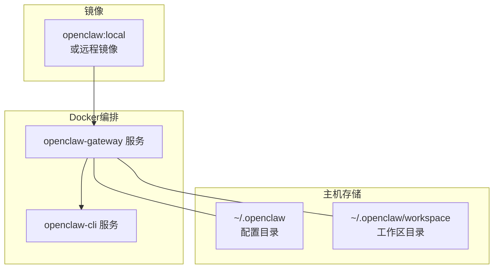
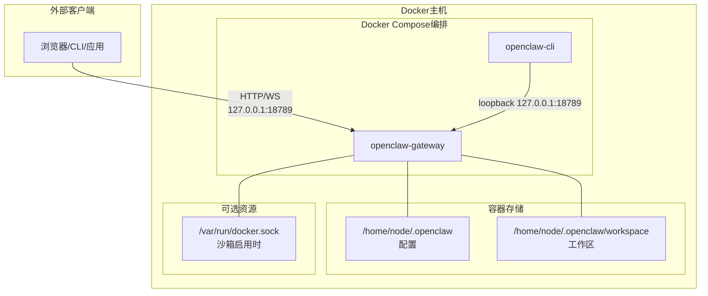
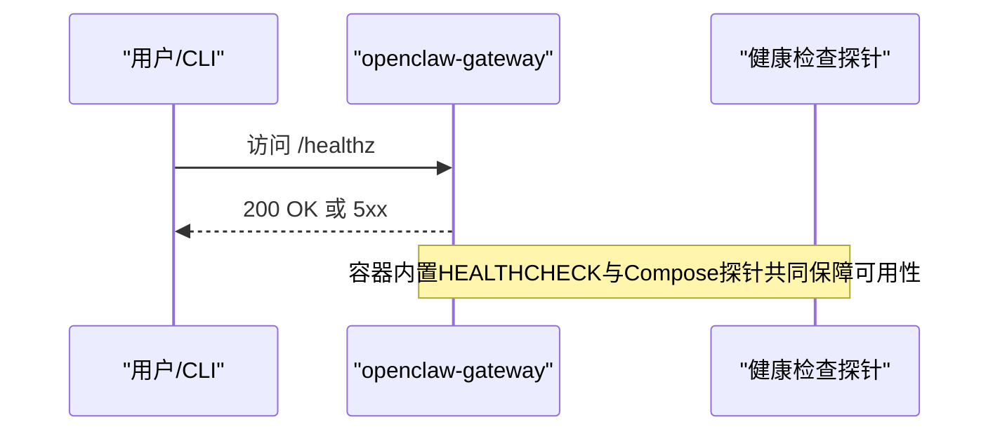
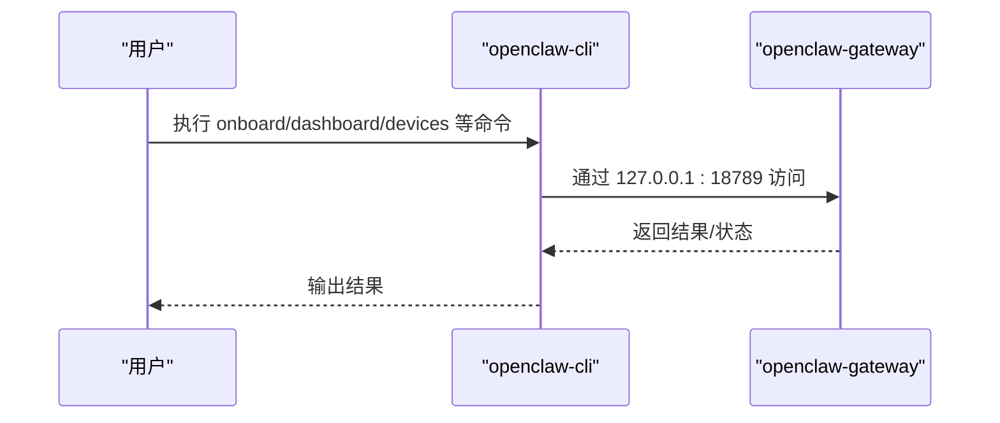
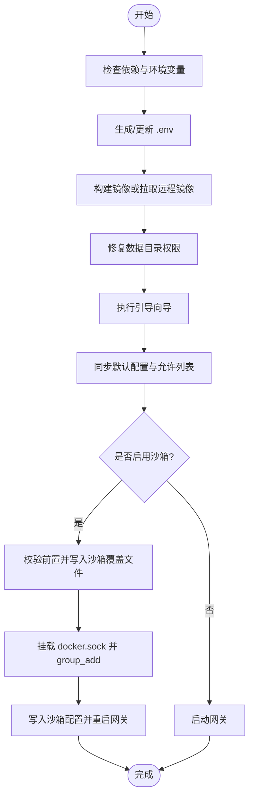
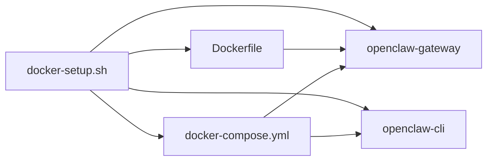

# 容器化网关部署

<cite>
**本文引用的文件**
- [docker-compose.yml](file://docker-compose.yml)
- [Dockerfile](file://Dockerfile)
- [docker-setup.sh](file://docker-setup.sh)
- [openclaw.podman.env](file://openclaw.podman.env)
- [docs/install/docker.md](file://docs/install/docker.md)
- [docs/gateway/configuration.md](file://docs/gateway/configuration.md)
- [scripts/e2e/Dockerfile](file://scripts/e2e/Dockerfile)
- [scripts/docker/install-sh-smoke/Dockerfile](file://scripts/docker/install-sh-smoke/Dockerfile)
</cite>

## 目录
1. [简介](#简介)
2. [项目结构](#项目结构)
3. [核心组件](#核心组件)
4. [架构总览](#架构总览)
5. [详细组件分析](#详细组件分析)
6. [依赖关系分析](#依赖关系分析)
7. [性能考虑](#性能考虑)
8. [故障排除指南](#故障排除指南)
9. [结论](#结论)
10. [附录](#附录)

## 简介
本技术文档面向在Docker环境中部署OpenClaw网关与CLI的用户，系统性阐述以下内容：
- Docker Compose编排配置与容器镜像构建流程
- 环境变量设置、端口映射、存储卷挂载与健康检查机制
- openclaw-gateway与openclaw-cli服务的配置要点
- 完整的一键部署脚本使用方法、配置文件生成与初始设置流程
- Docker环境下的故障排除、日志查看与性能监控建议

## 项目结构
围绕容器化部署的关键文件与目录如下：
- docker-compose.yml：定义openclaw-gateway与openclaw-cli两个服务及其网络、卷、环境变量与健康检查
- Dockerfile：多阶段构建的运行时镜像，支持Slim变体与可选功能（浏览器、Docker CLI）
- docker-setup.sh：一键部署脚本，负责镜像构建/拉取、数据目录权限修复、引导向导、启动服务与可选沙箱配置
- openclaw.podman.env：Podman环境示例（用于对比与参考）
- 文档：docs/install/docker.md（Docker部署指南）、docs/gateway/configuration.md（配置参考）

图表来源
- [docker-compose.yml:1-77](file://docker-compose.yml#L1-L77)
- [Dockerfile:103-231](file://Dockerfile#L103-L231)

章节来源
- [docker-compose.yml:1-77](file://docker-compose.yml#L1-L77)
- [Dockerfile:103-231](file://Dockerfile#L103-L231)
- [docs/install/docker.md:35-240](file://docs/install/docker.md#L35-L240)

## 核心组件
- openclaw-gateway服务
  - 镜像来源：默认使用本地镜像openclaw:local，可通过OPENCLAW_IMAGE覆盖
  - 端口映射：宿主端口18789映射到容器内18789（HTTP API），另开放桥接端口18790（按需）
  - 环境变量：包含认证令牌、Claude会话密钥等敏感信息；通过环境变量注入
  - 存储卷：绑定宿主~/.openclaw到容器/home/node/.openclaw；绑定工作区目录
  - 健康检查：内置liveness/readiness探针，Compose层也定义了额外健康检查
  - 启动命令：以gateway模式启动，并支持bind模式与端口参数
- openclaw-cli服务
  - 共享网络：network_mode指向openclaw-gateway，便于通过127.0.0.1访问
  - 权限限制：丢弃NET_RAW/NET_ADMIN能力并启用no-new-privileges
  - 交互性：stdin_open与tty开启，适合交互式操作
  - 入口点：直接调用CLI入口，便于执行配置、设备管理、仪表盘等命令

章节来源
- [docker-compose.yml:2-50](file://docker-compose.yml#L2-L50)
- [docker-compose.yml:51-77](file://docker-compose.yml#L51-L77)
- [Dockerfile:224-231](file://Dockerfile#L224-L231)

## 架构总览
下图展示容器化网关的端到端架构与关键交互：

图表来源
- [docker-compose.yml:23-26](file://docker-compose.yml#L23-L26)
- [docker-compose.yml:12-14](file://docker-compose.yml#L12-L14)
- [docker-compose.yml:53](file://docker-compose.yml#L53)
- [docker-compose.yml:15-22](file://docker-compose.yml#L15-L22)

## 详细组件分析

### openclaw-gateway服务
- 镜像与构建
  - 默认镜像openclaw:local由Dockerfile多阶段构建产出，支持Slim变体与可选特性（浏览器、Docker CLI）
  - 运行时以非root用户node执行，具备基础系统工具
- 网络与端口
  - 默认绑定LAN模式并通过端口18789对外提供HTTP API；桥接端口18790按需使用
  - 在Docker桥接网络中，loopback绑定会导致宿主无法直接访问容器内回环地址，需将bind切换为lan并设置认证
- 存储卷
  - 绑定宿主配置目录与工作区目录，确保重启后数据持久化
  - 可选挂载Docker socket以启用沙箱容器执行
- 健康检查
  - 容器层面内置HEALTHCHECK探测/healthz
  - Compose层定义了额外探针，周期30秒，超时5秒，重试5次，启动期20秒

图表来源
- [Dockerfile:224-231](file://Dockerfile#L224-L231)
- [docker-compose.yml:38-49](file://docker-compose.yml#L38-L49)

章节来源
- [Dockerfile:103-231](file://Dockerfile#L103-L231)
- [docker-compose.yml:23-49](file://docker-compose.yml#L23-L49)
- [docs/install/docker.md:469-495](file://docs/install/docker.md#L469-L495)

### openclaw-cli服务
- 网络模型
  - 使用network_mode: service:openclaw-gateway共享网络，通过127.0.0.1访问网关
  - 通过安全策略降低权限面，提升容器内命令执行的安全性
- 交互与入口
  - 开启TTY与STDIN，适合交互式向导与命令执行
  - 入口点直接调用CLI入口，便于执行onboard、dashboard、devices等子命令
- 与网关的关系
  - CLI作为网关的控制平面与运维入口，二者在同一网络命名空间内通信

图表来源
- [docker-compose.yml:51-77](file://docker-compose.yml#L51-L77)

章节来源
- [docker-compose.yml:51-77](file://docker-compose.yml#L51-L77)

### 一键部署脚本 docker-setup.sh
- 功能概览
  - 自动检测并安装依赖（docker/compose），生成/更新.env，构建或拉取镜像
  - 修复数据目录权限，执行引导向导（onboard），启动网关
  - 可选启用沙箱：校验前置条件、写入沙箱compose覆盖文件、挂载docker.sock、写入沙箱配置
  - 支持额外挂载与命名卷，支持远程镜像与扩展包预装
- 关键流程
  - 环境变量解析与校验（路径、格式、字符集）
  - 写出docker-compose.extra.yml（如需要）
  - 镜像构建/拉取与权限修复
  - 引导向导与默认配置同步
  - 沙箱启用与回滚保护

图表来源
- [docker-setup.sh:171-428](file://docker-setup.sh#L171-L428)
- [docker-setup.sh:477-586](file://docker-setup.sh#L477-L586)

章节来源
- [docker-setup.sh:171-586](file://docker-setup.sh#L171-L586)
- [docs/install/docker.md:35-125](file://docs/install/docker.md#L35-L125)

### 环境变量与配置
- 环境变量来源与优先级
  - 进程继承的环境变量
  - 当前工作目录的.env
  - ~/.openclaw/.env（全局回退）
  - 在配置中也可声明env字段进行导入
- 关键变量
  - OPENCLAW_GATEWAY_TOKEN：网关访问令牌（推荐随机生成）
  - OPENCLAW_GATEWAY_BIND：网关绑定模式（lan/loopback等）
  - OPENCLAW_GATEWAY_PORT/OPENCLAW_BRIDGE_PORT：端口映射
  - OPENCLAW_CONFIG_DIR/OPENCLAW_WORKSPACE_DIR：宿主绑定路径
  - OPENCLAW_SANDBOX：启用沙箱（1/true等真值）
  - OPENCLAW_INSTALL_DOCKER_CLI：在镜像中安装Docker CLI（沙箱所需）
  - OPENCLAW_DOCKER_SOCKET：自定义docker.sock路径
  - OPENCLAW_DOCKER_APT_PACKAGES：构建期安装apt包
  - OPENCLAW_EXTENSIONS：预装扩展依赖
  - OPENCLAW_EXTRA_MOUNTS/HOME_VOLUME：额外挂载与命名卷
  - OPENCLAW_ALLOW_INSECURE_PRIVATE_WS：允许私有ws目标（调试用途）
- 配置文件
  - ~/.openclaw/openclaw.json为可选配置文件，支持JSON5与热重载
  - 通过CLI或Control UI编辑，或直接手工修改

章节来源
- [docs/install/docker.md:59-125](file://docs/install/docker.md#L59-L125)
- [docs/gateway/configuration.md:449-539](file://docs/gateway/configuration.md#L449-L539)
- [docker-setup.sh:235-256](file://docker-setup.sh#L235-L256)

### 网络与安全
- 网络暴露与绑定
  - 默认lan模式配合端口发布，使宿主浏览器与CLI可达
  - loopback模式仅容器内可达，宿主端口可能不可达
- 安全加固
  - CLI丢弃NET_RAW/NET_ADMIN并启用no-new-privileges
  - 非root用户运行，减少逃逸风险
  - 可选沙箱：通过挂载docker.sock实现容器内容器执行，需谨慎配置权限与策略

章节来源
- [docs/install/docker.md:130-141](file://docs/install/docker.md#L130-L141)
- [docker-compose.yml:54-58](file://docker-compose.yml#L54-L58)
- [docker-compose.yml:15-22](file://docker-compose.yml#L15-L22)

## 依赖关系分析
- 组件耦合
  - openclaw-cli与openclaw-gateway通过共享网络与loopback通信，耦合度高但边界清晰
  - openclaw-gateway依赖宿主配置与工作区卷，以及可选的docker.sock
- 外部依赖
  - Docker与Docker Compose
  - 可选：Playwright浏览器、Docker CLI（沙箱）
- 循环依赖
  - 无直接循环依赖；Compose通过服务名引用实现逻辑耦合

图表来源
- [docker-compose.yml:1-77](file://docker-compose.yml#L1-L77)
- [Dockerfile:103-231](file://Dockerfile#L103-L231)
- [docker-setup.sh:171-428](file://docker-setup.sh#L171-L428)

章节来源
- [docker-compose.yml:1-77](file://docker-compose.yml#L1-L77)
- [Dockerfile:103-231](file://Dockerfile#L103-L231)
- [docker-setup.sh:171-428](file://docker-setup.sh#L171-L428)

## 性能考虑
- 镜像构建优化
  - 将依赖安装层置于缓存友好的位置，避免无关变更导致重建
  - 使用Slim变体减少镜像体积与攻击面
- 运行时优化
  - 为浏览器自动化预装Chromium可显著降低启动延迟
  - 适当设置内存/CPU限制与ulimit，避免资源争用
- I/O与存储
  - 将Playwright下载目录与/home/node持久化，避免重复下载
  - 监控媒体、会话与日志目录增长，必要时清理或外置存储

[本节为通用指导，无需特定文件引用]

## 故障排除指南
- 常见问题与定位
  - 端口占用：宿主端口18789被占用时，容器无法监听；可通过变更宿主端口或释放端口解决
  - 权限错误：宿主目录属主/属组不匹配导致EACCES；使用脚本修复或手动chown
  - 绑定模式：loopback模式下宿主无法访问；将gateway.bind设为lan并设置认证
  - 沙箱未生效：镜像未安装Docker CLI或socket未挂载；检查OPENCLAW_INSTALL_DOCKER_CLI与docker.sock挂载
- 探测与诊断
  - 容器内健康检查：/healthz与/readyz；Compose探针周期30s
  - 深度健康快照：通过网关命令执行带令牌的健康检查
  - 日志查看：使用docker compose logs -f openclaw-gateway
- 参考流程
  - 重新固定权限：脚本自动执行chown修复
  - 重新启动网关：Compose重启或脚本重启
  - 回滚沙箱：若部分配置失败，脚本会回滚至关闭模式并移除沙箱覆盖文件

章节来源
- [docs/install/docker.md:469-495](file://docs/install/docker.md#L469-L495)
- [docker-setup.sh:442-444](file://docker-setup.sh#L442-L444)
- [docker-setup.sh:563-574](file://docker-setup.sh#L563-L574)

## 结论
通过Docker Compose与一键部署脚本，OpenClaw实现了可复现、可维护的容器化网关部署。脚本自动处理镜像构建/拉取、数据目录权限、引导向导与沙箱配置，结合Compose的健康检查与网络隔离，提供了安全、稳定的运行环境。建议在生产环境中启用lan绑定、严格认证与最小权限原则，并根据业务需求选择合适的镜像变体与附加功能。

[本节为总结，无需特定文件引用]

## 附录

### 安装步骤（一键部署）
- 准备工作
  - 安装Docker与Docker Compose
  - 准备宿主目录（配置与工作区）并确保可写
- 执行部署
  - 运行脚本：./docker-setup.sh
  - 脚本将：
    - 生成/更新.env并写入OPENCLAW_GATEWAY_TOKEN
    - 构建或拉取镜像
    - 修复数据目录权限
    - 执行引导向导
    - 启动openclaw-gateway
    - 可选启用沙箱（OPENCLAW_SANDBOX=1）
- 初始设置
  - 在浏览器打开http://127.0.0.1:18789
  - 在Control UI中粘贴令牌
  - 如需，使用CLI容器添加频道账号

章节来源
- [docs/install/docker.md:37-84](file://docs/install/docker.md#L37-L84)
- [docker-setup.sh:447-477](file://docker-setup.sh#L447-L477)

### 环境变量清单与用途
- OPENCLAW_IMAGE：镜像名称（本地或远程）
- OPENCLAW_GATEWAY_TOKEN：网关访问令牌
- OPENCLAW_GATEWAY_BIND：网关绑定模式（lan/loopback等）
- OPENCLAW_GATEWAY_PORT/OPENCLAW_BRIDGE_PORT：端口映射
- OPENCLAW_CONFIG_DIR/OPENCLAW_WORKSPACE_DIR：宿主绑定路径
- OPENCLAW_SANDBOX：启用沙箱
- OPENCLAW_INSTALL_DOCKER_CLI：在镜像中安装Docker CLI
- OPENCLAW_DOCKER_SOCKET：docker.sock路径
- OPENCLAW_DOCKER_APT_PACKAGES：构建期apt包
- OPENCLAW_EXTENSIONS：预装扩展
- OPENCLAW_EXTRA_MOUNTS/HOME_VOLUME：额外挂载与命名卷
- OPENCLAW_ALLOW_INSECURE_PRIVATE_WS：允许私有ws目标（调试）

章节来源
- [docs/install/docker.md:59-125](file://docs/install/docker.md#L59-L125)
- [docker-setup.sh:235-256](file://docker-setup.sh#L235-L256)

### 配置文件生成与初始设置
- 自动生成
  - 脚本在首次运行时生成OPENCLAW_GATEWAY_TOKEN并写入.env
  - 执行引导向导（onboard），设置默认模式与绑定
  - 若绑定非loopback，自动设置Control UI允许的Origin白名单
- 手动调整
  - 通过CLI命令或Control UI编辑~/.openclaw/openclaw.json
  - 支持热重载与分段include组织大型配置

章节来源
- [docker-setup.sh:235-256](file://docker-setup.sh#L235-L256)
- [docker-setup.sh:101-123](file://docker-setup.sh#L101-L123)
- [docs/gateway/configuration.md:36-59](file://docs/gateway/configuration.md#L36-L59)

### 日志查看与健康检查
- 日志
  - docker compose logs -f openclaw-gateway
- 健康检查
  - 容器内：/healthz（liveness）、/readyz（readiness）
  - Compose探针：每30秒，超时5秒，重试5次，启动期20秒
  - 深度健康：docker compose exec openclaw-gateway node dist/index.js health --token "$OPENCLAW_GATEWAY_TOKEN"

章节来源
- [docs/install/docker.md:469-495](file://docs/install/docker.md#L469-L495)
- [Dockerfile:224-231](file://Dockerfile#L224-L231)
- [docker-compose.yml:38-49](file://docker-compose.yml#L38-L49)

### 测试与验证镜像
- e2e测试镜像
  - scripts/e2e/Dockerfile：完整源码构建，适合端到端测试
- 安装Smoke测试镜像
  - scripts/docker/install-sh-smoke/Dockerfile：轻量基础镜像，包含常用工具，适合安装流程Smoke测试

章节来源
- [scripts/e2e/Dockerfile:1-39](file://scripts/e2e/Dockerfile#L1-L39)
- [scripts/docker/install-sh-smoke/Dockerfile:1-29](file://scripts/docker/install-sh-smoke/Dockerfile#L1-L29)