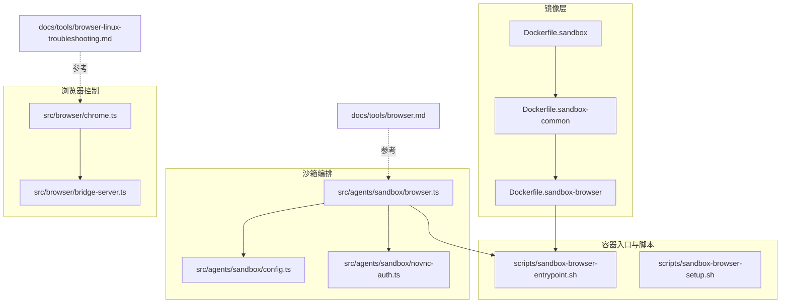
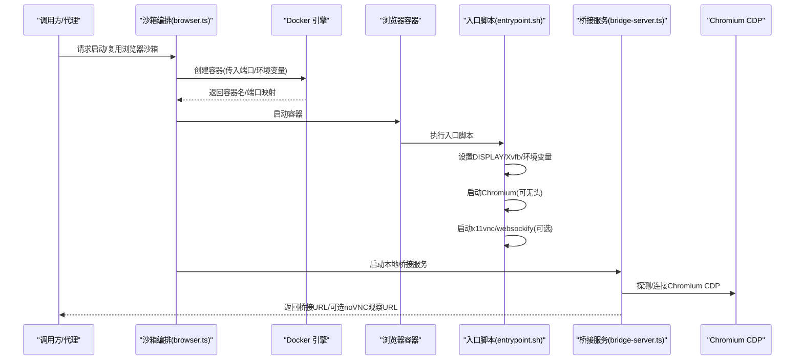
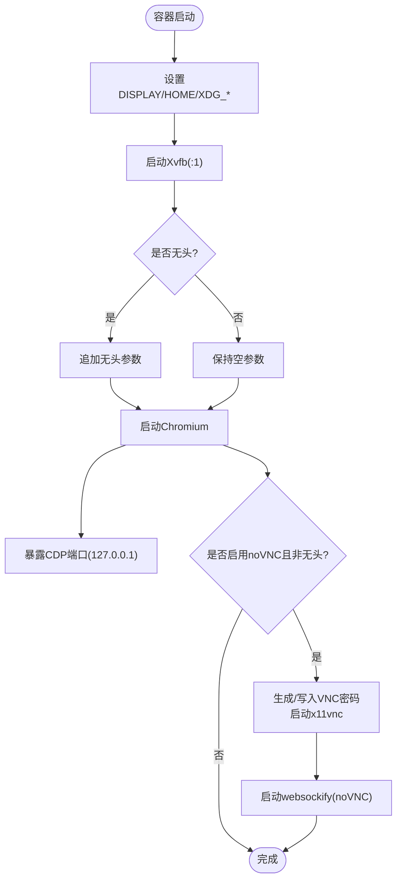
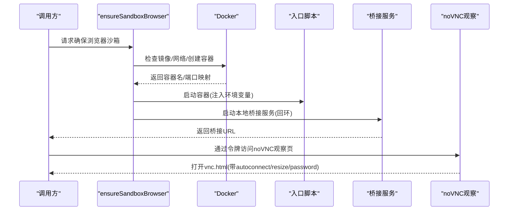
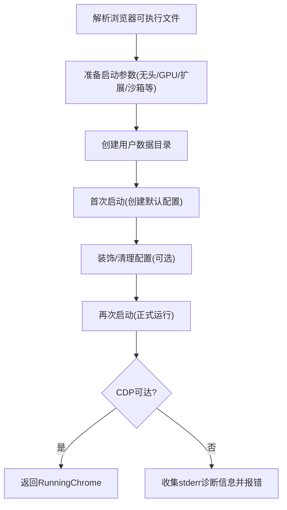
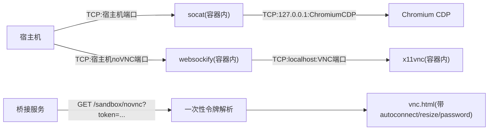
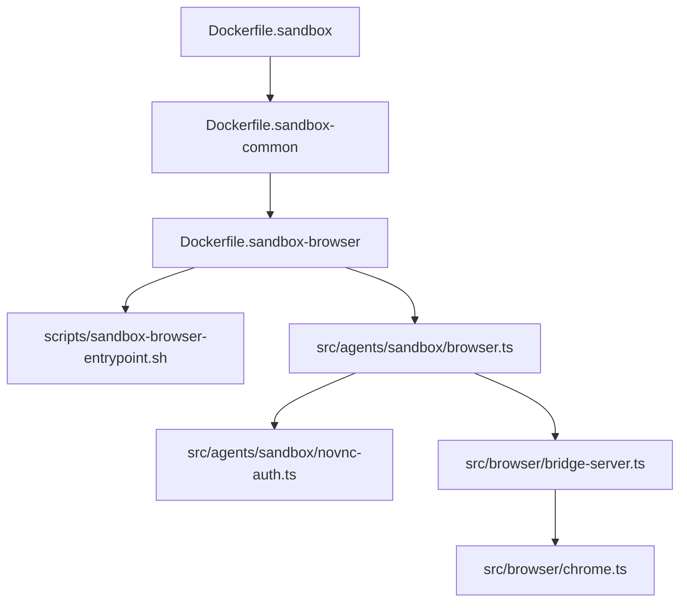

# 浏览器沙箱

<cite>
**本文引用的文件**
- [Dockerfile.sandbox-browser](file://Dockerfile.sandbox-browser)
- [scripts/sandbox-browser-entrypoint.sh](file://scripts/sandbox-browser-entrypoint.sh)
- [scripts/sandbox-browser-setup.sh](file://scripts/sandbox-browser-setup.sh)
- [src/agents/sandbox/browser.ts](file://src/agents/sandbox/browser.ts)
- [src/agents/sandbox/config.ts](file://src/agents/sandbox/config.ts)
- [src/agents/sandbox/novnc-auth.ts](file://src/agents/sandbox/novnc-auth.ts)
- [src/browser/chrome.ts](file://src/browser/chrome.ts)
- [src/browser/bridge-server.ts](file://src/browser/bridge-server.ts)
- [docs/tools/browser.md](file://docs/tools/browser.md)
- [docs/tools/browser-linux-troubleshooting.md](file://docs/tools/browser-linux-troubleshooting.md)
- [Dockerfile.sandbox](file://Dockerfile.sandbox)
- [Dockerfile.sandbox-common](file://Dockerfile.sandbox-common)
</cite>

## 目录
1. [简介](#简介)
2. [项目结构](#项目结构)
3. [核心组件](#核心组件)
4. [架构总览](#架构总览)
5. [详细组件分析](#详细组件分析)
6. [依赖关系分析](#依赖关系分析)
7. [性能考虑](#性能考虑)
8. [故障排查指南](#故障排查指南)
9. [结论](#结论)
10. [附录](#附录)

## 简介
本文件系统化阐述浏览器沙箱功能：基于 Docker 的隔离执行环境、Chromium 配置与无头模式支持、CDP 调试接口以及 noVNC 远程访问机制。内容覆盖镜像构建、显示环境与图形硬件加速、扩展管理、安全策略、调试方法、性能优化与兼容性处理，帮助读者在不同平台与部署场景下稳定运行受控浏览器。

## 项目结构
围绕浏览器沙箱的关键目录与文件如下：
- Docker 镜像层
  - 基础沙箱镜像：Dockerfile.sandbox
  - 通用开发环境镜像：Dockerfile.sandbox-common
  - 浏览器专用镜像：Dockerfile.sandbox-browser
- 启动脚本与构建脚本
  - 浏览器容器入口脚本：scripts/sandbox-browser-entrypoint.sh
  - 构建浏览器镜像脚本：scripts/sandbox-browser-setup.sh
- 沙箱编排与桥接
  - 沙箱浏览器编排：src/agents/sandbox/browser.ts
  - 沙箱配置解析：src/agents/sandbox/config.ts
  - noVNC 认证与令牌：src/agents/sandbox/novnc-auth.ts
  - CDP 桥接服务（本地）：src/browser/bridge-server.ts
- 浏览器控制与 CDP
  - Chromium 启动与可达性探测：src/browser/chrome.ts
- 文档与使用指南
  - 浏览器工具与配置文档：docs/tools/browser.md
  - Linux 特定问题排查：docs/tools/browser-linux-troubleshooting.md

**图表来源**
- [Dockerfile.sandbox](file://Dockerfile.sandbox)
- [Dockerfile.sandbox-common](file://Dockerfile.sandbox-common)
- [Dockerfile.sandbox-browser](file://Dockerfile.sandbox-browser)
- [scripts/sandbox-browser-entrypoint.sh](file://scripts/sandbox-browser-entrypoint.sh)
- [scripts/sandbox-browser-setup.sh](file://scripts/sandbox-browser-setup.sh)
- [src/agents/sandbox/browser.ts](file://src/agents/sandbox/browser.ts)
- [src/agents/sandbox/config.ts](file://src/agents/sandbox/config.ts)
- [src/agents/sandbox/novnc-auth.ts](file://src/agents/sandbox/novnc-auth.ts)
- [src/browser/chrome.ts](file://src/browser/chrome.ts)
- [src/browser/bridge-server.ts](file://src/browser/bridge-server.ts)
- [docs/tools/browser.md](file://docs/tools/browser.md)
- [docs/tools/browser-linux-troubleshooting.md](file://docs/tools/browser-linux-troubleshooting.md)

**章节来源**
- [Dockerfile.sandbox](file://Dockerfile.sandbox)
- [Dockerfile.sandbox-common](file://Dockerfile.sandbox-common)
- [Dockerfile.sandbox-browser](file://Dockerfile.sandbox-browser)
- [scripts/sandbox-browser-entrypoint.sh](file://scripts/sandbox-browser-entrypoint.sh)
- [scripts/sandbox-browser-setup.sh](file://scripts/sandbox-browser-setup.sh)
- [src/agents/sandbox/browser.ts](file://src/agents/sandbox/browser.ts)
- [src/agents/sandbox/config.ts](file://src/agents/sandbox/config.ts)
- [src/agents/sandbox/novnc-auth.ts](file://src/agents/sandbox/novnc-auth.ts)
- [src/browser/chrome.ts](file://src/browser/chrome.ts)
- [src/browser/bridge-server.ts](file://src/browser/bridge-server.ts)
- [docs/tools/browser.md](file://docs/tools/browser.md)
- [docs/tools/browser-linux-troubleshooting.md](file://docs/tools/browser-linux-troubleshooting.md)

## 核心组件
- Docker 浏览器镜像与启动流程
  - 基于 Debian slim，安装 Chromium、Xvfb、noVNC、websockify、x11vnc、socat 等依赖。
  - 容器以非 root 用户运行，暴露 CDP、VNC、noVNC 端口。
  - 入口脚本负责设置显示环境、导出浏览器参数、启动虚拟帧缓冲、可选启动 VNC/noVNC，并通过 socat 将外部端口转发到容器内 CDP。
- 沙箱编排与桥接
  - 动态创建/复用浏览器容器，注入环境变量（如是否无头、是否启用 noVNC、CDP/VNC/noVNC 端口等），并自动映射端口。
  - 启动本地 CDP 桥接服务，提供统一的 HTTP API，按需自动确保目标 CDP 可达。
  - 提供 noVNC 观察令牌，生成一次性短生命周期令牌，安全地打开 noVNC 页面。
- 浏览器控制与 CDP
  - 本地模式下，通过 Chromium 启动参数与用户数据目录隔离，支持无头模式、禁用 GPU/3D API、禁用扩展等安全与性能选项。
  - 提供 CDP 可达性检测、WebSocket 握手探测、健康命令验证等能力，保障启动与连接稳定性。
- 文档与使用指南
  - 提供浏览器配置、多配置文件、远程 CDP、扩展中继、安全策略、调试与故障排查等完整说明。

**章节来源**
- [Dockerfile.sandbox-browser](file://Dockerfile.sandbox-browser)
- [scripts/sandbox-browser-entrypoint.sh](file://scripts/sandbox-browser-entrypoint.sh)
- [src/agents/sandbox/browser.ts](file://src/agents/sandbox/browser.ts)
- [src/agents/sandbox/novnc-auth.ts](file://src/agents/sandbox/novnc-auth.ts)
- [src/browser/chrome.ts](file://src/browser/chrome.ts)
- [docs/tools/browser.md](file://docs/tools/browser.md)

## 架构总览
浏览器沙箱的整体工作流包括：沙箱编排创建容器 -> 容器内启动虚拟显示与浏览器 -> 暴露 CDP 端口并通过 socat 转发 -> 启动 VNC/noVNC（可选）-> 本地桥接服务对外提供 HTTP API。

**图表来源**
- [src/agents/sandbox/browser.ts](file://src/agents/sandbox/browser.ts)
- [scripts/sandbox-browser-entrypoint.sh](file://scripts/sandbox-browser-entrypoint.sh)
- [src/browser/bridge-server.ts](file://src/browser/bridge-server.ts)
- [src/browser/chrome.ts](file://src/browser/chrome.ts)

## 详细组件分析

### 组件一：Docker 浏览器镜像与启动参数
- 镜像基础与软件包
  - 基于 Debian slim，安装 Chromium、Xvfb、noVNC、websockify、x11vnc、socat、curl、jq、python3 等。
  - 使用只读根文件系统、限制用户权限、暴露必要端口（CDP、VNC、noVNC）。
- 启动参数与显示环境
  - 设置 DISPLAY、HOME、XDG_* 目录，使用 Xvfb 提供虚拟帧缓冲。
  - 支持无头模式、禁用 GPU/3D API、禁用扩展、限制渲染进程数量、禁用沙箱等。
- CDP 与 noVNC
  - 通过 socat 将宿主机端口转发到容器内 CDP；可选启动 x11vnc + websockify 提供 noVNC。
  - noVNC 密码最大 8 字符，未指定时自动生成；密码存储在容器内受限位置。

**图表来源**
- [Dockerfile.sandbox-browser](file://Dockerfile.sandbox-browser)
- [scripts/sandbox-browser-entrypoint.sh](file://scripts/sandbox-browser-entrypoint.sh)

**章节来源**
- [Dockerfile.sandbox-browser](file://Dockerfile.sandbox-browser)
- [scripts/sandbox-browser-entrypoint.sh](file://scripts/sandbox-browser-entrypoint.sh)

### 组件二：沙箱编排与桥接服务
- 容器生命周期管理
  - 解析沙箱配置，计算配置哈希，避免热容器变更导致的不一致。
  - 自动检查/创建网络、校验镜像存在、构建创建参数（含端口映射、环境变量、挂载）。
  - 通过 Docker 端口映射解析实际 CDP 端口，必要时自动启动容器。
- 桥接服务
  - 在本地回环启动 HTTP 服务，安装认证中间件，注册浏览器路由。
  - 提供 noVNC 观察页面路由，基于一次性令牌解析目标 noVNC 端口与密码。
- noVNC 认证
  - 生成 8 字母数字密码；颁发带 TTL 的一次性令牌；消费后即失效。

**图表来源**
- [src/agents/sandbox/browser.ts](file://src/agents/sandbox/browser.ts)
- [src/agents/sandbox/novnc-auth.ts](file://src/agents/sandbox/novnc-auth.ts)
- [src/browser/bridge-server.ts](file://src/browser/bridge-server.ts)

**章节来源**
- [src/agents/sandbox/browser.ts](file://src/agents/sandbox/browser.ts)
- [src/agents/sandbox/novnc-auth.ts](file://src/agents/sandbox/novnc-auth.ts)
- [src/browser/bridge-server.ts](file://src/browser/bridge-server.ts)

### 组件三：Chromium 启动与 CDP 可达性
- 启动参数与隔离
  - 使用独立用户数据目录，避免与宿主浏览器冲突。
  - 支持无头模式、禁用 GPU/3D、禁用扩展、禁用同步与后台网络、禁用特定组件与特性。
  - Linux 上禁用 dev/shm 使用，必要时添加 no-sandbox 参数。
- CDP 可达性与健康检查
  - 通过 HTTP /json/version 或直接 WebSocket 握手探测 CDP 可用性。
  - 发送最小化健康命令（如 Browser.getVersion）验证 CDP 通道可用。

**图表来源**
- [src/browser/chrome.ts](file://src/browser/chrome.ts)

**章节来源**
- [src/browser/chrome.ts](file://src/browser/chrome.ts)

### 组件四：CDP 与 noVNC 远程访问
- CDP 转发
  - 容器内通过 socat 将外部端口转发到 127.0.0.1:ChromiumCDP，支持源地址范围限制。
- noVNC 观察
  - 容器内启动 x11vnc + websockify，提供 noVNC 页面；密码最大 8 字符，未提供则随机生成。
  - 桥接服务提供 /sandbox/novnc 路由，消费一次性令牌后返回 vnc.html 目标 URL。

**图表来源**
- [scripts/sandbox-browser-entrypoint.sh](file://scripts/sandbox-browser-entrypoint.sh)
- [src/browser/bridge-server.ts](file://src/browser/bridge-server.ts)
- [src/agents/sandbox/novnc-auth.ts](file://src/agents/sandbox/novnc-auth.ts)

**章节来源**
- [scripts/sandbox-browser-entrypoint.sh](file://scripts/sandbox-browser-entrypoint.sh)
- [src/browser/bridge-server.ts](file://src/browser/bridge-server.ts)
- [src/agents/sandbox/novnc-auth.ts](file://src/agents/sandbox/novnc-auth.ts)

## 依赖关系分析
- 镜像层级
  - Dockerfile.sandbox 为基础，Dockerfile.sandbox-common 在其上安装常用工具链与包管理器，Dockerfile.sandbox-browser 安装浏览器与显示栈。
- 编排与脚本
  - scripts/sandbox-browser-setup.sh 用于构建浏览器镜像；入口脚本负责运行时参数注入与服务启动。
- 控制与桥接
  - 沙箱编排模块依赖 Docker 命令、端口解析、环境变量读取；桥接服务依赖本地回环绑定与认证中间件；Chromium 模块负责 CDP 可达性与健康检查。

**图表来源**
- [Dockerfile.sandbox](file://Dockerfile.sandbox)
- [Dockerfile.sandbox-common](file://Dockerfile.sandbox-common)
- [Dockerfile.sandbox-browser](file://Dockerfile.sandbox-browser)
- [scripts/sandbox-browser-entrypoint.sh](file://scripts/sandbox-browser-entrypoint.sh)
- [src/agents/sandbox/browser.ts](file://src/agents/sandbox/browser.ts)
- [src/agents/sandbox/novnc-auth.ts](file://src/agents/sandbox/novnc-auth.ts)
- [src/browser/bridge-server.ts](file://src/browser/bridge-server.ts)
- [src/browser/chrome.ts](file://src/browser/chrome.ts)

**章节来源**
- [Dockerfile.sandbox](file://Dockerfile.sandbox)
- [Dockerfile.sandbox-common](file://Dockerfile.sandbox-common)
- [Dockerfile.sandbox-browser](file://Dockerfile.sandbox-browser)
- [scripts/sandbox-browser-entrypoint.sh](file://scripts/sandbox-browser-entrypoint.sh)
- [src/agents/sandbox/browser.ts](file://src/agents/sandbox/browser.ts)
- [src/agents/sandbox/novnc-auth.ts](file://src/agents/sandbox/novnc-auth.ts)
- [src/browser/bridge-server.ts](file://src/browser/bridge-server.ts)
- [src/browser/chrome.ts](file://src/browser/chrome.ts)

## 性能考虑
- 启动与资源
  - 无头模式显著降低内存与 CPU 占用；禁用 GPU/3D API 有助于容器内稳定运行。
  - 限制渲染进程数量可减少并发开销；禁用扩展与翻译等特性降低初始化时间。
- I/O 与存储
  - 使用独立用户数据目录避免与宿主共享状态；必要时对下载目录进行持久化挂载。
- 网络与转发
  - 仅暴露必要端口；通过 socat 限制源地址范围，减少攻击面。
- 平台差异
  - Linux 上优先使用非 snap 的官方浏览器包；若必须使用 snap，采用“附加模式”或 systemd 服务托管。

[本节为通用指导，无需列出具体文件来源]

## 故障排查指南
- Linux 启动失败（snap 包）
  - 现象：无法启动 CDP 端口，stderr 指向 AppArmor 限制。
  - 处理：改用官方 Google Chrome deb 包；或启用 attach-only 模式手动启动浏览器。
- WSL2 与 Windows Chrome 分离
  - 现象：网关与浏览器不在同一命名空间，CDP 无法直连。
  - 处理：在浏览器所在主机运行节点主机，或通过 relay 代理；必要时调整 relay 绑定地址。
- noVNC 密码错误
  - 现象：noVNC 登录失败。
  - 处理：确认容器内密码已生成并正确传递；使用桥接服务提供的观察令牌访问。
- CDP 不可达
  - 现象：浏览器启动但 CDP 未就绪。
  - 处理：检查沙箱参数（如 no-sandbox）、日志输出、端口映射；确认容器网络与防火墙规则。

**章节来源**
- [docs/tools/browser-linux-troubleshooting.md](file://docs/tools/browser-linux-troubleshooting.md)
- [docs/tools/browser.md](file://docs/tools/browser.md)
- [src/browser/chrome.ts](file://src/browser/chrome.ts)
- [src/agents/sandbox/browser.ts](file://src/agents/sandbox/browser.ts)

## 结论
浏览器沙箱通过分层镜像、严格的启动参数与显示环境配置、可靠的 CDP 可达性检测以及 noVNC 观察机制，实现了跨平台、可复现、可审计的受控浏览器运行环境。结合沙箱编排与桥接服务，可在不同部署场景下提供一致的自动化与可视化能力。

[本节为总结性内容，无需列出具体文件来源]

## 附录

### A. 浏览器镜像构建与使用
- 构建浏览器镜像
  - 使用脚本构建镜像并打印镜像名称，便于在沙箱配置中引用。
- 基础与通用镜像
  - 基础镜像提供最小运行环境；通用镜像安装常用工具链与包管理器，适合作为其他沙箱的基础。

**章节来源**
- [scripts/sandbox-browser-setup.sh](file://scripts/sandbox-browser-setup.sh)
- [Dockerfile.sandbox](file://Dockerfile.sandbox)
- [Dockerfile.sandbox-common](file://Dockerfile.sandbox-common)

### B. 配置要点与最佳实践
- 端口与网络
  - CDP 端口与 noVNC 端口应避免与宿主占用冲突；仅在回环绑定，必要时限制源地址范围。
- 安全策略
  - 默认启用 no-sandbox（容器内沙箱已足够）；禁用扩展与翻译；严格控制工作区挂载与权限。
- 图形与显示
  - 容器内使用 Xvfb；无头模式下禁用 GPU；noVNC 仅在需要可视化时启用。
- 远程 CDP 与扩展中继
  - 远程 CDP 场景下使用加密端点与短期令牌；扩展中继需明确授权与网络边界。

**章节来源**
- [src/agents/sandbox/config.ts](file://src/agents/sandbox/config.ts)
- [src/agents/sandbox/browser.ts](file://src/agents/sandbox/browser.ts)
- [docs/tools/browser.md](file://docs/tools/browser.md)