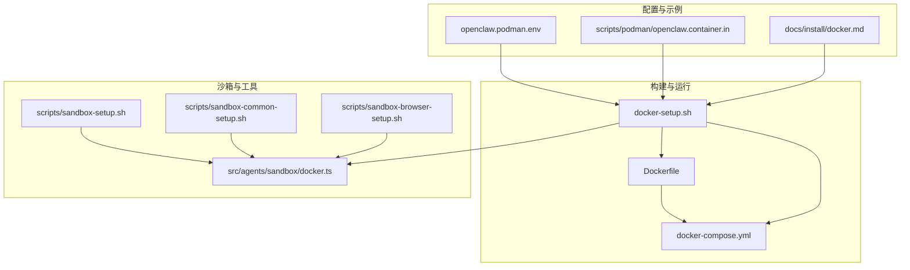
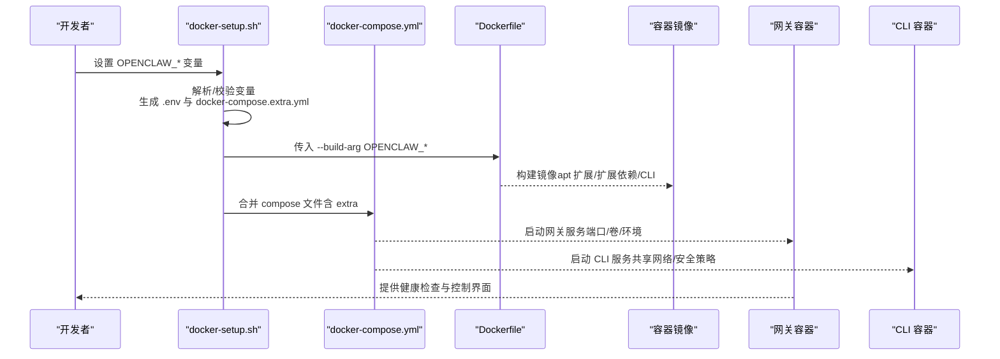
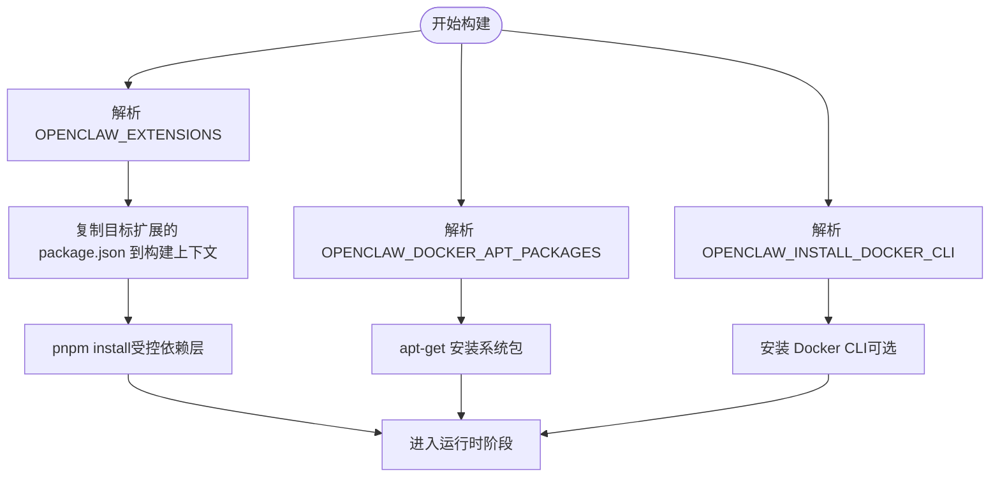
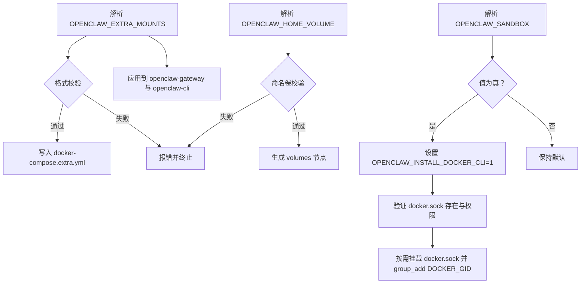
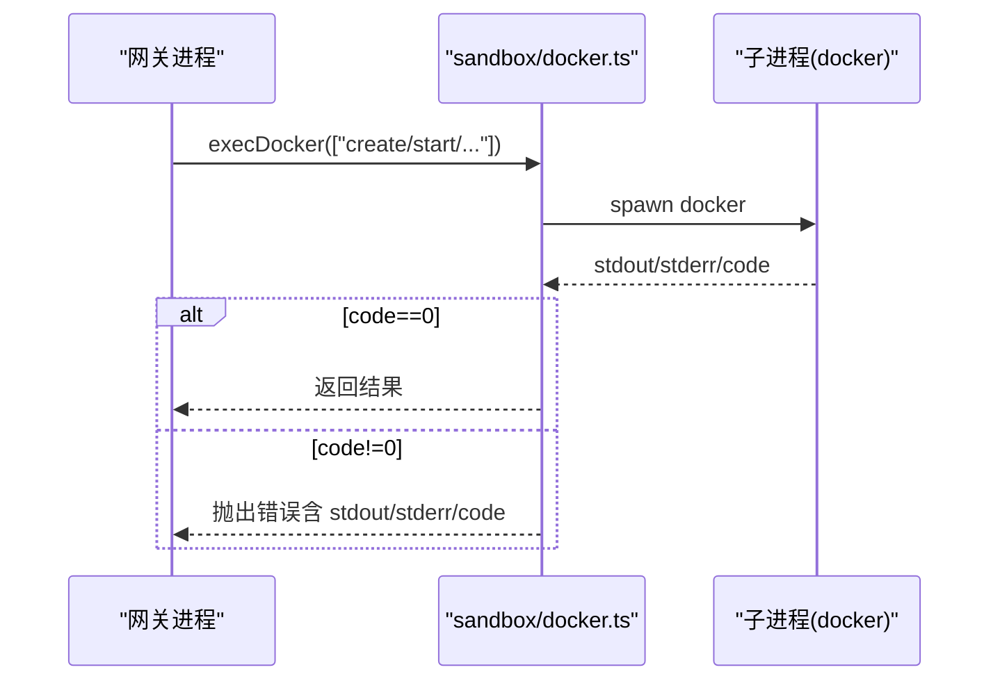
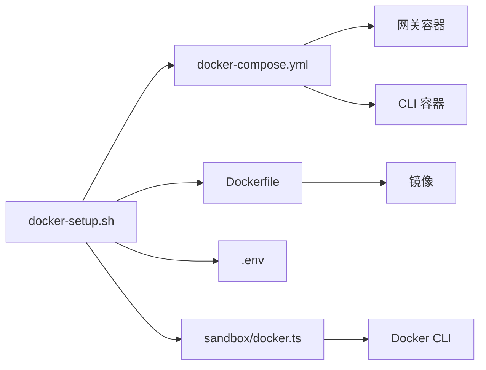

# 环境变量配置

<cite>
**本文引用的文件**
- [Dockerfile](file://Dockerfile)
- [docker-compose.yml](file://docker-compose.yml)
- [docker-setup.sh](file://docker-setup.sh)
- [openclaw.podman.env](file://openclaw.podman.env)
- [openclaw.container.in](file://scripts/podman/openclaw.container.in)
- [docs/install/docker.md](file://docs/install/docker.md)
- [src/agents/sandbox/docker.ts](file://src/agents/sandbox/docker.ts)
- [scripts/sandbox-setup.sh](file://scripts/sandbox-setup.sh)
- [scripts/sandbox-common-setup.sh](file://scripts/sandbox-common-setup.sh)
- [scripts/sandbox-browser-setup.sh](file://scripts/sandbox-browser-setup.sh)
</cite>

## 目录
1. [简介](#简介)
2. [项目结构](#项目结构)
3. [核心组件](#核心组件)
4. [架构总览](#架构总览)
5. [详细组件分析](#详细组件分析)
6. [依赖关系分析](#依赖关系分析)
7. [性能考量](#性能考量)
8. [故障排查指南](#故障排查指南)
9. [结论](#结论)
10. [附录](#附录)

## 简介
本文件系统性梳理 OpenClaw 在 Docker/Podman 环境中的“环境变量配置”，覆盖镜像构建期与运行期的关键变量、默认值、语法规范、典型用法与最佳实践，并给出常见问题排查与动态更新方法。重点解释以下变量：
- 构建期变量：OPENCLAW_EXTENSIONS、OPENCLAW_DOCKER_APT_PACKAGES、OPENCLAW_INSTALL_DOCKER_CLI、OPENCLAW_VARIANT、OPENCLAW_NODE_BOOKWORM_IMAGE 等
- 运行期变量：OPENCLAW_IMAGE、OPENCLAW_EXTRA_MOUNTS、OPENCLAW_HOME_VOLUME、OPENCLAW_SANDBOX、OPENCLAW_DOCKER_SOCKET、OPENCLAW_GATEWAY_BIND、OPENCLAW_GATEWAY_PORT、OPENCLAW_GATEWAY_TOKEN、OPENCLAW_ALLOW_INSECURE_PRIVATE_WS 等
- Podman 相关：OPENCLAW_PODMAN_* 系列变量（如 OPENCLAW_PODMAN_GATEWAY_HOST_PORT）

同时，文档涵盖 APT 包安装、扩展预装、存储卷挂载、网络绑定、浏览器与沙箱等高级能力的配置要点。

## 项目结构
围绕 Docker 环境变量配置，仓库中涉及以下关键文件：
- 构建与运行：Dockerfile、docker-compose.yml、docker-setup.sh
- 配置示例：openclaw.podman.env、scripts/podman/openclaw.container.in
- 文档参考：docs/install/docker.md
- 沙箱执行：src/agents/sandbox/docker.ts
- 沙箱镜像构建：scripts/sandbox-setup.sh、scripts/sandbox-common-setup.sh、scripts/sandbox-browser-setup.sh

**图表来源**
- [Dockerfile](file://Dockerfile)
- [docker-compose.yml](file://docker-compose.yml)
- [docker-setup.sh](file://docker-setup.sh)
- [openclaw.podman.env](file://openclaw.podman.env)
- [openclaw.container.in](file://scripts/podman/openclaw.container.in)
- [docs/install/docker.md](file://docs/install/docker.md)
- [src/agents/sandbox/docker.ts](file://src/agents/sandbox/docker.ts)
- [scripts/sandbox-setup.sh](file://scripts/sandbox-setup.sh)
- [scripts/sandbox-common-setup.sh](file://scripts/sandbox-common-setup.sh)
- [scripts/sandbox-browser-setup.sh](file://scripts/sandbox-browser-setup.sh)

**章节来源**
- [Dockerfile](file://Dockerfile)
- [docker-compose.yml](file://docker-compose.yml)
- [docker-setup.sh](file://docker-setup.sh)
- [openclaw.podman.env](file://openclaw.podman.env)
- [openclaw.container.in](file://scripts/podman/openclaw.container.in)
- [docs/install/docker.md](file://docs/install/docker.md)
- [src/agents/sandbox/docker.ts](file://src/agents/sandbox/docker.ts)
- [scripts/sandbox-setup.sh](file://scripts/sandbox-setup.sh)
- [scripts/sandbox-common-setup.sh](file://scripts/sandbox-common-setup.sh)
- [scripts/sandbox-browser-setup.sh](file://scripts/sandbox-browser-setup.sh)

## 核心组件
- 构建期变量（在 Dockerfile 中定义或通过 --build-arg 注入）
  - OPENCLAW_EXTENSIONS：空格分隔的扩展目录名列表，用于在构建阶段提取对应 package.json 并参与依赖解析
  - OPENCLAW_DOCKER_APT_PACKAGES：空格分隔的 apt 包名列表，在镜像构建阶段安装
  - OPENCLAW_INSTALL_DOCKER_CLI：是否在镜像内安装 Docker CLI（用于容器内沙箱管理）
  - OPENCLAW_VARIANT：运行时镜像变体（如 default/slim），影响最终基础镜像
  - OPENCLAW_NODE_BOOKWORM_IMAGE/OPENCLAW_NODE_BOOKWORM_SLIM_IMAGE：Node 基础镜像及其摘要
- 运行期变量（由 docker-setup.sh 解析并注入到 .env 与 docker-compose）
  - OPENCLAW_IMAGE：镜像名称（默认 openclaw:local；可指向远程镜像）
  - OPENCLAW_EXTRA_MOUNTS：逗号分隔的 bind mount 规范 source:target[:options]，无空格
  - OPENCLAW_HOME_VOLUME：命名卷名，持久化 /home/node
  - OPENCLAW_SANDBOX：启用沙箱引导（仅当值为 1/true/yes/on）
  - OPENCLAW_DOCKER_SOCKET：Docker 套接字路径（默认从 DOCKER_HOST 或 /var/run/docker.sock 推断）
  - OPENCLAW_GATEWAY_BIND：网关绑定模式（lan/loopback 等）
  - OPENCLAW_GATEWAY_PORT/OPENCLAW_BRIDGE_PORT：主机端口映射
  - OPENCLAW_GATEWAY_TOKEN：网关访问令牌（未提供时自动生成或从配置/环境文件复用）
  - OPENCLAW_ALLOW_INSECURE_PRIVATE_WS：允许受信私有网络 ws:// 的破窗开关
  - OPENCLAW_ALLOW_INSECURE_PRIVATE_WS：允许受信私有网络 ws:// 的破窗开关
  - OPENCLAW_BROWSER_*：浏览器相关硬核参数（图形禁用标志、扩展禁用、渲染器进程限制等）的开关

**章节来源**
- [Dockerfile](file://Dockerfile)
- [docker-compose.yml](file://docker-compose.yml)
- [docker-setup.sh](file://docker-setup.sh)
- [docs/install/docker.md](file://docs/install/docker.md)

## 架构总览
下图展示环境变量在构建与运行阶段的流转与作用范围：

**图表来源**
- [docker-setup.sh](file://docker-setup.sh)
- [docker-compose.yml](file://docker-compose.yml)
- [Dockerfile](file://Dockerfile)

## 详细组件分析

### 构建期变量：OPENCLAW_EXTENSIONS、OPENCLAW_DOCKER_APT_PACKAGES、OPENCLAW_INSTALL_DOCKER_CLI
- OPENCLAW_EXTENSIONS
  - 作用：在构建阶段提取 extensions/*/package.json，避免无关源码变更导致层失效
  - 语法：空格分隔的扩展目录名（位于 extensions/ 下）
  - 示例：diagnostics-otel matrix
  - 影响：减少 pnpm 安装时间，提升缓存命中率
- OPENCLAW_DOCKER_APT_PACKAGES
  - 作用：在镜像构建阶段安装 apt 包，持久化到镜像
  - 语法：空格分隔的包名
  - 示例：ffmpeg build-essential
- OPENCLAW_INSTALL_DOCKER_CLI
  - 作用：在镜像内安装 Docker CLI，使容器内沙箱管理成为可能
  - 语法：1 表示安装
  - 注意：需与 OPENCLAW_SANDBOX 协同使用

**图表来源**
- [Dockerfile](file://Dockerfile)

**章节来源**
- [Dockerfile](file://Dockerfile)

### 运行期变量：OPENCLAW_IMAGE、OPENCLAW_EXTRA_MOUNTS、OPENCLAW_HOME_VOLUME、OPENCLAW_SANDBOX、OPENCLAW_DOCKER_SOCKET
- OPENCLAW_IMAGE
  - 默认：openclaw:local（本地构建）
  - 可设为远程镜像（如 ghcr.io/openclaw/openclaw:latest）以跳过本地构建
- OPENCLAW_EXTRA_MOUNTS
  - 语法：source:target[:options]，多个条目以逗号分隔，且每项不得包含空格/换行/制表符
  - 应用：为 openclaw-gateway 与 openclaw-cli 同时添加额外 bind mount
  - 示例：$HOME/.codex:/home/node/.codex:ro,$HOME/github:/home/node/github:rw
- OPENCLAW_HOME_VOLUME
  - 作用：将 /home/node 持久化为命名卷，配合标准 config/workspace 挂载
  - 约束：命名卷需满足正则 [A-Za-z0-9][A-Za-z0-9_.-]*
- OPENCLAW_SANDBOX
  - 作用：启用沙箱引导（仅当值为 1/true/yes/on）
  - 行为：若开启，docker-setup.sh 自动设置 OPENCLAW_INSTALL_DOCKER_CLI=1，并在前置条件满足后挂载 docker.sock
- OPENCLAW_DOCKER_SOCKET
  - 作用：指定 docker.sock 路径（优先从 DOCKER_HOST 解析，否则默认 /var/run/docker.sock）

**图表来源**
- [docker-setup.sh](file://docker-setup.sh)
- [docker-compose.yml](file://docker-compose.yml)

**章节来源**
- [docker-setup.sh](file://docker-setup.sh)
- [docker-compose.yml](file://docker-compose.yml)
- [docs/install/docker.md](file://docs/install/docker.md)

### 网络与绑定：OPENCLAW_GATEWAY_BIND、OPENCLAW_GATEWAY_PORT、OPENCLAW_BRIDGE_PORT
- OPENCLAW_GATEWAY_BIND
  - 默认：lan（便于 Docker 端口发布）
  - 其他值：loopback 等（详见文档）
- OPENCLAW_GATEWAY_PORT/OPENCLAW_BRIDGE_PORT
  - 默认：18789/18790
  - 可通过环境变量覆盖
- docker-compose.yml 中的命令行参数会将 --bind 绑定到容器内的端口（注意与主机映射的区别）

**章节来源**
- [docker-compose.yml](file://docker-compose.yml)
- [docs/install/docker.md](file://docs/install/docker.md)

### 认证与安全：OPENCLAW_GATEWAY_TOKEN、OPENCLAW_ALLOW_INSECURE_PRIVATE_WS
- OPENCLAW_GATEWAY_TOKEN
  - 若未显式提供，脚本会尝试从配置文件或 .env 复用，否则随机生成
  - 生成逻辑：优先 openssl，其次 Python secrets
- OPENCLAW_ALLOW_INSECURE_PRIVATE_WS
  - 破窗开关：允许受信私有网络 ws:// 目标（默认关闭，仅 loopback）

**章节来源**
- [docker-setup.sh](file://docker-setup.sh)
- [docker-compose.yml](file://docker-compose.yml)

### Podman 支持：openclaw.podman.env 与 openclaw.container.in
- openclaw.podman.env
  - 提供 Podman 环境示例，包括 OPENCLAW_GATEWAY_TOKEN、主机端口映射、网关绑定模式等
- openclaw.container.in
  - Podman Quadlet 模板，定义镜像、卷、环境、端口发布、执行入口等
  - 使用 EnvironmentFile 引入用户 .env，确保与 Docker 流程一致

**章节来源**
- [openclaw.podman.env](file://openclaw.podman.env)
- [openclaw.container.in](file://scripts/podman/openclaw.container.in)

### 沙箱与容器执行：OPENCLAW_INSTALL_DOCKER_CLI 与 src/agents/sandbox/docker.ts
- OPENCLAW_INSTALL_DOCKER_CLI
  - 用于在镜像内安装 Docker CLI，以便在容器内执行 docker 命令进行沙箱管理
- src/agents/sandbox/docker.ts
  - 封装 execDockerRaw/execDocker，处理子进程调用、错误与退出码
  - 当 docker 命令不可用时，抛出明确的 INVALID_CONFIG 错误提示

**图表来源**
- [src/agents/sandbox/docker.ts](file://src/agents/sandbox/docker.ts)

**章节来源**
- [src/agents/sandbox/docker.ts](file://src/agents/sandbox/docker.ts)
- [docker-setup.sh](file://docker-setup.sh)

### 沙箱镜像构建与使用
- 默认沙箱镜像：openclaw-sandbox:bookworm-slim
- 常见变体：
  - openclaw-sandbox-common:bookworm-slim（预装常用工具链）
  - openclaw-sandbox-browser:bookworm-slim（带浏览器与 noVNC）
- 构建脚本：
  - scripts/sandbox-setup.sh
  - scripts/sandbox-common-setup.sh
  - scripts/sandbox-browser-setup.sh

**章节来源**
- [scripts/sandbox-setup.sh](file://scripts/sandbox-setup.sh)
- [scripts/sandbox-common-setup.sh](file://scripts/sandbox-common-setup.sh)
- [scripts/sandbox-browser-setup.sh](file://scripts/sandbox-browser-setup.sh)

## 依赖关系分析
- docker-setup.sh 依赖 docker-compose.yml 与 Dockerfile，负责：
  - 解析与校验 OPENCLAW_* 变量
  - 生成 .env 与 docker-compose.extra.yml
  - 构建或拉取镜像
  - 启动网关与 CLI，并在需要时挂载 docker.sock
- Dockerfile 依赖构建期变量（OPENCLAW_*）完成 apt 包安装、扩展依赖预装与 Docker CLI 安装
- 运行时 compose 依赖 OPENCLAW_IMAGE、OPENCLAW_EXTRA_MOUNTS、OPENCLAW_HOME_VOLUME、OPENCLAW_SANDBOX 等变量

**图表来源**
- [docker-setup.sh](file://docker-setup.sh)
- [docker-compose.yml](file://docker-compose.yml)
- [Dockerfile](file://Dockerfile)
- [src/agents/sandbox/docker.ts](file://src/agents/sandbox/docker.ts)

**章节来源**
- [docker-setup.sh](file://docker-setup.sh)
- [docker-compose.yml](file://docker-compose.yml)
- [Dockerfile](file://Dockerfile)
- [src/agents/sandbox/docker.ts](file://src/agents/sandbox/docker.ts)

## 性能考量
- 构建缓存优化
  - 将依赖层（package.json/pnpm-lock.yaml）置于 apt 安装之前，避免无关变更导致重复安装
  - 使用 pnpm 缓存（/root/.local/share/pnpm/store）与 apt 缓存（/var/cache/apt、/var/lib/apt）
- 运行时性能
  - 沙箱容器默认使用 tmpfs（/tmp、/var/tmp、/run），减少磁盘 IO
  - 通过 OPENCLAW_BROWSER_* 控制浏览器渲染行为，平衡兼容性与性能
- 磁盘增长监控
  - 关注 media/、sessions/*.jsonl、日志文件等热点目录，必要时通过卷挂载或清理策略控制

[本节为通用建议，无需特定文件引用]

## 故障排查指南
- 网关无法访问或端口映射异常
  - 检查 OPENCLAW_GATEWAY_BIND 与端口映射（lan/loopback 差异）
  - 使用内置健康检查端点：/healthz、/readyz
- 权限与 EACCES
  - 确保宿主挂载目录属主为 uid 1000:1000（容器内 node 用户）
  - 使用 docker compose run --rm --user root ... chown 固定权限
- 沙箱无法启动
  - 确认镜像已安装 Docker CLI（OPENCLAW_INSTALL_DOCKER_CLI=1）
  - 确认 docker.sock 存在且可访问（OPENCLAW_DOCKER_SOCKET）
  - 若部分配置失败，脚本会回滚 agents.defaults.sandbox.mode=off
- 浏览器工具异常
  - 若需要 WebGL/3D 或扩展支持，设置 OPENCLAW_BROWSER_DISABLE_GRAPHICS_FLAGS=0 与 OPENCLAW_BROWSER_DISABLE_EXTENSIONS=0
  - 调整渲染器进程限制：OPENCLAW_BROWSER_RENDERER_PROCESS_LIMIT
- Token 与配对
  - 未授权/配对失败时，重新获取仪表盘链接并批准设备
  - 通过 docker compose exec 执行健康快照命令进行深度诊断

**章节来源**
- [docker-setup.sh](file://docker-setup.sh)
- [docker-compose.yml](file://docker-compose.yml)
- [src/agents/sandbox/docker.ts](file://src/agents/sandbox/docker.ts)
- [docs/install/docker.md](file://docs/install/docker.md)

## 结论
- OPENCLAW 的 Docker/Podman 环境变量体系以“构建期变量 + 运行期变量”的方式实现灵活定制
- 构建期变量（OPENCLAW_EXTENSIONS、OPENCLAW_DOCKER_APT_PACKAGES、OPENCLAW_INSTALL_DOCKER_CLI）决定镜像能力与体积
- 运行期变量（OPENCLAW_IMAGE、OPENCLAW_EXTRA_MOUNTS、OPENCLAW_HOME_VOLUME、OPENCLAW_SANDBOX 等）决定部署形态与安全边界
- 通过 docker-setup.sh 的严格校验与自动化流程，可显著降低配置错误率并提升可重复性
- 沙箱与浏览器相关变量提供了强大的隔离与兼容性控制，适合多场景生产部署

[本节为总结，无需特定文件引用]

## 附录

### 环境变量清单与默认值
- 构建期
  - OPENCLAW_EXTENSIONS=""（空格分隔扩展名）
  - OPENCLAW_DOCKER_APT_PACKAGES=""（空格分隔 apt 包）
  - OPENCLAW_INSTALL_DOCKER_CLI=""（1 安装 CLI）
  - OPENCLAW_VARIANT="default"（default/slim）
  - OPENCLAW_NODE_BOOKWORM_IMAGE/SLIM_IMAGE：固定镜像与摘要
- 运行期
  - OPENCLAW_IMAGE="openclaw:local"
  - OPENCLAW_EXTRA_MOUNTS=""（逗号分隔 source:target[:options]）
  - OPENCLAW_HOME_VOLUME=""（命名卷）
  - OPENCLAW_SANDBOX=""（1/true/yes/on 开启）
  - OPENCLAW_DOCKER_SOCKET（默认从 DOCKER_HOST 或 /var/run/docker.sock 推断）
  - OPENCLAW_GATEWAY_BIND="lan"
  - OPENCLAW_GATEWAY_PORT="18789"
  - OPENCLAW_BRIDGE_PORT="18790"
  - OPENCLAW_GATEWAY_TOKEN（未提供时自动生成或复用）
  - OPENCLAW_ALLOW_INSECURE_PRIVATE_WS=""
  - OPENCLAW_BROWSER_*：浏览器相关硬核参数开关

**章节来源**
- [Dockerfile](file://Dockerfile)
- [docker-compose.yml](file://docker-compose.yml)
- [docker-setup.sh](file://docker-setup.sh)
- [openclaw.podman.env](file://openclaw.podman.env)
- [docs/install/docker.md](file://docs/install/docker.md)