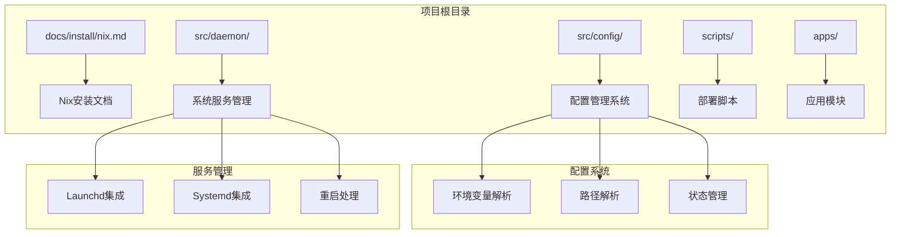
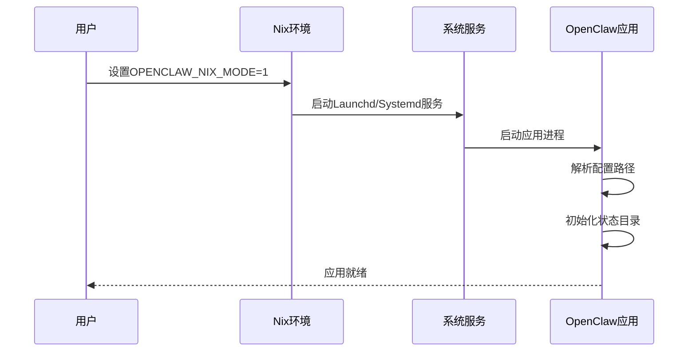
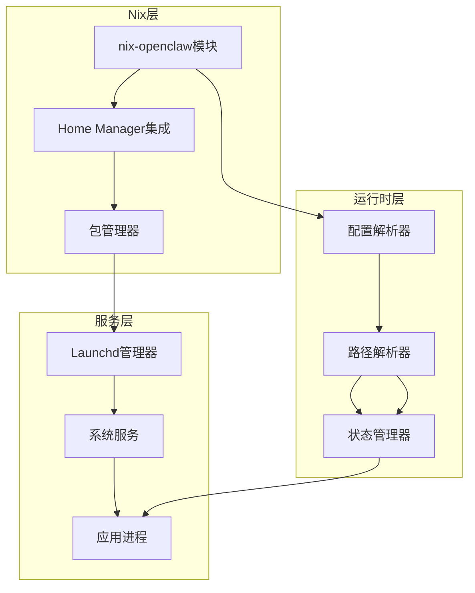
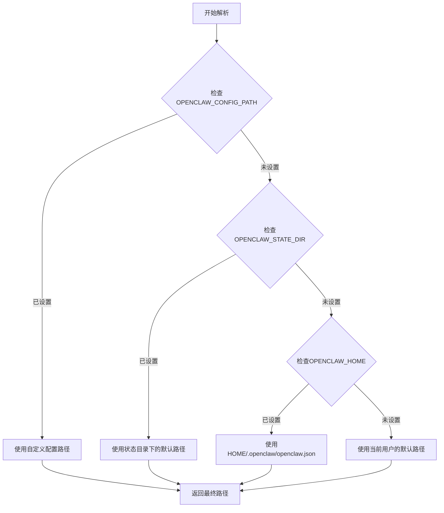
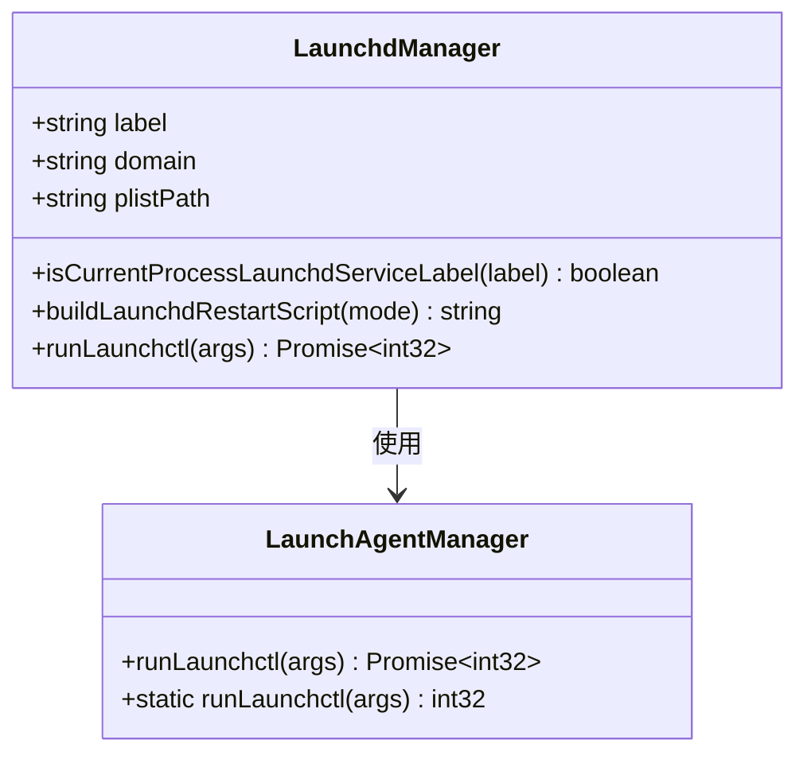
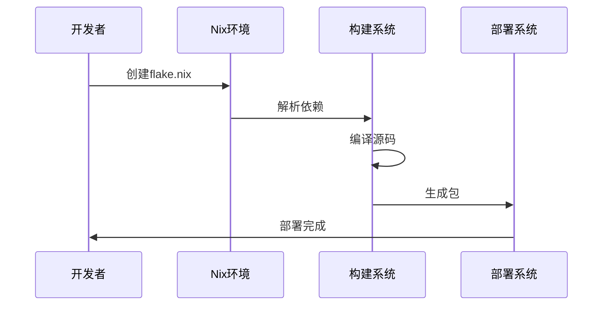
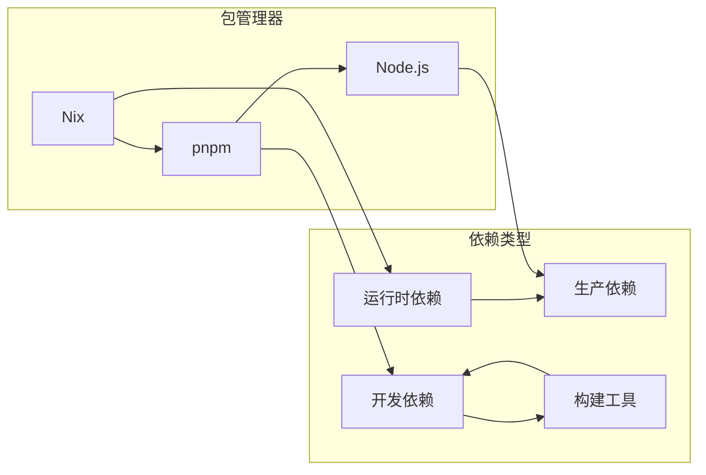
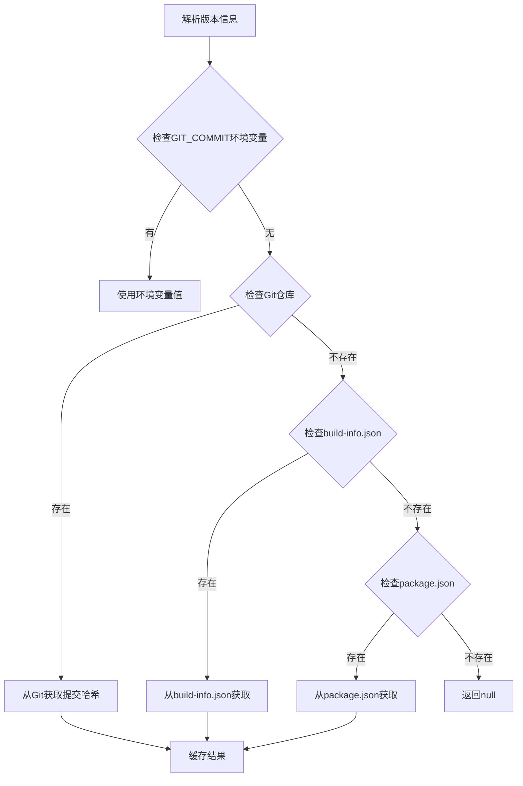
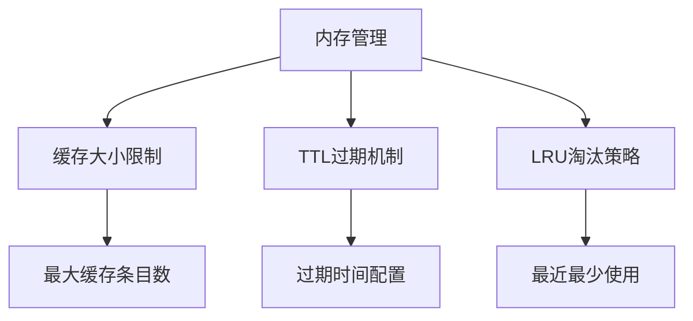
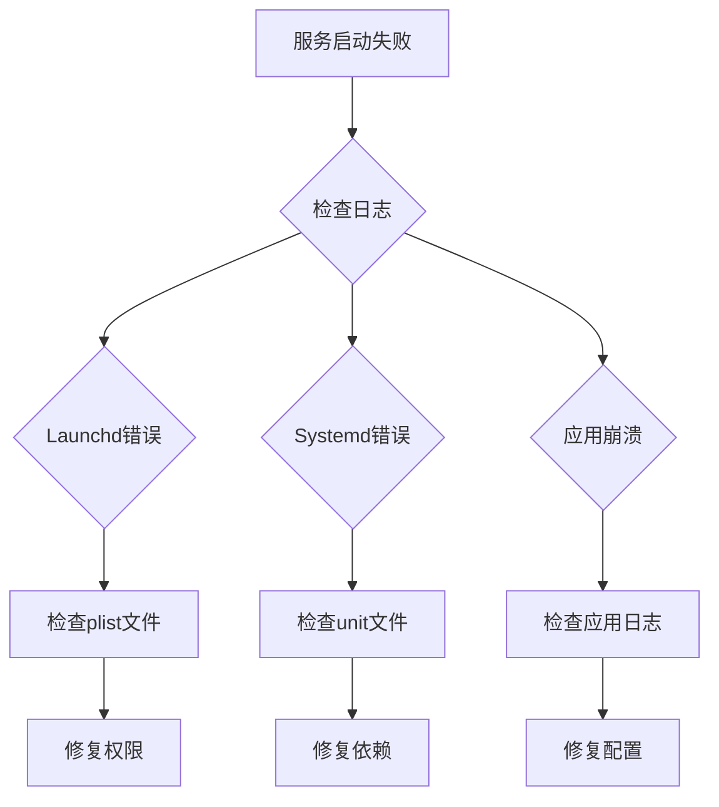

# Nix包管理器部署

<cite>
**本文档引用的文件**
- [docs/install/nix.md](file://docs/install/nix.md)
- [src/config/config.nix-integration-u3-u5-u9.test.ts](file://src/config/config.nix-integration-u3-u5-u9.test.ts)
- [src/config/config.ts](file://src/config/config.ts)
- [src/daemon/launchd-restart-handoff.ts](file://src/daemon/launchd-restart-handoff.ts)
- [apps/macos/Sources/OpenClaw/LaunchAgentManager.swift](file://apps/macos/Sources/OpenClaw/LaunchAgentManager.swift)
- [scripts/systemd/openclaw-auth-monitor.service](file://scripts/systemd/openclaw-auth-monitor.service)
- [scripts/systemd/openclaw-auth-monitor.timer](file://scripts/systemd/openclaw-auth-monitor.timer)
- [scripts/run-node.mjs](file://scripts/run-node.mjs)
- [package.json](file://package.json)
- [src/infra/git-commit.ts](file://src/infra/git-commit.ts)
</cite>

## 目录
1. [简介](#简介)
2. [项目结构](#项目结构)
3. [核心组件](#核心组件)
4. [架构概览](#架构概览)
5. [详细组件分析](#详细组件分析)
6. [依赖关系分析](#依赖关系分析)
7. [性能考虑](#性能考虑)
8. [故障排除指南](#故障排除指南)
9. [结论](#结论)
10. [附录](#附录)

## 简介

本文件为OpenClaw项目在Nix包管理器环境下的部署技术文档。OpenClaw是一个多渠道AI网关，支持可扩展的消息集成。该项目提供了完整的Nix模式支持，允许在声明式环境中进行可重现的安装和回滚。

Nix模式的核心特性包括：
- 声明式配置管理
- 可重现的构建过程
- 环境变量覆盖机制
- 状态目录分离
- 自动化服务管理

## 项目结构

OpenClaw项目采用模块化架构，主要包含以下关键目录：



**图表来源**
- [docs/install/nix.md:1-99](file://docs/install/nix.md#L1-L99)
- [src/config/config.ts:1-29](file://src/config/config.ts#L1-L29)

**章节来源**
- [docs/install/nix.md:10-99](file://docs/install/nix.md#L10-L99)
- [src/config/config.ts:1-29](file://src/config/config.ts#L1-L29)

## 核心组件

### Nix模式配置系统

OpenClaw实现了完整的Nix模式配置支持，通过环境变量实现灵活的路径管理：

| 环境变量 | 默认值 | 用途 |
|---------|--------|------|
| OPENCLAW_NIX_MODE | 未设置 | 启用Nix模式 |
| OPENCLAW_HOME | 用户主目录 | 根目录控制 |
| OPENCLAW_STATE_DIR | ~/.openclaw | 可变状态存储 |
| OPENCLAW_CONFIG_PATH | $OPENCLAW_STATE_DIR/openclaw.json | 配置文件路径 |

### 系统服务集成

项目支持多种操作系统的服务管理机制：



**图表来源**
- [src/daemon/launchd-restart-handoff.ts:51-85](file://src/daemon/launchd-restart-handoff.ts#L51-L85)
- [apps/macos/Sources/OpenClaw/LaunchAgentManager.swift:61-78](file://apps/macos/Sources/OpenClaw/LaunchAgentManager.swift#L61-L78)

**章节来源**
- [src/config/config.nix-integration-u3-u5-u9.test.ts:36-194](file://src/config/config.nix-integration-u3-u5-u9.test.ts#L36-L194)

## 架构概览

OpenClaw的Nix部署架构分为三个层次：



**图表来源**
- [docs/install/nix.md:12-35](file://docs/install/nix.md#L12-L35)
- [src/config/config.ts:1-29](file://src/config/config.ts#L1-L29)

## 详细组件分析

### 配置路径解析机制

配置系统实现了智能的路径解析逻辑，支持多种环境变量覆盖：



**图表来源**
- [src/config/config.nix-integration-u3-u5-u9.test.ts:55-118](file://src/config/config.nix-integration-u3-u5-u9.test.ts#L55-L118)

### 环境变量检测逻辑

Nix模式的环境变量检测实现了严格的验证机制：

```mermaid
flowchart TD
A[检测OPENCLAW_NIX_MODE] --> B{变量是否存在}
B --> |不存在| C[返回false]
B --> |存在| D{变量为空字符串}
D --> |是| E[返回false]
D --> |否| F{变量等于"1"}
F --> |是| G[返回true]
F --> |否| H[返回false]
```

**图表来源**
- [src/config/config.nix-integration-u3-u5-u9.test.ts:37-53](file://src/config/config.nix-integration-u3-u5-u9.test.ts#L37-L53)

**章节来源**
- [src/config/config.nix-integration-u3-u5-u9.test.ts:36-265](file://src/config/config.nix-integration-u3-u5-u9.test.ts#L36-L265)

### 系统服务管理

项目实现了跨平台的服务管理支持：

#### Launchd集成



**图表来源**
- [src/daemon/launchd-restart-handoff.ts:51-85](file://src/daemon/launchd-restart-handoff.ts#L51-L85)
- [apps/macos/Sources/OpenClaw/LaunchAgentManager.swift:61-78](file://apps/macos/Sources/OpenClaw/LaunchAgentManager.swift#L61-L78)

#### Systemd集成

项目还支持Linux系统的Systemd服务管理，通过定时器实现认证监控：

**章节来源**
- [scripts/systemd/openclaw-auth-monitor.service:1-15](file://scripts/systemd/openclaw-auth-monitor.service#L1-L15)
- [scripts/systemd/openclaw-auth-monitor.timer:1-11](file://scripts/systemd/openclaw-auth-monitor.timer#L1-L11)

### 构建和部署流程



**图表来源**
- [scripts/run-node.mjs:87-140](file://scripts/run-node.mjs#L87-L140)

**章节来源**
- [scripts/run-node.mjs:87-140](file://scripts/run-node.mjs#L87-L140)

## 依赖关系分析

### 包管理依赖

OpenClaw项目使用多种包管理工具：



**图表来源**
- [package.json:340-465](file://package.json#L340-L465)

### 版本控制集成

项目实现了多层版本信息解析机制：



**图表来源**
- [src/infra/git-commit.ts:184-233](file://src/infra/git-commit.ts#L184-L233)

**章节来源**
- [package.json:1-465](file://package.json#L1-L465)
- [src/infra/git-commit.ts:184-233](file://src/infra/git-commit.ts#L184-L233)

## 性能考虑

### 缓存优化策略

项目实现了多层次的缓存机制：

1. **Git提交缓存**：避免重复的Git操作
2. **构建信息缓存**：减少文件系统访问
3. **配置解析缓存**：加速配置加载

### 内存管理



**图表来源**
- [src/infra/outbound/directory-cache.ts:44-98](file://src/infra/outbound/directory-cache.ts#L44-L98)

### 并行构建优化

Nix环境支持并行构建，通过以下方式优化性能：
- 多核编译支持
- 缓存共享机制
- 依赖图优化

## 故障排除指南

### 常见问题诊断

#### Nix模式启用问题

当Nix模式无法正确启用时，检查以下要点：

1. 确认环境变量设置正确
2. 验证Home Manager配置
3. 检查权限设置

#### 服务启动失败



#### 配置路径解析错误

当配置路径解析出现问题时：

1. 验证OPENCLAW_HOME设置
2. 检查OPENCLAW_STATE_DIR权限
3. 确认配置文件格式正确

**章节来源**
- [src/config/config.nix-integration-u3-u5-u9.test.ts:36-265](file://src/config/config.nix-integration-u3-u5-u9.test.ts#L36-L265)

## 结论

OpenClaw的Nix部署方案提供了企业级的可重现性和可维护性。通过声明式配置、严格的环境隔离和完善的错误处理机制，确保了在各种部署场景下的稳定运行。

关键优势包括：
- 完整的Nix模式支持
- 跨平台服务管理
- 智能的配置解析
- 多层次的缓存优化
- 全面的故障排除工具

## 附录

### 部署最佳实践

1. **使用nix-openclaw模块**：推荐使用官方提供的Home Manager模块
2. **配置环境变量**：确保正确的路径解析
3. **定期备份配置**：利用Nix的可重现特性进行快速恢复
4. **监控服务状态**：建立完善的服务监控机制

### 支持的操作系统

- macOS（通过Launchd）
- Linux（通过Systemd）
- NixOS（原生支持）

### 相关资源

- [nix-openclaw官方仓库](https://github.com/openclaw/nix-openclaw)
- [Home Manager文档](https://nix-community.github.io/home-manager/)
- [Nix包管理器文档](https://nixos.org/manual/nix/stable/)