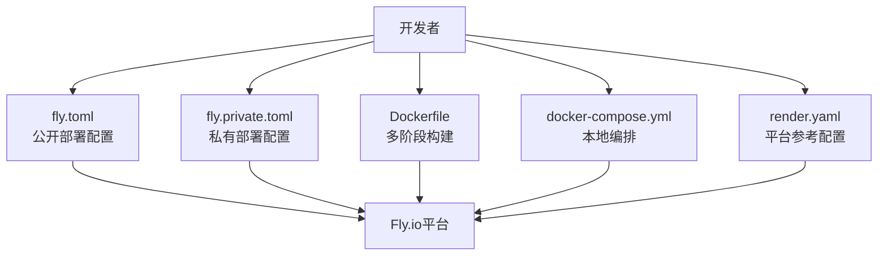
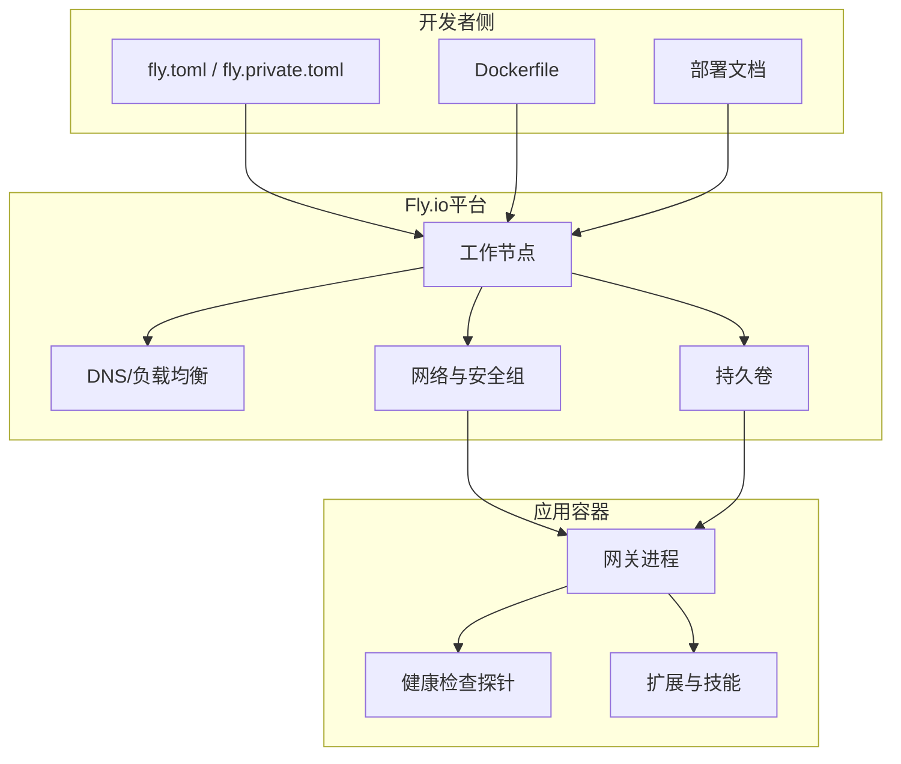
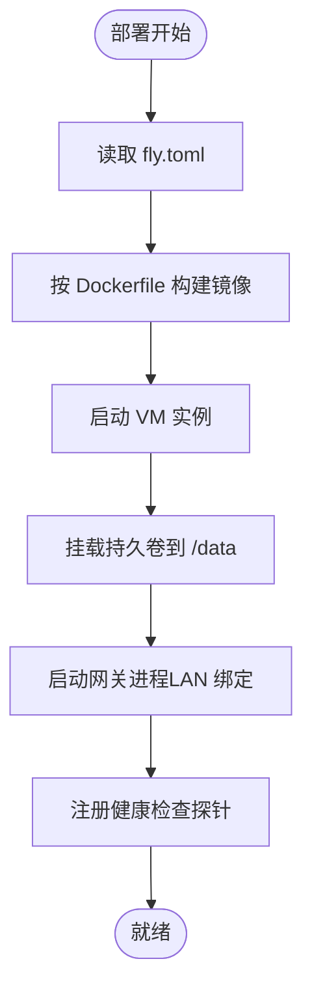
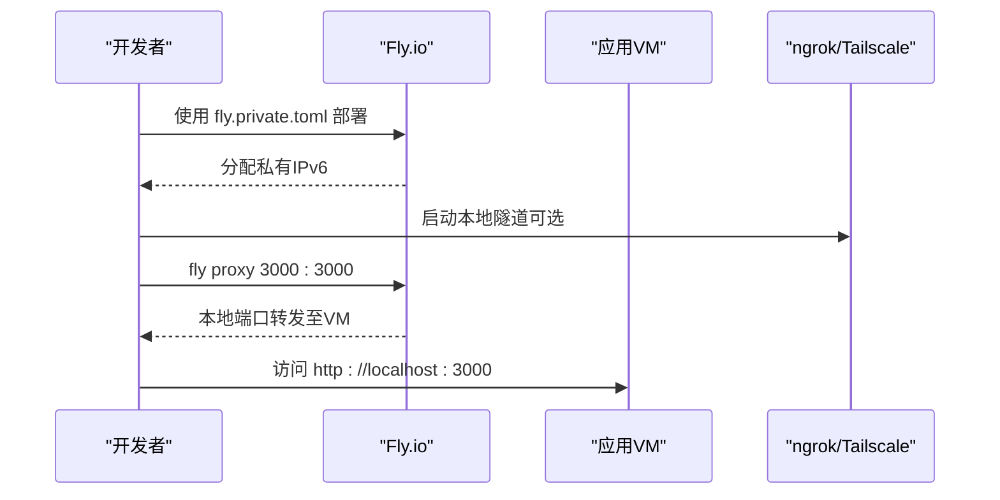
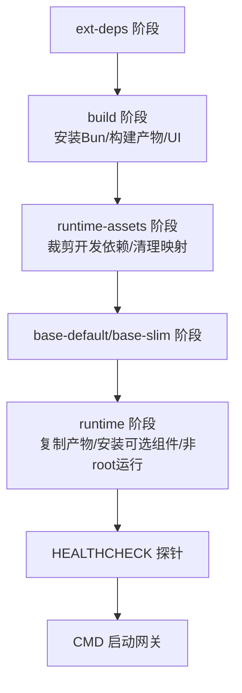
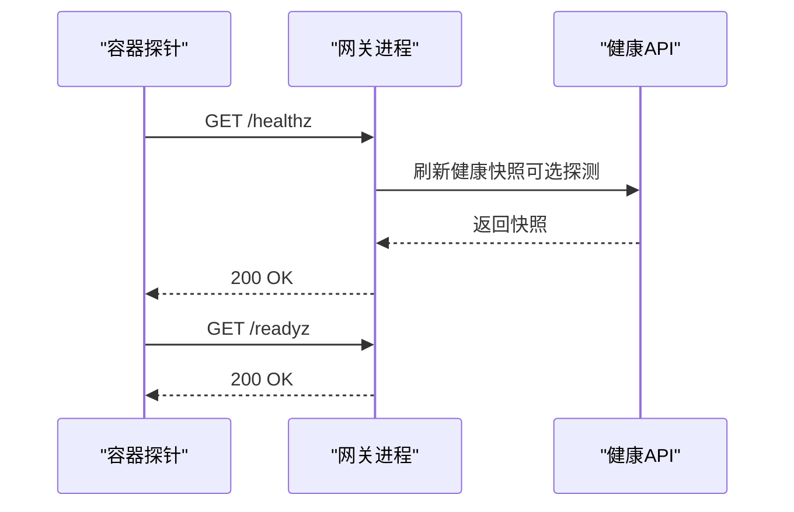
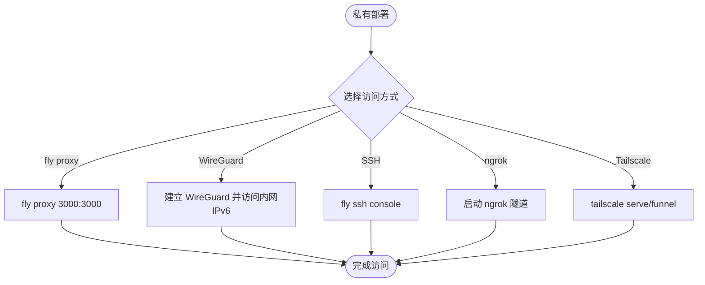
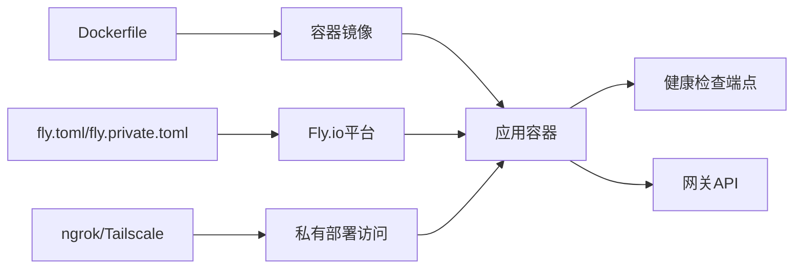

# Fly.io部署

<cite>
**本文档引用的文件**
- [fly.toml](file://fly.toml)
- [fly.private.toml](file://fly.private.toml)
- [Dockerfile](file://Dockerfile)
- [docker-compose.yml](file://docker-compose.yml)
- [render.yaml](file://render.yaml)
- [package.json](file://package.json)
- [docs/install/fly.md](file://docs/install/fly.md)
- [docs/zh-CN/install/fly.md](file://docs/zh-CN/install/fly.md)
- [src/gateway/server-methods/health.ts](file://src/gateway/server-methods/health.ts)
- [extensions/voice-call/src/tunnel.ts](file://extensions/voice-call/src/tunnel.ts)
</cite>

## 目录
1. [简介](#简介)
2. [项目结构](#项目结构)
3. [核心组件](#核心组件)
4. [架构总览](#架构总览)
5. [详细组件分析](#详细组件分析)
6. [依赖关系分析](#依赖关系分析)
7. [性能考虑](#性能考虑)
8. [故障排除指南](#故障排除指南)
9. [结论](#结论)
10. [附录](#附录)

## 简介
本文件面向在Fly.io云平台上部署OpenClaw网关的工程师与运维人员，系统性阐述从配置文件到运行时行为的关键要点，覆盖公开部署与私有部署两种模式、Docker容器化、健康检查与监控、Webhook隧道方案（ngrok与Tailscale）、以及Fly.io特有的性能优化与成本控制建议。文档同时提供可操作的步骤、可视化图示与排障指引，帮助读者快速完成稳定可靠的生产级部署。

## 项目结构
OpenClaw在Fly.io上的部署由以下关键文件协同完成：
- fly.toml：公开部署配置，定义应用名、构建参数、环境变量、进程命令、HTTP服务与虚拟机规格、数据卷挂载等
- fly.private.toml：私有部署配置，不分配公网入口，仅通过代理或VPN访问
- Dockerfile：多阶段构建的容器镜像，包含扩展依赖提取、UI构建、运行时裁剪与健康检查探针
- docker-compose.yml：本地开发与测试的Compose编排，便于对比容器与Fly.io运行时差异
- render.yaml：Render平台参考配置（非Fly.io），展示健康检查路径与磁盘挂载
- package.json：项目脚本与依赖清单，支撑构建与运行时行为
- 文档：docs/install/fly.md与docs/zh-CN/install/fly.md提供Fly.io部署的权威说明

**图表来源**
- [fly.toml:1-35](file://fly.toml#L1-L35)
- [fly.private.toml:1-40](file://fly.private.toml#L1-L40)
- [Dockerfile:1-231](file://Dockerfile#L1-L231)
- [docker-compose.yml:1-77](file://docker-compose.yml#L1-L77)
- [render.yaml:1-22](file://render.yaml#L1-L22)

**章节来源**
- [fly.toml:1-35](file://fly.toml#L1-L35)
- [fly.private.toml:1-40](file://fly.private.toml#L1-L40)
- [Dockerfile:1-231](file://Dockerfile#L1-L231)
- [docker-compose.yml:1-77](file://docker-compose.yml#L1-L77)
- [render.yaml:1-22](file://render.yaml#L1-L22)
- [package.json:1-465](file://package.json#L1-L465)

## 核心组件
- 应用配置层
  - 公开部署：通过[fly.toml:1-35](file://fly.toml#L1-L35)启用HTTP服务、强制HTTPS、保持机器常驻、最小运行实例数、VM规格与数据卷挂载
  - 私有部署：通过[fly.private.toml:1-40](file://fly.private.toml#L1-L40)禁用HTTP服务块，仅通过代理或VPN访问
- 容器镜像层
  - 多阶段构建：分离扩展依赖提取、构建产物生成、运行时裁剪，最终以非root用户运行，内置健康检查探针
  - 可选功能：安装Chromium与Playwright、安装Docker CLI以支持沙箱容器管理
- 运行时服务层
  - 网关进程：默认绑定到回环地址，通过命令行参数切换为LAN访问，配合Fly代理可达公网
  - 健康检查：内置/liveness与/readiness端点，供容器运行时与平台健康探测
- Webhook隧道层
  - 支持ngrok与Tailscale两种隧道方案，用于在私有部署场景下暴露回调接口

**章节来源**
- [fly.toml:10-35](file://fly.toml#L10-L35)
- [fly.private.toml:18-40](file://fly.private.toml#L18-L40)
- [Dockerfile:224-231](file://Dockerfile#L224-L231)
- [extensions/voice-call/src/tunnel.ts:1-314](file://extensions/voice-call/src/tunnel.ts#L1-L314)

## 架构总览
Fly.io部署采用“配置驱动 + 容器化 + 平台托管”的架构。开发者通过配置文件声明应用行为与资源需求，Dockerfile定义镜像构建与运行时特性，Fly.io平台负责调度、扩缩容与网络接入。

**图表来源**
- [fly.toml:1-35](file://fly.toml#L1-L35)
- [fly.private.toml:1-40](file://fly.private.toml#L1-L40)
- [Dockerfile:224-231](file://Dockerfile#L224-L231)

## 详细组件分析

### Fly.io配置文件（fly.toml）
- 应用与区域：定义应用名与主区域，便于就近接入
- 构建：指定Dockerfile路径
- 环境变量：生产模式、包管理偏好、状态目录、Node内存上限
- 进程命令：启动网关进程，绑定LAN端口，允许未配置启动
- HTTP服务：内部端口、强制HTTPS、机器自动启停、最小运行实例、进程选择
- VM规格：CPU与内存配置
- 数据卷：将持久卷挂载到状态目录，确保重启后状态不丢失

**图表来源**
- [fly.toml:7-35](file://fly.toml#L7-L35)
- [Dockerfile:224-231](file://Dockerfile#L224-L231)

**章节来源**
- [fly.toml:1-35](file://fly.toml#L1-L35)

### Fly.io配置文件（fly.private.toml）
- 适用场景：仅出站调用、使用ngrok/Tailscale隧道处理webhook、通过代理或VPN访问
- 关键差异：移除HTTP服务块，不分配公网入口，仅保留私有IPv6
- 访问方式：fly proxy、WireGuard VPN、SSH控制台

**图表来源**
- [fly.private.toml:27-40](file://fly.private.toml#L27-L40)
- [docs/install/fly.md:360-436](file://docs/install/fly.md#L360-L436)

**章节来源**
- [fly.private.toml:1-40](file://fly.private.toml#L1-L40)
- [docs/install/fly.md:360-436](file://docs/install/fly.md#L360-L436)

### Docker容器构建与运行
- 多阶段构建：先提取扩展依赖，再执行构建与UI打包，最后裁剪为精简运行时
- 运行时特性：非root用户、可选安装Chromium/Playwright、可选安装Docker CLI
- 健康检查：内置liveness/readiness端点，容器运行时定期探测
- 进程命令：默认回环绑定，Fly代理需要LAN绑定以可达公网

**图表来源**
- [Dockerfile:27-231](file://Dockerfile#L27-L231)

**章节来源**
- [Dockerfile:1-231](file://Dockerfile#L1-L231)

### 健康检查与监控
- 内置端点：/healthz（liveness）、/readyz（readiness），别名为/health、/ready
- 容器探针：基于Node请求探活，失败时触发重启
- 网关API：/health与/status接口返回运行时快照与状态摘要，支持带探测或缓存模式

**图表来源**
- [Dockerfile:224-231](file://Dockerfile#L224-L231)
- [src/gateway/server-methods/health.ts:10-38](file://src/gateway/server-methods/health.ts#L10-L38)

**章节来源**
- [Dockerfile:224-231](file://Dockerfile#L224-L231)
- [src/gateway/server-methods/health.ts:1-38](file://src/gateway/server-methods/health.ts#L1-L38)

### Webhook隧道与私有部署访问
- ngrok隧道：支持认证令牌与自定义域名，适合临时或演示场景
- Tailscale隧道：提供serve与funnel两种模式，适合长期私有访问
- 私有部署访问：fly proxy、WireGuard VPN、SSH控制台

**图表来源**
- [docs/install/fly.md:406-436](file://docs/install/fly.md#L406-L436)
- [extensions/voice-call/src/tunnel.ts:1-314](file://extensions/voice-call/src/tunnel.ts#L1-L314)

**章节来源**
- [docs/install/fly.md:406-436](file://docs/install/fly.md#L406-L436)
- [extensions/voice-call/src/tunnel.ts:1-314](file://extensions/voice-call/src/tunnel.ts#L1-L314)

### 自动扩缩容与资源规划
- 最小运行实例：fly.toml中设置最小实例数，保证基础可用性
- 机器规格：根据并发与内存需求调整CPU与内存
- 健康检查：合理的探针间隔与超时，避免误判导致不必要的重启
- 状态持久化：通过挂载卷确保重启后会话与状态不丢失

**章节来源**
- [fly.toml:20-35](file://fly.toml#L20-L35)
- [Dockerfile:224-231](file://Dockerfile#L224-L231)

### 域名绑定与HTTPS
- 强制HTTPS：HTTP服务块启用强制HTTPS，确保传输安全
- 域名解析：Fly.io为应用分配子域，结合平台证书实现HTTPS
- 私有部署：如需自定义域名，可通过隧道或反向代理实现

**章节来源**
- [fly.toml:20-26](file://fly.toml#L20-L26)
- [docs/install/fly.md:48-90](file://docs/install/fly.md#L48-L90)

### 文件存储与状态持久化
- 持久卷：fly.toml与fly.private.toml均配置持久卷挂载到/data
- 状态目录：通过环境变量指定状态目录，确保重启后数据不丢失
- 本地开发：docker-compose.yml展示如何在本地映射配置与工作区目录

**章节来源**
- [fly.toml:32-35](file://fly.toml#L32-L35)
- [fly.private.toml:37-40](file://fly.private.toml#L37-L40)
- [docker-compose.yml:12-15](file://docker-compose.yml#L12-L15)

### PostgreSQL数据库集成（概念性说明）
- 场景：当并发写入、外部查询、团队协作或大体量输出成为瓶颈时，考虑使用PostgreSQL替代文件系统或SQLite
- 配置：通过连接字符串环境变量注入，注意凭证可见性与权限最小化原则
- 云厂商：可选Neon、Supabase、Railway等，按需选择冷启动与计费模型

**章节来源**
- [extensions/open-prose/skills/prose/state/postgres.md:64-204](file://extensions/open-prose/skills/prose/state/postgres.md#L64-L204)

## 依赖关系分析
- 配置到平台：fly.toml/fly.private.toml决定应用行为、网络入口与资源规格
- 镜像到运行：Dockerfile定义容器镜像，包含健康检查与运行时能力
- 运行时到监控：健康检查端点与网关API共同构成可观测性基础
- 隧道到访问：ngrok/Tailscale为私有部署提供外网可达性

**图表来源**
- [fly.toml:1-35](file://fly.toml#L1-L35)
- [fly.private.toml:1-40](file://fly.private.toml#L1-L40)
- [Dockerfile:224-231](file://Dockerfile#L224-L231)
- [extensions/voice-call/src/tunnel.ts:1-314](file://extensions/voice-call/src/tunnel.ts#L1-L314)

**章节来源**
- [fly.toml:1-35](file://fly.toml#L1-L35)
- [fly.private.toml:1-40](file://fly.private.toml#L1-L40)
- [Dockerfile:1-231](file://Dockerfile#L1-L231)
- [extensions/voice-call/src/tunnel.ts:1-314](file://extensions/voice-call/src/tunnel.ts#L1-L314)

## 性能考虑
- 内存与并发：根据业务并发与模型占用调整VM内存，避免OOM与频繁GC
- 探针合理性：健康检查间隔与超时应平衡探测及时性与平台负载
- 镜像体积：多阶段构建与裁剪减少镜像体积，缩短拉取与启动时间
- 可选组件：按需安装Chromium/Playwright与Docker CLI，避免不必要的体积与启动开销
- 状态持久化：使用持久卷避免重启带来的状态重建成本

**章节来源**
- [fly.toml:28-31](file://fly.toml#L28-L31)
- [Dockerfile:120-207](file://Dockerfile#L120-L207)
- [Dockerfile:224-231](file://Dockerfile#L224-L231)

## 故障排除指南
- 健康检查失败
  - 检查容器探针是否可达，确认端口与绑定策略一致
  - 查看网关API的健康快照，定位具体通道或会话问题
- 状态未持久化
  - 确认状态目录已正确挂载到/data，且环境变量指向该路径
- 私有部署无法访问
  - 使用fly proxy进行本地转发，或建立WireGuard VPN
  - 如需webhook回调，使用ngrok或Tailscale隧道暴露本地端口
- 更新与回滚
  - 通过fly deploy更新镜像，必要时查看日志与状态
  - 若手动修改了机器命令，注意后续部署可能重置，需重新应用

**章节来源**
- [Dockerfile:224-231](file://Dockerfile#L224-L231)
- [src/gateway/server-methods/health.ts:10-38](file://src/gateway/server-methods/health.ts#L10-L38)
- [docs/install/fly.md:322-358](file://docs/install/fly.md#L322-L358)
- [docs/install/fly.md:406-436](file://docs/install/fly.md#L406-L436)

## 结论
通过fly.toml与fly.private.toml的合理配置、Dockerfile的多阶段构建与健康检查探针、以及ngrok/Tailscale隧道方案，OpenClaw可在Fly.io上实现安全、稳定且可扩展的部署。公开部署适合快速上线与演示，私有部署则满足高安全性与隐蔽性需求。结合合理的资源规划与可观测性，可有效提升系统可靠性与运维效率。

## 附录
- 参考文档
  - [docs/install/fly.md](file://docs/install/fly.md)
  - [docs/zh-CN/install/fly.md](file://docs/zh-CN/install/fly.md)
- 相关文件
  - [package.json:217-338](file://package.json#L217-L338)
  - [render.yaml:1-22](file://render.yaml#L1-L22)