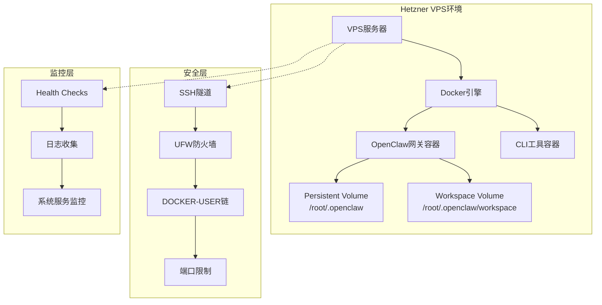
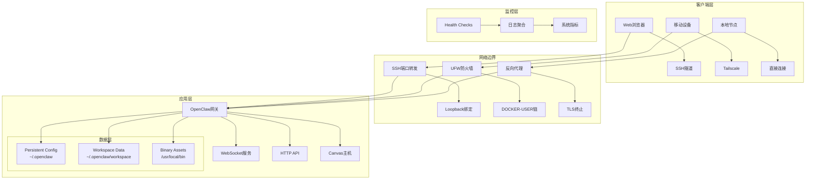
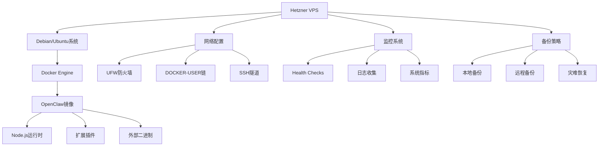

# Hetzner VPS部署

<cite>
**本文档引用的文件**
- [hetzner.md](file://docs/install/hetzner.md)
- [vps.md](file://docs/vps.md)
- [docker.md](file://docs/install/docker.md)
- [security/index.md](file://docs/gateway/security/index.md)
- [backup.md](file://docs/cli/backup.md)
- [docker-compose.yml](file://docker-compose.yml)
- [Dockerfile](file://Dockerfile)
- [systemd.ts](file://src/daemon/systemd.ts)
- [systemd.test.ts](file://src/daemon/systemd.test.ts)
- [gateway-network-docker.sh](file://scripts/e2e/gateway-network-docker.sh)
- [raspberry-pi.md](file://docs/platforms/raspberry-pi.md)
</cite>

## 目录
1. [简介](#简介)
2. [项目结构](#项目结构)
3. [核心组件](#核心组件)
4. [架构概览](#架构概览)
5. [详细组件分析](#详细组件分析)
6. [依赖关系分析](#依赖关系分析)
7. [性能考虑](#性能考虑)
8. [故障排除指南](#故障排除指南)
9. [结论](#结论)
10. [附录](#附录)

## 简介

本文档提供了基于Hetzner VPS的OpenClaw部署完整技术指南。该部署方案专注于生产级稳定性，采用Docker容器化架构，在Hetzner VPS上实现24/7不间断运行。文档涵盖了从服务器初始化配置、防火墙设置和安全加固，到Docker部署的特殊配置、网络优化和存储管理的完整流程。

该部署方案的核心优势在于：
- **生产级可靠性**：通过Docker容器化确保环境一致性
- **持久化存储**：明确的数据持久化策略，确保重启不丢失
- **安全隔离**：多层安全防护，包括网络隔离和访问控制
- **自动化运维**：完善的监控、备份和灾难恢复机制
- **成本优化**：针对Hetzner平台的性能调优和成本控制

## 项目结构

OpenClaw项目采用模块化架构设计，为VPS部署提供了完整的基础设施支持：



**图表来源**
- [hetzner.md:75-87](file://docs/install/hetzner.md#L75-L87)
- [docker-compose.yml:1-77](file://docker-compose.yml#L1-L77)

**章节来源**
- [hetzner.md:11-44](file://docs/install/hetzner.md#L11-L44)
- [docker-compose.yml:1-77](file://docker-compose.yml#L1-L77)

## 核心组件

### 1. VPS服务器初始化

Hetzner VPS作为OpenClaw运行的基础环境，需要进行严格的初始化配置：

**硬件配置建议**：
- 推荐CX22规格：2 vCPU、4GB RAM、20GB SSD
- 选择Debian/Ubuntu作为操作系统
- 预留足够的磁盘空间用于日志和缓存

**系统基础配置**：
- 更新系统包列表并升级现有软件包
- 安装Docker运行时环境
- 配置SSH密钥认证，禁用密码登录
- 设置防火墙规则，仅开放必要端口

### 2. Docker容器化架构

OpenClaw采用双容器架构，确保网关服务和CLI工具的分离：

**容器角色分工**：
- **openclaw-gateway**：主容器，运行OpenClaw网关服务
- **openclaw-cli**：辅助容器，提供命令行界面和工具集

**存储卷映射**：
- 配置目录映射：`/root/.openclaw` → `/home/node/.openclaw`
- 工作区目录映射：`/root/.openclaw/workspace` → `/home/node/.openclaw/workspace`

### 3. 安全加固措施

实施多层次的安全防护策略：

**网络层面**：
- 使用UFW防火墙限制入站连接
- 配置DOCKER-USER链确保Docker流量符合防火墙策略
- 仅暴露必要的管理端口

**访问控制**：
- 强制使用SSH密钥认证
- 配置网关访问令牌
- 实施mDNS服务的访问限制

**系统层面**：
- 非特权用户运行容器
- 限制容器权限和能力
- 启用健康检查和自动重启

**章节来源**
- [hetzner.md:75-130](file://docs/install/hetzner.md#L75-L130)
- [docker-compose.yml:12-14](file://docker-compose.yml#L12-L14)
- [security/index.md:640-695](file://docs/gateway/security/index.md#L640-L695)

## 架构概览

OpenClaw在Hetzner VPS上的整体架构采用容器化微服务模式：



**图表来源**
- [hetzner.md:164-203](file://docs/install/hetzner.md#L164-L203)
- [security/index.md:619-695](file://docs/gateway/security/index.md#L619-L695)

## 详细组件分析

### Docker部署配置

#### 1. 镜像构建优化

Dockerfile采用了多阶段构建策略，确保最终镜像的精简性和安全性：

**构建阶段策略**：
- **扩展依赖提取**：仅复制需要的package.json文件，避免不必要的依赖变更
- **分层缓存优化**：将依赖安装放在独立层，提高构建缓存命中率
- **运行时镜像选择**：默认使用node:22-bookworm，支持slim变体

**安全特性**：
- 非特权用户运行（uid 1000）
- 严格的能力限制和权限控制
- 系统完整性验证和签名检查

#### 2. 容器编排配置

docker-compose.yml定义了完整的容器编排规范：

**服务配置要点**：
- 环境变量管理：集中管理所有运行时配置
- 存储卷挂载：确保数据持久化和隔离
- 网络端口映射：灵活的网络访问控制
- 健康检查：自动监控服务可用性

**安全配置**：
- 容器权限限制
- 网络隔离策略
- 资源限制和配额

**章节来源**
- [Dockerfile:1-231](file://Dockerfile#L1-L231)
- [docker-compose.yml:1-77](file://docker-compose.yml#L1-L77)

### 网络安全配置

#### 1. 防火墙策略

Hetzner VPS的网络安全采用分层防护策略：

**UFW防火墙配置**：
- 默认拒绝所有入站连接
- 仅允许SSH（22/tcp）、HTTP（80/tcp）、HTTPS（443/tcp）端口
- 配置DOCKER-USER链确保Docker流量合规

**DOCKER-USER链规则**：
```bash
-A DOCKER-USER -m conntrack --ctstate ESTABLISHED,RELATED -j RETURN
-A DOCKER-USER -s 127.0.0.0/8 -j RETURN
-A DOCKER-USER -s 10.0.0.0/8 -j RETURN
-A DOCKER-USER -s 172.16.0.0/12 -j RETURN
-A DOCKER-USER -s 192.168.0.0/16 -j RETURN
-A DOCKER-USER -s 100.64.0.0/10 -j RETURN
-A DOCKER-USER -p tcp --dport 80 -j RETURN
-A DOCKER-USER -p tcp --dport 443 -j RETURN
-A DOCKER-USER -m conntrack --ctstate NEW -j DROP
```

#### 2. 访问控制策略

**绑定模式配置**：
- 默认loopback绑定，仅本地访问
- 支持lan绑定，需要配合认证和防火墙
- 推荐使用Tailscale Serve替代LAN绑定

**SSH隧道配置**：
```bash
ssh -N -L 18789:127.0.0.1:18789 root@YOUR_VPS_IP
```

**章节来源**
- [security/index.md:640-695](file://docs/gateway/security/index.md#L640-L695)
- [hetzner.md:184-198](file://docs/install/hetzner.md#L184-L198)

### 存储管理策略

#### 1. 数据持久化架构

OpenClaw采用明确的数据持久化策略，确保关键数据的可靠存储：

**持久化目录结构**：
- 配置目录：`/root/.openclaw` → `/home/node/.openclaw`
- 工作区目录：`/root/.openclaw/workspace` → `/home/node/.openclaw/workspace`
- 外部二进制：`/usr/local/bin/` → 镜像内置

**数据保护机制**：
- 容器卷挂载确保数据与容器生命周期分离
- 权限设置防止权限问题导致的数据丢失
- 备份策略覆盖所有持久化数据

#### 2. 外部二进制管理

**构建时集成**：
- 所有外部二进制必须在构建时集成到镜像中
- 运行时安装的二进制在重启后会丢失
- 支持gog、goplaces、wacli等常用工具

**二进制兼容性**：
- 确保二进制文件与目标架构兼容
- 提供ARM和x86_64版本支持
- 集成到Docker构建流程中

**章节来源**
- [hetzner.md:205-264](file://docs/install/hetzner.md#L205-L264)
- [docker-compose.yml:12-14](file://docker-compose.yml#L12-L14)

### 监控与健康检查

#### 1. 健康检查机制

Docker容器内置了完整的健康检查机制：

**容器级健康检查**：
- HTTP端点：/healthz（存活检查）、/readyz（就绪检查）
- 健康检查间隔：30秒
- 超时时间：5秒
- 重试次数：5次
- 启动等待：20秒

**服务级监控**：
- 网关服务状态监控
- WebSocket连接状态检查
- 外部服务连接探测

#### 2. 系统服务监控

**systemd集成**：
- 自动服务重启策略
- 启动延迟和超时配置
- 运行状态跟踪

**监控指标**：
- 服务启动时间
- 内存使用情况
- 磁盘空间使用
- 网络连接状态

**章节来源**
- [docker-compose.yml:38-49](file://docker-compose.yml#L38-L49)
- [systemd.ts:223-352](file://src/daemon/systemd.ts#L223-L352)

## 依赖关系分析

OpenClaw在Hetzner VPS部署涉及多个层面的依赖关系：



**图表来源**
- [hetzner.md:90-103](file://docs/install/hetzner.md#L90-L103)
- [docker-compose.yml:1-77](file://docker-compose.yml#L1-L77)

**依赖关系特点**：
- **低耦合高内聚**：各组件职责明确，接口清晰
- **可替换性**：网络、存储、监控组件可独立替换
- **向后兼容**：配置文件和API保持向前兼容

**章节来源**
- [docker-compose.yml:1-77](file://docker-compose.yml#L1-L77)
- [Dockerfile:1-231](file://Dockerfile#L1-L231)

## 性能考虑

### 1. 系统性能优化

针对Hetzner VPS的性能调优策略：

**内存优化**：
- 启用Node.js模块编译缓存
- 配置适当的垃圾回收参数
- 监控内存使用情况，及时扩容

**存储性能**：
- 使用SSD存储提升I/O性能
- 合理配置swap空间
- 优化文件系统参数

**网络优化**：
- TCP连接复用
- 压缩传输数据
- CDN加速静态资源

### 2. Docker性能调优

**镜像优化**：
- 减少镜像层数量
- 清理不必要的中间文件
- 使用多阶段构建

**容器资源限制**：
- CPU配额和限制
- 内存上限设置
- 磁盘I/O限制

**章节来源**
- [vps.md:55-103](file://docs/vps.md#L55-L103)
- [raspberry-pi.md:182-244](file://docs/platforms/raspberry-pi.md#L182-L244)

## 故障排除指南

### 1. 常见问题诊断

**容器启动失败**：
- 检查Docker守护进程状态
- 查看容器日志输出
- 验证端口占用情况

**网络连接问题**：
- 确认防火墙规则配置
- 检查DOCKER-USER链规则
- 验证SSH隧道连接

**数据持久化问题**：
- 检查卷挂载权限
- 验证目录所有权
- 确认磁盘空间充足

### 2. 系统服务故障处理

**systemd服务问题**：
- 使用systemctl status查看服务状态
- 检查服务配置文件
- 分析错误日志信息

**健康检查失败**：
- 验证服务端口监听
- 检查进程状态
- 确认依赖服务正常

### 3. 备份和恢复

**备份验证**：
- 使用backup verify命令验证备份完整性
- 检查备份文件的manifest.json
- 验证关键数据的可恢复性

**灾难恢复流程**：
- 停止现有服务
- 恢复备份数据
- 重新启动服务
- 验证服务功能

**章节来源**
- [systemd.ts:223-352](file://src/daemon/systemd.ts#L223-L352)
- [backup.md:1-77](file://docs/cli/backup.md#L1-L77)

## 结论

基于Hetzner VPS的OpenClaw部署方案提供了企业级的稳定性和可靠性。通过容器化架构、严格的安全策略和完善的监控体系，该方案能够满足生产环境的各种需求。

**主要优势**：
- **高可用性**：容器化部署确保环境一致性
- **安全性**：多层防护策略保护系统安全
- **可维护性**：完善的监控和备份机制
- **成本效益**：Hetzner平台的性价比优势

**实施建议**：
- 根据业务需求选择合适的VPS规格
- 制定详细的备份和灾难恢复计划
- 建立监控告警机制
- 定期进行安全审计和性能优化

该部署方案为OpenClaw在云端的稳定运行提供了坚实的技术基础，适合各种规模的企业和组织使用。

## 附录

### A. 成本优化策略

**Hetzner平台成本控制**：
- 选择合适的VPS规格，避免过度配置
- 利用Hetzner的免费带宽额度
- 合理规划存储空间，避免浪费
- 使用SSH密钥认证减少管理成本

**Docker优化技巧**：
- 使用多阶段构建减小镜像体积
- 启用镜像层缓存提高构建效率
- 定期清理未使用的镜像和容器
- 优化容器资源分配

### B. 灾难恢复计划

**备份策略**：
- 定期创建增量备份
- 验证备份数据的完整性
- 测试灾难恢复流程
- 建立异地备份机制

**恢复流程**：
- 快速评估故障影响范围
- 制定详细的恢复步骤
- 执行恢复操作并验证结果
- 总结经验教训改进预案

### C. 性能监控指标

**关键性能指标**：
- 服务响应时间
- 错误率和异常率
- 资源使用率（CPU、内存、磁盘、网络）
- 用户并发数和会话数
- 外部服务连接成功率

**监控工具推荐**：
- Prometheus + Grafana监控套件
- ELK Stack日志分析
- APM应用性能监控
- 自定义业务指标监控