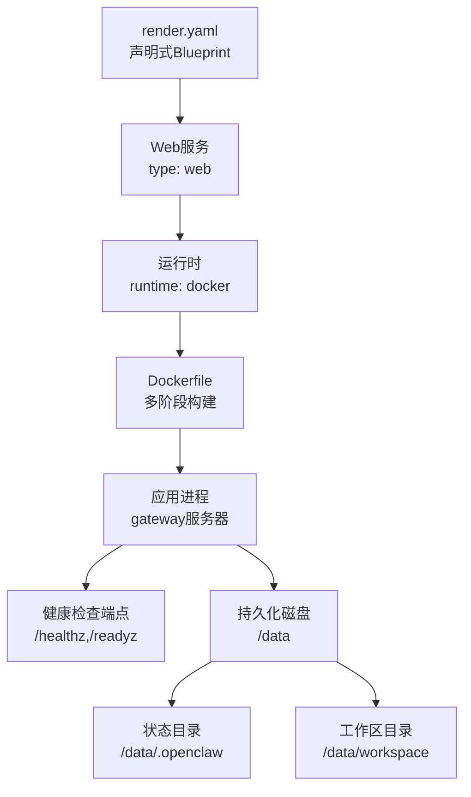
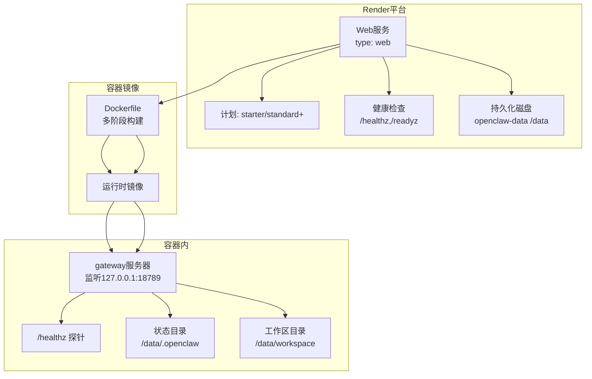
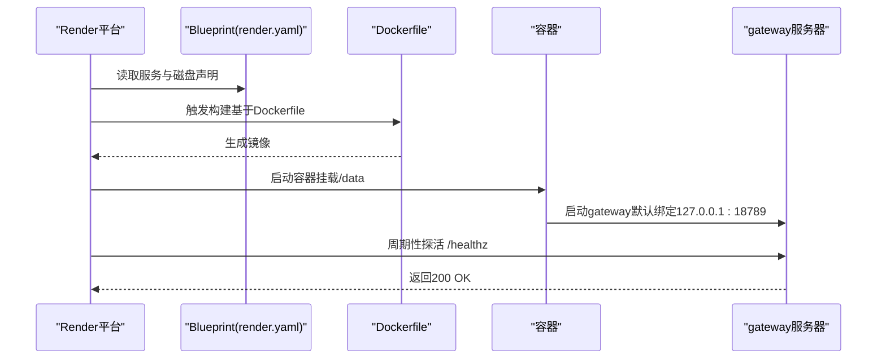
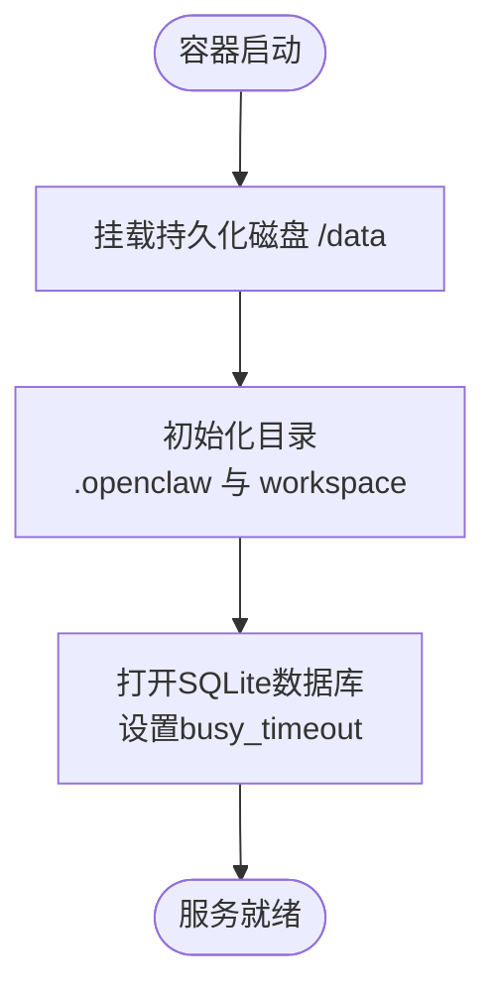
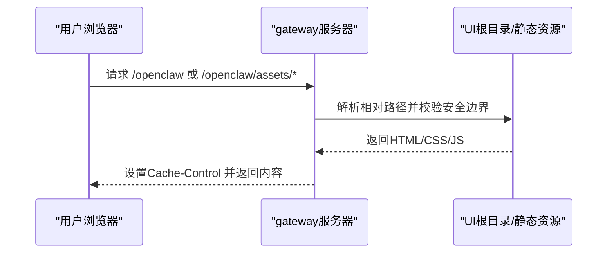
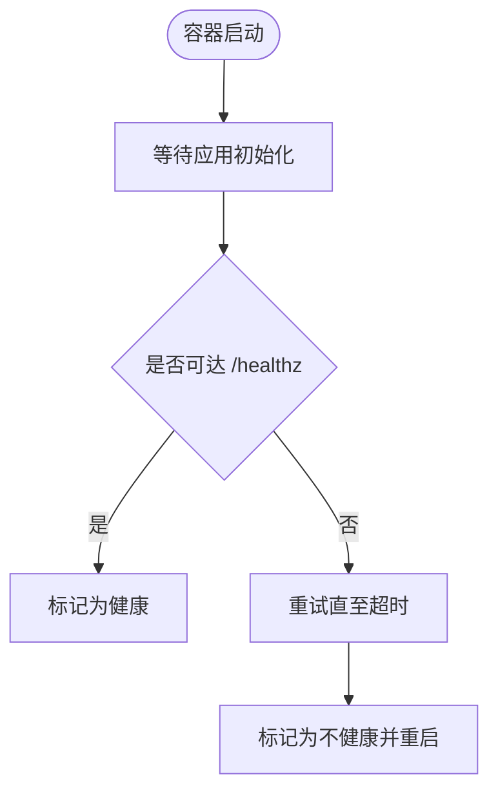
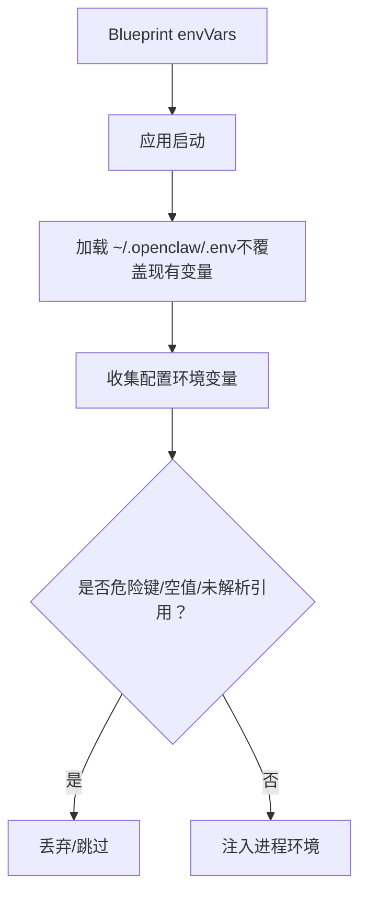
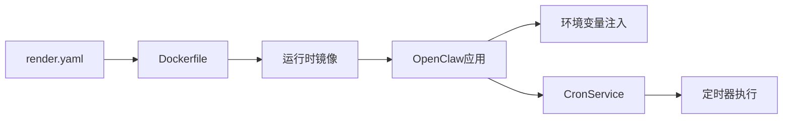

# Render部署

<cite>
**本文引用的文件**
- [render.yaml](file://render.yaml)
- [Dockerfile](file://Dockerfile)
- [docs/install/render.mdx](file://docs/install/render.mdx)
- [package.json](file://package.json)
- [src/config/env-vars.ts](file://src/config/env-vars.ts)
- [src/infra/dotenv.ts](file://src/infra/dotenv.ts)
- [openclaw.podman.env](file://openclaw.podman.env)
- [src/gateway/control-ui.ts](file://src/gateway/control-ui.ts)
- [src/canvas-host/a2ui.ts](file://src/canvas-host/a2ui.ts)
- [src/memory/manager-sync-ops.ts](file://src/memory/manager-sync-ops.ts)
- [extensions/open-prose/skills/prose/state/sqlite.md](file://extensions/open-prose/skills/prose/state/sqlite.md)
- [src/cron/service.ts](file://src/cron/service.ts)
- [src/cron/service/timer.ts](file://src/cron/service/timer.ts)
</cite>

## 目录
1. [简介](#简介)
2. [项目结构](#项目结构)
3. [核心组件](#核心组件)
4. [架构总览](#架构总览)
5. [详细组件分析](#详细组件分析)
6. [依赖关系分析](#依赖关系分析)
7. [性能考虑](#性能考虑)
8. [故障排查指南](#故障排查指南)
9. [结论](#结论)
10. [附录](#附录)

## 简介
本文件面向在Render云平台上部署OpenClaw的工程团队，提供从Blueprint到运行时的完整技术说明。内容覆盖：
- Web Service与Worker Service的配置差异与适用场景
- 数据库与持久化存储（SQLite与向量扩展）集成
- 静态资源托管与控制界面访问路径
- 渲染管道与健康检查、环境变量注入与安全策略
- SSL证书与自定义域名配置
- 自动部署触发、预览环境与回滚策略
- 性能优化与成本管理建议

## 项目结构
OpenClaw在Render上的部署由一个单一的Docker Blueprint驱动：render.yaml。该Blueprint声明了Web服务类型、运行时、健康检查端点、环境变量、以及持久化磁盘挂载。Dockerfile负责多阶段构建与运行时精简，确保容器体积小、启动快。

图表来源
- [render.yaml:1-22](file://render.yaml#L1-L22)
- [Dockerfile:224-231](file://Dockerfile#L224-L231)

章节来源
- [render.yaml:1-22](file://render.yaml#L1-L22)
- [Dockerfile:1-231](file://Dockerfile#L1-L231)
- [docs/install/render.mdx:24-51](file://docs/install/render.mdx#L24-L51)

## 核心组件
- Web服务（Web Service）
  - 类型：web
  - 运行时：docker
  - 健康检查：/health（别名 /healthz）、/readyz
  - 端口：默认8080（通过环境变量PORT暴露）
  - 计划：starter（可按需调整）
- 持久化磁盘
  - 名称：openclaw-data
  - 挂载路径：/data
  - 大小：1 GB
  - 用途：存放状态目录与工作区，支持重启后数据不丢失
- 环境变量
  - PORT：容器监听端口
  - SETUP_PASSWORD：首次部署时用于初始化向导的安全密码（同步：false，即部署时提示输入）
  - OPENCLAW_STATE_DIR：状态目录（/data/.openclaw）
  - OPENCLAW_WORKSPACE_DIR：工作区目录（/data/workspace）
  - OPENCLAW_GATEWAY_TOKEN：网关认证令牌（自动生成，增强安全性）

章节来源
- [render.yaml:2-22](file://render.yaml#L2-L22)
- [Dockerfile:224-231](file://Dockerfile#L224-L231)
- [docs/install/render.mdx:74-86](file://docs/install/render.mdx#L74-L86)

## 架构总览
下图展示了OpenClaw在Render上的整体运行架构：Blueprint定义服务与磁盘；Dockerfile构建镜像；容器内运行gateway服务器；健康检查由容器内部探针执行；持久化磁盘挂载至/data，供状态与工作区使用。

图表来源
- [render.yaml:1-22](file://render.yaml#L1-L22)
- [Dockerfile:224-231](file://Dockerfile#L224-L231)

## 详细组件分析

### Web Service配置与渲染管道
- Blueprint声明
  - 服务类型为web，运行时为docker，健康检查路径为/health（/healthz别名）
  - 环境变量包括PORT、SETUP_PASSWORD（部署时提示）、OPENCLAW_STATE_DIR、OPENCLAW_WORKSPACE_DIR、OPENCLAW_GATEWAY_TOKEN（自动生成）
  - 持久化磁盘openclaw-data挂载至/data，大小1 GB
- 渲染管道
  - Render根据render.yaml与Dockerfile进行构建与部署
  - 容器启动后，gateway服务器在127.0.0.1:18789上监听（默认），并通过/healthz进行存活探针
- 环境变量管理
  - Blueprint中通过envVars声明变量；部分变量（如SETUP_PASSWORD）设置为非同步（sync: false），在部署时提示输入
  - OPENCLAW_GATEWAY_TOKEN设置为自动生成（generateValue: true），提升安全性
- SSL与自定义域名
  - Render为服务自动提供TLS证书；可通过Dashboard添加自定义域名并按指示配置DNS（CNAME）

图表来源
- [render.yaml:1-22](file://render.yaml#L1-L22)
- [Dockerfile:224-231](file://Dockerfile#L224-L231)

章节来源
- [render.yaml:1-22](file://render.yaml#L1-L22)
- [docs/install/render.mdx:12-22](file://docs/install/render.mdx#L12-L22)
- [docs/install/render.mdx:106-109](file://docs/install/render.mdx#L106-L109)
- [docs/install/render.mdx:110-116](file://docs/install/render.mdx#L110-L116)

### Worker Service（概念性说明）
- 适用场景
  - 执行后台任务、定时作业、消息队列处理等长耗时或异步任务
- 配置要点
  - 在Blueprint中新增type: worker的服务条目
  - 使用独立的环境变量集，避免与Web服务共享敏感配置
  - 如需与Web服务通信，通过Render提供的服务间网络或外部API
- 与Web Service的差异
  - 不需要公开HTTP端点与健康检查路径
  - 可使用更小的实例规格或按需扩缩容
  - 与持久化磁盘交互时注意并发写入与锁竞争

[本节为概念性说明，未直接分析具体源码文件]

### 数据库与持久化集成
- 存储位置
  - 状态目录：/data/.openclaw（用于配置、密钥、会话等）
  - 工作区目录：/data/workspace（用于插件、技能、临时文件等）
- SQLite与向量扩展
  - 内存与会话相关的SQLite数据库位于状态目录
  - 当启用向量功能时，数据库连接会设置busy_timeout以减少并发冲突
- 示例模式
  - 插件示例中提供了SQLite核心表结构与扩展建议（索引、JSON字段、自定义表等）

图表来源
- [render.yaml:18-21](file://render.yaml#L18-L21)
- [Dockerfile:224-231](file://Dockerfile#L224-L231)
- [src/memory/manager-sync-ops.ts:259-274](file://src/memory/manager-sync-ops.ts#L259-L274)
- [extensions/open-prose/skills/prose/state/sqlite.md:158-227](file://extensions/open-prose/skills/prose/state/sqlite.md#L158-L227)

章节来源
- [render.yaml:18-21](file://render.yaml#L18-L21)
- [src/memory/manager-sync-ops.ts:259-274](file://src/memory/manager-sync-ops.ts#L259-L274)
- [extensions/open-prose/skills/prose/state/sqlite.md:158-227](file://extensions/open-prose/skills/prose/state/sqlite.md#L158-L227)

### 静态资源托管与控制界面
- 控制界面（Control UI）
  - 通过内置路由解析UI根目录与静态资源，支持安全路径校验与缓存控制
  - 支持HTML注入与HEAD请求优化
- A2UI资源
  - Canvas A2UI资源在开发与构建流程中被复制到输出目录，运行时通过HTTP路由提供
- 路径与安全
  - 对符号链接与硬链接进行安全边界检查，防止越权访问

图表来源
- [src/gateway/control-ui.ts:375-426](file://src/gateway/control-ui.ts#L375-L426)
- [src/canvas-host/a2ui.ts:173-209](file://src/canvas-host/a2ui.ts#L173-L209)

章节来源
- [src/gateway/control-ui.ts:375-426](file://src/gateway/control-ui.ts#L375-L426)
- [src/canvas-host/a2ui.ts:173-209](file://src/canvas-host/a2ui.ts#L173-L209)

### 渲染管道与健康检查
- 健康检查端点
  - /healthz（存活探针）与/readyz（就绪探针）
  - Blueprint中healthCheckPath指向/health（/healthz别名）
- 探针实现
  - Dockerfile中HEALTHCHECK通过HTTP请求验证容器内部服务可用性
- 建议
  - 确保容器启动时间在Render允许的超时范围内（通常小于30秒）
  - 如遇冷启动延迟，考虑升级实例规格或使用预热策略

图表来源
- [Dockerfile:224-231](file://Dockerfile#L224-L231)
- [render.yaml:6](file://render.yaml#L6)

章节来源
- [Dockerfile:224-231](file://Dockerfile#L224-L231)
- [render.yaml:6](file://render.yaml#L6)

### 环境变量管理与安全
- 变量注入
  - Blueprint中的envVars用于注入运行时变量
  - 应用层支持从~/.openclaw/.env加载全局变量，且不会覆盖已存在的同名变量
- 安全策略
  - 应用层对危险环境变量键进行拦截，避免覆盖系统级变量
  - 对配置中的环境变量引用进行检查，防止未解析占位符污染进程环境
- 密钥与令牌
  - OPENCLAW_GATEWAY_TOKEN通过Blueprint自动生成，降低泄露风险
  - SETUP_PASSWORD在部署时提示输入，避免明文提交

图表来源
- [render.yaml:7-17](file://render.yaml#L7-L17)
- [src/infra/dotenv.ts:6-20](file://src/infra/dotenv.ts#L6-L20)
- [src/config/env-vars.ts:79-97](file://src/config/env-vars.ts#L79-L97)

章节来源
- [render.yaml:7-17](file://render.yaml#L7-L17)
- [src/infra/dotenv.ts:6-20](file://src/infra/dotenv.ts#L6-L20)
- [src/config/env-vars.ts:79-97](file://src/config/env-vars.ts#L79-L97)

### SSL证书与自定义域名
- 自动证书
  - Render为服务自动颁发TLS证书，无需手动上传
- 自定义域名
  - 在Dashboard中添加域名并按指示配置CNAME记录
  - Render将自动完成证书申请与续期

章节来源
- [docs/install/render.mdx:110-116](file://docs/install/render.mdx#L110-L116)

### 自动部署触发、预览环境与回滚策略
- 自动部署
  - 若使用原始仓库，Render不会自动拉取更新；可在Dashboard中手动同步Blueprint
- 预览环境
  - 可通过Fork与不同分支配合Blueprint实现多环境部署
- 回滚策略
  - 利用Render的版本历史与服务切换能力进行快速回滚
  - 建议在生产前开启备份导出（/setup/export），以便恢复

章节来源
- [docs/install/render.mdx:106-109](file://docs/install/render.mdx#L106-L109)
- [docs/install/render.mdx:126-134](file://docs/install/render.mdx#L126-L134)

## 依赖关系分析
- Blueprint依赖
  - render.yaml声明服务、运行时、健康检查、环境变量与磁盘
- 构建依赖
  - Dockerfile定义多阶段构建、运行时精简与非root用户执行
- 运行时依赖
  - 应用通过package.json声明的依赖运行gateway与插件生态
- 定时任务依赖
  - CronService提供任务调度接口，结合定时器逻辑执行作业

图表来源
- [render.yaml:1-22](file://render.yaml#L1-L22)
- [Dockerfile:1-231](file://Dockerfile#L1-L231)
- [package.json:340-395](file://package.json#L340-L395)
- [src/cron/service.ts:1-60](file://src/cron/service.ts#L1-L60)
- [src/cron/service/timer.ts:1157-1201](file://src/cron/service/timer.ts#L1157-L1201)

章节来源
- [package.json:340-395](file://package.json#L340-L395)
- [src/cron/service.ts:1-60](file://src/cron/service.ts#L1-L60)
- [src/cron/service/timer.ts:1157-1201](file://src/cron/service/timer.ts#L1157-L1201)

## 性能考虑
- 实例规格选择
  - Starter计划适合个人与小团队；Standard+适合生产与多通道场景
- 冷启动优化
  - 升级至Starter或以上计划，避免免费计划的15分钟空闲休眠导致的冷启动延迟
- 容器体积与启动速度
  - Dockerfile采用多阶段构建与运行时精简，有助于缩短启动时间
- 数据库并发
  - SQLite连接设置busy_timeout，减少并发写入阻塞
- 静态资源
  - 控制界面与A2UI资源通过HEAD与缓存控制优化响应

章节来源
- [docs/install/render.mdx:63-72](file://docs/install/render.mdx#L63-L72)
- [docs/install/render.mdx:145-147](file://docs/install/render.mdx#L145-L147)
- [Dockerfile:1-231](file://Dockerfile#L1-L231)
- [src/memory/manager-sync-ops.ts:268-274](file://src/memory/manager-sync-ops.ts#L268-L274)
- [src/gateway/control-ui.ts:375-426](file://src/gateway/control-ui.ts#L375-L426)
- [src/canvas-host/a2ui.ts:173-209](file://src/canvas-host/a2ui.ts#L173-L209)

## 故障排查指南
- 服务无法启动
  - 检查部署日志与构建日志；确认SETUP_PASSWORD已设置；核对PORT与Dockerfile暴露端口一致
- 健康检查失败
  - 确认容器内部/healthz可达；若启动时间较长，考虑升级实例规格
- 数据丢失
  - 免费计划无持久化磁盘；升级至付费计划或定期导出配置（/setup/export）
- 环境变量问题
  - 确认Blueprint中的envVars与应用侧注入顺序；避免危险键与未解析占位符

章节来源
- [docs/install/render.mdx:136-160](file://docs/install/render.mdx#L136-L160)
- [src/config/env-vars.ts:79-97](file://src/config/env-vars.ts#L79-L97)

## 结论
通过render.yaml与Dockerfile的协同，OpenClaw在Render上实现了声明式、可复现的部署体验。Blueprint统一管理服务、磁盘、环境变量与健康检查；Dockerfile确保运行时最小化与安全执行。配合Render的自动证书、自定义域名与日志/Shell调试能力，可满足从开发到生产的全链路需求。建议在生产环境中优先选择Starter或以上计划，并建立定期备份与回滚机制。

## 附录
- 环境变量参考
  - PORT：容器监听端口
  - SETUP_PASSWORD：首次部署向导密码（部署时提示）
  - OPENCLAW_STATE_DIR：状态目录（/data/.openclaw）
  - OPENCLAW_WORKSPACE_DIR：工作区目录（/data/workspace）
  - OPENCLAW_GATEWAY_TOKEN：网关认证令牌（自动生成）
- 关键文件路径
  - Blueprint：render.yaml
  - 构建脚本：Dockerfile
  - 文档：docs/install/render.mdx
  - 环境变量注入：src/config/env-vars.ts、src/infra/dotenv.ts
  - 控制界面：src/gateway/control-ui.ts
  - A2UI资源：src/canvas-host/a2ui.ts
  - 数据库与向量：src/memory/manager-sync-ops.ts、extensions/open-prose/skills/prose/state/sqlite.md
  - 定时任务：src/cron/service.ts、src/cron/service/timer.ts