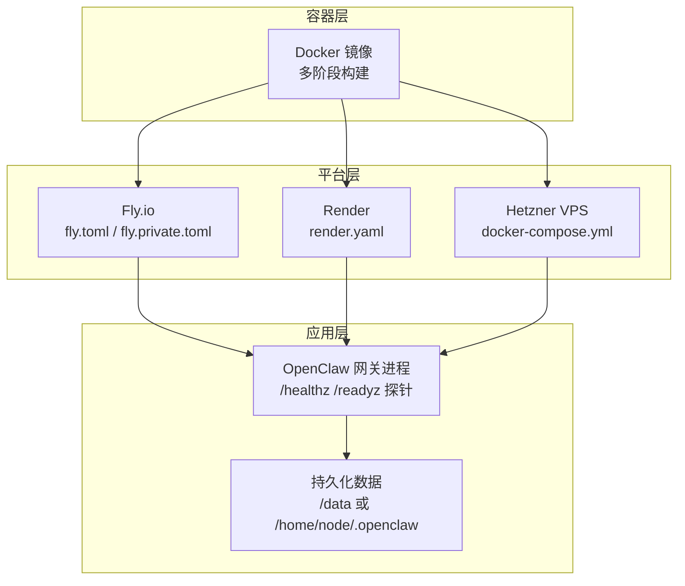
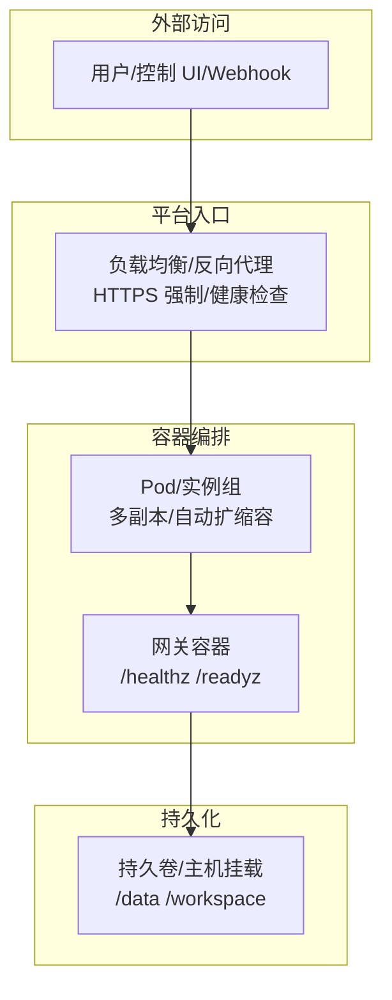
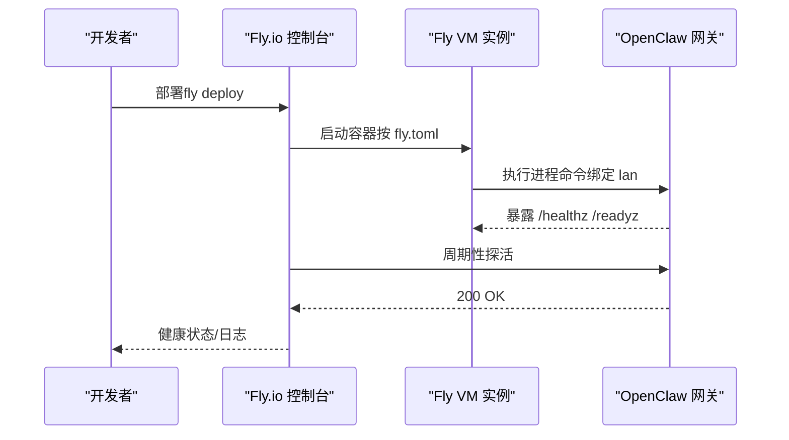
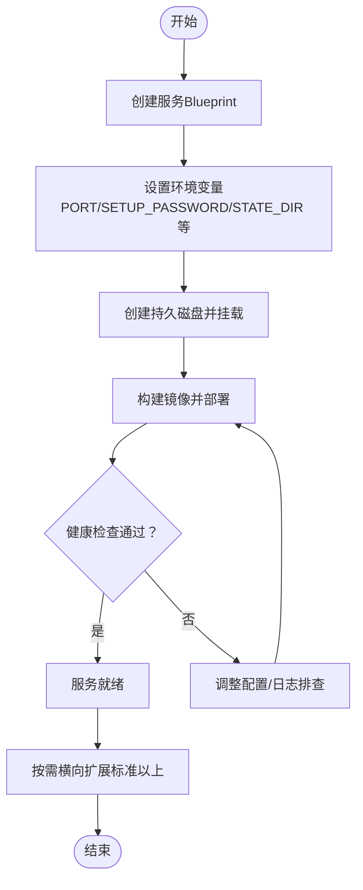
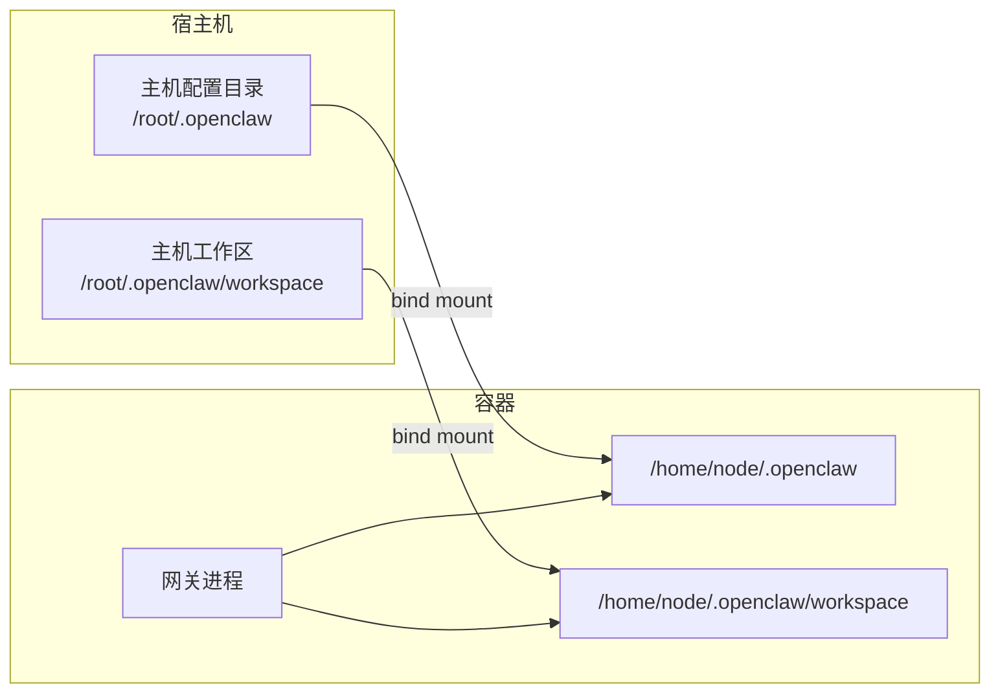
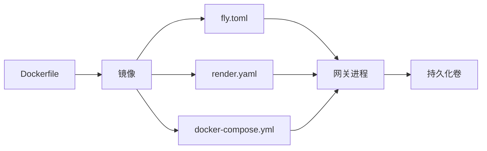

# 云平台部署

<cite>
**本文引用的文件**
- [fly.toml](file://fly.toml)
- [fly.private.toml](file://fly.private.toml)
- [render.yaml](file://render.yaml)
- [Dockerfile](file://Dockerfile)
- [docker-compose.yml](file://docker-compose.yml)
- [docs/install/fly.md](file://docs/install/fly.md)
- [docs/install/render.mdx](file://docs/install/render.mdx)
- [docs/install/hetzner.md](file://docs/install/hetzner.md)
- [docs/install/docker.md](file://docs/install/docker.md)
- [package.json](file://package.json)
</cite>

## 目录
1. [简介](#简介)
2. [项目结构](#项目结构)
3. [核心组件](#核心组件)
4. [架构总览](#架构总览)
5. [详细组件分析](#详细组件分析)
6. [依赖关系分析](#依赖关系分析)
7. [性能考虑](#性能考虑)
8. [故障排查指南](#故障排查指南)
9. [结论](#结论)
10. [附录](#附录)

## 简介
本文件面向在 Fly.io、Render、Hetzner 等云平台部署 OpenClaw 的工程团队与运维人员，系统性梳理容器化要求、持久化存储、环境变量、健康检查、负载均衡与自动扩缩容策略、成本优化、性能监控与安全加固，并给出各平台的优缺点对比与迁移策略建议。内容基于仓库中的部署配置与官方文档整理而成，确保可操作与可追溯。

## 项目结构
OpenClaw 提供多平台部署入口与容器化运行时：
- 容器镜像构建：使用多阶段 Dockerfile，支持 slim/base 变体与按需安装浏览器/Playwright、Docker CLI 等能力
- 平台配置：
  - Fly.io：fly.toml（公开/私有部署）、fly.private.toml（无公网暴露）
  - Render：render.yaml（Blueprint 声明式定义服务、磁盘、环境变量）
  - Docker Compose：本地/自管 VPS 场景的编排与持久化挂载
- 文档：各平台独立安装文档，覆盖部署步骤、健康检查、端口绑定、内存与存储、故障排查与升级

图示来源
- [Dockerfile:1-231](file://Dockerfile#L1-L231)
- [fly.toml:1-35](file://fly.toml#L1-L35)
- [fly.private.toml:1-40](file://fly.private.toml#L1-L40)
- [render.yaml:1-22](file://render.yaml#L1-L22)
- [docker-compose.yml:1-77](file://docker-compose.yml#L1-L77)

章节来源
- [Dockerfile:1-231](file://Dockerfile#L1-L231)
- [fly.toml:1-35](file://fly.toml#L1-L35)
- [fly.private.toml:1-40](file://fly.private.toml#L1-L40)
- [render.yaml:1-22](file://render.yaml#L1-L22)
- [docker-compose.yml:1-77](file://docker-compose.yml#L1-L77)

## 核心组件
- 容器镜像与运行时
  - 多阶段构建，最终运行用户为非 root，内置健康检查探针
  - 支持通过构建参数启用浏览器/Playwright、Docker CLI、额外 apt 包等
- 平台配置
  - Fly.io：HTTP 入口、VM 规格、持久卷挂载、进程绑定与内存
  - Render：Blueprint 服务、计划、健康检查路径、环境变量与持久磁盘
  - Docker Compose：网关与 CLI 服务、端口映射、卷挂载、健康检查
- 持久化与状态
  - 明确 STATE_DIR、WORKSPACE_DIR，结合平台磁盘或主机挂载实现重启不丢数据
- 健康检查与就绪探测
  - 内置 /healthz（存活）与 /readyz（就绪），用于容器编排与平台健康检查

章节来源
- [Dockerfile:224-230](file://Dockerfile#L224-L230)
- [fly.toml:20-26](file://fly.toml#L20-L26)
- [render.yaml:6-21](file://render.yaml#L6-L21)
- [docker-compose.yml:38-49](file://docker-compose.yml#L38-L49)

## 架构总览
下图展示三类部署形态的通用架构：容器镜像承载网关进程，平台负责网络入口、扩缩容与健康检查，持久化卷提供状态与工作区。

图示来源
- [fly.toml:20-26](file://fly.toml#L20-L26)
- [render.yaml:6-21](file://render.yaml#L6-L21)
- [Dockerfile:224-230](file://Dockerfile#L224-L230)

## 详细组件分析

### Fly.io 部署
- 配置要点
  - 应用名、主区域、构建信息、环境变量（生产模式、状态目录、Node 内存）
  - 进程命令绑定到 0.0.0.0（lan）以便平台代理访问
  - HTTP 服务：内部端口、强制 HTTPS、最小运行实例数、是否自动启停
  - VM 规格与持久卷挂载
- 私有部署（无公网暴露）
  - 不配置 http_service，仅通过 fly proxy/WireGuard/SSH 访问
  - 适合只出不入场景与隐藏部署
- 环境变量与安全
  - 必须设置网关令牌以允许非回环绑定
  - 建议将密钥置于平台机密，避免写入配置文件
- 健康检查与扩容
  - 平台根据 /healthz 与 /readyz 判定健康
  - 通过最小运行实例数与自动启停控制成本与可用性
- 故障排查
  - 绑定地址错误、端口不匹配、内存不足、锁文件残留、状态未持久化等常见问题均有对应处理步骤

图示来源
- [fly.toml:17-26](file://fly.toml#L17-L26)
- [Dockerfile:224-230](file://Dockerfile#L224-L230)
- [docs/install/fly.md:245-321](file://docs/install/fly.md#L245-L321)

章节来源
- [fly.toml:1-35](file://fly.toml#L1-L35)
- [fly.private.toml:1-40](file://fly.private.toml#L1-L40)
- [docs/install/fly.md:1-491](file://docs/install/fly.md#L1-L491)

### Render 部署
- 配置要点
  - Blueprint 定义：Web 服务、Docker 运行时、计划、健康检查路径
  - 环境变量：端口、Setup 密码、状态目录、工作区目录、自动生成网关令牌
  - 持久磁盘：名称、挂载路径与容量
- 自动化与可观测性
  - 健康检查路径 /health，失败会触发重建
  - 支持水平扩展（标准及以上计划）
- 使用建议
  - Starter 计划适合个人/小团队；免费计划无持久盘，每次部署会重置配置
  - 可通过仪表板查看日志、Shell 调试、环境变量热更新

图示来源
- [render.yaml:1-22](file://render.yaml#L1-L22)
- [docs/install/render.mdx:1-160](file://docs/install/render.mdx#L1-L160)

章节来源
- [render.yaml:1-22](file://render.yaml#L1-L22)
- [docs/install/render.mdx:1-160](file://docs/install/render.mdx#L1-L160)

### Docker Compose（Hetzner/VPS）
- 编排与挂载
  - 网关与 CLI 服务、端口映射、卷挂载至主机目录
  - 支持沙箱（agents.defaults.sandbox）时可挂载 docker.sock
- 环境变量与安全
  - 通过 .env 与 compose 环境变量注入令牌与凭据
  - 建议将敏感信息放入 .env 并加入忽略列表
- 健康检查
  - 内置 /healthz 探针，Compose 依据探针结果进行重启策略
- 生产建议
  - 将二进制与必要系统包“烘焙”进镜像，避免运行时安装导致重启丢失
  - 使用持久卷与合适的权限（UID/GID），确保重启后数据可读写

图示来源
- [docker-compose.yml:12-14](file://docker-compose.yml#L12-L14)
- [docker-compose.yml:68-70](file://docker-compose.yml#L68-L70)
- [docs/install/hetzner.md:118-128](file://docs/install/hetzner.md#L118-L128)

章节来源
- [docker-compose.yml:1-77](file://docker-compose.yml#L1-L77)
- [docs/install/hetzner.md:1-357](file://docs/install/hetzner.md#L1-L357)

### 容器化要求与运行时
- 基础镜像与变体
  - 默认与 slim 两种基础镜像，可通过构建参数切换
  - 运行用户为非 root，减少逃逸风险
- 健康检查
  - 内置 /healthz 与 /readyz，平台/编排系统据此判定容器健康
- 可选增强
  - 浏览器/Playwright：通过构建参数一次性安装，避免启动时下载
  - Docker CLI：用于沙箱容器管理（需要平台/镜像支持）

章节来源
- [Dockerfile:93-101](file://Dockerfile#L93-L101)
- [Dockerfile:211-214](file://Dockerfile#L211-L214)
- [Dockerfile:157-171](file://Dockerfile#L157-L171)
- [Dockerfile:173-203](file://Dockerfile#L173-L203)
- [Dockerfile:224-230](file://Dockerfile#L224-L230)

### 环境变量与数据库连接
- 环境变量注入
  - 平台侧：Fly 的 secrets、Render 的 Blueprint envVars、Compose 的 env_file/environment
  - 应用侧：通过配置收集与替换机制注入运行时环境
- 数据库/外部服务
  - 文档中提供 PostgreSQL 状态管理示例，强调连接串注入与权限最小化
  - 建议将连接串与密钥置于平台机密或环境变量，避免硬编码

章节来源
- [fly.toml:10-15](file://fly.toml#L10-L15)
- [render.yaml:7-17](file://render.yaml#L7-L17)
- [docker-compose.yml:4-7](file://docker-compose.yml#L4-L7)
- [docs/install/docker.md:53-84](file://docs/install/docker.md#L53-L84)
- [extensions/open-prose/skills/prose/state/postgres.md:64-81](file://extensions/open-prose/skills/prose/state/postgres.md#L64-L81)

### 存储卷管理
- Fly.io：通过 [mounts] 将持久卷挂载到 /data
- Render：Blueprint disk 定义磁盘大小与挂载路径
- Docker Compose：将主机目录 bind mount 至 /home/node/.openclaw 与 /home/node/.openclaw/workspace
- 最佳实践
  - 明确 STATE_DIR 与 WORKSPACE_DIR，确保重启/重建后数据不丢失
  - 在 VPS 场景，注意 UID/GID 与权限，避免 EACCES

章节来源
- [fly.toml:32-34](file://fly.toml#L32-L34)
- [render.yaml:18-21](file://render.yaml#L18-L21)
- [docker-compose.yml:12-14](file://docker-compose.yml#L12-L14)
- [docker-compose.yml:68-70](file://docker-compose.yml#L68-L70)
- [docs/install/docker.md:539-543](file://docs/install/docker.md#L539-L543)

### 负载均衡与自动扩缩容
- Fly.io
  - 通过 http_service 与最小运行实例数控制可用性与成本
  - auto_start_machines/auto_stop_machines 控制闲置资源释放
- Render
  - 支持垂直（提升计划）与水平（增加实例数）扩展
  - 健康检查失败会触发重建
- Docker Compose（自管）
  - 由编排工具或平台自身实现副本数与扩缩容策略

章节来源
- [fly.toml:23-26](file://fly.toml#L23-L26)
- [render.yaml:118-124](file://render.yaml#L118-L124)

## 依赖关系分析
- 镜像与平台
  - Dockerfile 生成的镜像被 Fly/Render/Docker Compose 使用
- 平台配置与运行时
  - fly.toml/render.yaml/docker-compose.yml 决定端口、绑定、健康检查、卷与环境变量
- 应用与持久化
  - 应用通过 STATE_DIR/WORKSPACE_DIR 读写持久化目录

图示来源
- [Dockerfile:1-231](file://Dockerfile#L1-L231)
- [fly.toml:1-35](file://fly.toml#L1-L35)
- [render.yaml:1-22](file://render.yaml#L1-L22)
- [docker-compose.yml:1-77](file://docker-compose.yml#L1-L77)

章节来源
- [Dockerfile:1-231](file://Dockerfile#L1-L231)
- [fly.toml:1-35](file://fly.toml#L1-L35)
- [render.yaml:1-22](file://render.yaml#L1-L22)
- [docker-compose.yml:1-77](file://docker-compose.yml#L1-L77)

## 性能考虑
- 内存与 CPU
  - Fly/Render 建议至少 2GB 内存，避免 OOM 与频繁重启
  - Render 可通过提升计划满足更高并发
- 启动与冷启动
  - Render 免费计划存在空闲回收与冷启动延迟，建议 Starter/Standard
- I/O 与持久化
  - 使用持久卷/主机挂载，避免频繁重建导致数据丢失
  - Docker 场景建议将二进制与依赖“烘焙”进镜像，减少启动时 I/O
- 健康检查与探针
  - 平台健康检查失败会触发重建，确保 /healthz /readyz 能快速返回

章节来源
- [docs/install/fly.md:259-276](file://docs/install/fly.md#L259-L276)
- [docs/install/render.mdx:145-147](file://docs/install/render.mdx#L145-L147)
- [docs/install/docker.md:305-324](file://docs/install/docker.md#L305-L324)
- [Dockerfile:224-230](file://Dockerfile#L224-L230)

## 故障排查指南
- Fly.io
  - 绑定地址错误：确保进程命令包含 --bind lan
  - 端口不匹配：internal_port 必须与网关端口一致
  - 内存不足：提升 VM 内存或降低日志级别
  - 锁文件冲突：删除 /data/gateway.*.lock 后重启
  - 状态未持久化：确认 OPENCLAW_STATE_DIR 指向持久卷
- Render
  - 服务不启动：检查 SETUP_PASSWORD 是否设置、端口是否为 8080
  - 健康检查失败：确认 /health 返回 200 且容器能正常启动
  - 数据丢失：免费计划无持久盘，升级计划或定期导出配置
- Docker Compose（Hetzner）
  - 权限问题：确保主机目录属主为容器内 UID/GID
  - 二进制缺失：将所需二进制“烘焙”进镜像
  - 端口冲突：检查宿主机端口占用与防火墙

章节来源
- [docs/install/fly.md:245-321](file://docs/install/fly.md#L245-L321)
- [docs/install/render.mdx:136-160](file://docs/install/render.mdx#L136-L160)
- [docs/install/hetzner.md:392-403](file://docs/install/hetzner.md#L392-L403)
- [docs/install/docker.md:392-403](file://docs/install/docker.md#L392-L403)

## 结论
- Fly.io 适合快速上线与公网暴露场景，私有模板可隐藏部署
- Render 适合声明式基础设施与持续交付，免费计划有局限
- Docker Compose 适合自管 VPS 与对运行时有强定制需求的团队
- 统一遵循：明确 STATE_DIR/WORKSPACE_DIR、注入环境变量、启用健康检查、合理分配内存、使用持久化卷、最小权限原则与安全加固

## 附录

### 平台对比与迁移策略
- 对比维度
  - 公网暴露：Fly（默认公开）、Render（默认公开）、Docker（自管）
  - 自动扩缩容：Fly（实例级）、Render（实例级）、Docker（编排/平台）
  - 持久化：Fly（卷）、Render（磁盘）、Docker（主机挂载）
  - 成本：Fly（按 VM/网络/卷计费）、Render（按计划/磁盘计费）、Docker（自管硬件/云主机）
- 迁移策略
  - 从 Fly 迁移到 Render：复用 Dockerfile，将 fly secrets 转换为 Blueprint envVars，保留 /data 挂载
  - 从 Render 迁移到 Fly：将 Blueprint envVars 转换为 fly secrets，保留 /data 挂载
  - 从 Docker Compose 迁移到 Fly/Render：将 .env 与卷挂载转换为平台机密与持久卷

章节来源
- [fly.toml:1-35](file://fly.toml#L1-L35)
- [render.yaml:1-22](file://render.yaml#L1-L22)
- [docker-compose.yml:1-77](file://docker-compose.yml#L1-L77)