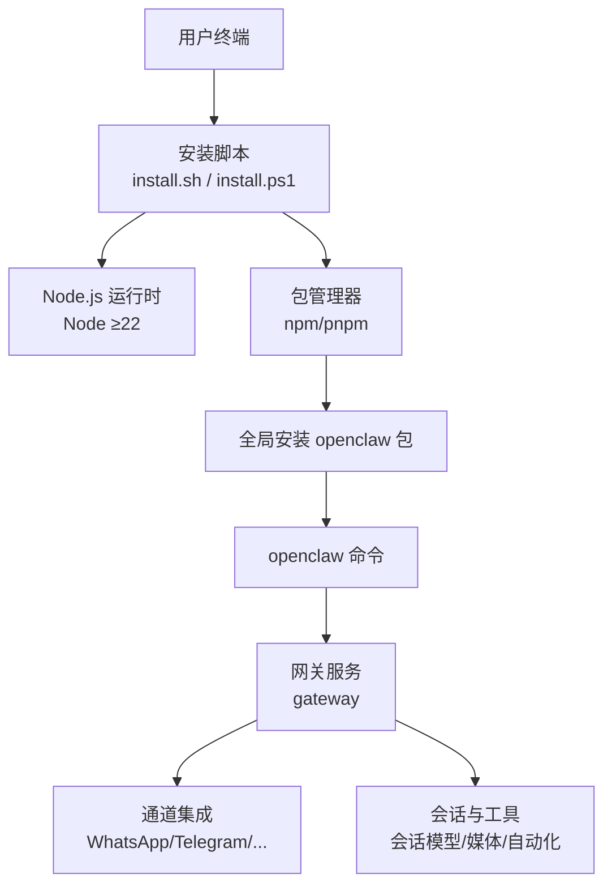
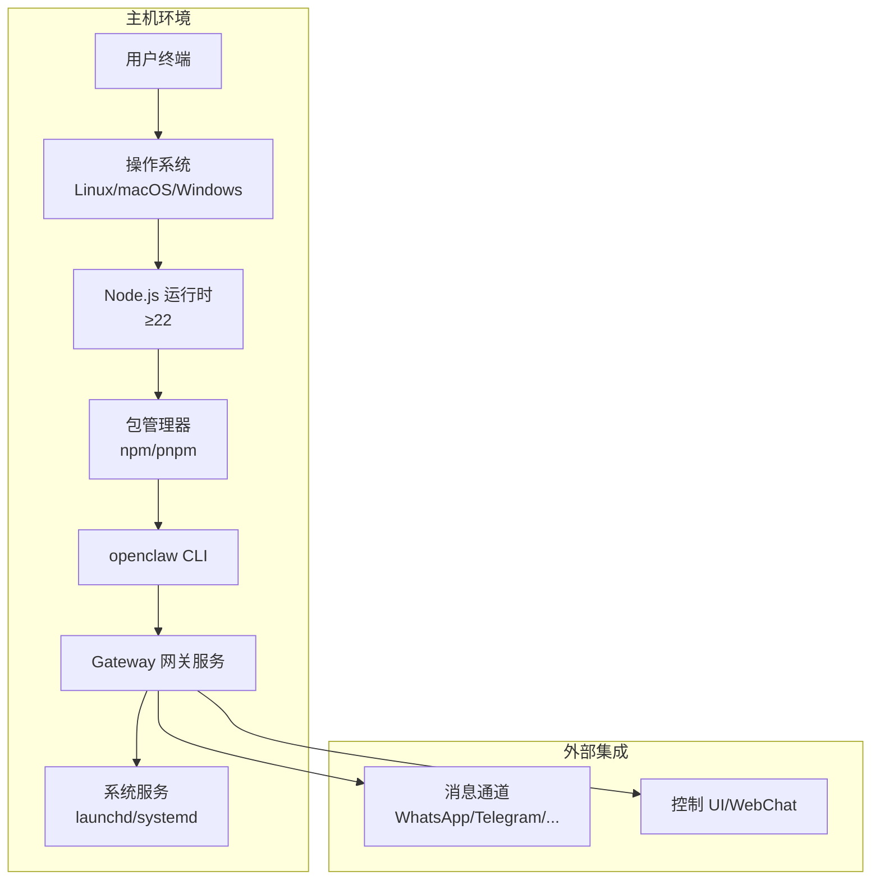
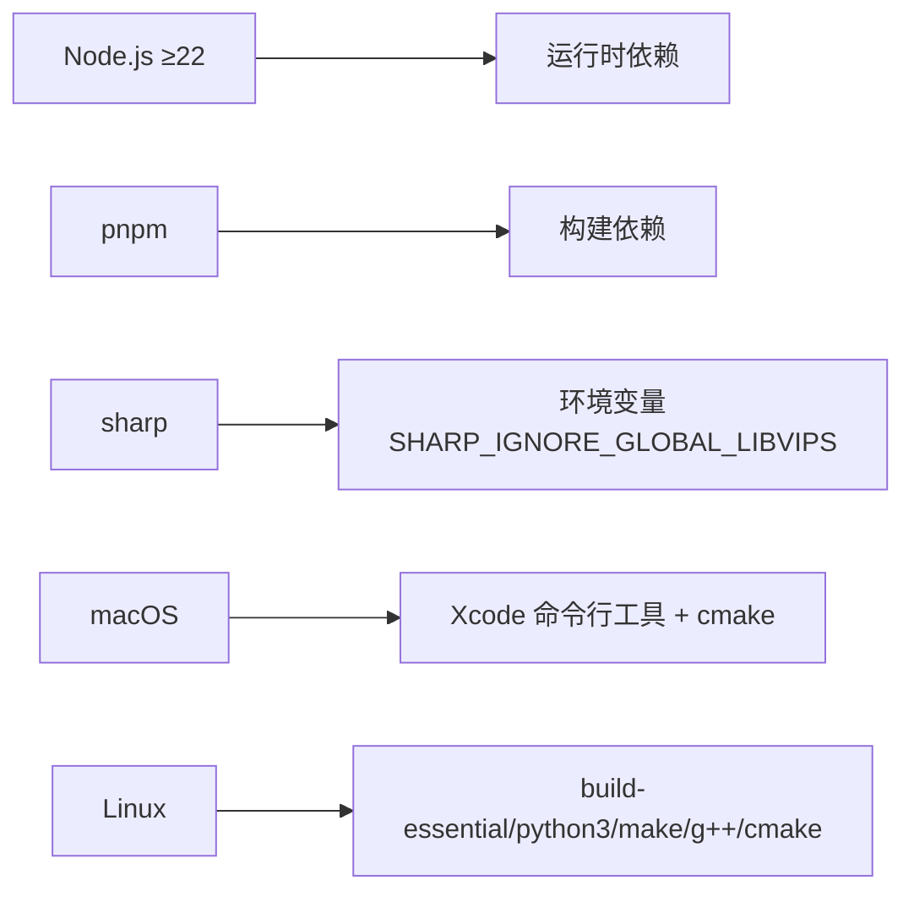

# 传统本地安装

<cite>
**本文引用的文件**
- [package.json](file://package.json)
- [README.md](file://README.md)
- [scripts/install.sh](file://scripts/install.sh)
- [scripts/install.ps1](file://scripts/install.ps1)
- [docs/install/index.md](file://docs/install/index.md)
- [docs/install/node.md](file://docs/install/node.md)
- [docs/install/updating.md](file://docs/install/updating.md)
- [docs/platforms/linux.md](file://docs/platforms/linux.md)
- [docs/platforms/macos.md](file://docs/platforms/macos.md)
- [docs/help/environment.md](file://docs/help/environment.md)
- [docs/gateway/configuration.md](file://docs/gateway/configuration.md)
- [scripts/systemd/openclaw-auth-monitor.service](file://scripts/systemd/openclaw-auth-monitor.service)
- [scripts/systemd/openclaw-auth-monitor.timer](file://scripts/systemd/openclaw-auth-monitor.timer)
</cite>

## 目录
1. [简介](#简介)
2. [项目结构](#项目结构)
3. [核心组件](#核心组件)
4. [架构总览](#架构总览)
5. [详细组件分析](#详细组件分析)
6. [依赖关系分析](#依赖关系分析)
7. [性能考虑](#性能考虑)
8. [故障排除指南](#故障排除指南)
9. [结论](#结论)
10. [附录](#附录)

## 简介
本技术文档面向在本地以传统方式安装与运行 OpenClaw 的用户，覆盖系统要求、前置依赖、安装步骤、开发与生产环境配置、升级维护、不同操作系统（Linux、macOS、Windows）的安装差异、环境变量与路径设置、与容器化部署的对比、故障排除与性能优化建议等内容。目标是帮助您从零开始完成安装，并在生产环境中稳定运行。

## 项目结构
OpenClaw 提供了多平台安装入口与脚本，核心安装与运行逻辑集中在以下位置：
- 全局 CLI 与二进制入口：通过 npm/pnpm 安装后，全局命令 openclaw 可用
- 安装脚本：macOS/Linux 使用 install.sh；Windows 使用 install.ps1
- 平台文档：Linux、macOS 的应用与服务管理说明
- 环境变量与配置：环境变量加载顺序、路径覆盖、日志级别等
- 更新与维护：更新策略、回滚与重启流程

图示来源
- [scripts/install.sh:1-200](file://scripts/install.sh#L1-L200)
- [scripts/install.ps1:1-200](file://scripts/install.ps1#L1-L200)
- [package.json:16-30](file://package.json#L16-L30)

章节来源
- [scripts/install.sh:1-200](file://scripts/install.sh#L1-L200)
- [scripts/install.ps1:1-200](file://scripts/install.ps1#L1-L200)
- [package.json:16-30](file://package.json#L16-L30)

## 核心组件
- Node.js 运行时：要求 Node ≥22，安装脚本可自动检测与安装
- 包管理器：npm 或 pnpm（推荐 pnpm，首次构建需要批准）
- CLI 命令：openclaw，提供 onboarding、gateway、configure、doctor、logs 等子命令
- 网关服务：WebSocket 控制平面，承载会话、通道、工具与事件
- 配置系统：JSON5 配置文件，支持环境变量注入与热重载
- 系统服务：macOS launchd、Linux systemd 用户服务或系统服务

章节来源
- [docs/install/node.md:1-139](file://docs/install/node.md#L1-L139)
- [docs/install/index.md:1-219](file://docs/install/index.md#L1-L219)
- [docs/gateway/configuration.md:1-200](file://docs/gateway/configuration.md#L1-L200)
- [docs/platforms/linux.md:1-95](file://docs/platforms/linux.md#L1-L95)
- [docs/platforms/macos.md:1-227](file://docs/platforms/macos.md#L1-L227)

## 架构总览
下图展示了传统本地安装的核心组件与交互关系：

图示来源
- [docs/platforms/linux.md:37-95](file://docs/platforms/linux.md#L37-L95)
- [docs/platforms/macos.md:35-50](file://docs/platforms/macos.md#L35-L50)
- [docs/gateway/configuration.md:1-200](file://docs/gateway/configuration.md#L1-L200)

## 详细组件分析

### 系统要求与前置依赖
- Node.js 版本：必须 ≥22（安装脚本会自动检测与安装）
- 包管理器：npm 或 pnpm（pnpm 需要首次批准构建脚本）
- 权限与 PATH：确保 npm 全局 bin 目录在 PATH 中
- 平台支持：macOS、Linux、Windows（推荐 WSL2）

章节来源
- [docs/install/node.md:1-139](file://docs/install/node.md#L1-L139)
- [docs/install/index.md:14-32](file://docs/install/index.md#L14-L32)

### 安装步骤（macOS/Linux）
- 使用官方安装脚本一键安装与引导
  - 命令：curl -fsSL https://openclaw.ai/install.sh | bash
  - 支持跳过引导：--no-onboard
- 手动安装（已具备 Node ≥22）
  - npm：npm install -g openclaw@latest
  - pnpm：pnpm add -g openclaw@latest；首次构建需执行 approve-builds
- 安装后运行引导向导并安装守护进程
  - openclaw onboard --install-daemon

章节来源
- [docs/install/index.md:34-141](file://docs/install/index.md#L34-L141)
- [scripts/install.sh:1-200](file://scripts/install.sh#L1-L200)

### 安装步骤（Windows）
- PowerShell 脚本安装（推荐）
  - 命令：iwr -useb https://openclaw.ai/install.ps1 | iex
  - 自动处理执行策略、Node 检测与安装、Git 检测与安装
- npm 安装（需手动满足 Node/Git）
  - npm install -g openclaw@latest
- 安装后 PATH 修复与引导

章节来源
- [scripts/install.ps1:1-330](file://scripts/install.ps1#L1-L330)
- [docs/install/index.md:44-66](file://docs/install/index.md#L44-L66)

### 开发环境配置
- 从源码构建
  - git clone + pnpm install + pnpm ui:build + pnpm build
  - pnpm link --global 或使用 pnpm openclaw ...
- 环境变量与路径
  - OPENCLAW_HOME、OPENCLAW_STATE_DIR、OPENCLAW_CONFIG_PATH
  - 日志级别：OPENCLAW_LOG_LEVEL
- 配置系统
  - JSON5 配置文件，支持环境变量注入与热重载
  - 常见任务：通道配置、模型选择、DM 策略、群组提及门控、会话与重置

章节来源
- [docs/install/index.md:107-141](file://docs/install/index.md#L107-L141)
- [docs/help/environment.md:104-141](file://docs/help/environment.md#L104-L141)
- [docs/gateway/configuration.md:1-200](file://docs/gateway/configuration.md#L1-L200)

### 生产环境部署
- 守护进程安装
  - macOS：launchd（LaunchAgent），openclaw gateway install 或 onboard --install-daemon
  - Linux：systemd 用户服务或系统服务
- 网络暴露与安全
  - 本地绑定 + SSH 隧道或 Tailscale Serve/Funnel
  - 仅在启用 Serve/Funnel 时保持 gateway.bind 为 loopback
- 系统服务示例
  - systemd 用户服务单元与定时器（认证过期监控）

章节来源
- [docs/platforms/macos.md:35-50](file://docs/platforms/macos.md#L35-L50)
- [docs/platforms/linux.md:37-95](file://docs/platforms/linux.md#L37-L95)
- [scripts/systemd/openclaw-auth-monitor.service:1-15](file://scripts/systemd/openclaw-auth-monitor.service#L1-L15)
- [scripts/systemd/openclaw-auth-monitor.timer:1-11](file://scripts/systemd/openclaw-auth-monitor.timer#L1-L11)

### 升级与维护
- 推荐使用网站安装脚本进行原地升级
  - curl -fsSL https://openclaw.ai/install.sh | bash
  - 支持 --no-onboard 与 --install-method git
- 全局安装（npm/pnpm）
  - npm i -g openclaw@latest 或 pnpm add -g openclaw@latest
  - 切换通道：openclaw update --channel <stable|beta|dev>
- 源码安装（git）
  - openclaw update（安全更新流程）
  - 手动：git pull + pnpm install + pnpm build + pnpm ui:build
- Doctor 与健康检查
  - openclaw doctor（迁移/修复/审计）
  - openclaw health / status / logs
- 回滚与固定版本
  - npm/pnpm pin 到指定版本
  - git checkout 到指定提交

章节来源
- [docs/install/updating.md:1-258](file://docs/install/updating.md#L1-L258)

### 不同操作系统安装要点

#### Linux
- 官方推荐 Node 作为运行时
- 守护进程：systemd 用户服务或系统服务
- 快速路径（VPS）：安装 Node → npm i -g openclaw@latest → openclaw onboard --install-daemon → SSH 隧道访问

章节来源
- [docs/platforms/linux.md:1-95](file://docs/platforms/linux.md#L1-L95)

#### macOS
- 应用职责：菜单栏状态、权限管理、网关连接、节点能力暴露
- 守护进程：launchd（LaunchAgent）
- 远程模式：通过 SSH/Tailscale 连接远程网关，本地启动节点服务

章节来源
- [docs/platforms/macos.md:1-227](file://docs/platforms/macos.md#L1-L227)

#### Windows
- 强烈推荐 WSL2 运行
- PowerShell 安装脚本自动处理执行策略、Node/Git 检测与安装
- PATH 修复与引导

章节来源
- [scripts/install.ps1:1-330](file://scripts/install.ps1#L1-L330)
- [docs/install/index.md:20-22](file://docs/install/index.md#L20-L22)

### 环境变量与路径设置
- 路径相关
  - OPENCLAW_HOME：替换系统家目录用于路径解析
  - OPENCLAW_STATE_DIR：覆盖状态目录（默认 ~/.openclaw）
  - OPENCLAW_CONFIG_PATH：覆盖配置文件路径
- 日志级别
  - OPENCLAW_LOG_LEVEL：覆盖文件与控制台日志级别
- 环境变量加载顺序（从高到低）
  - 进程环境 > 当前目录 .env > 全局 ~/.openclaw/.env > 配置文件 env 块 > 登录壳导入（按需）

章节来源
- [docs/help/environment.md:104-141](file://docs/help/environment.md#L104-L141)

### 传统安装与容器化部署对比
- 传统安装（本机）
  - 优点：直接访问本地硬件（摄像头、屏幕录制、系统命令）、权限可控、无容器抽象层
  - 适用：个人桌面、本地服务器、需要直接系统调用的场景
- 容器化部署
  - 优点：隔离性好、便于复制与分发、资源限制明确
  - 适用：云环境、多实例部署、CI/CD 流水线
- 选择建议
  - 若需要本地节点能力（如 system.run、Canvas、Camera、Screen Recording），优先传统安装
  - 若追求环境一致性与可移植性，可考虑容器化

[本节为概念性内容，不直接分析具体文件]

## 依赖关系分析
- 运行时依赖：Node.js ≥22
- 构建依赖：pnpm（源码构建）、sharp（可能需要全局 libvips 时设置环境变量）
- 系统依赖：macOS（Xcode CLT + cmake）、Linux（build-essential/python3/make/g++/cmake 或对应发行版包管理器）
- 包管理器：npm/pnpm（pnpm 需要批准构建脚本）

图示来源
- [package.json:340-463](file://package.json#L340-L463)
- [scripts/install.sh:622-654](file://scripts/install.sh#L622-L654)
- [docs/install/index.md:82-90](file://docs/install/index.md#L82-L90)

章节来源
- [package.json:340-463](file://package.json#L340-L463)
- [scripts/install.sh:568-654](file://scripts/install.sh#L568-L654)

## 性能考虑
- 降低视觉令牌消耗：调整图像最大尺寸参数，减少截图类操作的分辨率
- 会话与内存：合理设置会话重置策略与空闲阈值，避免长时间占用内存
- 通道与并发：根据通道数量与并发需求，适当调整心跳与轮询间隔
- 日志级别：生产环境建议使用较高等级的日志，减少调试开销

[本节提供通用指导，不直接分析具体文件]

## 故障排除指南
- openclaw 命令未找到
  - 检查 npm prefix -g 输出是否在 PATH 中
  - 在 macOS/Linux 添加 $(npm prefix -g)/bin 到 PATH；Windows 添加 $(npm prefix -g)
- 权限错误（EACCES，Linux）
  - 将 npm prefix 设为用户可写目录，并将该目录加入 PATH
- sharp 构建失败
  - 若系统已安装全局 libvips，设置 SHARP_IGNORE_GLOBAL_LIBVIPS=1
  - 缺少构建工具：在 macOS 安装 Xcode CLT + cmake，在 Linux 安装 build-essential/python3/make/g++/cmake
- Windows 执行策略限制
  - PowerShell 执行策略为 Restricted/AllSigned 时无法运行脚本，需设置为 RemoteSigned 或以管理员身份执行
- 诊断命令
  - openclaw doctor（迁移/修复/审计）
  - openclaw logs --follow（实时查看日志）
  - openclaw health / status（健康与状态）

章节来源
- [docs/install/node.md:89-139](file://docs/install/node.md#L89-L139)
- [docs/install/index.md:181-204](file://docs/install/index.md#L181-L204)
- [scripts/install.sh:656-721](file://scripts/install.sh#L656-L721)
- [scripts/install.ps1:42-80](file://scripts/install.ps1#L42-L80)

## 结论
通过官方安装脚本与标准流程，可在 macOS、Linux、Windows（WSL2）上快速完成 OpenClaw 的传统本地安装与运行。结合环境变量与配置系统，可实现灵活的路径覆盖、日志级别与通道接入。生产环境建议使用守护进程与 SSH/Tailscale 方式安全暴露网关，并定期使用 doctor 与 update 流程保障稳定性与安全性。

[本节为总结性内容，不直接分析具体文件]

## 附录

### 常用命令速查
- 安装与引导
  - curl -fsSL https://openclaw.ai/install.sh | bash
  - npm/pnpm 安装后：openclaw onboard --install-daemon
- 网关控制
  - openclaw gateway status/stop/restart
  - openclaw dashboard（打开浏览器 UI）
- 诊断与日志
  - openclaw doctor / health / status / logs --follow
- 更新与回滚
  - openclaw update（源码安装）
  - npm/pnpm 升级：npm i -g openclaw@latest 或 pnpm add -g openclaw@latest
  - 固定版本：npm/pnpm pin 到指定版本

章节来源
- [docs/install/index.md:163-171](file://docs/install/index.md#L163-L171)
- [docs/install/updating.md:185-204](file://docs/install/updating.md#L185-L204)