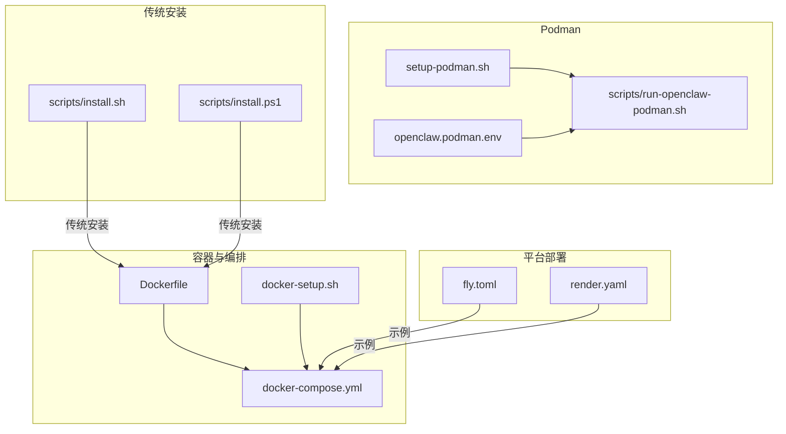
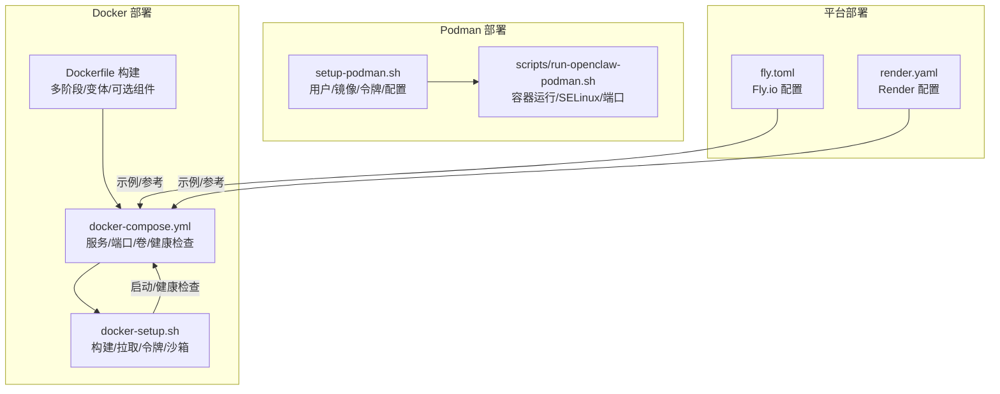
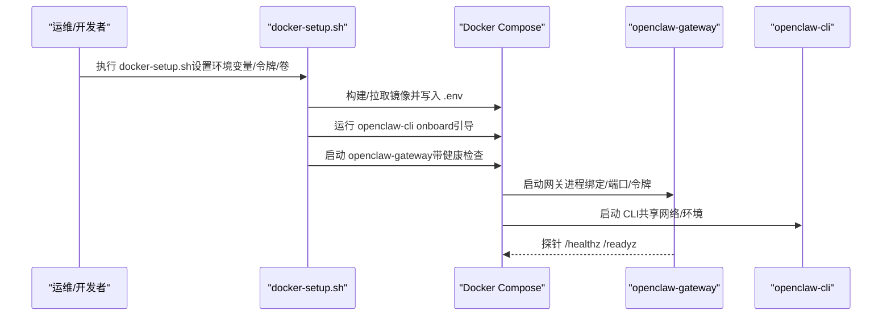
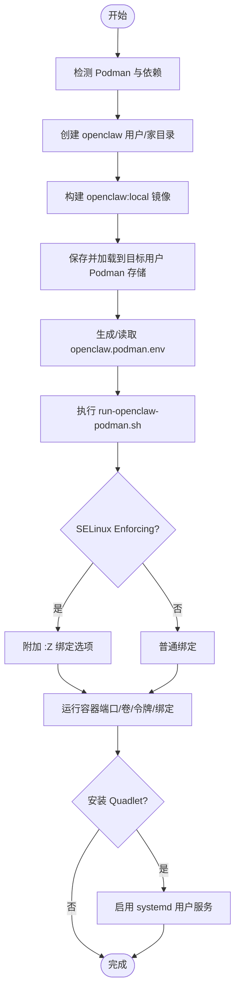
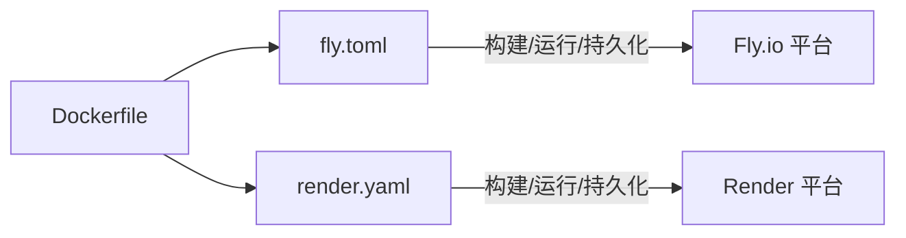
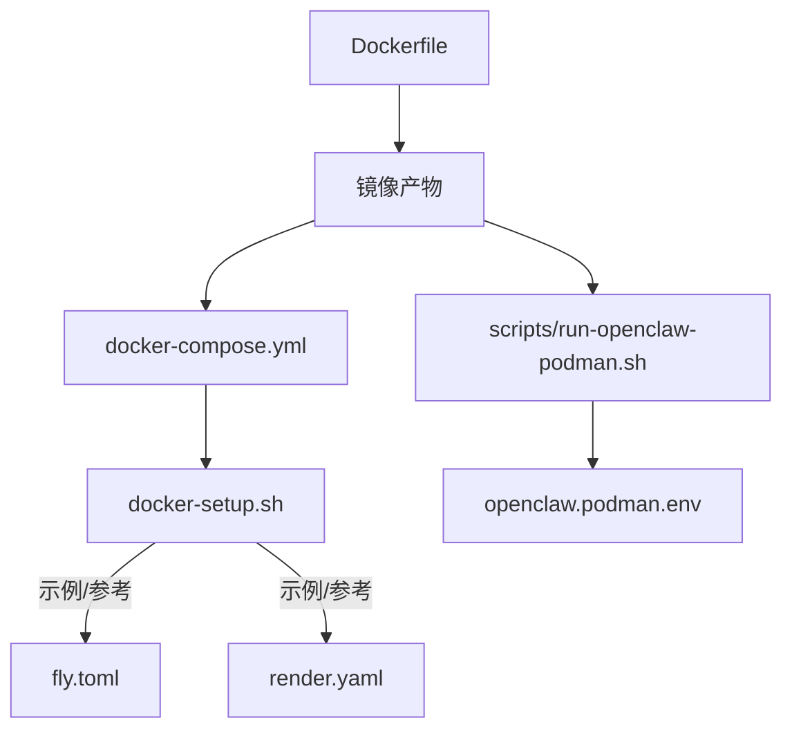

# 部署选项

<cite>
**本文引用的文件**
- [Dockerfile](file://Dockerfile)
- [docker-compose.yml](file://docker-compose.yml)
- [docker-setup.sh](file://docker-setup.sh)
- [setup-podman.sh](file://setup-podman.sh)
- [openclaw.podman.env](file://openclaw.podman.env)
- [scripts/run-openclaw-podman.sh](file://scripts/run-openclaw-podman.sh)
- [fly.toml](file://fly.toml)
- [render.yaml](file://render.yaml)
- [scripts/install.sh](file://scripts/install.sh)
- [scripts/install.ps1](file://scripts/install.ps1)
</cite>

## 目录
1. [简介](#简介)
2. [项目结构](#项目结构)
3. [核心组件](#核心组件)
4. [架构总览](#架构总览)
5. [详细组件分析](#详细组件分析)
6. [依赖关系分析](#依赖关系分析)
7. [性能考量](#性能考量)
8. [故障排查指南](#故障排查指南)
9. [结论](#结论)
10. [附录](#附录)

## 简介
本文件面向OpenClaw的多部署方式，提供从容器化到传统本地安装的完整技术文档。重点覆盖以下部署路径：
- Docker 容器化部署（含 Docker Compose 编排与 docker-setup 脚本）
- Podman（含 systemd Quadlet）部署
- 传统本地安装（基于脚本）

内容涵盖系统要求、前置条件、安装步骤、关键配置参数（环境变量、端口映射、存储卷挂载、网络绑定）、健康检查与探针、以及针对开发/测试/生产的最佳实践建议。

## 项目结构
与部署直接相关的仓库文件主要分布在以下位置：
- 容器镜像构建：Dockerfile 及多阶段构建、运行时变体（full/slim）、可选安装组件（浏览器、Docker CLI）
- 编排与启动：docker-compose.yml、docker-setup.sh
- Podman 部署：setup-podman.sh、openclaw.podman.env、scripts/run-openclaw-podman.sh
- 平台部署示例：fly.toml（Fly.io）、render.yaml（Render）
- 传统安装脚本：scripts/install.sh（类Unix）、scripts/install.ps1（Windows）

图表来源
- [Dockerfile:1-231](file://Dockerfile#L1-L231)
- [docker-compose.yml:1-77](file://docker-compose.yml#L1-L77)
- [docker-setup.sh:1-598](file://docker-setup.sh#L1-L598)
- [setup-podman.sh:1-313](file://setup-podman.sh#L1-L313)
- [openclaw.podman.env:1-25](file://openclaw.podman.env#L1-L25)
- [scripts/run-openclaw-podman.sh:1-232](file://scripts/run-openclaw-podman.sh#L1-L232)
- [fly.toml:1-35](file://fly.toml#L1-L35)
- [render.yaml:1-22](file://render.yaml#L1-L22)
- [scripts/install.sh](file://scripts/install.sh)
- [scripts/install.ps1](file://scripts/install.ps1)

章节来源
- [Dockerfile:1-231](file://Dockerfile#L1-L231)
- [docker-compose.yml:1-77](file://docker-compose.yml#L1-L77)
- [docker-setup.sh:1-598](file://docker-setup.sh#L1-L598)
- [setup-podman.sh:1-313](file://setup-podman.sh#L1-L313)
- [openclaw.podman.env:1-25](file://openclaw.podman.env#L1-L25)
- [scripts/run-openclaw-podman.sh:1-232](file://scripts/run-openclaw-podman.sh#L1-L232)
- [fly.toml:1-35](file://fly.toml#L1-L35)
- [render.yaml:1-22](file://render.yaml#L1-L22)
- [scripts/install.sh](file://scripts/install.sh)
- [scripts/install.ps1](file://scripts/install.ps1)

## 核心组件
- 运行时镜像与变体
  - 基于 Node.js 22 的 Debian Bookworm 镜像，支持 full 与 slim 两种变体；通过构建参数切换。
  - 支持在镜像中预装 Chromium 与 Playwright，减少容器启动时的下载等待。
  - 可选安装 Docker CLI，用于沙箱容器管理（agents.defaults.sandbox）。
- 编排与启动
  - docker-compose.yml 定义网关与 CLI 服务，暴露网关与桥接端口，内置健康检查。
  - docker-setup.sh 提供一键构建/拉取镜像、生成/注入网关令牌、初始化配置、可选启用沙箱（socket 挂载与策略配置）。
- Podman 部署
  - setup-podman.sh 一次性设置用户、镜像加载、生成令牌、创建配置与工作区目录，并可安装 systemd Quadlet。
  - scripts/run-openclaw-podman.sh 作为运行入口，负责容器启动、SELinux 绑定选项、端口映射、环境注入。
- 平台部署示例
  - fly.toml：Fly.io 示例，定义 Dockerfile、进程、HTTP 服务、VM 规格与持久化磁盘挂载。
  - render.yaml：Render 示例，定义 Docker 运行时、环境变量、健康检查、数据盘挂载。
- 传统安装
  - scripts/install.sh 与 scripts/install.ps1 提供传统本地安装流程（非容器），适合无需容器或受限环境。

章节来源
- [Dockerfile:103-231](file://Dockerfile#L103-L231)
- [docker-compose.yml:1-77](file://docker-compose.yml#L1-L77)
- [docker-setup.sh:413-598](file://docker-setup.sh#L413-L598)
- [setup-podman.sh:258-313](file://setup-podman.sh#L258-L313)
- [scripts/run-openclaw-podman.sh:202-232](file://scripts/run-openclaw-podman.sh#L202-L232)
- [fly.toml:1-35](file://fly.toml#L1-L35)
- [render.yaml:1-22](file://render.yaml#L1-L22)
- [scripts/install.sh](file://scripts/install.sh)
- [scripts/install.ps1](file://scripts/install.ps1)

## 架构总览
下图展示容器化与 Podman 部署的关键交互：镜像构建、编排/运行、健康检查、持久化存储、可选沙箱。

图表来源
- [Dockerfile:1-231](file://Dockerfile#L1-L231)
- [docker-compose.yml:1-77](file://docker-compose.yml#L1-L77)
- [docker-setup.sh:1-598](file://docker-setup.sh#L1-L598)
- [setup-podman.sh:1-313](file://setup-podman.sh#L1-L313)
- [scripts/run-openclaw-podman.sh:1-232](file://scripts/run-openclaw-podman.sh#L1-L232)
- [fly.toml:1-35](file://fly.toml#L1-L35)
- [render.yaml:1-22](file://render.yaml#L1-L22)

## 详细组件分析

### Docker 容器化部署
- 系统要求与前置条件
  - 已安装 Docker 引擎与 Docker Compose 插件。
  - 若需沙箱功能，镜像需包含 Docker CLI（通过构建参数启用），且宿主机需提供 Docker socket 权限。
- 关键配置参数
  - 环境变量（示例）
    - OPENCLAW_GATEWAY_TOKEN：网关访问令牌（必填）
    - OPENCLAW_GATEWAY_BIND：绑定模式（默认 lan；loopback 仅内网）
    - OPENCLAW_GATEWAY_PORT/OPENCLAW_BRIDGE_PORT：宿主端口映射
    - OPENCLAW_CONFIG_DIR/OPENCLAW_WORKSPACE_DIR：持久化卷挂载路径
    - OPENCLAW_ALLOW_INSECURE_PRIVATE_WS：允许不安全私有 WebSocket（按需）
    - OPENCLAW_DOCKER_APT_PACKAGES/OPENCLAW_EXTENSIONS：运行时依赖与扩展
    - OPENCLAW_INSTALL_BROWSER/OPENCLAW_INSTALL_DOCKER_CLI：是否预装浏览器与 Docker CLI
  - 存储卷
    - /home/node/.openclaw：配置目录
    - /home/node/.openclaw/workspace：工作区目录
    - 可选 /var/run/docker.sock：启用沙箱时挂载
- 启动与编排
  - 使用 docker-compose.yml 启动网关与 CLI 服务，CLI 以“同服务网络”共享网络命名空间。
  - docker-setup.sh 自动完成镜像构建/拉取、令牌注入、权限修复、引导向导、可选沙箱配置与 socket 挂载。
- 健康检查
  - 内置 /healthz（liveness）与 /readyz（readiness）探针，适用于容器编排平台。

图表来源
- [docker-setup.sh:413-598](file://docker-setup.sh#L413-L598)
- [docker-compose.yml:1-77](file://docker-compose.yml#L1-L77)
- [Dockerfile:224-231](file://Dockerfile#L224-L231)

章节来源
- [docker-compose.yml:1-77](file://docker-compose.yml#L1-L77)
- [docker-setup.sh:1-598](file://docker-setup.sh#L1-L598)
- [Dockerfile:103-231](file://Dockerfile#L103-L231)

### Podman 部署（含 systemd Quadlet）
- 系统要求与前置条件
  - 已安装 Podman 与可选 systemd（用于 Quadlet）。
  - 根用户权限用于一次性初始化（创建用户、子 UID/GID、镜像导入）。
  - 可选启用 systemd 用户服务（linger）以便无交互开机自启。
- 关键配置参数
  - openclaw.podman.env：令牌、端口映射、绑定模式、可选提供商凭据。
  - 运行脚本 scripts/run-openclaw-podman.sh：解析 .env、生成令牌、创建最小配置、处理 SELinux 绑定选项、端口映射与容器运行。
- 启动与编排
  - setup-podman.sh 完成用户/镜像/令牌/配置目录创建，可选安装 Quadlet。
  - run-openclaw-podman.sh 作为运行入口，支持“setup”向导与常规启动。
- 最佳实践
  - 使用 OPENCLAW_PODMAN_USERNS 控制用户命名空间行为（keep-id/host/auto）。
  - 在 SELinux Enforcing/Permissive 环境自动附加 :Z 绑定选项，确保容器可读写挂载。

图表来源
- [setup-podman.sh:1-313](file://setup-podman.sh#L1-L313)
- [openclaw.podman.env:1-25](file://openclaw.podman.env#L1-L25)
- [scripts/run-openclaw-podman.sh:161-232](file://scripts/run-openclaw-podman.sh#L161-L232)

章节来源
- [setup-podman.sh:1-313](file://setup-podman.sh#L1-L313)
- [openclaw.podman.env:1-25](file://openclaw.podman.env#L1-L25)
- [scripts/run-openclaw-podman.sh:1-232](file://scripts/run-openclaw-podman.sh#L1-L232)

### 传统本地安装
- 适用场景
  - 不使用容器、需要直接在宿主机安装与运行的环境。
- 安装脚本
  - scripts/install.sh：类 Unix 系统安装流程（非容器）。
  - scripts/install.ps1：Windows PowerShell 安装流程（非容器）。
- 注意事项
  - 传统安装不包含容器镜像与编排逻辑，需自行准备 Node.js 运行时与依赖。
  - 如需与容器部署一致的行为，需手动配置等价的环境变量与持久化目录。

章节来源
- [scripts/install.sh](file://scripts/install.sh)
- [scripts/install.ps1](file://scripts/install.ps1)

### 平台部署示例（Fly.io 与 Render）
- Fly.io（fly.toml）
  - 使用 Dockerfile 构建镜像，定义进程命令（绑定 LAN、端口 3000）、HTTP 服务、VM 规格与持久化磁盘挂载。
  - 适合需要全球边缘节点与稳定运行的生产场景。
- Render（render.yaml）
  - 定义 Docker 运行时、环境变量（含自动生成的令牌）、健康检查路径、数据盘挂载。
  - 适合快速上线与简单运维的托管场景。

图表来源
- [fly.toml:1-35](file://fly.toml#L1-L35)
- [render.yaml:1-22](file://render.yaml#L1-L22)
- [Dockerfile:1-231](file://Dockerfile#L1-L231)

章节来源
- [fly.toml:1-35](file://fly.toml#L1-L35)
- [render.yaml:1-22](file://render.yaml#L1-L22)

## 依赖关系分析
- 组件耦合
  - docker-compose.yml 依赖 Dockerfile 产出的镜像；docker-setup.sh 既可拉取远端镜像，也可本地构建。
  - Podman 路径由 setup-podman.sh 生成 openclaw.podman.env 与配置目录，再由 run-openclaw-podman.sh 启动容器。
  - 平台部署示例 fly.toml/render.yaml 与 Dockerfile 解耦，仅通过 Dockerfile 作为构建基线。
- 外部依赖
  - Docker/Podman 引擎、Docker Compose 插件（Docker 路径）
  - 可选：Playwright 浏览器、Docker CLI（沙箱）
  - 平台：Fly.io、Render 的托管能力

图表来源
- [Dockerfile:1-231](file://Dockerfile#L1-L231)
- [docker-compose.yml:1-77](file://docker-compose.yml#L1-L77)
- [docker-setup.sh:1-598](file://docker-setup.sh#L1-L598)
- [scripts/run-openclaw-podman.sh:1-232](file://scripts/run-openclaw-podman.sh#L1-L232)
- [openclaw.podman.env:1-25](file://openclaw.podman.env#L1-L25)
- [fly.toml:1-35](file://fly.toml#L1-L35)
- [render.yaml:1-22](file://render.yaml#L1-L22)

章节来源
- [Dockerfile:1-231](file://Dockerfile#L1-L231)
- [docker-compose.yml:1-77](file://docker-compose.yml#L1-L77)
- [docker-setup.sh:1-598](file://docker-setup.sh#L1-L598)
- [scripts/run-openclaw-podman.sh:1-232](file://scripts/run-openclaw-podman.sh#L1-L232)
- [openclaw.podman.env:1-25](file://openclaw.podman.env#L1-L25)
- [fly.toml:1-35](file://fly.toml#L1-L35)
- [render.yaml:1-22](file://render.yaml#L1-L22)

## 性能考量
- 容器内存与垃圾回收
  - Dockerfile 中通过 NODE_OPTIONS 设置最大堆大小，避免低内存主机上构建/运行时 OOM。
  - fly.toml 中同样设置了 NODE_OPTIONS，建议在资源受限环境中保持一致。
- 构建缓存与依赖安装
  - Dockerfile 使用 pnpm 缓存与内存限制，降低小规格 VM 上的失败率。
  - Podman 路径通过保存/加载镜像，避免重复构建。
- 浏览器与 Playwright
  - 预装 Chromium 与 Playwright 可显著缩短首次启动时间，适合频繁重启的开发/测试环境。
- 端口与网络
  - 默认绑定为 loopback（127.0.0.1），若需外部访问需改为 lan 并设置认证令牌与控制 UI 允许来源。

章节来源
- [Dockerfile:56-90](file://Dockerfile#L56-L90)
- [fly.toml:10-16](file://fly.toml#L10-L16)

## 故障排查指南
- Docker 路径
  - 健康检查失败
    - 检查 OPENCLAW_GATEWAY_BIND 是否为 loopback 且未设置外部访问；如需外部访问，改为 lan 并设置 OPENCLAW_GATEWAY_TOKEN。
    - 使用 docker compose exec 手动调用健康检查端点进行验证。
  - 端口冲突
    - 修改 OPENCLAW_GATEWAY_PORT/OPENCLAW_BRIDGE_PORT 或停止占用端口的服务。
  - 权限问题（EACCES）
    - docker-setup.sh 已自动修复配置目录所有权；如仍失败，确认宿主目录属主与容器 node 用户一致。
  - 沙箱不可用
    - 确认镜像包含 Docker CLI（构建参数 OPENCLAW_INSTALL_DOCKER_CLI=1），并正确挂载 /var/run/docker.sock。
- Podman 路径
  - SELinux 报错
    - run-openclaw-podman.sh 自动附加 :Z 选项；如仍失败，检查 SELinux 状态与策略。
  - 用户命名空间
    - OPENCLAW_PODMAN_USERNS=keep-id 时，容器以宿主 UID/GID 运行；否则可能需要手动修复挂载权限。
  - Quadlet 服务未启动
    - 确保已启用 linger，systemd 重载并启用服务。
- 传统安装
  - 依赖缺失
    - 确保 Node.js 与 pnpm 正确安装，且依赖完整。
  - 配置与令牌
    - 传统安装需手动配置 OPENCLAW_GATEWAY_TOKEN 与持久化目录权限。

章节来源
- [docker-setup.sh:430-445](file://docker-setup.sh#L430-L445)
- [docker-compose.yml:38-49](file://docker-compose.yml#L38-L49)
- [scripts/run-openclaw-podman.sh:186-200](file://scripts/run-openclaw-podman.sh#L186-L200)
- [setup-podman.sh:224-228](file://setup-podman.sh#L224-L228)

## 结论
- Docker 路径适合需要标准化打包与编排的团队与 CI/CD 场景，docker-setup.sh 提供开箱即用的一键式体验。
- Podman 路径适合需要 rootless 与 systemd 集成的生产环境，setup-podman.sh 与 Quadlet 降低了长期运行与自启的复杂度。
- 传统安装适合对容器有严格限制或需要原生运行的场景，但需自行维护运行时与依赖。
- 平台部署示例（Fly.io/Render）展示了如何在云平台上以容器方式稳定运行 OpenClaw。

## 附录
- 环境变量清单（节选）
  - OPENCLAW_GATEWAY_TOKEN：网关访问令牌（必填）
  - OPENCLAW_GATEWAY_BIND：绑定模式（lan/loopback）
  - OPENCLAW_GATEWAY_PORT/OPENCLAW_BRIDGE_PORT：宿主端口映射
  - OPENCLAW_CONFIG_DIR/OPENCLAW_WORKSPACE_DIR：持久化卷路径
  - OPENCLAW_ALLOW_INSECURE_PRIVATE_WS：允许不安全私有 WebSocket
  - OPENCLAW_DOCKER_APT_PACKAGES/OPENCLAW_EXTENSIONS：运行时依赖与扩展
  - OPENCLAW_INSTALL_BROWSER/OPENCLAW_INSTALL_DOCKER_CLI：预装组件
  - OPENCLAW_PODMAN_*：Podman 相关（端口、绑定、用户命名空间）
  - OPENCLAW_STATE_DIR/OPENCLAW_WORKSPACE_DIR：平台部署示例中的持久化目录
- 端口与健康检查
  - 网关端口：18789（默认），桥接端口：18790（默认）
  - 健康检查：/healthz（liveness）、/readyz（readiness）

章节来源
- [docker-compose.yml:4-26](file://docker-compose.yml#L4-L26)
- [docker-setup.sh:216-226](file://docker-setup.sh#L216-L226)
- [scripts/run-openclaw-podman.sh:76-78](file://scripts/run-openclaw-podman.sh#L76-L78)
- [fly.toml:10-16](file://fly.toml#L10-L16)
- [render.yaml:6-16](file://render.yaml#L6-L16)