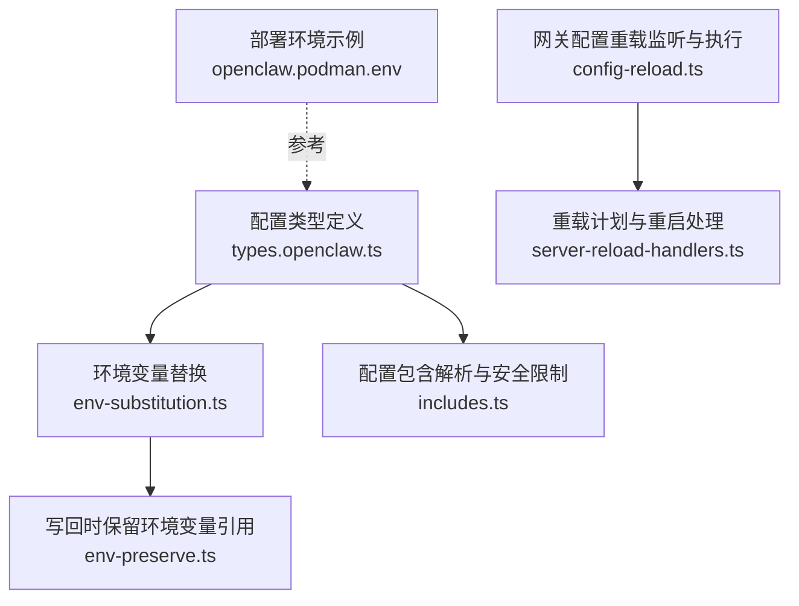
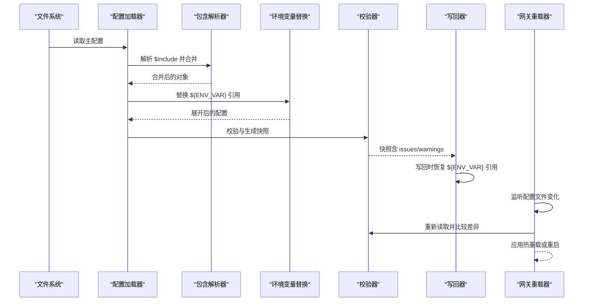
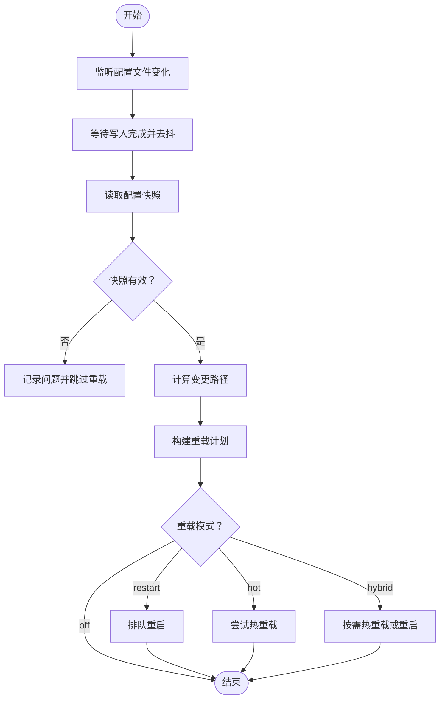
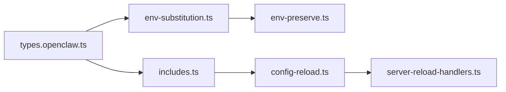

# 部署配置管理

<cite>
**本文引用的文件**
- [src/config/types.openclaw.ts](file://src/config/types.openclaw.ts)
- [src/config/env-substitution.ts](file://src/config/env-substitution.ts)
- [src/config/env-preserve.ts](file://src/config/env-preserve.ts)
- [src/config/includes.ts](file://src/config/includes.ts)
- [src/gateway/config-reload.ts](file://src/gateway/config-reload.ts)
- [src/gateway/server-reload-handlers.ts](file://src/gateway/server-reload-handlers.ts)
- [openclaw.podman.env](file://openclaw.podman.env)
- [docs/gateway/configuration.md](file://docs/gateway/configuration.md)
- [docs/gateway/configuration-reference.md](file://docs/gateway/configuration-reference.md)
- [docs/gateway/configuration-examples.md](file://docs/gateway/configuration-examples.md)
- [docs/install/docker.md](file://docs/install/docker.md)
- [docs/install/fly.md](file://docs/install/fly.md)
- [docs/install/render.mdx](file://docs/install/render.mdx)
- [docs/install/northflank.mdx](file://docs/install/northflank.mdx)
- [docs/install/railway.mdx](file://docs/install/railway.mdx)
- [docs/install/podman.md](file://docs/install/podman.md)
- [docs/install/ansible.md](file://docs/install/ansible.md)
- [docs/install/migrating.md](file://docs/install/migrating.md)
- [docs/refactor/strict-config.md](file://docs/refactor/strict-config.md)
- [docs/help/environment.md](file://docs/help/environment.md)
- [docs/start/setup.md](file://docs/start/setup.md)
- [docs/cli/config.md](file://docs/cli/config.md)
- [docs/cli/configure.md](file://docs/cli/configure.md)
- [docs/security/README.md](file://docs/security/README.md)
- [docs/gateway/security/index.md](file://docs/gateway/security/index.md)
</cite>

## 目录
1. [简介](#简介)
2. [项目结构](#项目结构)
3. [核心组件](#核心组件)
4. [架构总览](#架构总览)
5. [详细组件分析](#详细组件分析)
6. [依赖分析](#依赖分析)
7. [性能考虑](#性能考虑)
8. [故障排查指南](#故障排查指南)
9. [结论](#结论)
10. [附录](#附录)

## 简介
本文件系统化阐述 OpenClaw 的部署配置管理，涵盖配置文件结构、参数与环境变量管理、网关/渠道/代理/安全等关键配置项，以及配置验证、热重载与迁移策略。文档同时提供多环境部署模板、最佳实践与安全建议，并解释配置优先级、继承与覆盖规则。

## 项目结构
OpenClaw 将配置模型定义在类型文件中，运行时通过解析器完成 include 合并、环境变量替换与校验，网关侧实现配置变更检测与热重载/重启策略。

图示来源
- [src/config/types.openclaw.ts:1-155](file://src/config/types.openclaw.ts#L1-L155)
- [src/config/env-substitution.ts:1-204](file://src/config/env-substitution.ts#L1-L204)
- [src/config/env-preserve.ts:1-135](file://src/config/env-preserve.ts#L1-L135)
- [src/config/includes.ts:184-317](file://src/config/includes.ts#L184-L317)
- [src/gateway/config-reload.ts:54-182](file://src/gateway/config-reload.ts#L54-L182)
- [src/gateway/server-reload-handlers.ts:138-161](file://src/gateway/server-reload-handlers.ts#L138-L161)
- [openclaw.podman.env:1-25](file://openclaw.podman.env#L1-L25)

章节来源
- [src/config/types.openclaw.ts:1-155](file://src/config/types.openclaw.ts#L1-L155)
- [src/config/env-substitution.ts:1-204](file://src/config/env-substitution.ts#L1-L204)
- [src/config/env-preserve.ts:1-135](file://src/config/env-preserve.ts#L1-L135)
- [src/config/includes.ts:184-317](file://src/config/includes.ts#L184-L317)
- [src/gateway/config-reload.ts:54-182](file://src/gateway/config-reload.ts#L54-L182)
- [src/gateway/server-reload-handlers.ts:138-161](file://src/gateway/server-reload-handlers.ts#L138-L161)
- [openclaw.podman.env:1-25](file://openclaw.podman.env#L1-L25)

## 核心组件
- 配置类型与字段：OpenClawConfig 定义了 auth、env、logging、gateway、channels、models、agents、tools、plugins、secrets、skills 等顶层键，用于描述认证、环境变量注入、日志、网关、渠道、模型、代理、工具、插件、密钥与技能等配置域。
- 环境变量替换：支持在字符串值中使用 ${VAR} 语法进行替换；未设置或为空时可选择抛出异常或回调收集警告。
- 写回保留引用：在写回配置文件时，若发现新值与当前环境变量展开一致，则恢复原 ${VAR} 引用，避免硬编码泄露。
- 配置包含与安全：$include 支持从配置根目录及子目录安全引入其他 JSON/JSON5 文件，内置路径穿越、深度限制、符号链接真实路径校验与边界读取保护。
- 网关配置重载：监听配置文件变化，计算变更路径，按策略决定热重载或重启；支持 off/restart/hot/hybrid 模式与防抖配置。

章节来源
- [src/config/types.openclaw.ts:31-123](file://src/config/types.openclaw.ts#L31-L123)
- [src/config/env-substitution.ts:88-203](file://src/config/env-substitution.ts#L88-L203)
- [src/config/env-preserve.ts:89-134](file://src/config/env-preserve.ts#L89-L134)
- [src/config/includes.ts:184-317](file://src/config/includes.ts#L184-L317)
- [src/gateway/config-reload.ts:54-182](file://src/gateway/config-reload.ts#L54-L182)

## 架构总览
下图展示配置从磁盘到运行态的关键流程：读取与合并 include、环境变量替换、校验与快照生成、写回时恢复引用、网关监听与热重载/重启。

图示来源
- [src/config/includes.ts:184-317](file://src/config/includes.ts#L184-L317)
- [src/config/env-substitution.ts:88-203](file://src/config/env-substitution.ts#L88-L203)
- [src/gateway/config-reload.ts:184-215](file://src/gateway/config-reload.ts#L184-L215)

## 详细组件分析

### 配置类型与字段
- 顶层键包括但不限于：meta、auth、env、wizard、diagnostics、logging、cli、update、browser、ui、secrets、skills、plugins、models、nodeHost、agents、tools、bindings、broadcast、audio、media、messages、commands、approvals、session、web、channels、cron、hooks、discovery、canvasHost、talk、gateway、memory。
- env 字段支持：
  - shellEnv：从登录 shell 导入缺失的密钥（可配置超时）。
  - vars：直接注入进程环境（不覆盖已存在值）。
  - 顶层字符串键作为 env 的糖衣语法，仅允许字符串值。
- wizard 记录上次运行时间、版本、提交、命令与模式（local/remote），便于审计与迁移追踪。

章节来源
- [src/config/types.openclaw.ts:31-123](file://src/config/types.openclaw.ts#L31-L123)

### 环境变量替换与安全
- 语法：仅识别大写格式的环境变量名；支持转义 $${VAR} 输出字面量 ${VAR}。
- 行为：
  - 缺失或空值时默认抛出 MissingEnvVarError，并携带配置路径上下文。
  - 可通过 onMissing 回调收集警告而不中断，保留占位符以便显式可见。
- 安全性：严格匹配大写字母/数字/下划线模式，避免误匹配小写或特殊字符。

章节来源
- [src/config/env-substitution.ts:29-37](file://src/config/env-substitution.ts#L29-L37)
- [src/config/env-substitution.ts:88-203](file://src/config/env-substitution.ts#L88-L203)

### 写回时保留环境变量引用
- 当配置被读取时，${VAR} 已被替换为具体值；写回时传入“已解析”的配置。
- 该模块会对比“解析前”的原始值与“解析后”的新值：
  - 若原始值包含 ${VAR} 且当前环境展开结果与新值一致，则恢复原始引用。
  - 若新值是用户刻意修改（与环境展开不一致），则保持新值不变。
- 适用范围：字符串叶子节点、数组元素、对象键值，递归深遍历。

章节来源
- [src/config/env-preserve.ts:89-134](file://src/config/env-preserve.ts#L89-L134)

### 配置包含与安全限制
- 支持在任意层级使用 $include 引入同目录或子目录下的 JSON/JSON5 文件。
- 安全措施：
  - 路径穿越防护：拒绝绝对路径或向上遍历逃逸配置根目录。
  - 符号链接真实路径校验：防止通过软链绕过限制。
  - 最大包含深度限制，避免递归滥用。
  - 边界读取保护：限制单文件最大字节数，确保只读取常规文件，避免硬链接等异常。
- 错误类型：ConfigIncludeError/CircularIncludeError，携带路径与原因信息。

章节来源
- [src/config/includes.ts:184-317](file://src/config/includes.ts#L184-L317)

### 网关配置重载与热重载机制
- 监听策略：
  - 使用 chokidar 监听配置文件增删改事件，忽略初始扫描。
  - awaitWriteFinish 防抖：稳定阈值与轮询间隔减少抖动。
- 重载决策：
  - 读取最新快照，若无效则记录问题并跳过重载。
  - 计算变更路径，构建重载计划；根据 gateway.reload.mode 决定行为：
    - off：禁用重载。
    - restart：直接排队重启。
    - hot：尽可能热重载；若需要重启则在 hybrid 模式下提示或强制重启。
    - hybrid：结合 hot 与 restart，按需选择。
  - 防抖：debounceMs 控制连续变更的合并窗口。
- 执行阶段：
  - 热重载：调用 onHotReload 回调，应用动态可更新项。
  - 重启：请求 SIGUSR1 外部重启（若存在监听者）。

图示来源
- [src/gateway/config-reload.ts:184-215](file://src/gateway/config-reload.ts#L184-L215)
- [src/gateway/server-reload-handlers.ts:138-161](file://src/gateway/server-reload-handlers.ts#L138-L161)

章节来源
- [src/gateway/config-reload.ts:54-182](file://src/gateway/config-reload.ts#L54-L182)
- [src/gateway/server-reload-handlers.ts:138-161](file://src/gateway/server-reload-handlers.ts#L138-L161)

### 网关配置项（关键参数）
- 网关控制界面与信任代理：
  - gateway.controlUi.*：控制 UI 相关行为。
  - gateway.trustedProxies：反向代理场景下用于正确识别客户端 IP。
- 危险开关（仅在明确理解风险后启用）：
  - gateway.controlUi.dangerouslyAllowHostHeaderOriginFallback
  - gateway.controlUi.dangerouslyDisableDeviceAuth
  - browser.ssrfPolicy.dangerouslyAllowPrivateNetwork
  - channels.*.dangerouslyAllowNameMatching（多渠道与账号级别）
  - agents.defaults.sandbox.docker.* 与 agents.list[].sandbox.docker.* 的危险权限开关

章节来源
- [docs/gateway/security/index.md:294-320](file://docs/gateway/security/index.md#L294-L320)

### 渠道配置（Channel）
- 通用结构：每个渠道通常包含 accounts 列表，支持 per-account 参数与全局默认。
- 常见键族：认证凭据、名称匹配策略、消息路由、速率限制、SSRF 策略等。
- 安全注意：谨慎开启 dangerouslyAllowNameMatching 等高危选项；在反向代理后设置 trustedProxies。

章节来源
- [docs/gateway/configuration-reference.md](file://docs/gateway/configuration-reference.md)
- [docs/gateway/configuration.md](file://docs/gateway/configuration.md)

### 代理与网络配置
- 反向代理：在 nginx/Caddy/Traefik 等后端部署时，务必配置 gateway.trustedProxies 以保证 X-Forwarded-For 等头部正确解析。
- 端口映射：Podman 示例中包含主机端口与绑定策略，可参考 openclaw.podman.env 进行本地或容器化部署。

章节来源
- [openclaw.podman.env:15-25](file://openclaw.podman.env#L15-L25)
- [docs/gateway/security/index.md:318-320](file://docs/gateway/security/index.md#L318-L320)

### 安全配置与最佳实践
- 危险开关：仅在充分评估风险后启用；建议通过最小权限原则与审计日志监控变更。
- 反向代理：必须配置 trustedProxies；避免将控制界面暴露于公网而无鉴权。
- 环境变量：优先使用 ${ENV_VAR} 引用并在写回时保留，避免明文硬编码。
- 包含文件：仅在配置根目录内使用 $include，避免路径穿越与符号链接绕过。

章节来源
- [docs/gateway/security/index.md:294-320](file://docs/gateway/security/index.md#L294-L320)
- [src/config/env-substitution.ts:88-203](file://src/config/env-substitution.ts#L88-L203)
- [src/config/includes.ts:184-317](file://src/config/includes.ts#L184-L317)

## 依赖分析
- 类型层：OpenClawConfig 作为统一契约，被各子系统读取与消费。
- 解析层：env-substitution 与 includes 分别负责环境变量替换与包含合并。
- 写回层：env-preserve 在持久化时恢复引用，维持配置一致性。
- 运行层：gateway/config-reload 与 server-reload-handlers 实现重载与重启策略。

图示来源
- [src/config/types.openclaw.ts:1-155](file://src/config/types.openclaw.ts#L1-L155)
- [src/config/env-substitution.ts:1-204](file://src/config/env-substitution.ts#L1-L204)
- [src/config/env-preserve.ts:1-135](file://src/config/env-preserve.ts#L1-L135)
- [src/config/includes.ts:184-317](file://src/config/includes.ts#L184-L317)
- [src/gateway/config-reload.ts:54-182](file://src/gateway/config-reload.ts#L54-L182)
- [src/gateway/server-reload-handlers.ts:138-161](file://src/gateway/server-reload-handlers.ts#L138-L161)

章节来源
- [src/config/types.openclaw.ts:1-155](file://src/config/types.openclaw.ts#L1-L155)
- [src/config/env-substitution.ts:1-204](file://src/config/env-substitution.ts#L1-L204)
- [src/config/env-preserve.ts:1-135](file://src/config/env-preserve.ts#L1-L135)
- [src/config/includes.ts:184-317](file://src/config/includes.ts#L184-L317)
- [src/gateway/config-reload.ts:54-182](file://src/gateway/config-reload.ts#L54-L182)
- [src/gateway/server-reload-handlers.ts:138-161](file://src/gateway/server-reload-handlers.ts#L138-L161)

## 性能考虑
- 防抖与稳定性：awaitWriteFinish 的稳定阈值与轮询间隔有助于减少频繁重载带来的抖动。
- 包含深度与文件大小：通过最大深度与文件大小限制，避免深层嵌套与超大文件导致的解析成本。
- 环境变量替换：仅对字符串进行扫描与替换，复杂度与字符串长度线性相关；建议避免在配置中放置超长文本。
- 写回引用恢复：递归遍历配置树，对大型配置有轻微开销；但仅在写回时发生，影响有限。

## 故障排查指南
- 环境变量缺失：
  - 现象：启动时报错 MissingEnvVarError 或配置快照包含缺失项。
  - 排查：检查 ${VAR} 是否在当前环境中设置；必要时使用 env.shellEnv 或 env.vars 注入。
- 包含文件错误：
  - 现象：报错包含路径逃逸配置目录、符号链接绕过或深度超限。
  - 排查：确认 $include 路径位于配置根目录或其子目录；移除符号链接或缩短包含层级。
- 重载失败或跳过：
  - 现象：配置变更后未生效或记录警告。
  - 排查：查看快照 issues/warnings；确认 gateway.reload.mode 设置；检查防抖与并发重载状态。
- 反向代理 IP 识别异常：
  - 现象：访问日志显示为代理地址而非真实客户端。
  - 排查：在 gateway.trustedProxies 中配置受信代理列表。

章节来源
- [src/config/env-substitution.ts:29-37](file://src/config/env-substitution.ts#L29-L37)
- [src/config/includes.ts:184-317](file://src/config/includes.ts#L184-L317)
- [src/gateway/config-reload.ts:141-148](file://src/gateway/config-reload.ts#L141-L148)
- [docs/gateway/security/index.md:318-320](file://docs/gateway/security/index.md#L318-L320)

## 结论
OpenClaw 的配置体系以类型安全为核心，结合环境变量替换、包含合并与安全防护，形成可审计、可热重载、可迁移的部署能力。通过合理使用危险开关、反向代理与环境变量策略，可在多环境下实现稳定与安全的运行。

## 附录

### 配置优先级、继承与覆盖规则
- 优先级顺序（从高到低）：
  1) 运行时注入（如 CLI/进程环境）。
  2) 配置文件中的显式值。
  3) 默认值（由运行时在解析后填充）。
- 继承与覆盖：
  - 对象键采用深度合并策略；数组元素逐项覆盖。
  - $include 从子目录逐步向上合并，后者覆盖前者同路径值。
  - 环境变量替换发生在写回前，若新值与当前环境展开一致则恢复引用。

章节来源
- [src/config/env-preserve.ts:89-134](file://src/config/env-preserve.ts#L89-L134)
- [src/config/includes.ts:184-317](file://src/config/includes.ts#L184-L317)

### 配置验证与快照
- 快照包含：原始内容、解析后对象、解析后（含环境变量替换）对象、有效性标记、问题与警告列表、遗留问题列表。
- 验证时机：读取配置后生成快照；写回前基于解析前对象恢复引用。

章节来源
- [src/config/types.openclaw.ts:137-154](file://src/config/types.openclaw.ts#L137-L154)

### 热重载与重启策略
- 模式：
  - off：禁用重载。
  - restart：直接重启。
  - hot：尽可能热重载；若需要重启则忽略或按 hybrid 处理。
  - hybrid：混合策略，按需选择。
- 防抖：debounceMs 控制连续变更合并窗口。
- 触发条件：检测到配置路径差异后触发；无效快照将被跳过。

章节来源
- [src/gateway/config-reload.ts:54-182](file://src/gateway/config-reload.ts#L54-L182)

### 不同部署环境的配置模板与最佳实践
- Docker：参考安装文档中的容器化部署步骤与端口映射。
- Fly.io、Render、Northflank、Railway：按平台要求配置环境变量与服务编排。
- Ansible：通过清单自动化部署与配置分发。
- Podman：使用 openclaw.podman.env 提供的示例变量与端口映射。

章节来源
- [docs/install/docker.md](file://docs/install/docker.md)
- [docs/install/fly.md](file://docs/install/fly.md)
- [docs/install/render.mdx](file://docs/install/render.mdx)
- [docs/install/northflank.mdx](file://docs/install/northflank.mdx)
- [docs/install/railway.mdx](file://docs/install/railway.mdx)
- [docs/install/ansible.md](file://docs/install/ansible.md)
- [openclaw.podman.env:1-25](file://openclaw.podman.env#L1-L25)

### 配置迁移策略
- 版本追踪：meta.lastTouchedVersion 与 lastTouchedAt 记录最后一次写入版本与时间，便于迁移脚本判断。
- 严格配置：遵循 strict-config 文档，避免遗留字段与非法键值。
- 迁移指南：参考 migrating 文档，按版本分步升级并验证配置快照。

章节来源
- [src/config/types.openclaw.ts:32-37](file://src/config/types.openclaw.ts#L32-L37)
- [docs/refactor/strict-config.md](file://docs/refactor/strict-config.md)
- [docs/install/migrating.md](file://docs/install/migrating.md)

### 环境变量与 CLI 使用
- 环境变量：通过 env.shellEnv 与 env.vars 注入；写回时自动恢复 ${VAR} 引用。
- CLI：使用 config 与 configure 子命令进行交互式配置与校验。

章节来源
- [src/config/env-substitution.ts:88-203](file://src/config/env-substitution.ts#L88-L203)
- [docs/cli/config.md](file://docs/cli/config.md)
- [docs/cli/configure.md](file://docs/cli/configure.md)
- [docs/help/environment.md](file://docs/help/environment.md)