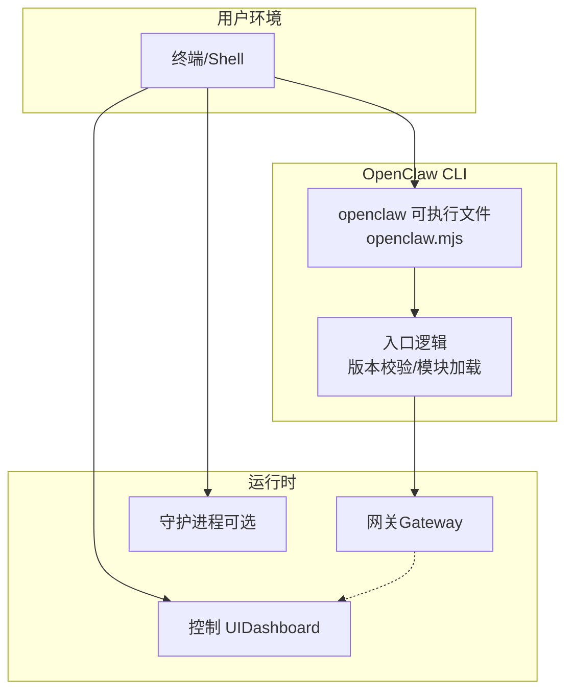
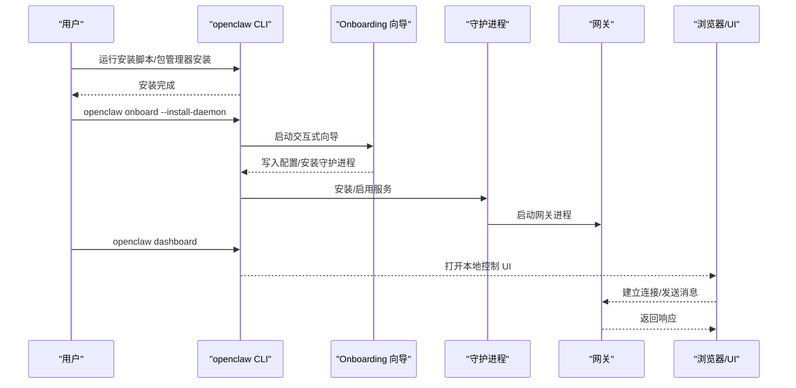
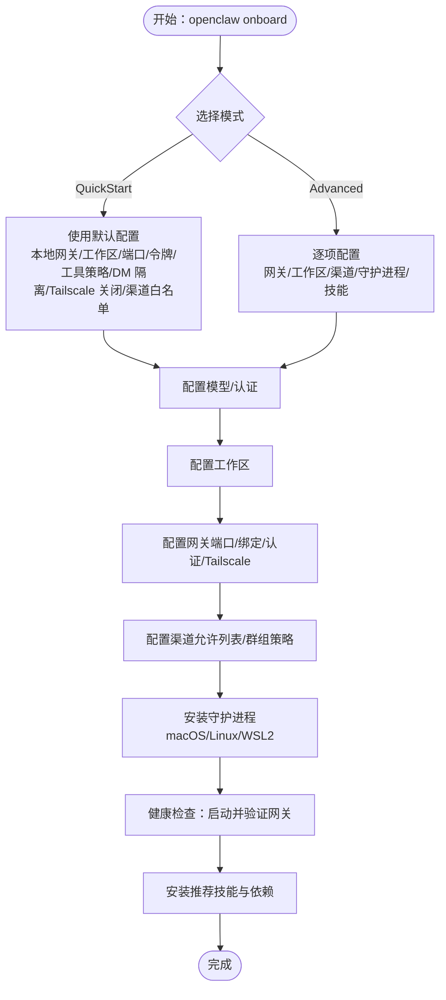
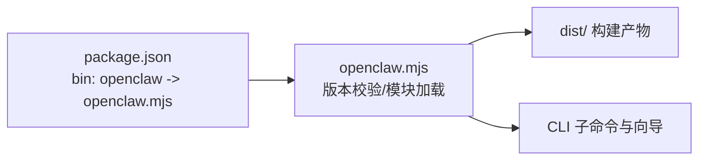

# 快速开始

<cite>
**本文引用的文件**
- [README.md](file://README.md)
- [package.json](file://package.json)
- [openclaw.mjs](file://openclaw.mjs)
- [docs/start/getting-started.md](file://docs/start/getting-started.md)
- [docs/start/wizard.md](file://docs/start/wizard.md)
- [docs/install/index.md](file://docs/install/index.md)
- [docs/install/node.md](file://docs/install/node.md)
- [docs/cli/onboard.md](file://docs/cli/onboard.md)
- [docs/gateway/configuration.md](file://docs/gateway/configuration.md)
</cite>

## 目录
1. [简介](#简介)
2. [项目结构](#项目结构)
3. [核心组件](#核心组件)
4. [架构总览](#架构总览)
5. [详细组件分析](#详细组件分析)
6. [依赖关系分析](#依赖关系分析)
7. [性能考虑](#性能考虑)
8. [故障排除指南](#故障排除指南)
9. [结论](#结论)
10. [附录](#附录)

## 简介
本指南面向首次接触 OpenClaw 的用户，目标是在最短时间内完成安装、配置与首次使用，帮助你从零开始运行 OpenClaw 并与助手进行第一次对话。你将学到：
- 推荐的安装方式与系统要求
- 环境准备与依赖安装
- 首次运行与基础配置
- onboarding wizard 的工作流程与关键配置项
- 常见问题的诊断与修复

## 项目结构
OpenClaw 提供了多种安装路径与运行方式，核心入口为命令行工具 openclaw。其主要能力包括：
- 交互式 onboarding wizard：引导完成网关、工作区、渠道与技能的配置
- 控制 UI（Dashboard）：无需渠道即可在浏览器中直接聊天
- CLI 子命令：消息发送、代理对话、守护进程管理等

图示来源
- [openclaw.mjs:1-90](file://openclaw.mjs#L1-L90)
- [package.json:16-18](file://package.json#L16-L18)

章节来源
- [README.md:28-81](file://README.md#L28-L81)
- [package.json:16-18](file://package.json#L16-L18)
- [openclaw.mjs:1-90](file://openclaw.mjs#L1-L90)

## 核心组件
- CLI 入口与版本校验：openclaw.mjs 在启动时检查 Node 版本（要求 Node ≥22.12），并尝试加载构建产物。
- 安装与运行：支持通过安装脚本、npm/pnpm/bun 或从源码构建的方式安装；推荐使用安装脚本或包管理器全局安装。
- onboarding wizard：交互式向导，用于配置模型/认证、工作区、网关、渠道、守护进程与技能。
- 网关与控制 UI：网关负责会话、通道、工具与事件的控制平面；控制 UI 提供可视化配置与调试。

章节来源
- [openclaw.mjs:5-36](file://openclaw.mjs#L5-L36)
- [docs/start/getting-started.md:28-77](file://docs/start/getting-started.md#L28-L77)
- [docs/start/wizard.md:10-90](file://docs/start/wizard.md#L10-L90)

## 架构总览
下图展示了从安装到首次使用的端到端流程，以及 CLI 与网关、守护进程的关系：

图示来源
- [docs/start/getting-started.md:28-77](file://docs/start/getting-started.md#L28-L77)
- [docs/start/wizard.md:10-90](file://docs/start/wizard.md#L10-L90)
- [docs/cli/onboard.md:8-27](file://docs/cli/onboard.md#L8-L27)

章节来源
- [docs/start/getting-started.md:28-77](file://docs/start/getting-started.md#L28-L77)
- [docs/start/wizard.md:10-90](file://docs/start/wizard.md#L10-L90)

## 详细组件分析

### 1) 系统要求与推荐安装方式
- 系统要求
  - Node.js ≥22.12（安装脚本会自动检测并安装）
  - macOS、Linux 或 Windows（强烈建议在 WSL2 下运行 Windows）
  - pnpm 仅在从源码构建时需要
- 推荐安装方式
  - 使用安装脚本（macOS/Linux/WSL2 或 Windows PowerShell）一键安装并启动 onboarding wizard
  - 使用 npm/pnpm/bun 全局安装后运行 wizard
  - 从源码构建并链接 CLI

章节来源
- [docs/install/index.md:14-22](file://docs/install/index.md#L14-L22)
- [docs/install/index.md:34-70](file://docs/install/index.md#L34-L70)
- [docs/install/index.md:72-104](file://docs/install/index.md#L72-L104)
- [docs/install/index.md:107-141](file://docs/install/index.md#L107-L141)
- [docs/install/node.md:12-21](file://docs/install/node.md#L12-L21)

### 2) 环境准备与依赖安装
- 检查 Node 版本：确保 Node ≥22.12
- 安装依赖
  - npm：安装后可直接运行 openclaw
  - pnpm：首次安装需批准含构建脚本的包（如 sharp、node-llama-cpp、openclaw）
  - Bun：可用于 CLI 运行（仅限 CLI）

章节来源
- [docs/install/index.md:72-104](file://docs/install/index.md#L72-L104)
- [docs/install/index.md:107-141](file://docs/install/index.md#L107-L141)
- [docs/install/node.md:14-21](file://docs/install/node.md#L14-L21)

### 3) 首次运行与基础配置
- 运行 onboarding wizard：安装完成后运行 openclaw onboard，并选择“安装守护进程”以保持网关常驻
- 检查网关状态：使用 openclaw gateway status 确认服务已运行
- 打开控制 UI：运行 openclaw dashboard，在浏览器中打开本地控制面板进行首次聊天
- 发送测试消息（可选）：配置渠道后，使用 openclaw message send 发送一条测试消息

章节来源
- [docs/start/getting-started.md:28-77](file://docs/start/getting-started.md#L28-L77)
- [docs/cli/onboard.md:20-27](file://docs/cli/onboard.md#L20-L27)

### 4) onboarding wizard 工作流程与关键配置项
- QuickStart vs Advanced
  - QuickStart：默认本地网关、工作区、端口 18789、令牌认证（自动生成）、工具策略“coding”、DM 隔离默认 per-channel-peer、关闭 Tailscale、Telegram/WhatsApp 默认允许白名单
  - Advanced：逐项配置模式（网关、工作区、渠道、守护进程、技能等）
- 关键配置项
  - 模型/认证：支持 API Key、OAuth、自定义 Provider（OpenAI/Anthropic 兼容或 Unknown 自动识别）
  - 工作区：默认位于 ~/.openclaw/workspace，种子初始化文件
  - 网关：端口、绑定地址、认证模式、Tailscale 暴露
  - 渠道：支持 WhatsApp、Telegram、Discord、Google Chat、Mattermost、Signal、BlueBubbles、iMessage 等
  - 守护进程：安装 LaunchAgent（macOS）或 systemd 用户单元（Linux/WSL2）
  - 健康检查：启动网关并验证运行状态
  - 技能：安装推荐技能与可选依赖
- 重跑与重置
  - 重新运行向导不会删除数据，除非显式选择 Reset 或传入 --reset
  - 非交互模式：使用 --non-interactive，配合 --secret-input-mode ref 将密钥以 SecretRef 形式存储

图示来源
- [docs/start/wizard.md:44-90](file://docs/start/wizard.md#L44-L90)

章节来源
- [docs/start/wizard.md:44-90](file://docs/start/wizard.md#L44-L90)

### 5) 配置文件与常用命令
- 配置文件位置：~/.openclaw/openclaw.json（JSON5 支持注释与尾随逗号）
- 常用命令
  - openclaw onboard：交互式向导
  - openclaw configure：交互式配置（也可用 openclaw config）
  - openclaw dashboard：打开本地控制 UI
  - openclaw gateway status：检查网关状态
  - openclaw message send：发送测试消息（需配置渠道）
- 配置编辑方式
  - 交互式向导
  - CLI 一次性命令（openclaw config get/set/unset）
  - 控制 UI（Config 标签页）
  - 直接编辑 JSON 文件（热重载生效）

章节来源
- [docs/gateway/configuration.md:12-59](file://docs/gateway/configuration.md#L12-L59)
- [docs/cli/onboard.md:12-18](file://docs/cli/onboard.md#L12-L18)
- [docs/start/getting-started.md:64-102](file://docs/start/getting-started.md#L64-L102)

## 依赖关系分析
- CLI 入口 openclaw.mjs 负责 Node 版本校验与模块加载
- package.json 定义了二进制入口 openclaw 指向 openclaw.mjs，并声明了运行所需的 Node 引擎版本
- 安装脚本与包管理器安装路径最终都会调用 openclaw.mjs，再由其加载构建产物

图示来源
- [package.json:16-18](file://package.json#L16-L18)
- [openclaw.mjs:1-90](file://openclaw.mjs#L1-L90)

章节来源
- [package.json:16-18](file://package.json#L16-L18)
- [openclaw.mjs:1-90](file://openclaw.mjs#L1-L90)

## 性能考虑
- 首次启动时，向导会安装守护进程并启动网关，建议在本地网络内运行，避免不必要的远程暴露
- 若使用本地模型或浏览器控制功能，确保系统资源充足（内存、CPU、磁盘 IO）
- 对于多渠道与多代理场景，合理配置会话隔离与线程绑定，减少上下文切换成本

## 故障排除指南
- openclaw 命令未找到
  - 检查 npm prefix -g 输出是否在 PATH 中；若不在，请将其添加到 shell 启动文件并重启终端
- npm install -g 权限错误（Linux）
  - 将 npm 全局前缀改为用户可写目录，并将该目录加入 PATH
- sharp 构建失败
  - macOS 上若已全局安装 libvips（Homebrew），可通过环境变量强制使用预编译二进制
- Node 版本过低
  - 使用安装脚本自动安装 Node 22+，或通过版本管理器（nvm/fnm/mise/asdf）切换到 Node 22.12+

章节来源
- [docs/install/index.md:181-204](file://docs/install/index.md#L181-L204)
- [docs/install/node.md:89-139](file://docs/install/node.md#L89-L139)
- [docs/install/index.md:82-90](file://docs/install/index.md#L82-L90)

## 结论
通过本快速开始指南，你已经完成了 OpenClaw 的安装与首次运行，掌握了 onboarding wizard 的关键流程与常用配置项，并具备了基本的故障排除能力。建议继续深入学习各渠道与技能的配置，逐步扩展你的个人 AI 助手能力。

## 附录
- 快速命令清单
  - 安装（推荐）：curl -fsSL https://openclaw.ai/install.sh | bash
  - 启动向导并安装守护进程：openclaw onboard --install-daemon
  - 检查网关状态：openclaw gateway status
  - 打开控制 UI：openclaw dashboard
  - 发送测试消息（需配置渠道）：openclaw message send --target +15555550123 --message "Hello from OpenClaw"
- 相关文档
  - Getting Started：从零到第一次聊天
  - Onboarding Wizard（CLI）：交互式向导与高级选项
  - Install：系统要求、安装方法与维护
  - Node.js：版本要求与 PATH 问题排查
  - Configuration：配置文件与常用任务

章节来源
- [docs/start/getting-started.md:28-102](file://docs/start/getting-started.md#L28-L102)
- [docs/start/wizard.md:10-90](file://docs/start/wizard.md#L10-L90)
- [docs/install/index.md:14-22](file://docs/install/index.md#L14-L22)
- [docs/install/node.md:12-21](file://docs/install/node.md#L12-L21)
- [docs/gateway/configuration.md:12-59](file://docs/gateway/configuration.md#L12-L59)