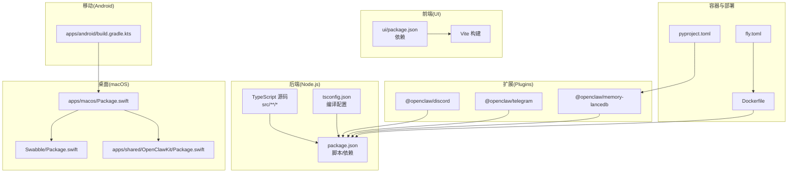
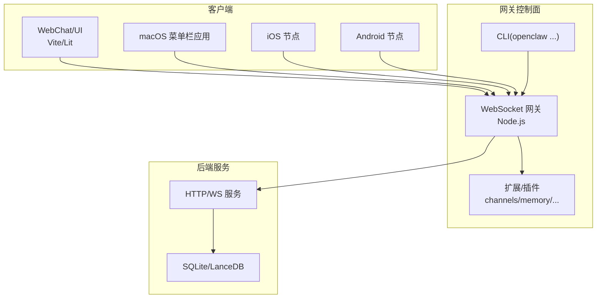
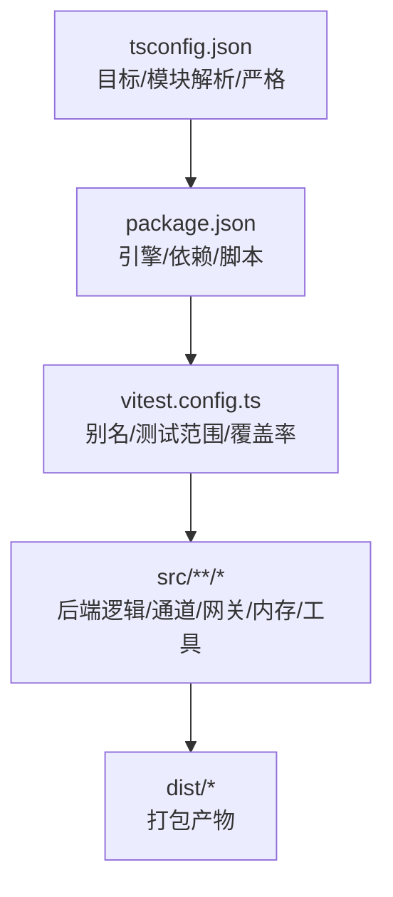
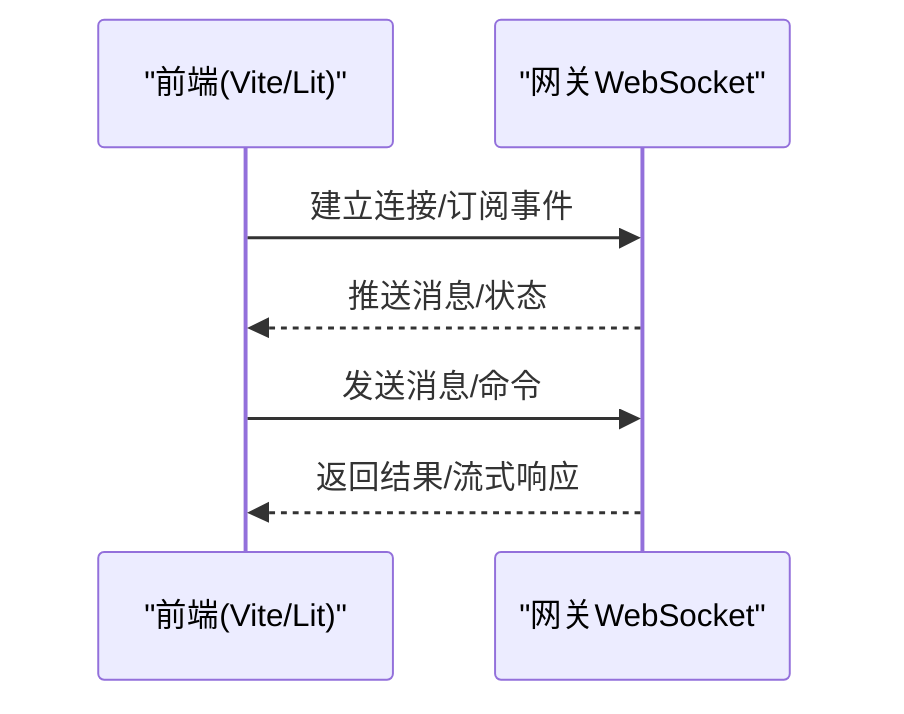
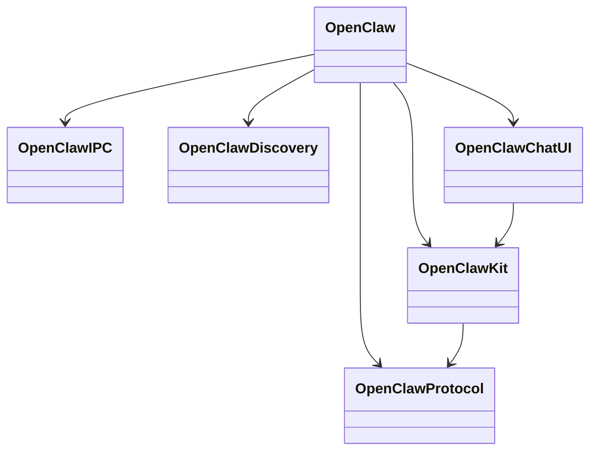
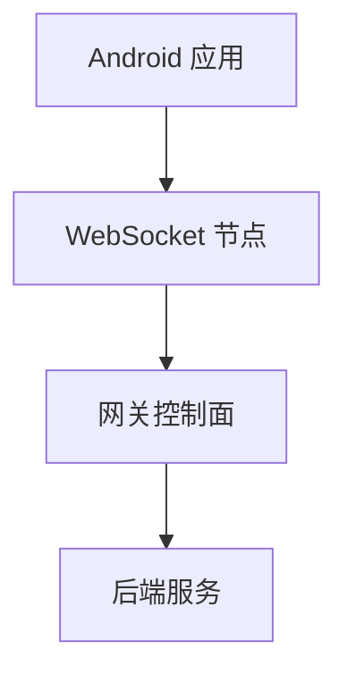
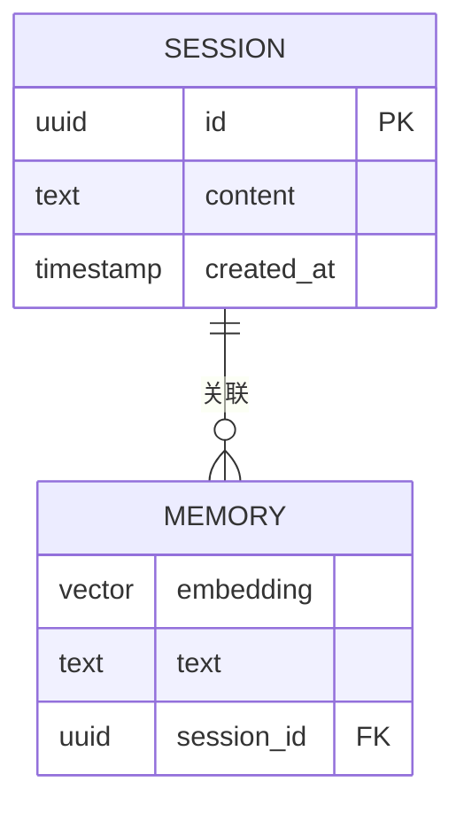
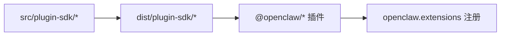
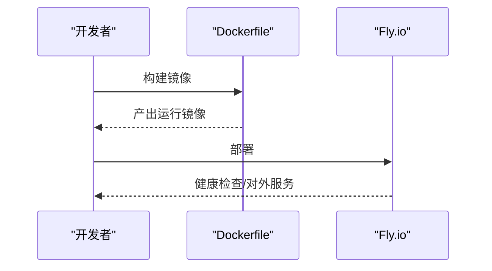
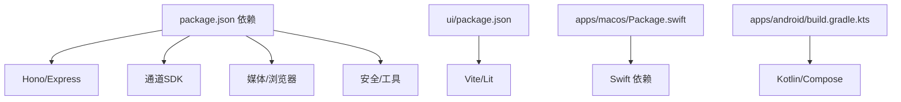

# 技术栈

<cite>
**本文引用的文件**
- [package.json](file://package.json)
- [README.md](file://README.md)
- [tsconfig.json](file://tsconfig.json)
- [vitest.config.ts](file://vitest.config.ts)
- [Dockerfile](file://Dockerfile)
- [fly.toml](file://fly.toml)
- [pyproject.toml](file://pyproject.toml)
- [Swabble/Package.swift](file://Swabble/Package.swift)
- [apps/android/build.gradle.kts](file://apps/android/build.gradle.kts)
- [apps/macos/Package.swift](file://apps/macos/Package.swift)
- [apps/shared/OpenClawKit/Package.swift](file://apps/shared/OpenClawKit/Package.swift)
- [ui/package.json](file://ui/package.json)
- [extensions/memory-lancedb/package.json](file://extensions/memory-lancedb/package.json)
- [extensions/discord/package.json](file://extensions/discord/package.json)
- [extensions/telegram/package.json](file://extensions/telegram/package.json)
</cite>

## 目录
1. [简介](#简介)
2. [项目结构](#项目结构)
3. [核心组件](#核心组件)
4. [架构总览](#架构总览)
5. [详细组件分析](#详细组件分析)
6. [依赖关系分析](#依赖关系分析)
7. [性能考量](#性能考量)
8. [故障排查指南](#故障排查指南)
9. [结论](#结论)
10. [附录](#附录)

## 简介
本文件系统化梳理 OpenClaw 的技术栈，覆盖后端（TypeScript/Node.js）、前端（HTML/CSS/JavaScript）、移动端（Swift/Kotlin）、数据库与向量存储（SQLite/LanceDB）、构建与测试工具链、容器化与部署方案，并给出版本要求、兼容性与演进建议，帮助不同背景的开发者快速理解并参与开发。

## 项目结构
OpenClaw 采用多语言混合工程：核心后端与 CLI 使用 TypeScript/Node.js；桌面端与移动节点使用 Swift；Android 使用 Kotlin；前端控制界面采用 Vite + Lit；扩展与插件以模块化方式组织；容器化与部署通过 Dockerfile 与云平台配置实现。

图示来源
- [package.json](file://package.json)
- [tsconfig.json](file://tsconfig.json)
- [ui/package.json](file://ui/package.json)
- [extensions/discord/package.json](file://extensions/discord/package.json)
- [extensions/telegram/package.json](file://extensions/telegram/package.json)
- [extensions/memory-lancedb/package.json](file://extensions/memory-lancedb/package.json)
- [apps/macos/Package.swift](file://apps/macos/Package.swift)
- [Swabble/Package.swift](file://Swabble/Package.swift)
- [apps/shared/OpenClawKit/Package.swift](file://apps/shared/OpenClawKit/Package.swift)
- [apps/android/build.gradle.kts](file://apps/android/build.gradle.kts)
- [Dockerfile](file://Dockerfile)
- [fly.toml](file://fly.toml)
- [pyproject.toml](file://pyproject.toml)

章节来源
- [package.json](file://package.json)
- [README.md](file://README.md)
- [tsconfig.json](file://tsconfig.json)
- [ui/package.json](file://ui/package.json)
- [Dockerfile](file://Dockerfile)
- [fly.toml](file://fly.toml)
- [pyproject.toml](file://pyproject.toml)
- [Swabble/Package.swift](file://Swabble/Package.swift)
- [apps/android/build.gradle.kts](file://apps/android/build.gradle.kts)
- [apps/macos/Package.swift](file://apps/macos/Package.swift)
- [apps/shared/OpenClawKit/Package.swift](file://apps/shared/OpenClawKit/Package.swift)

## 核心组件
- 后端运行时与包管理
  - 运行时：Node.js ≥ 22（引擎要求）
  - 包管理：pnpm（工作区 + overrides）
  - 入口与导出：CLI 入口 openclaw.mjs，主包导出 dist/index.js 与多子路径导出（插件 SDK）
- 编译与类型系统
  - TypeScript 目标 ES2023，NodeNext 模块解析，严格模式
- 测试与覆盖率
  - Vitest 配置，按目录分层的 include/exclude，覆盖率阈值与稳定锚点
- 前端控制界面
  - Vite + Lit + @lit-labs/signals + marked + dompurify
- 扩展与插件生态
  - 插件以独立 package.json 的 openclaw.extensions 列表注册，支持 Discord、Telegram、LanceDB 内存等
- 容器化与云部署
  - Docker 多阶段构建，基于 node:22-bookworm，健康检查与非 root 用户运行
  - Fly.io 配置，VM 规格与持久卷挂载

章节来源
- [package.json](file://package.json)
- [tsconfig.json](file://tsconfig.json)
- [vitest.config.ts](file://vitest.config.ts)
- [ui/package.json](file://ui/package.json)
- [Dockerfile](file://Dockerfile)
- [fly.toml](file://fly.toml)
- [extensions/discord/package.json](file://extensions/discord/package.json)
- [extensions/telegram/package.json](file://extensions/telegram/package.json)
- [extensions/memory-lancedb/package.json](file://extensions/memory-lancedb/package.json)

## 架构总览
OpenClaw 的运行时由“网关 WebSocket 控制面”驱动，后端通过 Node.js 提供 CLI、网关服务、工具与自动化能力；桌面与移动节点通过 Swift 实现本地能力与协议桥接；前端控制界面由 Vite 构建并直连网关；扩展以模块化方式接入；容器化与云平台提供可复现的部署基座。

图示来源
- [README.md](file://README.md)
- [package.json](file://package.json)
- [Dockerfile](file://Dockerfile)

章节来源
- [README.md](file://README.md)
- [package.json](file://package.json)
- [Dockerfile](file://Dockerfile)

## 详细组件分析

### 后端：TypeScript/Node.js
- 运行时与包管理
  - Node.js ≥ 22，pnpm 工作区，overrides 统一依赖版本
  - 主入口 openclaw.mjs，dist 导出与插件 SDK 子路径导出
- 类型与编译
  - 目标 ES2023，NodeNext 模块解析，严格模式，DOM/ES2023 库
- 测试体系
  - Vitest 配置包含别名映射到 src/plugin-sdk/* 子路径，测试范围覆盖 src/**/*、extensions/**/*、test/**/*，并排除大量集成/端到端/UI 文件
  - 覆盖率仅统计实际被测试执行的 src/**/*.ts，设置行/函数/分支/语句阈值
- 关键依赖
  - Hono/Express 生态、WebSocket、模型提供商 SDK、PDF/图像处理、可执行进程桥接、二维码、Markdown 解析、YAML、Zod/TypeBox 等

图示来源
- [tsconfig.json](file://tsconfig.json)
- [package.json](file://package.json)
- [vitest.config.ts](file://vitest.config.ts)

章节来源
- [package.json](file://package.json)
- [tsconfig.json](file://tsconfig.json)
- [vitest.config.ts](file://vitest.config.ts)

### 前端：HTML/CSS/JavaScript（Vite + Lit）
- 依赖与构建
  - Vite 7.3.1，Lit 3.3.2，@lit-labs/signals，marked，dompurify，playwright（浏览器测试）
- 开发与预览
  - dev/preview/build 脚本，测试通过 vitest.config.ts 集成
- 与后端交互
  - 直连网关 WebSocket，提供 WebChat 与控制面板

图示来源
- [ui/package.json](file://ui/package.json)
- [README.md](file://README.md)

章节来源
- [ui/package.json](file://ui/package.json)
- [README.md](file://README.md)

### 移动端：Swift（macOS/iOS 节点与协议库）
- 平台与工具链
  - Swift 6，macOS/iOS 最低版本声明，Swift Package Manager
- 组件
  - OpenClawIPC/OpenClawDiscovery/OpenClaw/OpenClawMacCLI 可执行与库
  - OpenClawProtocol/OpenClawKit/OpenClawChatUI，ElevenLabsKit，Textual（条件引入）
- 测试
  - Swift Testing 框架，启用 StrictConcurrency 与实验特性

图示来源
- [apps/macos/Package.swift](file://apps/macos/Package.swift)
- [apps/shared/OpenClawKit/Package.swift](file://apps/shared/OpenClawKit/Package.swift)
- [Swabble/Package.swift](file://Swabble/Package.swift)

章节来源
- [apps/macos/Package.swift](file://apps/macos/Package.swift)
- [apps/shared/OpenClawKit/Package.swift](file://apps/shared/OpenClawKit/Package.swift)
- [Swabble/Package.swift](file://Swabble/Package.swift)

### 移动端：Kotlin（Android）
- 构建与插件
  - Gradle 应用/测试插件，ktlint，Compose，serialization 插件
- 与网关交互
  - 设备配对、聊天/语音/画布/相机/屏幕录制等节点能力

图示来源
- [apps/android/build.gradle.kts](file://apps/android/build.gradle.kts)
- [README.md](file://README.md)

章节来源
- [apps/android/build.gradle.kts](file://apps/android/build.gradle.kts)
- [README.md](file://README.md)

### 数据库与向量存储：SQLite 与 LanceDB
- SQLite
  - 默认内置，满足本地会话、配置与日志存储
- LanceDB
  - 作为长期记忆插件（@openclaw/memory-lancedb），提供向量检索与自动召回
  - 依赖 @lancedb/lancedb、openai、TypeBox

图示来源
- [extensions/memory-lancedb/package.json](file://extensions/memory-lancedb/package.json)

章节来源
- [extensions/memory-lancedb/package.json](file://extensions/memory-lancedb/package.json)

### 扩展与插件生态
- 插件发现机制
  - 每个扩展 package.json 中的 openclaw.extensions 数组指向入口文件
- 典型插件
  - Discord、Telegram、LanceDB 内存等
- 插件 SDK
  - 通过 package.json 的 exports 映射到 dist/plugin-sdk/*，便于统一导入

图示来源
- [package.json](file://package.json)
- [extensions/discord/package.json](file://extensions/discord/package.json)
- [extensions/telegram/package.json](file://extensions/telegram/package.json)
- [extensions/memory-lancedb/package.json](file://extensions/memory-lancedb/package.json)

章节来源
- [package.json](file://package.json)
- [extensions/discord/package.json](file://extensions/discord/package.json)
- [extensions/telegram/package.json](file://extensions/telegram/package.json)
- [extensions/memory-lancedb/package.json](file://extensions/memory-lancedb/package.json)

### 容器化与部署
- Dockerfile
  - 多阶段构建：提取扩展依赖、安装依赖、构建、裁剪 dev 依赖与映射文件
  - 基于 node:22-bookworm（或 slim），非 root 用户运行，健康检查
  - 支持可选安装 Chromium/Xvfb、Docker CLI（沙箱）
- Fly.io
  - Dockerfile 构建，共享 CPU 2x，2GB 内存，持久卷 /data，HTTP 强制 HTTPS，最小 1 台常驻机器

图示来源
- [Dockerfile](file://Dockerfile)
- [fly.toml](file://fly.toml)

章节来源
- [Dockerfile](file://Dockerfile)
- [fly.toml](file://fly.toml)

### Python 工具链（可选）
- ruff：Python Lint（py310 目标）
- pytest：skills 目录测试

章节来源
- [pyproject.toml](file://pyproject.toml)

## 依赖关系分析
- 后端依赖
  - Hono/Express：HTTP/WS 服务
  - 模型提供商 SDK：OpenAI、Anthropic、Bedrock 等
  - 媒体与浏览器：Playwright-core、sharp、pdfjs
  - 通道适配：grammy、discord.js、@whiskeysockets/baileys、@slack/bolt 等
  - 工具与安全：ws、yaml、zod、TypeBox、https-proxy-agent、chokidar、qrcode-terminal
- 前端依赖
  - Vite、Lit、@lit-labs/signals、marked、dompurify、playwright（浏览器测试）
- Swift 依赖
  - Commander、swift-testing、MenuBarExtraAccess、Subprocess、Logging、Sparkle、Peekaboo、ElevenLabsKit、Textual
- Android 依赖
  - Compose、serialization、ktlint 插件

图示来源
- [package.json](file://package.json)
- [ui/package.json](file://ui/package.json)
- [apps/macos/Package.swift](file://apps/macos/Package.swift)
- [apps/android/build.gradle.kts](file://apps/android/build.gradle.kts)

章节来源
- [package.json](file://package.json)
- [ui/package.json](file://ui/package.json)
- [apps/macos/Package.swift](file://apps/macos/Package.swift)
- [apps/android/build.gradle.kts](file://apps/android/build.gradle.kts)

## 性能考量
- 构建与缓存
  - pnpm store 缓存、Docker apt 缓存、UI 构建强制 pnpm（避免架构差异导致的失败）
- 运行时优化
  - 非 root 用户运行，减少权限开销；Node 内存限制通过环境变量配置
  - 可选预装 Chromium 与 Xvfb，降低启动时下载依赖的冷启动成本
- 测试并发
  - Vitest 在本地按 CPU 核数动态分配 worker，在 CI 上按平台设定 worker 数，提升吞吐
- 覆盖率锚定
  - 仅统计被测试直接覆盖的 src/**/*.ts，避免随扩展/应用膨胀导致阈值漂移

章节来源
- [Dockerfile](file://Dockerfile)
- [vitest.config.ts](file://vitest.config.ts)
- [fly.toml](file://fly.toml)

## 故障排查指南
- 端口与绑定
  - Docker 默认绑定 loopback，桥接网络下需使用 host 网络或改为 LAN 并设置鉴权
- 健康检查
  - 容器内健康探针访问 http://127.0.0.1:18789/healthz，确认网关就绪
- 权限与沙箱
  - 非 root 运行，如需 Docker 沙箱，需在镜像中安装 Docker CLI
- 浏览器自动化
  - 如需 Playwright，可在构建时启用 OPENCLAW_INSTALL_BROWSER，预装 Chromium
- 测试问题
  - Windows 平台下 hook 超时更高；CI 下 worker 数受限；注意 vmForks 下的环境隔离

章节来源
- [Dockerfile](file://Dockerfile)
- [fly.toml](file://fly.toml)
- [vitest.config.ts](file://vitest.config.ts)

## 结论
OpenClaw 采用“多语言混合 + 模块化插件”的技术栈：后端以 TypeScript/Node.js 为核心，配合 Swift 桌面与 Kotlin Android 节点，前端以 Vite/Lit 提供轻量控制界面；数据库与向量存储通过 SQLite/LanceDB 插件化支持；容器化与云平台提供可复现、可观测的部署基座。该架构兼顾易用性与扩展性，适合个人与团队在多平台上构建与运行多通道 AI 助手。

## 附录

### 版本与兼容性摘要
- Node.js：≥ 22（引擎要求）
- TypeScript：ES2023 目标，NodeNext 模块解析
- Swift：Swift 6，macOS/iOS 最低版本见各 Package.swift
- Android：Gradle 应用/测试插件，Compose/serialization 插件
- Docker：基于 node:22-bookworm（或 slim），非 root 用户运行
- Fly.io：共享 CPU 2x，2GB 内存，持久卷 /data

章节来源
- [package.json](file://package.json)
- [tsconfig.json](file://tsconfig.json)
- [Swabble/Package.swift](file://Swabble/Package.swift)
- [apps/macos/Package.swift](file://apps/macos/Package.swift)
- [apps/android/build.gradle.kts](file://apps/android/build.gradle.kts)
- [Dockerfile](file://Dockerfile)
- [fly.toml](file://fly.toml)