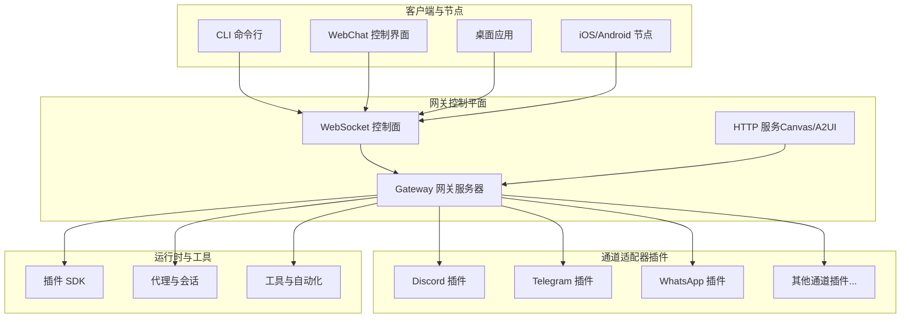
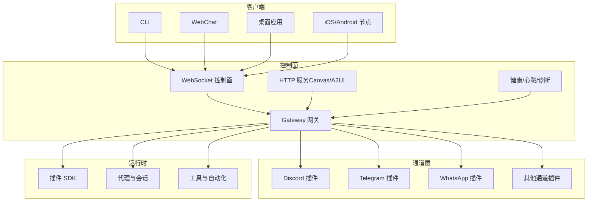
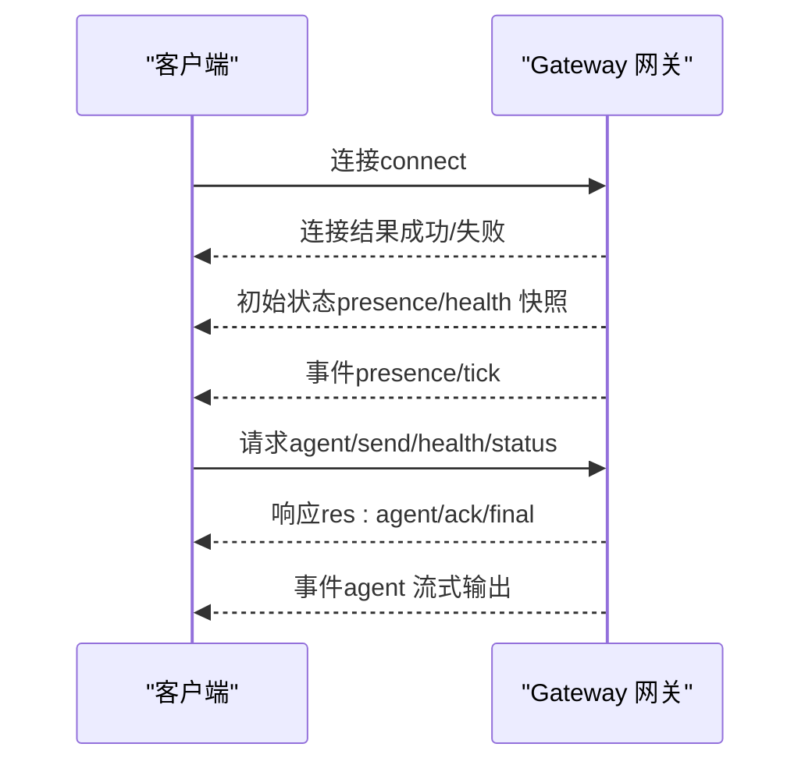
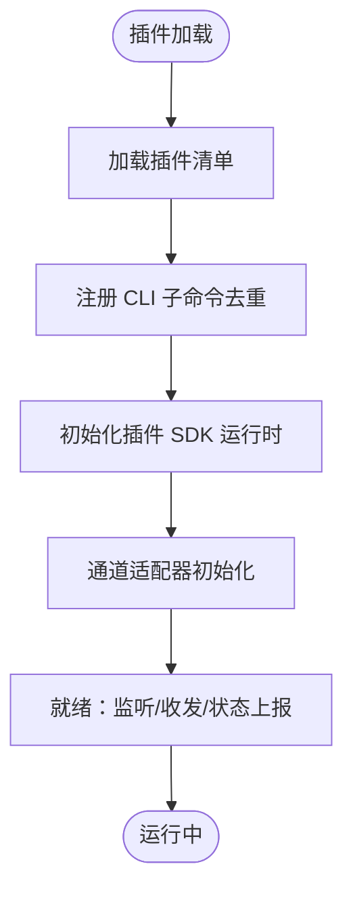
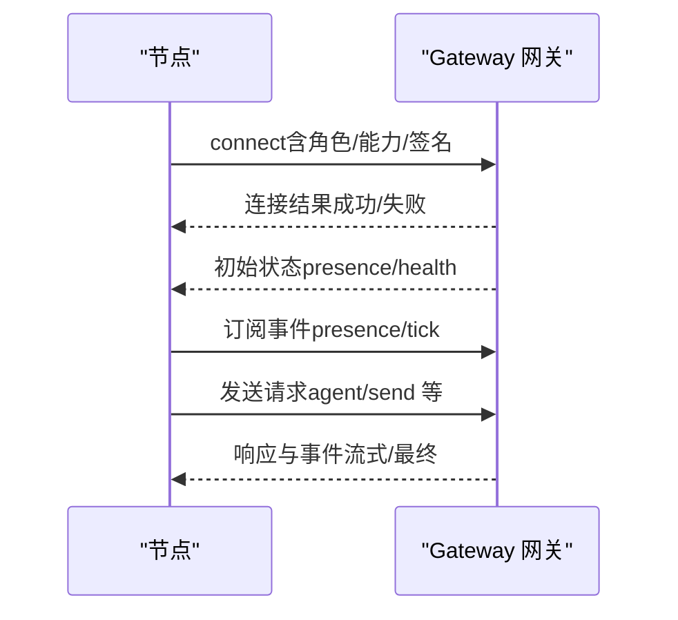
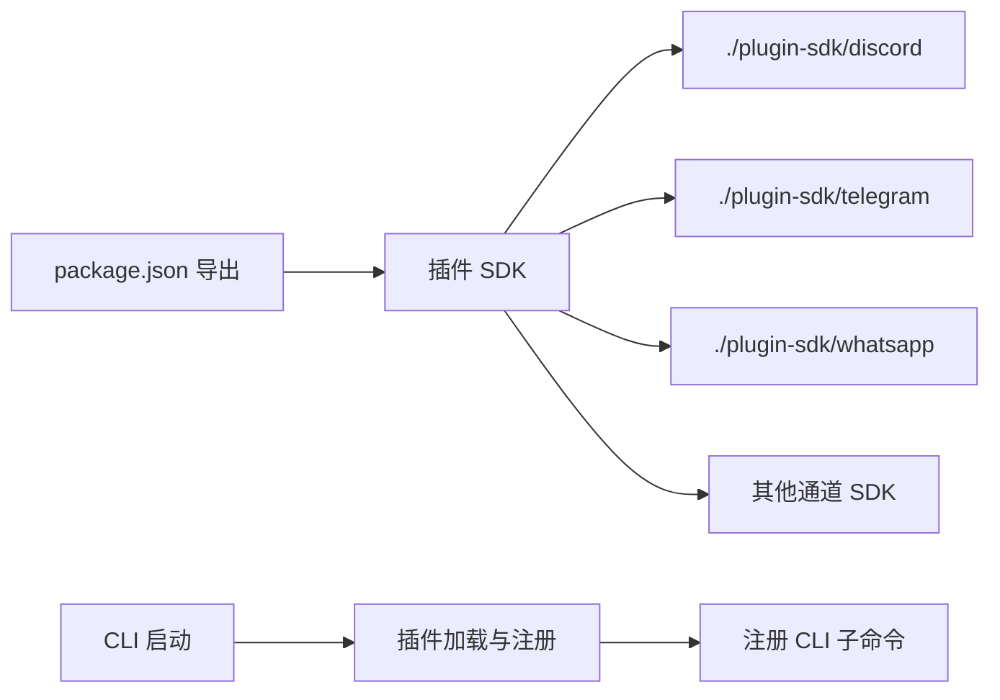

# 架构总览

<cite>
**本文引用的文件**
- [README.md](file://README.md)
- [architecture.md](file://docs/concepts/architecture.md)
- [index.ts](file://src/plugin-sdk/index.ts)
- [entry.ts](file://src/entry.ts)
- [run-main.ts](file://src/cli/run-main.ts)
- [package.json](file://package.json)
- [openclaw.plugin.json（discord）](file://extensions/discord/openclaw.plugin.json)
- [openclaw.plugin.json（telegram）](file://extensions/telegram/openclaw.plugin.json)
- [openclaw.plugin.json（whatsapp）](file://extensions/whatsapp/openclaw.plugin.json)
- [server.ts](file://src/gateway/server.ts)
- [cli.ts](file://src/plugins/cli.ts)
</cite>

## 目录
1. [简介](#简介)
2. [项目结构](#项目结构)
3. [核心组件](#核心组件)
4. [架构总览](#架构总览)
5. [详细组件分析](#详细组件分析)
6. [依赖分析](#依赖分析)
7. [性能考虑](#性能考虑)
8. [故障排查指南](#故障排查指南)
9. [结论](#结论)

## 简介
OpenClaw 是一个“个人 AI 助手”，可在用户自有的设备上运行，统一接入多渠道消息平台（如 WhatsApp、Telegram、Slack、Discord、Google Chat、Signal、iMessage、BlueBubbles、IRC、Microsoft Teams、Matrix、Feishu、LINE、Mattermost、Nextcloud Talk、Nostr、Synology Chat、Tlon、Twitch、Zalo、Zalo Personal、WebChat），并支持语音唤醒与实时画布协作。其核心是“网关控制平面”（Gateway），作为统一的控制面，承载会话、通道、工具与事件；同时提供 CLI、WebChat、桌面应用与移动端节点的连接入口。

- 产品定位：以本地优先、快速且常在线的方式提供个人助理体验。
- 关键能力：多通道统一接入、多代理路由、语音唤醒/通话、实时画布（A2UI）、浏览器与节点控制、自动化与钩子、远程访问与安全控制。
- 运行时：Node ≥22，支持 npm/pnpm/bun 安装与运行。

章节来源
- [README.md:21-31](file://README.md#L21-L31)
- [README.md:128-135](file://README.md#L128-L135)
- [README.md:185-202](file://README.md#L185-L202)

## 项目结构
从整体上看，OpenClaw 采用“单网关控制平面 + 插件化通道适配 + 节点系统”的分层架构：
- 网关控制平面：负责协议、会话、事件、健康与心跳、远程暴露（Tailscale/SSH 隧道）等。
- 通道适配器：通过插件形式接入各消息平台（Discord、Telegram、WhatsApp 等），每个插件定义自身配置模式与能力边界。
- 插件 SDK：为插件开发者提供统一的类型、工具函数、状态与生命周期管理接口。
- 客户端与节点：CLI、WebChat、桌面应用、移动节点均通过 WebSocket 连接到网关，形成统一控制面。
- 扩展与技能：通过扩展目录与技能平台实现功能增强与可发现性。

图示来源
- [architecture.md:12-26](file://docs/concepts/architecture.md#L12-L26)
- [package.json:37-216](file://package.json#L37-L216)

章节来源
- [architecture.md:12-26](file://docs/concepts/architecture.md#L12-L26)
- [package.json:37-216](file://package.json#L37-L216)

## 核心组件
- 网关（Gateway）
  - 单一长连接控制平面，承载通道连接、会话、事件推送、健康与心跳、Canvas/A2UI 提供等。
  - 默认绑定到本地回环地址与端口，可通过 Tailscale 或 SSH 隧道安全暴露。
- 通道适配器（Channel Plugins）
  - 以插件形式接入不同消息平台，每个插件声明支持的通道列表与配置模式。
  - 通过统一的插件 SDK 提供认证、消息收发、线程/群组处理、状态与诊断等能力。
- 插件 SDK（Plugin SDK）
  - 暴露类型定义、工具函数、Webhook/HTTP 注册、队列与幂等缓存、SSRF 保护、时间与环境工具等。
  - 为插件开发提供一致的开发体验与运行时保障。
- 客户端与节点
  - CLI、WebChat、桌面应用、iOS/Android 节点均通过 WebSocket 连接网关，具备角色区分（操作者/节点）与权限声明。
- 远程访问与安全
  - 支持 Tailscale Serve/Funnel 与 SSH 隧道；连接需设备配对与签名挑战，支持本地自动批准与远程显式批准。
  - 网关鉴权（gateway.auth.*）适用于所有连接。

章节来源
- [architecture.md:29-47](file://docs/concepts/architecture.md#L29-L47)
- [architecture.md:93-109](file://docs/concepts/architecture.md#L93-L109)
- [index.ts:1-826](file://src/plugin-sdk/index.ts#L1-L826)
- [openclaw.plugin.json（discord）:1-10](file://extensions/discord/openclaw.plugin.json#L1-L10)
- [openclaw.plugin.json（telegram）:1-10](file://extensions/telegram/openclaw.plugin.json#L1-L10)
- [openclaw.plugin.json（whatsapp）:1-10](file://extensions/whatsapp/openclaw.plugin.json#L1-L10)

## 架构总览
OpenClaw 的整体架构围绕“网关控制平面”展开，采用以下核心设计原则：
- 微服务化控制面：单一网关负责所有通道连接与会话编排，避免跨进程协调复杂度。
- 插件化通道适配：通过插件注册与配置模式，实现对多平台的解耦与可扩展接入。
- 事件驱动与流式响应：基于 WebSocket 的请求/响应与事件推送，结合流式输出与块合并策略，提升交互体验。
- 安全与信任：设备级配对、签名挑战、本地自动批准、远程显式批准与网关鉴权共同构成安全基线。
- 可观测与可观测性：内置诊断事件、速率限制与异常追踪，便于问题定位与性能优化。

图示来源
- [architecture.md:12-26](file://docs/concepts/architecture.md#L12-L26)
- [index.ts:1-826](file://src/plugin-sdk/index.ts#L1-L826)

章节来源
- [architecture.md:12-26](file://docs/concepts/architecture.md#L12-L26)
- [README.md:185-202](file://README.md#L185-L202)

## 详细组件分析

### 网关控制平面（Gateway）
- 角色与职责
  - 维护各通道提供商连接，暴露类型化的 WebSocket API（请求/响应/事件推送）。
  - 校验入站帧（JSON Schema），发布 agent/chat/presence/health/heartbeat/cron 等事件。
  - 提供 Canvas/A2UI HTTP 服务，使用与网关相同的端口。
- 连接与生命周期
  - 客户端（CLI/WebChat/桌面应用/节点）通过 WebSocket 连接，首帧必须为 connect。
  - 支持令牌鉴权（OPENCLAW_GATEWAY_TOKEN），节点需声明角色与能力。
  - 设备配对与签名挑战确保本地/远程连接的信任边界。
- 运维快照
  - 启动命令、健康查询、守护进程（launchd/systemd）与自动重启。

图示来源
- [architecture.md:59-78](file://docs/concepts/architecture.md#L59-L78)

章节来源
- [architecture.md:29-47](file://docs/concepts/architecture.md#L29-L47)
- [architecture.md:93-109](file://docs/concepts/architecture.md#L93-L109)
- [server.ts:1-4](file://src/gateway/server.ts#L1-L4)

### 插件生态与通道适配器
- 插件注册与 CLI 集成
  - 插件在启动时加载，注册 CLI 子命令并与现有命令集去重冲突。
  - 通过插件 SDK 提供统一的类型、工具与运行时能力。
- 通道插件示例
  - Discord/Telegram/WhatsApp 插件均以 openclaw.plugin.json 声明通道 ID 与配置模式。
  - 插件内部实现认证、消息收发、线程/群组处理、状态与诊断等。
- 插件 SDK 能力概览
  - 类型与校验：TypeBox 模式生成 JSON Schema，Swift 模型代码生成。
  - HTTP/Webhook：路径规范化、目标解析、并发限制与请求体防护。
  - 幂等与去重：键控异步队列与短期去重缓存。
  - 安全：SSRF 策略、主机白名单、抓取守卫。
  - 工具与媒体：文本分片、媒体加载、临时文件管理、位置解析等。

图示来源
- [cli.ts:11-59](file://src/plugins/cli.ts#L11-L59)
- [index.ts:1-826](file://src/plugin-sdk/index.ts#L1-L826)
- [openclaw.plugin.json（discord）:1-10](file://extensions/discord/openclaw.plugin.json#L1-L10)
- [openclaw.plugin.json（telegram）:1-10](file://extensions/telegram/openclaw.plugin.json#L1-L10)
- [openclaw.plugin.json（whatsapp）:1-10](file://extensions/whatsapp/openclaw.plugin.json#L1-L10)

章节来源
- [cli.ts:11-59](file://src/plugins/cli.ts#L11-L59)
- [index.ts:1-826](file://src/plugin-sdk/index.ts#L1-L826)
- [openclaw.plugin.json（discord）:1-10](file://extensions/discord/openclaw.plugin.json#L1-L10)
- [openclaw.plugin.json（telegram）:1-10](file://extensions/telegram/openclaw.plugin.json#L1-L10)
- [openclaw.plugin.json（whatsapp）:1-10](file://extensions/whatsapp/openclaw.plugin.json#L1-L10)

### 客户端与节点（CLI/WebChat/桌面/节点）
- 连接模型
  - 所有客户端通过同一 WebSocket 服务器连接，区分角色（操作者/节点）与能力声明。
  - 节点通过设备配对与签名挑战建立信任，支持本地自动批准与远程显式批准。
- 交互流程
  - 首帧 connect 成功后，网关下发初始状态（presence/health），随后订阅事件并发送请求。
  - 请求采用幂等键（idempotency keys）以支持重试；节点需包含角色与能力信息。

图示来源
- [architecture.md:59-78](file://docs/concepts/architecture.md#L59-L78)
- [architecture.md:93-109](file://docs/concepts/architecture.md#L93-L109)

章节来源
- [architecture.md:59-78](file://docs/concepts/architecture.md#L59-L78)
- [architecture.md:93-109](file://docs/concepts/architecture.md#L93-L109)

### 远程访问与安全
- 远程访问
  - 推荐：Tailscale（Serve/Funnel）或 VPN；备选：SSH 隧道。
  - 同一套握手与令牌机制适用于隧道连接，可启用 TLS 与可选证书固定。
- 安全模型
  - 设备配对：新设备需批准；本地连接可自动批准；远程连接需显式批准。
  - 签名挑战：v3 签名绑定平台与设备家族，变更元数据需重新配对。
  - 网关鉴权：gateway.auth.* 适用于所有连接（本地/远程）。

章节来源
- [architecture.md:117-128](file://docs/concepts/architecture.md#L117-L128)
- [architecture.md:93-109](file://docs/concepts/architecture.md#L93-L109)

## 依赖分析
- 包导出与模块化
  - package.json 暴露多条 exports，包括主入口与各通道插件 SDK（如 ./plugin-sdk/discord、./plugin-sdk/telegram 等），便于按需引入与类型推断。
- 运行时与依赖
  - 核心运行时要求 Node ≥22；依赖包括 WebSocket、Express、Hono、TypeBox、Zod、croner、各种 SDK（如 @whiskeysockets/baileys、@grammyjs/grammY、@slack/bolt 等）。
- 插件与扩展
  - 插件通过 openclaw.plugin.json 声明通道 ID 与配置模式；CLI 在启动时加载插件并注册命令。

图示来源
- [package.json:37-216](file://package.json#L37-L216)
- [cli.ts:11-59](file://src/plugins/cli.ts#L11-L59)

章节来源
- [package.json:37-216](file://package.json#L37-L216)
- [cli.ts:11-59](file://src/plugins/cli.ts#L11-L59)

## 性能考虑
- 事件驱动与流式输出
  - 使用 WebSocket 的事件推送与流式响应，减少轮询开销，提升交互延迟表现。
- 幂等与去重
  - 对副作用方法（如 send/agent）要求幂等键，配合短期去重缓存降低重复处理成本。
- 并发与限流
  - 插件 SDK 提供键控异步队列与固定窗口限流器，避免过载与资源争用。
- SSRF 与请求体限制
  - 内置抓取守卫与请求体大小限制，防止滥用与资源耗尽。
- 本地优先与远程安全
  - 默认绑定 loopback，结合 Tailscale/SSH 隧道，既保证本地低延迟，又确保远程访问的安全可控。

章节来源
- [architecture.md:80-92](file://docs/concepts/architecture.md#L80-L92)
- [index.ts:440-452](file://src/plugin-sdk/index.ts#L440-L452)
- [index.ts:146-148](file://src/plugin-sdk/index.ts#L146-L148)
- [index.ts:430-439](file://src/plugin-sdk/index.ts#L430-L439)

## 故障排查指南
- 健康检查与诊断
  - 通过 WS 的 health 方法或 hello-ok 快照中的健康信息进行检查。
  - 使用诊断事件（Diagnostic*）与异常追踪定位问题。
- 连接与配对
  - 若连接被关闭，检查 connect 参数中的令牌与签名挑战是否匹配。
  - 新设备未批准或元数据变更导致的配对失效，需重新配对。
- 远程访问
  - 确认 Tailscale/SSH 隧道配置正确，令牌与鉴权设置符合 gateway.auth.*。
- 日志与捕获
  - CLI 启动时安装未处理拒绝与未捕获异常处理器，确保错误可追踪。

章节来源
- [architecture.md:129-140](file://docs/concepts/architecture.md#L129-L140)
- [index.ts:622-642](file://src/plugin-sdk/index.ts#L622-L642)
- [run-main.ts:105-112](file://src/cli/run-main.ts#L105-L112)

## 结论
OpenClaw 以“网关控制平面”为核心，采用微服务化控制面、插件化通道适配与事件驱动模式，构建了可扩展、可远程、可审计的个人 AI 助手平台。通过设备配对、签名挑战与网关鉴权形成安全基线，结合流式响应、幂等与限流等工程实践，兼顾性能与可靠性。插件 SDK 与 CLI 集成为扩展与运维提供了清晰的路径，适合在本地或远程环境中稳定运行。