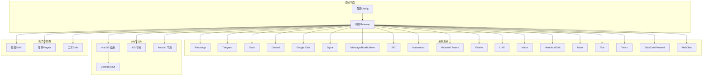
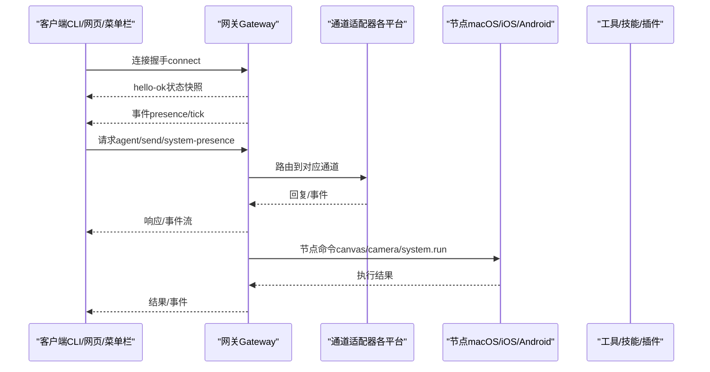
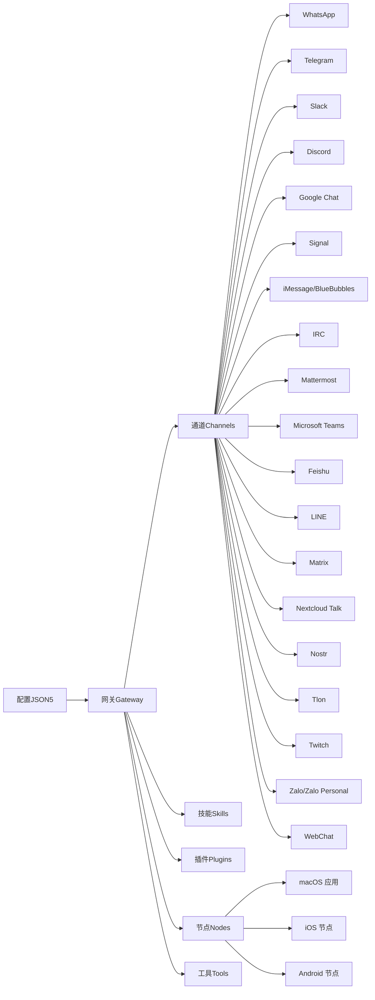

# 核心特性

<cite>
**本文引用的文件**
- [README.md](file://README.md)
- [VISION.md](file://VISION.md)
- [docs/channels/index.md](file://docs/channels/index.md)
- [docs/concepts/architecture.md](file://docs/concepts/architecture.md)
- [docs/tools/skills.md](file://docs/tools/skills.md)
- [docs/gateway/configuration.md](file://docs/gateway/configuration.md)
- [docs/tools/plugin.md](file://docs/tools/plugin.md)
- [docs/platforms/macos.md](file://docs/platforms/macos.md)
</cite>

## 目录
1. [简介](#简介)
2. [项目结构](#项目结构)
3. [核心组件](#核心组件)
4. [架构总览](#架构总览)
5. [详细组件分析](#详细组件分析)
6. [依赖关系分析](#依赖关系分析)
7. [性能考量](#性能考量)
8. [故障排查指南](#故障排查指南)
9. [结论](#结论)
10. [附录](#附录)

## 简介
OpenClaw 是一个“个人 AI 助手”，可在你的设备上运行，接入你常用的即时通讯渠道，支持本地化、安全可控的 AI 代理执行与跨平台设备控制，并通过可扩展的技能与插件生态实现能力外延。它以“网关（Gateway）”作为统一控制平面，连接多通道消息、工具与节点，提供本地优先、隐私优先的智能体验。

- 多渠道消息集成：覆盖 WhatsApp、Telegram、Slack、Discord、Google Chat、Signal、iMessage（BlueBubbles 推荐）、IRC、Microsoft Teams、Matrix、Feishu、LINE、Mattermost、Nextcloud Talk、Nostr、Synology Chat、Tlon、Twitch、Zalo、Zalo Personal、WebChat 等 20+ 平台。
- 本地化的 AI 代理执行：在网关内以“Pi 代理”模式运行，支持工具流式输出与块流式输出，结合会话管理与模型回退策略，兼顾性能与稳定性。
- 跨平台设备控制：macOS/iOS/Android 节点通过 WebSocket 连接网关，暴露 Canvas、相机、屏幕录制、系统命令、通知等能力；macOS 应用进一步整合权限与本地服务。
- 可扩展的技能与插件生态：通过“技能（Skills）”与“插件（Plugins）”机制，实现工具、通道、上下文引擎、HTTP 路由等能力的按需加载与组合。
- 安全的本地数据处理：默认严格的安全策略（如 DM 配对、允许列表、沙箱隔离、远程访问受控），强调 Operator 对高风险路径的显式控制。

章节来源
- [README.md:1-26](file://README.md#L1-L26)
- [README.md:126-176](file://README.md#L126-L176)
- [VISION.md:15-32](file://VISION.md#L15-L32)

## 项目结构
OpenClaw 的核心围绕“网关（Gateway）+ 通道（Channels）+ 技能（Skills）+ 插件（Plugins）+ 节点（Nodes）+ 工具（Tools）+ 配置（Config）”展开。下图给出高层视图：

图表来源
- [docs/channels/index.md:14-37](file://docs/channels/index.md#L14-L37)
- [docs/concepts/architecture.md:12-25](file://docs/concepts/architecture.md#L12-L25)
- [docs/platforms/macos.md:9-24](file://docs/platforms/macos.md#L9-L24)

章节来源
- [docs/channels/index.md:9-48](file://docs/channels/index.md#L9-L48)
- [docs/concepts/architecture.md:12-25](file://docs/concepts/architecture.md#L12-L25)
- [docs/platforms/macos.md:9-24](file://docs/platforms/macos.md#L9-L24)

## 核心组件
- 网关（Gateway）
  - 单一长连接的 WebSocket 控制平面，承载消息通道、事件推送、工具调用与节点交互。
  - 提供类型化请求/响应与事件流，支持配对信任、远程访问（Tailscale/SSH）、健康检查与心跳。
- 通道（Channels）
  - 支持 20+ 即时通讯平台，统一经由网关路由；每类通道具备独立配置、DM 策略与群组规则。
- 技能（Skills）
  - 基于“AgentSkills”兼容规范的技能目录，支持工作区/托管/内置三层优先级、按环境/配置/二进制条件筛选、热重载与令牌开销估算。
- 插件（Plugins）
  - TypeScript 模块，注册 RPC、HTTP 路由、工具、CLI 命令、后台服务、上下文引擎、自动回复等；支持专属槽位（如内存插件）与严格发现/校验流程。
- 节点（Nodes）
  - macOS/iOS/Android 通过 WebSocket 以“节点”角色连接，声明能力与权限，执行本地动作（Canvas、相机、屏幕录制、系统命令、通知等）。
- 工具（Tools）
  - 浏览器控制、Canvas/A2UI、节点命令、定时任务（cron）、会话工具、语音唤醒与对话模式等。
- 配置（Config）
  - JSON5 配置文件，严格校验；支持热重载、分段 include、环境变量注入、SecretRef 凭证引用、多代理路由与多 Agent 隔离。

章节来源
- [docs/concepts/architecture.md:27-48](file://docs/concepts/architecture.md#L27-L48)
- [docs/tools/skills.md:11-26](file://docs/tools/skills.md#L11-L26)
- [docs/tools/plugin.md:62-79](file://docs/tools/plugin.md#L62-L79)
- [docs/gateway/configuration.md:10-24](file://docs/gateway/configuration.md#L10-L24)

## 架构总览
OpenClaw 的核心是“网关控制平面 + 多通道消息 + 节点本地能力 + 可插拔技能/插件”的统一架构。客户端（macOS 应用/CLI/Web）与节点均通过 WebSocket 与网关交互，网关负责会话、路由、工具与事件编排。

图表来源
- [docs/concepts/architecture.md:59-78](file://docs/concepts/architecture.md#L59-L78)
- [docs/concepts/architecture.md:80-92](file://docs/concepts/architecture.md#L80-L92)

章节来源
- [docs/concepts/architecture.md:12-25](file://docs/concepts/architecture.md#L12-L25)
- [docs/concepts/architecture.md:59-78](file://docs/concepts/architecture.md#L59-L78)

## 详细组件分析

### 多渠道消息集成（20+ 即时通讯平台）
- 能力概览
  - 支持文本、媒体与反应（因平台而异）；通道可并行运行，按聊天路由。
  - DM 策略统一：配对（pairing）、允许列表（allowlist）、开放（open）、禁用（disabled）。
  - 群组行为：提及门控、回复标签、分片路由与平台特定规则。
- 典型使用场景
  - 快速上手：Telegram（简单机器人令牌）；复杂场景：WhatsApp（QR 登录与状态持久化）。
  - 企业/团队：Slack/Discord/Teams；协作与自动化：Mattermost/Matrix/Nextcloud Talk。
  - 分布式/去中心化：Nostr；国内生态：Feishu/LINE/Zalo/Zalo Personal。
- 最佳实践
  - 明确 DM 策略与允许列表，避免未授权访问。
  - 合理设置群组提及门控与线程绑定，提升多账号/多账户场景下的可控性。
  - 使用“通道路由”与“多代理路由”隔离不同来源与身份的会话。

章节来源
- [docs/channels/index.md:14-37](file://docs/channels/index.md#L14-L37)
- [docs/channels/index.md:39-47](file://docs/channels/index.md#L39-L47)
- [docs/gateway/configuration.md:90-103](file://docs/gateway/configuration.md#L90-L103)
- [docs/gateway/configuration.md:149-175](file://docs/gateway/configuration.md#L149-L175)

### 本地化的 AI 代理执行
- 能力概览
  - Pi 代理运行于网关内，支持工具流式输出与块流式输出；结合会话管理、模型回退与使用追踪。
  - 支持多代理路由（per-agent 工作区与会话隔离）、会话压缩与历史检索。
- 典型使用场景
  - 单用户助理：主会话直连主机工具，兼顾安全性与易用性。
  - 多账号/多账户：通过绑定规则将不同通道/账户路由至独立代理，实现强隔离。
- 最佳实践
  - 在非主会话启用沙箱（Docker）隔离，限制高风险工具。
  - 合理设置会话重置策略与线程绑定，避免上下文污染。
  - 使用模型回退与认证轮换，降低单点失败风险。

章节来源
- [README.md:144-149](file://README.md#L144-L149)
- [docs/concepts/architecture.md:129-140](file://docs/concepts/architecture.md#L129-L140)
- [docs/gateway/configuration.md:178-203](file://docs/gateway/configuration.md#L178-L203)
- [docs/gateway/configuration.md:206-226](file://docs/gateway/configuration.md#L206-L226)

### 跨平台设备控制
- 能力概览
  - macOS 节点通过菜单栏应用暴露 Canvas、相机、屏幕录制、系统命令与通知；系统运行（system.run）受“执行批准”策略保护。
  - iOS/Android 节点提供聊天、语音、Canvas、相机与设备命令（通知/位置/短信/联系人/日历/运动/应用更新）。
  - 远程模式：macOS 应用在远程模式下启动本地节点服务，使远端网关可访问本机能力。
- 典型使用场景
  - 本地自动化：macOS 上的系统命令与 UI 自动化（需 TCC 权限）。
  - 移动侧控制：Android 节点用于拍照、录屏、定位与设备指令；iOS 节点用于语音触发与 Canvas。
- 最佳实践
  - 明确执行批准策略与允许列表，避免高危命令被误执行。
  - 在远程模式下使用 SSH 隧道或 Tailscale，确保传输安全与 IP 识别可控。
  - macOS 应用与网关配合，实现“UI/TCC 上下文”与“网关控制平面”的解耦。

章节来源
- [docs/platforms/macos.md:50-60](file://docs/platforms/macos.md#L50-L60)
- [docs/platforms/macos.md:75-111](file://docs/platforms/macos.md#L75-L111)
- [docs/platforms/macos.md:200-219](file://docs/platforms/macos.md#L200-L219)
- [README.md:156-161](file://README.md#L156-L161)

### 可扩展的技能与插件生态系统
- 技能（Skills）
  - 三层加载优先级：工作区技能 > 托管/本地技能 > 内置技能；支持按环境/配置/二进制条件筛选与热重载。
  - 支持 ClawHub 注册表安装与同步；第三方技能视为“不受信代码”，建议沙箱运行与最小权限原则。
- 插件（Plugins）
  - 注册 RPC、HTTP 路由、工具、CLI 命令、后台服务、上下文引擎、自动回复等；支持专属槽位（如内存插件）。
  - 发现与安全：严格路径校验、缓存控制、白名单/黑名单与安装跟踪；通道插件可提供元数据与安装提示。
- 典型使用场景
  - 通过技能扩展图像生成、语音转写、浏览器自动化、设备命令等；通过插件扩展新通道或增强现有能力。
  - 使用“插件槽位”选择唯一生效的内存/上下文引擎，保持核心稳定。
- 最佳实践
  - 优先使用官方或可信社区插件，明确启用/禁用与配置项。
  - 对不受信技能与插件启用沙箱与最小权限，避免越权操作。
  - 利用“技能热重载”与“插件发现缓存”优化开发与运维效率。

章节来源
- [docs/tools/skills.md:11-26](file://docs/tools/skills.md#L11-L26)
- [docs/tools/skills.md:41-48](file://docs/tools/skills.md#L41-L48)
- [docs/tools/skills.md:69-76](file://docs/tools/skills.md#L69-L76)
- [docs/tools/plugin.md:62-79](file://docs/tools/plugin.md#L62-L79)
- [docs/tools/plugin.md:228-277](file://docs/tools/plugin.md#L228-L277)
- [docs/tools/plugin.md:393-416](file://docs/tools/plugin.md#L393-L416)

### 安全的本地数据处理
- 能力概览
  - 默认严格安全策略：DM 配对、允许列表、远程访问受控（Tailscale/SSH）、节点配对与签名挑战。
  - 沙箱隔离（Docker）：非主会话可运行在隔离容器中，限制工具与文件系统访问。
  - 凭证与密钥：支持 SecretRef（环境/文件/执行）与环境变量注入，避免明文存储。
- 典型使用场景
  - 多用户/多账户：通过 DM 策略与多代理路由实现强隔离。
  - 远程网关：通过 Tailscale Serve/Funnel 或 SSH 隧道安全暴露网关。
- 最佳实践
  - 使用“配对 + 签名挑战”建立本地信任链，避免未授权节点接入。
  - 对高风险工具与外部通道启用沙箱与最小权限。
  - 使用 SecretRef 管理敏感凭据，定期轮换与审计。

章节来源
- [README.md:112-125](file://README.md#L112-L125)
- [docs/concepts/architecture.md:93-109](file://docs/concepts/architecture.md#L93-L109)
- [docs/gateway/configuration.md:206-226](file://docs/gateway/configuration.md#L206-L226)
- [docs/gateway/configuration.md:450-536](file://docs/gateway/configuration.md#L450-L536)

## 依赖关系分析
OpenClaw 的关键依赖与耦合关系如下：

图表来源
- [docs/channels/index.md:14-37](file://docs/channels/index.md#L14-L37)
- [docs/gateway/configuration.md:10-24](file://docs/gateway/configuration.md#L10-L24)

章节来源
- [docs/channels/index.md:14-37](file://docs/channels/index.md#L14-L37)
- [docs/gateway/configuration.md:10-24](file://docs/gateway/configuration.md#L10-L24)

## 性能考量
- 会话与上下文
  - 会话快照：在会话开始时对可用技能进行快照，减少后续回合的解析成本；支持技能监视器热重载。
  - 上下文压缩：通过上下文引擎与压缩策略降低 token 使用，平衡成本与效果。
- 工具与媒体
  - 媒体管线：图片/音频/视频的转录钩子、尺寸上限与临时文件生命周期管理，降低资源占用。
  - 工具流式输出：工具与模型输出采用流式/块式传输，提升实时性与用户体验。
- 运维与可观测性
  - 健康检查、心跳、远程暴露（Tailscale/SSH）、日志与诊断命令，保障长期稳定运行。
- 最佳实践
  - 合理设置会话重置与线程绑定，避免上下文膨胀。
  - 使用沙箱隔离高风险工具，减少容器启动与网络开销。
  - 利用技能热重载与插件缓存，缩短变更生效时间。

章节来源
- [docs/tools/skills.md:242-247](file://docs/tools/skills.md#L242-L247)
- [docs/concepts/architecture.md:129-140](file://docs/concepts/architecture.md#L129-L140)
- [README.md:149-150](file://README.md#L149-L150)

## 故障排查指南
- 常见问题定位
  - 配置校验失败：严格模式下未知键/类型错误会导致网关拒绝启动；使用“医生（doctor）”命令查看并修复。
  - 通道 DM 策略不当：检查 dmPolicy 与 allowFrom 设置，必要时开启“配对”或“允许列表”。
  - 远程访问异常：确认 Tailscale/SSH 隧道配置与认证方式；核对本地/远程 IP 与端口映射。
  - 节点权限不足：macOS 的 system.run 需要 TCC 权限与“执行批准”策略配置。
- 建议流程
  - 使用 doctor 命令快速诊断配置与安全问题。
  - 逐步启用/禁用插件与技能，定位冲突或性能瓶颈。
  - 查看网关日志与事件流，结合通道与节点状态进行交叉验证。

章节来源
- [docs/gateway/configuration.md:61-73](file://docs/gateway/configuration.md#L61-L73)
- [docs/gateway/configuration.md:389-447](file://docs/gateway/configuration.md#L389-L447)
- [docs/platforms/macos.md:75-111](file://docs/platforms/macos.md#L75-L111)

## 结论
OpenClaw 以“网关控制平面 + 多通道消息 + 节点本地能力 + 可插拔技能/插件”的架构，实现了“本地优先、隐私优先、能力可扩展”的个人 AI 助手平台。通过严格的默认安全策略、灵活的多代理路由、完善的配置与诊断体系，以及丰富的技能与插件生态，OpenClaw 既能满足初学者的入门需求，也为高级用户提供强大的扩展与定制空间。

## 附录
- 快速开始与安装
  - 使用终端向导（openclaw onboard）完成网关安装与守护进程配置；支持 npm/pnpm/bun。
  - 参考“快速开始（TL;DR）”与“安装指南”获取端口、认证与升级指引。
- 文档导航
  - 架构与协议：Gateway 架构、协议与远程访问。
  - 通道与群组：通道清单、群组路由与 DM 策略。
  - 技能与插件：技能格式、加载规则与插件 API。
  - 平台与节点：macOS 应用、iOS/Android 节点与设备控制。
  - 配置与运维：配置参考、热重载、环境变量与 SecretRef。

章节来源
- [README.md:50-81](file://README.md#L50-L81)
- [README.md:415-431](file://README.md#L415-L431)
- [VISION.md:41-83](file://VISION.md#L41-L83)