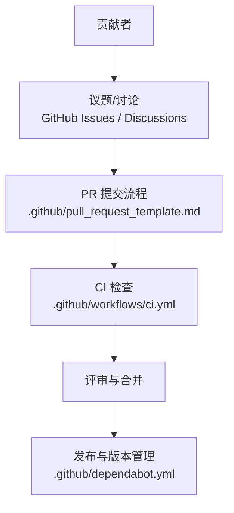
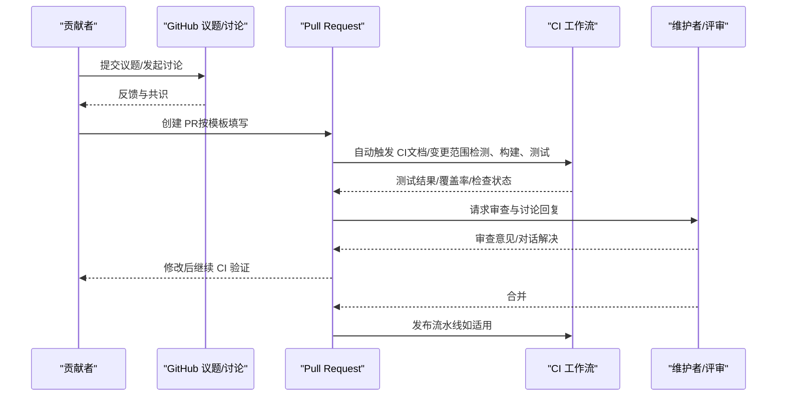
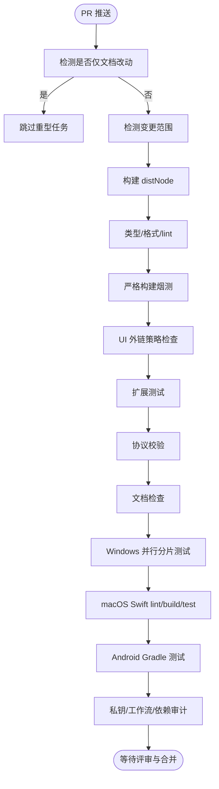
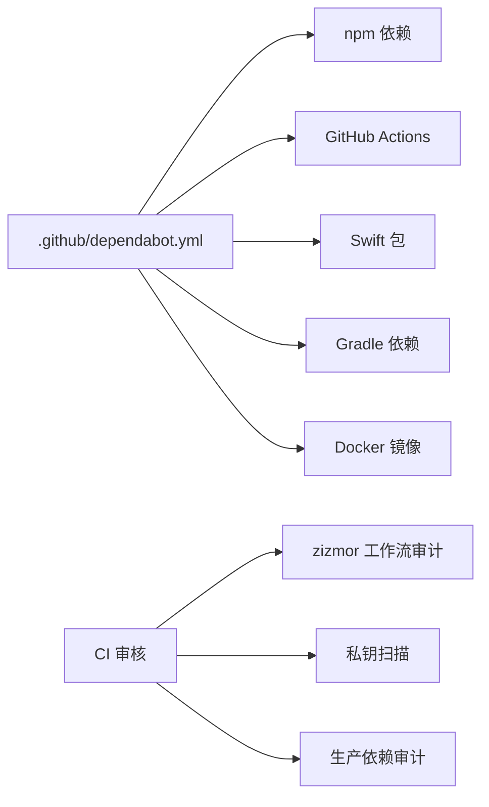

# 社区与贡献

<cite>
**本文引用的文件**
- [CONTRIBUTING.md](file://CONTRIBUTING.md)
- [README.md](file://README.md)
- [VISION.md](file://VISION.md)
- [SECURITY.md](file://SECURITY.md)
- [.github/workflows/ci.yml](file://.github/workflows/ci.yml)
- [.github/ISSUE_TEMPLATE/bug_report.yml](file://.github/ISSUE_TEMPLATE/bug_report.yml)
- [.github/ISSUE_TEMPLATE/feature_request.yml](file://.github/ISSUE_TEMPLATE/feature_request.yml)
- [.github/pull_request_template.md](file://.github/pull_request_template.md)
- [.github/labeler.yml](file://.github/labeler.yml)
- [.github/dependabot.yml](file://.github/dependabot.yml)
</cite>

## 目录
1. [引言](#引言)
2. [项目结构](#项目结构)
3. [核心组件](#核心组件)
4. [架构总览](#架构总览)
5. [详细组件分析](#详细组件分析)
6. [依赖分析](#依赖分析)
7. [性能考虑](#性能考虑)
8. [故障排查指南](#故障排查指南)
9. [结论](#结论)
10. [附录](#附录)

## 引言
本指南面向所有希望参与 OpenClaw 的贡献者，系统阐述社区文化、贡献入口、问题与变更流程、代码规范、测试与审查标准、治理结构与维护团队、安全与漏洞上报路径，以及如何成为贡献者并参与项目决策。我们鼓励包容、多元与高质量的协作，欢迎通过 PR、讨论与文档贡献共同推动项目演进。

## 项目结构
OpenClaw 是一个跨平台、多语言、多子系统的个人 AI 助手项目，包含核心网关、CLI、Web 控制界面、移动应用（macOS/iOS/Android）、大量通道扩展、技能生态与工具链。贡献者可从以下维度切入：
- 核心网关与协议：src/gateway、src/daemon、src/agents
- 通道与扩展：extensions/*、docs/channels/*
- 应用与节点：apps/macos、apps/ios、apps/android
- 工具与自动化：docs/tools/*、docs/automation/*
- 文档与本地化：docs/*、docs/.i18n
- 质量与基础设施：.github/workflows、scripts、test/*

图表来源
- [.github/workflows/ci.yml](file://.github/workflows/ci.yml)
- [.github/pull_request_template.md](file://.github/pull_request_template.md)
- [.github/dependabot.yml](file://.github/dependabot.yml)

章节来源
- [README.md](file://README.md)
- [CONTRIBUTING.md](file://CONTRIBUTING.md)

## 核心组件
- 贡献入口与社区文化
  - 快速链接：GitHub、愿景、Discord、社交媒体
  - 维护团队：明确职责分工与联系方式
  - 贡献方式：小修复直接开 PR；新特性先讨论；问题在 Discord 帮助区提问
- 贡献前准备与规范
  - 在本地实例中验证、运行构建与测试、遵循审查对话责任归属
  - 保持 PR 聚焦单一主题，描述“做了什么/为什么做”，必要时附截图
- 审查与质量门禁
  - CI 分层检测：文档范围、变更范围、Node/Windows/macOS/Android 等矩阵
  - 类型检查、格式化、lint、单元测试、扩展测试、协议校验、文档检查
- 治理与维护团队
  - 维护者职责与扩展流程：triage、review、推动进展
  - 申请成为维护者需邮件提交材料清单
- 安全与漏洞上报
  - 明确各子仓库与组件的上报路径与必需信息
  - 报告接受门槛与常见误报情形
- 视野与路线图
  - 当前优先级：稳定性、UX、技能生态、性能
  - 不会合并的类型清单（作为路线图护栏）

章节来源
- [CONTRIBUTING.md](file://CONTRIBUTING.md)
- [VISION.md](file://VISION.md)
- [SECURITY.md](file://SECURITY.md)

## 架构总览
下图展示从“问题发现”到“CI 审查”再到“合并发布”的典型贡献流程，帮助贡献者理解端到端的协作节奏与质量门禁。

图表来源
- [.github/workflows/ci.yml](file://.github/workflows/ci.yml)
- [.github/pull_request_template.md](file://.github/pull_request_template.md)

## 详细组件分析

### 1) 提交议题与功能请求
- Bug 报告模板覆盖：类型、摘要、复现步骤、期望/实际行为、版本/系统/安装方式、模型与路由链、配置位置、日志证据、影响与严重性、附加信息
- 功能请求模板覆盖：摘要、待解决问题、建议方案、替代方案、影响与证据、附加信息
- 使用模板可显著提升 triage 效率与问题定位速度

章节来源
- [.github/ISSUE_TEMPLATE/bug_report.yml](file://.github/ISSUE_TEMPLATE/bug_report.yml)
- [.github/ISSUE_TEMPLATE/feature_request.yml](file://.github/ISSUE_TEMPLATE/feature_request.yml)

### 2) 代码贡献与 PR 流程
- PR 模板强制字段：摘要、变更类型、作用域、关联议题/PR、用户可见变更、安全影响、环境与复现步骤、证据、人工验证、兼容性与迁移、故障恢复、风险与缓解
- 审查对话责任归属：机器人评论对话需由作者自行回复或解决，避免留给维护者清理
- 评审前置要求：本地验证、运行测试、CI 通过、聚焦单一主题、描述“做了什么/为什么做”
- 截图要求：UI/视觉变更需附“问题前/修复后”对比

章节来源
- [.github/pull_request_template.md](file://.github/pull_request_template.md)
- [CONTRIBUTING.md](file://CONTRIBUTING.md)

### 3) CI 与质量门禁
- 文档范围检测：仅文档改动时跳过重型任务（Node/Windows/macOS/Android），失败时回退执行全量
- 变更范围检测：自动识别 Node/Windows/macOS/Android/Python 技能等受影响区域，PR 可跳过无关矩阵
- 构建与产物：Node 场景构建一次供下游复用
- 质检矩阵：类型检查、lint/format、严格构建、UI 外链策略检查、扩展测试、协议校验、文档检查、Windows 并行分片测试、macOS Swift lint/build/test、Android Gradle 测试
- 秘钥与工作流审计：私钥扫描、zizmor 工作流安全审计、生产依赖审计
- 依赖更新：Dependabot 分生态配置，限制 PR 数量与冷却期

图表来源
- [.github/workflows/ci.yml](file://.github/workflows/ci.yml)

章节来源
- [.github/workflows/ci.yml](file://.github/workflows/ci.yml)
- [.github/dependabot.yml](file://.github/dependabot.yml)

### 4) 治理结构与维护团队
- 维护者角色与职责：triage、review、推动进展、社区协调
- 扩展维护者团队：对积极贡献者开放，需邮件提交材料清单（PR 链接、开源项目、社交账号、背景与兴趣、语言与地区、可投入时间）
- 决策机制：以维护者与贡献者共识为主，逐步扩大参与面

章节来源
- [CONTRIBUTING.md](file://CONTRIBUTING.md)

### 5) 安全与漏洞上报
- 上报渠道：按组件归属仓库或邮件路由至安全邮箱
- 必备信息：标题、严重性评估、影响、受影响组件、技术复现、演示影响、环境、修复建议
- 报告接受门槛：包含当前修订、可复现 PoC、与信任边界相关的演示影响、明确不在“不在范围”之列的说明
- 常见误报：仅提示注入、显式操作员控制表面、授权用户触发本地动作、重复报告处理等

章节来源
- [SECURITY.md](file://SECURITY.md)

### 6) 代码规范与风格
- 代码风格：统一使用 TypeScript/JavaScript，遵循项目既定的格式化与 lint 规则
- UI 与安全：禁止原始 window.open，确保 Canvas/浏览器等敏感能力受控
- 依赖与安全：使用 Dependabot 自动化依赖更新，减少安全风险

章节来源
- [.github/workflows/ci.yml](file://.github/workflows/ci.yml)
- [.github/dependabot.yml](file://.github/dependabot.yml)

### 7) 测试要求与审查标准
- 单元测试与扩展测试：按矩阵运行，覆盖率与稳定性门禁
- 文档测试：文档格式、链接与格式检查
- 平台测试：Windows/macOS/Android 分场景并行分片，保证稳定性
- 审查标准：聚焦单一主题、充分证据、可复现、最小破坏面、安全影响自评与缓解

章节来源
- [.github/workflows/ci.yml](file://.github/workflows/ci.yml)
- [.github/pull_request_template.md](file://.github/pull_request_template.md)

### 8) 成为贡献者与参与决策
- 入门路径：从“好上手”标签议题开始，逐步深入领域
- 维护者申请：邮件提交材料清单，维护者审慎评估与扩展
- 决策参与：通过讨论、PR、文档贡献与社区活动参与项目方向制定

章节来源
- [CONTRIBUTING.md](file://CONTRIBUTING.md)
- [VISION.md](file://VISION.md)

## 依赖分析
- 依赖更新策略：按生态与冷却期分组，限制 PR 数量，降低引入风险
- 工作流安全：zizmor 审计、私钥扫描、生产依赖审计
- 标签与分类：labeler 基于文件路径自动打标签，便于跨模块协作与追踪

图表来源
- [.github/dependabot.yml](file://.github/dependabot.yml)
- [.github/workflows/ci.yml](file://.github/workflows/ci.yml)

章节来源
- [.github/dependabot.yml](file://.github/dependabot.yml)
- [.github/labeler.yml](file://.github/labeler.yml)

## 性能考虑
- CI 并行与分片：Windows/macOS/Android 采用分片与缓存策略，缩短排队与重试成本
- 文档与变更范围检测：仅文档改动时跳过重型任务，避免不必要的资源消耗
- 依赖更新与安全：定期更新与审计，降低潜在性能与安全风险

章节来源
- [.github/workflows/ci.yml](file://.github/workflows/ci.yml)

## 故障排查指南
- 常见问题定位：按模板提供最小复现、版本、系统、安装方式、模型与路由链、配置位置、日志证据
- 安全问题：严格按“必备信息”与“接受门槛”准备，避免误报导致的低效 triage
- CI 失败：关注文档范围检测、变更范围检测、平台矩阵测试与审计项，逐项排查

章节来源
- [.github/ISSUE_TEMPLATE/bug_report.yml](file://.github/ISSUE_TEMPLATE/bug_report.yml)
- [.github/ISSUE_TEMPLATE/feature_request.yml](file://.github/ISSUE_TEMPLATE/feature_request.yml)
- [SECURITY.md](file://SECURITY.md)
- [.github/workflows/ci.yml](file://.github/workflows/ci.yml)

## 结论
OpenClaw 的社区与贡献体系以“安全默认、快速迭代、质量门禁、包容协作”为核心。贡献者可通过议题/讨论达成共识，按模板提交 PR，并在 CI 的严格门禁下完成审查与合并。维护团队负责治理与方向把控，欢迎更多贡献者加入并逐步承担维护职责。请始终遵循安全与隐私原则，尊重多样性与包容性，共同建设一个强大而可信的个人 AI 助手生态。

## 附录
- 社区资源与链接
  - GitHub 仓库与讨论区：参见贡献指南中的快速链接
  - Discord 频道与帮助区：参见贡献指南中的快速链接
  - 文档与本地化：docs/* 与 docs/.i18n
- 维护者与治理
  - 维护者名单与职责：参见贡献指南
  - 申请维护者：邮件提交材料清单
- 安全与合规
  - 漏洞上报流程与必备信息：参见安全策略
  - 报告接受门槛与常见误报：参见安全策略

章节来源
- [CONTRIBUTING.md](file://CONTRIBUTING.md)
- [SECURITY.md](file://SECURITY.md)
- [README.md](file://README.md)