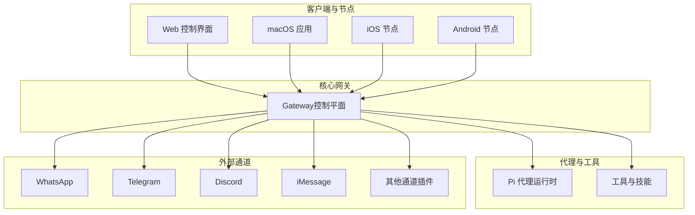
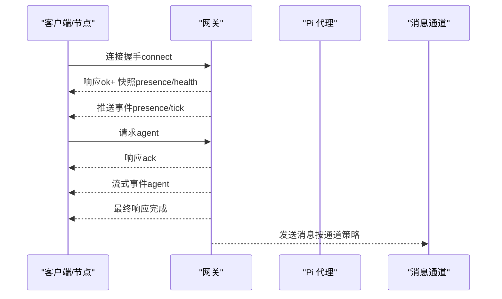
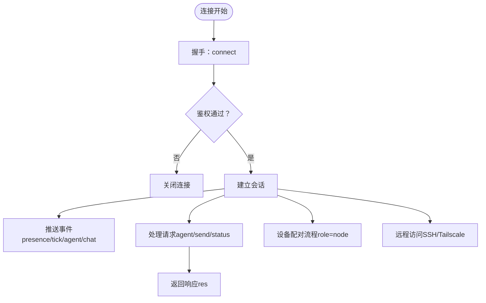
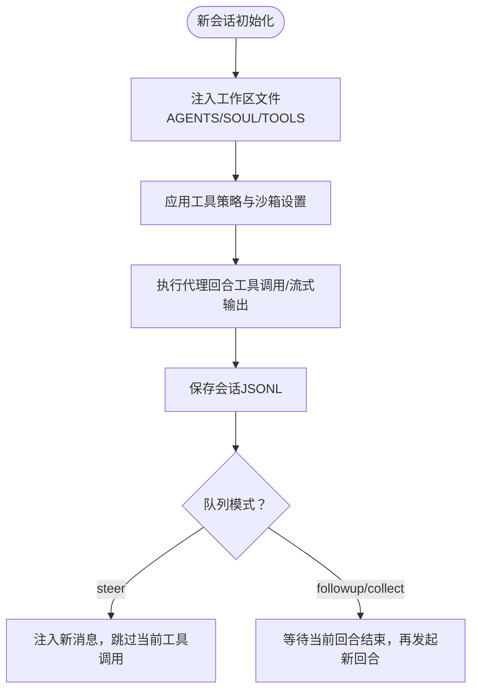
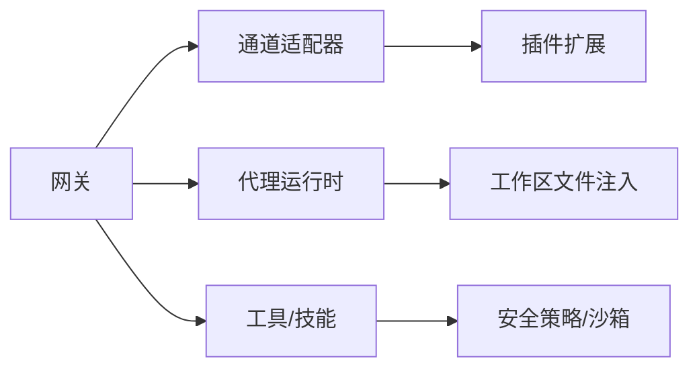

# 项目介绍

<cite>
**本文引用的文件**
- [README.md](file://README.md)
- [VISION.md](file://VISION.md)
- [docs/index.md](file://docs/index.md)
- [docs/start/openclaw.md](file://docs/start/openclaw.md)
- [docs/start/lore.md](file://docs/start/lore.md)
- [docs/concepts/features.md](file://docs/concepts/features.md)
- [docs/platforms/index.md](file://docs/platforms/index.md)
- [docs/concepts/architecture.md](file://docs/concepts/architecture.md)
- [docs/concepts/agent.md](file://docs/concepts/agent.md)
- [docs/gateway/configuration.md](file://docs/gateway/configuration.md)
</cite>

## 目录
1. [引言](#引言)
2. [项目结构](#项目结构)
3. [核心组件](#核心组件)
4. [架构总览](#架构总览)
5. [详细组件分析](#详细组件分析)
6. [依赖关系分析](#依赖关系分析)
7. [性能考量](#性能考量)
8. [故障排查指南](#故障排查指南)
9. [结论](#结论)
10. [附录](#附录)

## 引言
OpenClaw 是一个“个人AI助手”，由你本人在自己的设备上运行。它连接你常用的聊天渠道（如 WhatsApp、Telegram、Discord、iMessage 等），并以你的规则和数据为中心，提供始终在线、本地化的智能代理体验。OpenClaw 的核心价值在于：本地优先、隐私保护、跨平台集成、可扩展的插件生态与多代理路由能力。

OpenClaw 的愿景是“能真正做事的AI”，它从个人实验起步，逐步演进为一个安全、稳定、易用且强大的个人助理系统。项目强调安全默认、健壮性、首次体验与持续改进，并通过清晰的贡献规范与治理机制推动社区协作。

本项目名称“OpenClaw”取自“开放 + 钳子”，象征着开放、自由与掌控力；其品牌语录“钳子就是法律”体现了对用户主权与自我掌控的坚持。

## 项目结构
OpenClaw 采用模块化与分层设计：
- 核心网关（Gateway）：单点控制平面，负责会话、路由、通道连接与事件分发。
- 客户端与节点：macOS 应用、Web 控制界面、iOS/Android 节点，均通过 WebSocket 连接网关。
- 代理运行时（Pi）：嵌入式代理运行时，支持工具流式输出与会话管理。
- 插件与技能：通过扩展包与技能注册表（ClawHub）实现能力外扩。
- 平台与部署：支持 macOS、iOS、Android、Windows（WSL2）、Linux 等多平台，提供多种安装与托管方式。

图表来源
- [docs/concepts/architecture.md](file://docs/concepts/architecture.md)
- [docs/concepts/features.md](file://docs/concepts/features.md)
- [docs/platforms/index.md](file://docs/platforms/index.md)

章节来源
- [README.md:21-27](file://README.md#L21-L27)
- [docs/index.md:44-72](file://docs/index.md#L44-L72)
- [docs/platforms/index.md:9-16](file://docs/platforms/index.md#L9-L16)

## 核心组件
- 网关（Gateway）：单一控制平面，维护通道连接、会话状态、事件推送与协议握手；支持 WebSocket、配对与鉴权、远程访问（SSH/Tailscale）。
- 代理运行时（Pi）：嵌入式代理运行时，支持工具流式输出、块流式分段、会话注入与工作区（workspace）上下文。
- 通道与插件：内置多通道（WhatsApp、Telegram、Discord、iMessage 等）与插件扩展（如 Mattermost），统一通过网关接入。
- 客户端与节点：Web 控制界面、macOS 应用、iOS/Android 节点，用于聊天、配置、节点命令与设备能力调用。
- 配置与安全：严格的 JSON5 配置校验、环境变量与密钥引用、沙箱与工具策略、默认安全策略与可选高权限路径。

章节来源
- [docs/concepts/architecture.md:12-26](file://docs/concepts/architecture.md#L12-L26)
- [docs/concepts/agent.md:10-12](file://docs/concepts/agent.md#L10-L12)
- [docs/concepts/features.md:33-48](file://docs/concepts/features.md#L33-L48)
- [docs/gateway/configuration.md:10-24](file://docs/gateway/configuration.md#L10-L24)

## 架构总览
OpenClaw 的架构以“网关即控制平面”为核心，所有消息通道、工具与节点均通过 WebSocket 与网关交互。网关负责：
- 维护与各通道的连接
- 分发事件（agent、chat、presence、health、heartbeat、cron）
- 提供类型化请求/响应与事件订阅
- 支持设备配对、本地信任与远程访问

图表来源
- [docs/concepts/architecture.md:59-78](file://docs/concepts/architecture.md#L59-L78)

章节来源
- [docs/concepts/architecture.md:12-26](file://docs/concepts/architecture.md#L12-L26)
- [docs/concepts/architecture.md:80-92](file://docs/concepts/architecture.md#L80-L92)

## 详细组件分析

### 网关（Gateway）
- 单一控制平面：每个主机仅运行一个网关，避免重复会话与冲突。
- WebSocket 协议：首帧必须为 connect，后续请求/响应与事件推送遵循统一格式；支持令牌鉴权与幂等键去重。
- 设备配对与本地信任：设备身份、挑战签名、非本地需显式批准；本地回环可自动批准以优化同机体验。
- 远程访问：推荐 Tailscale 或 SSH 隧道；可启用 TLS 与可选证书固定。

图表来源
- [docs/concepts/architecture.md:80-109](file://docs/concepts/architecture.md#L80-L109)

章节来源
- [docs/concepts/architecture.md:12-26](file://docs/concepts/architecture.md#L12-L26)
- [docs/concepts/architecture.md:117-128](file://docs/concepts/architecture.md#L117-L128)

### 代理运行时（Pi）
- 工作区（Workspace）：作为代理唯一工作目录，注入 AGENTS、SOUL、TOOLS、BOOTSTRAP、IDENTITY、USER 等文件，形成“记忆与指令”上下文。
- 会话管理：会话文件存储为 JSONL，ID 稳定；队列模式支持“引导”或“跟随”，块流式分段可减少长文本碎片。
- 模型引用：支持 provider/model 格式与别名，模型目录作为允许列表；支持失败回退与认证轮换。

图表来源
- [docs/concepts/agent.md:24-47](file://docs/concepts/agent.md#L24-L47)
- [docs/concepts/agent.md:73-104](file://docs/concepts/agent.md#L73-L104)

章节来源
- [docs/concepts/agent.md:12-47](file://docs/concepts/agent.md#L12-L47)
- [docs/concepts/agent.md:106-121](file://docs/concepts/agent.md#L106-L121)

### 通道与插件
- 内置通道：WhatsApp（Baileys）、Telegram（grammY）、Discord（discord.js）、iMessage（imsg）、Google Chat、Signal、IRC、Microsoft Teams、Matrix、Feishu、LINE、Mattermost、Nextcloud Talk、Nostr、Synology Chat、Tlon、Twitch、Zalo、Zalo Personal、WebChat。
- 插件扩展：通过扩展包添加更多通道（如 Mattermost），保持核心轻量与可扩展性。
- 群组路由：基于提及、会话绑定与账户/通道匹配，实现隔离会话与多代理路由。

章节来源
- [docs/concepts/features.md:33-48](file://docs/concepts/features.md#L33-L48)
- [docs/concepts/features.md:10-29](file://docs/concepts/features.md#L10-L29)

### 客户端与节点
- Web 控制界面：浏览器仪表盘，支持聊天、配置、会话与节点管理。
- macOS 应用：菜单栏控制、语音唤醒/推断、WebChat 与调试工具、SSH 远程控制。
- iOS/Android 节点：配对后提供 Canvas、相机、屏幕录制、位置与通知等设备命令；支持语音触发与画布协作。

章节来源
- [docs/concepts/features.md:46-48](file://docs/concepts/features.md#L46-L48)
- [docs/platforms/index.md:20-24](file://docs/platforms/index.md#L20-L24)

### 配置与安全
- 配置：JSON5，严格校验；支持热重载（hybrid 默认）、RPC 更新（config.apply/config.patch）、环境变量与密钥引用（SecretRef）。
- 安全：默认安全策略（DM 策略、工具策略、沙箱模式）；可选高权限路径（如提升权限会话）；远程暴露需明确授权与密码策略。
- 可靠性：健康检查、诊断命令（doctor）、日志与守护进程（launchd/systemd）。

章节来源
- [docs/gateway/configuration.md:10-24](file://docs/gateway/configuration.md#L10-L24)
- [docs/gateway/configuration.md:349-387](file://docs/gateway/configuration.md#L349-L387)
- [docs/gateway/configuration.md:449-539](file://docs/gateway/configuration.md#L449-L539)

## 依赖关系分析
- 组件耦合：网关与通道、代理运行时、工具/技能之间松耦合；通过协议与事件解耦。
- 外部依赖：模型提供商（Anthropic、OpenAI 等）、通道 SDK（Baileys、grammY、discord.js 等）、操作系统权限（macOS TCC）。
- 循环依赖：无直接循环；通道适配器与网关通过抽象接口交互，避免循环导入。

图表来源
- [docs/concepts/architecture.md:27-48](file://docs/concepts/architecture.md#L27-L48)
- [docs/concepts/agent.md:49-64](file://docs/concepts/agent.md#L49-L64)

章节来源
- [docs/concepts/architecture.md:27-48](file://docs/concepts/architecture.md#L27-L48)
- [docs/concepts/agent.md:49-64](file://docs/concepts/agent.md#L49-L64)

## 性能考量
- 会话与内存：支持会话压缩与上下文修剪，降低 token 使用；群组隔离与线程绑定减少无关上下文。
- 流式与分段：块流式分段与软合并减少单行碎片，提高传输效率；队列模式根据场景选择“引导”或“跟随”。
- 沙箱与工具策略：在非主会话启用沙箱，限制高风险工具调用，平衡安全性与可用性。
- 远程访问：Tailscale Serve/Funnel 与 SSH 隧道降低延迟与复杂度；TLS 与可选证书固定增强远端安全。

章节来源
- [docs/concepts/agent.md:82-104](file://docs/concepts/agent.md#L82-L104)
- [docs/gateway/configuration.md:206-225](file://docs/gateway/configuration.md#L206-L225)

## 故障排查指南
- 健康检查与诊断：使用 doctor、health、status 命令快速定位问题；必要时运行 deep 检查。
- 日志与守护：日志位于临时目录；守护进程（launchd/systemd）确保服务自启动。
- 配置修复：当配置校验失败时，doctor 会提示具体问题；可使用 doctor --fix 自动修复常见错误。
- 远程连通性：确认 SSH/Tailscale 隧道配置正确；核对网关鉴权与绑定地址。

章节来源
- [docs/start/openclaw.md:195-202](file://docs/start/openclaw.md#L195-L202)
- [docs/gateway/configuration.md:61-73](file://docs/gateway/configuration.md#L61-L73)

## 结论
OpenClaw 将“个人AI助手”的理念落地为一个可自托管、可扩展、可安全运行的系统。它以网关为核心，统一对话通道、代理运行时与工具生态；通过严格的默认安全策略、灵活的配置与远程访问方案，满足开发者与高级用户的多样化需求。项目强调“本地优先、隐私保护、跨平台集成”，并以清晰的贡献规范与社区治理推动持续演进。

## 附录

### 价值主张与差异化优势
- 本地化与隐私：在你的设备上运行，数据不出边界；默认安全策略与可选高权限路径兼顾安全与能力。
- 跨平台集成：macOS、iOS、Android、Windows（WSL2）、Linux 全平台支持；Web 控制界面与节点无缝协作。
- 多通道与多代理：统一网关接入多通道，支持多代理路由与会话隔离；群组路由与提及激活提升协作效率。
- 可扩展与生态：插件与技能生态（ClawHub）持续扩展能力；配置与工具策略保障可控性与安全性。

章节来源
- [README.md:21-27](file://README.md#L21-L27)
- [docs/index.md:48-58](file://docs/index.md#L48-L58)
- [docs/concepts/features.md:10-29](file://docs/concepts/features.md#L10-L29)

### 主要目标用户与核心痛点
- 目标用户：开发者、高级用户、需要私有化与可审计 AI 助手的企业或个人。
- 核心痛点：云端托管带来的隐私与合规风险、多平台与多通道割裂、代理能力不可控、缺乏本地化与可扩展性。
- 解决方案：本地运行、统一网关、严格安全策略、插件与技能生态、跨平台节点与 Web 控制界面。

章节来源
- [docs/index.md:44-58](file://docs/index.md#L44-L58)
- [docs/start/openclaw.md:13-26](file://docs/start/openclaw.md#L13-L26)

### 背景故事与未来展望
- 背景故事：项目起源于个人实验，经历 Warelay → Clawdbot → Moltbot → OpenClaw 的多次“脱壳”与成长，最终确立“钳子就是法律”的品牌精神。
- 未来展望：持续强化安全默认、稳定性与首次体验；完善多模型提供商支持、消息通道覆盖与性能测试基础设施；推进跨平台配套应用与更佳的人机交互体验。

章节来源
- [docs/start/lore.md:12-27](file://docs/start/lore.md#L12-L27)
- [VISION.md:17-33](file://VISION.md#L17-L33)