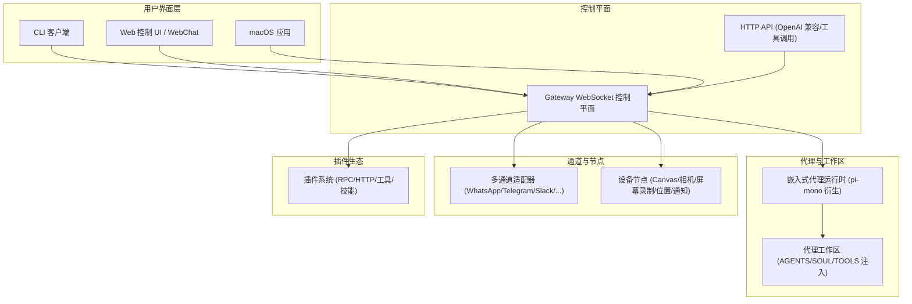
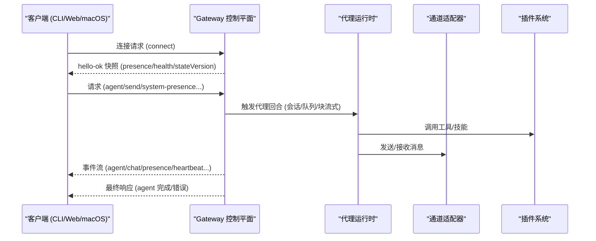
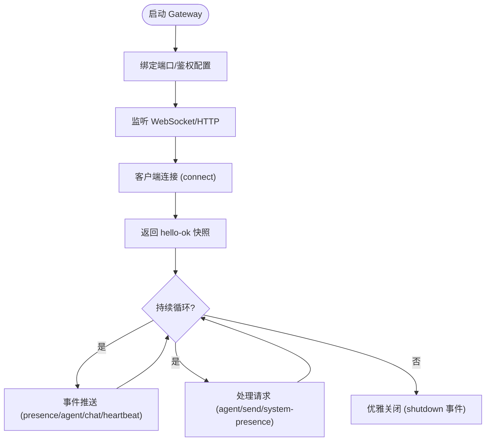
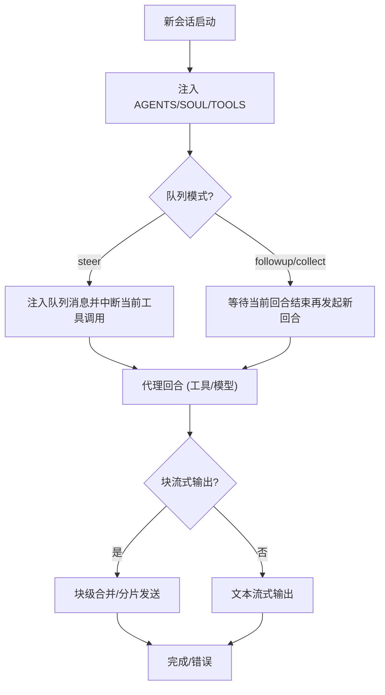
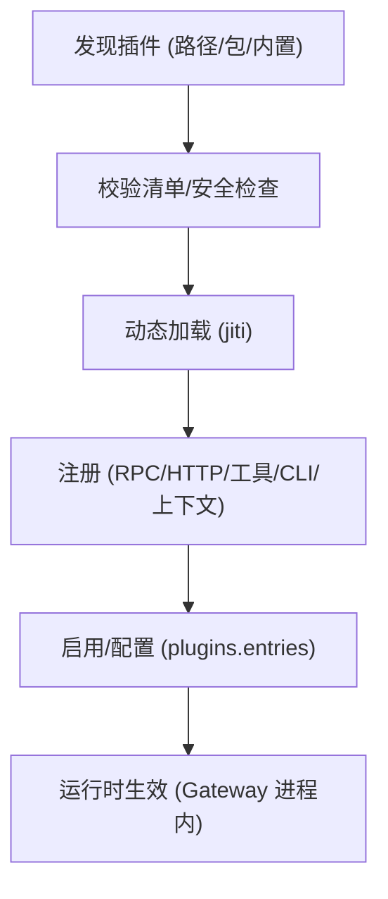
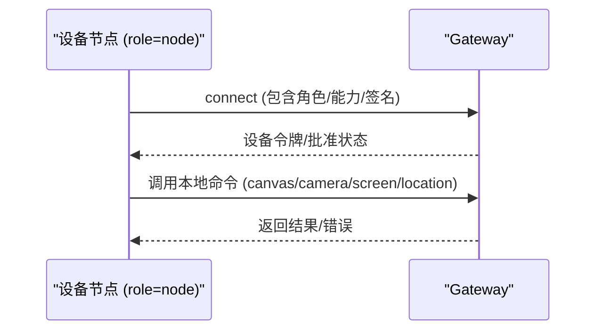
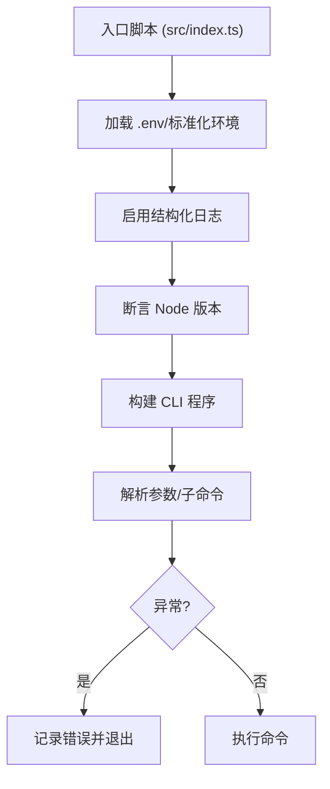
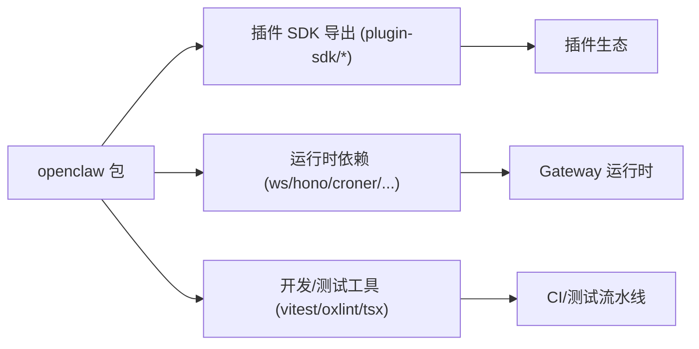

# 项目概述

<cite>
**本文档引用的文件**
- [README.md](file://README.md)
- [VISION.md](file://VISION.md)
- [CONTRIBUTING.md](file://CONTRIBUTING.md)
- [src/index.ts](file://src/index.ts)
- [src/runtime.ts](file://src/runtime.ts)
- [src/cli/program.ts](file://src/cli/program.ts)
- [package.json](file://package.json)
- [docs/concepts/architecture.md](file://docs/concepts/architecture.md)
- [docs/gateway/index.md](file://docs/gateway/index.md)
- [docs/concepts/agent.md](file://docs/concepts/agent.md)
- [docs/tools/plugin.md](file://docs/tools/plugin.md)
- [docs/start/getting-started.md](file://docs/start/getting-started.md)
</cite>

## 目录
1. [简介](#简介)
2. [项目结构](#项目结构)
3. [核心组件](#核心组件)
4. [架构总览](#架构总览)
5. [详细组件分析](#详细组件分析)
6. [依赖关系分析](#依赖关系分析)
7. [性能考虑](#性能考虑)
8. [故障排除指南](#故障排除指南)
9. [结论](#结论)
10. [附录](#附录)

## 简介
OpenClaw 是一个可在您自己的设备上运行的个人 AI 助手。它在您已使用的多渠道中回答问题（WhatsApp、Telegram、Slack、Discord、Google Chat、Signal、iMessage、BlueBubbles、IRC、Microsoft Teams、Matrix、飞书、LINE、Mattermost、Nextcloud Talk、Nostr、Synology Chat、Tlon、Twitch、Zalo、Zalo Personal、WebChat），支持在 macOS/iOS/Android 上语音与收听，并可渲染一个由您控制的实时 Canvas。Gateway 是控制平面——产品是助手本身。

OpenClaw 的核心愿景是：以本地优先的方式，提供易用、安全、强大的个人 AI 助手，支持广泛的平台与消息渠道，尊重隐私与安全。项目当前聚焦于安全与稳健默认、缺陷修复与稳定性、首次运行体验与安装可靠性；后续优先方向包括支持所有主流模型提供商、改进主要消息渠道的支持、性能与测试基础设施、更好的计算机使用与代理能力、跨 CLI 与 Web 前端的人体工程学、以及 macOS、iOS、Android、Windows 与 Linux 的配套应用。

## 项目结构
OpenClaw 采用模块化与分层组织方式，核心入口通过 CLI 启动，底层依赖 WebSocket 控制平面（Gateway）承载会话、通道、工具与事件，上层提供多客户端接入（macOS 应用、CLI、Web UI、自动化）、节点（macOS/iOS/Android/headless）连接与设备命令，同时通过插件生态扩展能力。

图示来源
- [docs/concepts/architecture.md:12-26](file://docs/concepts/architecture.md#L12-L26)
- [docs/gateway/index.md:68-77](file://docs/gateway/index.md#L68-L77)

章节来源
- [README.md:21-24](file://README.md#L21-L24)
- [docs/concepts/architecture.md:12-26](file://docs/concepts/architecture.md#L12-L26)
- [docs/gateway/index.md:68-77](file://docs/gateway/index.md#L68-L77)

## 核心组件
- Gateway 控制平面：单一长连接的 WebSocket 控制平面，负责维护各消息提供商连接、暴露类型化 WS API、事件推送（agent/chat/presence/health/heartbeat/cron）、HTTP API（OpenAI 兼容、工具调用、控制 UI）。
- 代理运行时：基于 pi-mono 的嵌入式代理运行时，使用工作区注入的 AGENTS/SOUL/TOOLS 文件作为上下文引导，支持会话管理、队列模式、块流式输出等。
- 插件系统：插件以 TypeScript 模块形式加载，注册 Gateway RPC 方法、HTTP 路由、代理工具、CLI 命令、后台服务、上下文引擎、技能等，运行于 Gateway 进程内。
- 多通道适配器：对 WhatsApp、Telegram、Slack、Discord、Signal、iMessage、WebChat 等渠道进行适配与路由。
- 设备节点：macOS/iOS/Android/headless 节点通过 WebSocket 连接，声明角色与能力，执行本地命令（system.run/notify）、Canvas、相机、屏幕录制、位置获取等。
- 安全与权限：默认安全策略、工具沙箱（Docker）、节点权限映射（macOS TCC）、设备配对与本地信任、远程访问（Tailscale/SSH 隧道）。

章节来源
- [docs/concepts/architecture.md:27-58](file://docs/concepts/architecture.md#L27-L58)
- [docs/concepts/agent.md:8-38](file://docs/concepts/agent.md#L8-L38)
- [docs/tools/plugin.md:9-80](file://docs/tools/plugin.md#L9-L80)
- [docs/gateway/index.md:68-77](file://docs/gateway/index.md#L68-L77)

## 架构总览
OpenClaw 的架构围绕“单网关控制平面 + 多客户端 + 多通道 + 插件生态”的模式展开。Gateway 作为唯一持有 Baileys 会话的进程，统一处理消息路由、会话状态、工具执行与事件广播；客户端（CLI、Web UI、macOS 应用）与节点（设备侧）通过 WebSocket 连接，遵循统一协议握手与鉴权流程；插件在运行时扩展能力，保持核心轻量。

图示来源
- [docs/concepts/architecture.md:59-78](file://docs/concepts/architecture.md#L59-L78)

章节来源
- [docs/concepts/architecture.md:12-26](file://docs/concepts/architecture.md#L12-L26)
- [docs/gateway/index.md:202-214](file://docs/gateway/index.md#L202-L214)

## 详细组件分析

### 组件一：Gateway 控制平面
- 单一控制平面：维护通道连接、暴露类型化 WS API、事件推送、HTTP API（OpenAI 兼容、工具调用、控制 UI）。
- 运行模型：常驻进程，端口复用（WS/HTTP），默认绑定 loopback，需鉴权（token/password）。
- 远程访问：推荐 Tailscale/VPN，或 SSH 隧道；隧道两端仍需鉴权。
- 运维快照：启动、健康检查、守护进程（launchd/systemd）。

图示来源
- [docs/gateway/index.md:27-61](file://docs/gateway/index.md#L27-L61)
- [docs/concepts/architecture.md:117-140](file://docs/concepts/architecture.md#L117-L140)

章节来源
- [docs/gateway/index.md:68-77](file://docs/gateway/index.md#L68-L77)
- [docs/concepts/architecture.md:27-58](file://docs/concepts/architecture.md#L27-L58)

### 组件二：代理运行时与工作区
- 工作区契约：单一工作区目录作为代理 cwd，注入 AGENTS/SOUL/TOOLS 等文件作为上下文；支持预设与自动创建。
- 会话管理：会话 ID 稳定，转录存储为 JSONL；队列模式支持“steer/followup/collect”，块流式输出可配置。
- pi-mono 集成：沿用部分 pi-mono 的模型/工具，但会话管理、发现与工具装配由 OpenClaw 自主实现。

图示来源
- [docs/concepts/agent.md:73-104](file://docs/concepts/agent.md#L73-L104)

章节来源
- [docs/concepts/agent.md:12-42](file://docs/concepts/agent.md#L12-L42)
- [docs/concepts/agent.md:73-104](file://docs/concepts/agent.md#L73-L104)

### 组件三：插件生态
- 插件类型：Gateway RPC 方法、HTTP 路由、代理工具、CLI 命令、后台服务、上下文引擎、技能、自动回复命令。
- 加载与发现：按路径顺序扫描（配置路径/工作区扩展/全局扩展/内置扩展），支持包打包与外部渠道目录元数据。
- 安全与信任：非内置插件需显式允许/安装跟踪；路径安全检查（避免符号链接逃逸、世界可写、可疑所有权）。
- 管理接口：CLI 提供安装/启用/禁用/更新/诊断等操作；配置变更需重启 Gateway。

图示来源
- [docs/tools/plugin.md:228-304](file://docs/tools/plugin.md#L228-L304)

章节来源
- [docs/tools/plugin.md:9-80](file://docs/tools/plugin.md#L9-L80)
- [docs/tools/plugin.md:228-304](file://docs/tools/plugin.md#L228-L304)

### 组件四：多通道与节点
- 多通道：对 WhatsApp、Telegram、Slack、Discord、Signal、iMessage、WebChat 等进行适配与路由，支持群组规则、提及门控、回复标签、分片与路由。
- 节点：设备节点声明角色与能力，执行本地命令（system.run/notify）、Canvas、相机、屏幕录制、位置获取等；macOS 权限通过 TCC 管理，支持提升权限的会话开关。

图示来源
- [docs/concepts/architecture.md:42-47](file://docs/concepts/architecture.md#L42-L47)
- [README.md:240-253](file://README.md#L240-L253)

章节来源
- [docs/concepts/architecture.md:14-26](file://docs/concepts/architecture.md#L14-L26)
- [README.md:240-253](file://README.md#L240-L253)

### 组件五：CLI 与入口
- 入口脚本：解析环境变量、确保 CLI 在 PATH 中、捕获日志、断言运行时版本、构建并解析 CLI 子命令。
- 运行时封装：提供统一的日志/错误输出与退出行为，支持非退出式运行时以方便测试。

图示来源
- [src/index.ts:36-93](file://src/index.ts#L36-L93)
- [src/runtime.ts:21-53](file://src/runtime.ts#L21-L53)

章节来源
- [src/index.ts:1-94](file://src/index.ts#L1-L94)
- [src/runtime.ts:1-54](file://src/runtime.ts#L1-L54)

## 依赖关系分析
- 包导出与插件 SDK：package.json 暴露了丰富的插件 SDK 导出路径，覆盖各频道与扩展子包，便于插件作者按需引入。
- 运行时依赖：包含 WebSocket、HTTP 服务器、定时任务、Markdown/HTML 解析、媒体处理、SQLite 向量扩展、跨平台终端PTY等。
- 开发与测试：Vitest、TypeScript、oxlint、格式化与文档检查工具链，支持并行测试与覆盖率统计。

图示来源
- [package.json:37-216](file://package.json#L37-L216)
- [package.json:340-464](file://package.json#L340-L464)

章节来源
- [package.json:37-216](file://package.json#L37-L216)
- [package.json:340-464](file://package.json#L340-L464)

## 性能考虑
- 会话压缩与上下文管理：支持上下文引擎插件替换或扩展默认上下文管道，优化 token 使用与历史压缩。
- 流式输出与块流式：块流式输出可减少单行刷屏、提升传输效率；可配置分片大小与合并策略。
- 并行测试与性能热点：提供性能预算与热点检测脚本，辅助定位瓶颈。
- 通道与媒体：媒体管线包含尺寸限制、临时文件生命周期管理与转录钩子，降低资源占用。

章节来源
- [docs/concepts/agent.md:94-104](file://docs/concepts/agent.md#L94-L104)
- [package.json:328-330](file://package.json#L328-L330)

## 故障排除指南
- 常见失败特征：非 loopback 绑定未配置鉴权、端口冲突、配置为远程模式、连接鉴权不匹配等。
- 诊断步骤：健康检查、通道探测、日志跟踪、doctor 诊断、端口占用排查。
- 运维建议：使用 launchd/systemd 守护、Tailscale/SSH 隧道、热重载模式（hot/hybrid/restart）。

章节来源
- [docs/gateway/index.md:235-244](file://docs/gateway/index.md#L235-L244)
- [docs/gateway/index.md:125-169](file://docs/gateway/index.md#L125-L169)

## 结论
OpenClaw 以“本地优先、安全默认、强扩展性”为核心理念，通过单一 Gateway 控制平面整合多客户端、多通道与插件生态，形成可扩展、可治理、可远控的个人 AI 助手体系。其架构既适合初学者通过向导快速上手，也为高级用户提供深入定制与扩展的空间。随着对模型提供商、消息渠道与性能的持续投入，OpenClaw 将进一步完善跨平台设备控制与本地化 AI 代理执行能力。

## 附录
- 快速开始：安装、向导、网关状态检查、打开控制 UI。
- 社区与贡献：维护者列表、贡献流程、AI 辅助 PR 规范、漏洞报告渠道。
- 视野与路线：安全优先、稳定与 UX 改进、性能与测试基础设施、跨平台配套应用。

章节来源
- [docs/start/getting-started.md:28-77](file://docs/start/getting-started.md#L28-L77)
- [CONTRIBUTING.md:12-74](file://CONTRIBUTING.md#L12-L74)
- [VISION.md:17-32](file://VISION.md#L17-L32)